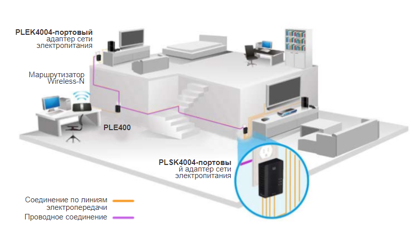

<!-- verified: agorbachev 03.05.2022 -->

<!-- 1.7.1 -->
## Актуальные тенденции

Теперь вы знаете о сетях многое: из чего они состоят, как они соединяют нас, что необходимо, чтобы они оставались надежными. Но сети, как и все остальное, продолжают меняться. Есть несколько тенденций, о которых вам следует знать.

По мере развития новых технологий и появления на рынке новых оконечных устройств предприятия и потребители должны постоянно приспосабливаться к современным изменяющимся условиям. Существует несколько новых тенденций в развитии сетевых технологий, которые повлияют на организации и потребителей.

* «Принеси на работу свое устройство» (Bring Your Own Device, BYOD)
* Совместная работа через Интернет
* Видеосвязь
* Облачные вычисления

<!-- 1.7.2 -->
## Концепция BYOD

Концепция использования любого устройства для любого контента любым образом является основной глобальной тенденцией, которая требует значительных изменений в том, как мы используем устройства и безопасно подключаем их к сетям. Эту популярную тенденцию часто называют «Принеси свое собственное устройство» (Bring Your Own Device, BYOD).

Согласно концепции BYOD конечные пользователи могут применять личные устройства для доступа к информации в корпоративной сети или сети комплекса зданий. По мере увеличения популярности потребительских устройств и соответствующего падения цен ожидается, что каждый из сотрудников и студенты может иметь в личном пользовании самые совершенные вычислительные и сетевые инструменты. К ним относятся ноутбуки, планшеты, смартфоны и электронные книги. Это могут быть устройства, купленные компанией, учебным заведением или самим пользователем.

BYOD означает возможность использования любого устройства в любом месте любым пользователем.

<!-- 1.7.3 -->
## Совместная работа через Интернет

Пользователи подключаются к сети не только ради доступа к приложениям для работы с данными, но и для совместной работы друг с другом на одном проекте. Такие инструменты совместной работы, как Cisco Webex (см. рисунок), дают работникам, студентам, учителям, заказчикам и партнерам возможность мгновенного подключения, взаимодействия и достижения целей.

Совместная работа становится критически важным аспектом конкурентоспособности. Она является приоритетом, например, в сфере образования: помогает в учебе, развивает навыки взаимодействия в команде, которые необходимы для групповых проектов.

Cisco Webex Teams — это многофункциональный инструмент для совместной работы, который позволяет отправлять мгновенные сообщения одному или нескольким пользователям, размещать изображения, видео и ссылки. Каждая команда «space» сохраняет историю всего, что там размещено.

<!-- 1.7.4 -->
## Видеосвязь

Другая тенденция в сфере сетевых технологий, которая важна для общения и совместной работы, — использование видео. Видеозвонки совершаются с любым человеком, у которого есть подключение к Интернету, независимо от того, где он находится.

Видеоконференции — это эффективное средство общения как на локальном, так и на глобальном уровне. Использование видео становится ключевым требованием для эффективной совместной работы по мере того, как компании расширяют географические и культурные границы.

<!-- 1.7.5 -->
## Видео: Cisco Webex для небольших переговорных

Посмотрите проморолик о том, как Cisco Webex внедряется в повседневную жизнь и бизнес.

<!-- 1.7.6 -->
## Облачные вычисления

Облачные вычисления — один из способов получения доступа к данным и их хранения. Облачные вычисления позволяют хранить личные файлы или резервную копию целого жесткого диска на серверах в Интернете. Например, приложениями для работы с текстом и для редактирования фотографий можно пользоваться из облака.

Для предприятий облако расширяет возможности, не требуя при этом больших капиталовложений в создание новой инфраструктуры, обучение нового персонала или лицензирование нового программного обеспечения. Эти экономичные сервисы доступны по запросу на любом устройстве в любой точке мира и обеспечивают должный уровень безопасности и функциональности.

Облачные вычисления возможны благодаря центрам обработки данных. Центр обработки данных (ЦОД) — это помещение, в котором располагаются компьютерные системы и соответствующие компоненты. ЦОД может занимать одно помещение в здании, один или несколько этажей и даже все здание. ЦОД обычно дорого создавать и обслуживать. По этой причине только крупные организации используют собственные ЦОД, чтобы размещать корпоративные данные и предоставлять услуги пользователям. Организации меньших размеров, которые не могут себе позволить содержание собственного частного центра, могут сократить общие расходы, взяв серверные мощности и сервисы хранения данных в облаке в лизинг у более крупной организации с таким центром.

Для обеспечения безопасности, надежности и устойчивости к сбоям поставщики облачных услуг часто хранят данные в распределенных центрах обработки данных. Вместо того, чтобы хранить все данные человека или организации в одном месте, они хранят их нескольких ЦОДах в разных местах.

Существует четыре основных типа облаков: публичные, частные, гибридные и коллективные.

|Типы облаков|Описание|
|---|---|
|**Общедоступные облака**|Общедоступное облако использует Интернет для предоставления услуг. Облачные приложения и услуги, предлагаемые в общедоступном облаке, доступны неограниченному кругу лиц. Услуги могут быть бесплатными или предлагаться по схеме «оплата по факту использования», например, в случае оплаты интернет-хранилища.|
|**Частные облака**|Облачные приложения и сервисы, предлагаемые в частном облаке, предназначены для конкретной организации или субъекта, например, правительства. Частное облако может быть настроено с использованием частной сети организации, хотя его создание и обслуживание может быть дорогостоящим. Управление частным облаком можно поручить внешней организации, которая способна обеспечить максимальную безопасность доступа.|
|**Гибридные облака**|Гибридное облако состоит из двух или более облаков (например, частично частное и частично публичное), где каждая часть остается отдельным объектом, но обе связаны с помощью единой архитектуры. Пользователи гибридного облака будут иметь степень доступа к различным услугам, основанным на правах доступа.|
|**Коллективные облака**|Коллективные облака создаются для исключительного использования определенными организациями или компаниями. Они похожи на общедоступную облачную среду, но с уровнем безопасности, конфиденциальности и даже нормативными требованиями частного облака. Различия между общедоступным и коллективным облаками заключаются в функциональных потребностях, настроенных для сообщества. Например, медицинские учреждения должны соблюдать различные правила и законы, которые требуют особой аутентификации и конфиденциальности. Облака такого сообщества используются несколькими организациями, которые имеют схожие потребности и проблемы.|

<!-- 1.7.7 -->
## Технологические тенденции в домашних сетях

Тенденции в развитии сетевых технологий не только оказывают влияние на способ общения на работе и в школе, но и меняют наш быт. К новейшим тенденциям домашних сетей относятся технологии интеллектуального дома.

Технология интеллектуального дома интегрируется в устройства и позволяет им соединяться между собой и быть более «интеллектуальными», то есть более автоматизированными. Например, предположим, что вы подготовили ингредиенты для блюда, которое планируете сделать на ужи, а перед тем, как уйти из дома на весь день, поставили их в духовку. Вы программируете свою умную печь на приготовление того блюда, которое хотите приготовить. Духовка подключена к вашему «календарю событий», поэтому она знает, когда вы вернетесь, и начнет готовить еду точно к вашему приходу. Она даже может скорректировать продолжительность и температуру приготовления, если ваши планы изменятся. Кроме того, с помощью смартфона или планшета вы можете напрямую подключиться к духовке и внести необходимые изменения. Когда еда будет готова, духовка отправит вам (или кому-то, кого вы указываете) уведомление об этом.

Технология «Умный дом» в настоящее время разрабатывается для всех комнат. Она станет еще более распространенной, так как домашние сети и технологии высокоскоростного Интернета расширяются.

Смартфон обновляется из облака со статусом умных домашних устройств и смарт-автомобиля. Затем пользователь может использовать смартфон для взаимодействия с умным домом и умным автомобилем.

<!-- 1.7.8 -->
## Сети по линиям электропитания

Организация сети по линиям электропитания — тенденция домашней сети, использующей существующие электрические кабели для соединения устройств, как показано на рисунке.

Открытая планировка дома с использованием электричества для домашней сети. Есть три 4-портовых адаптера электропередачи PLEK400, подключенных к трем различным розеткам, соединенным между собой с помощью кабелей. Каждый адаптер имеет по крайней мере одно подключение электричества к сетевому устройству, включая стационарные компьютеры и телевизоры.

При помощи стандартного адаптера электросети устройства могут подключаться к локальной сети везде, где есть розетки. Не нужно прокладывать кабели для передачи данных, и практически не используется дополнительное электричество. С использованием той же проводки, по которой поступает электричество, сети передачи данных отправляют информацию на определенных частотах по линиям электропитания.

Организация сети через электричество особенно полезна там, где невозможно использовать точки беспроводного доступа или они не обеспечивают доступ для всех устройств в доме. Такой способ не является заменой для выделенных кабельных сетей передачи данных, но станет альтернативой, когда кабели для передачи данных или беспроводная связь невозможны или неэффективны.

<!-- 1.7.9 -->
## Беспроводная широкополосная сеть

Во многих районах, где кабель и цифровая абонентская линия (DSL) недоступны, для подключения к Интернету может использоваться беспроводная связь.

**Поставщик беспроводных интернет-услуг**

Поставщик беспроводных интернет-услуг (WISP) подключает абонентов к определенным беспроводным точкам доступа с помощью беспроводных технологий, аналогичных домашним беспроводным локальным сетям (WLAN). Чаще всего WISP встречаются в сельской местности, где цифровые абонентские линии или кабельные сети недоступны.

Иногда антенну устанавливают на отдельную вышку, но чаще ее размещают на существующих конструкциях, например, водонапорных башнях или радиовышках. Небольшая антенна на крыше у абонента находится в зоне приема передатчика WISP. Блок доступа подключается к проводной сети в доме. Для домашнего пользователя настройка практически не отличается от настройки DSL или кабельных линий связи. Главное отличие состоит в том, что соединение дома с оператором связи обеспечивает беспроводное подключение, а не физический кабель.

**Беспроводной широкополосный доступ**

Другое беспроводное решение для дома и малых предприятий — беспроводной широкополосный доступ.

Используется та же сотовая технология, что и для смартфонов. Антенна устанавливается снаружи дома, обеспечивая беспроводное или проводное подключение устройств в любой точке дома. В большинстве случаев домашний беспроводной широкополосный доступ напрямую конкурирует с решениями DSL и кабельными услугами.

<!-- 1.7.10 -->
<!-- quiz -->

