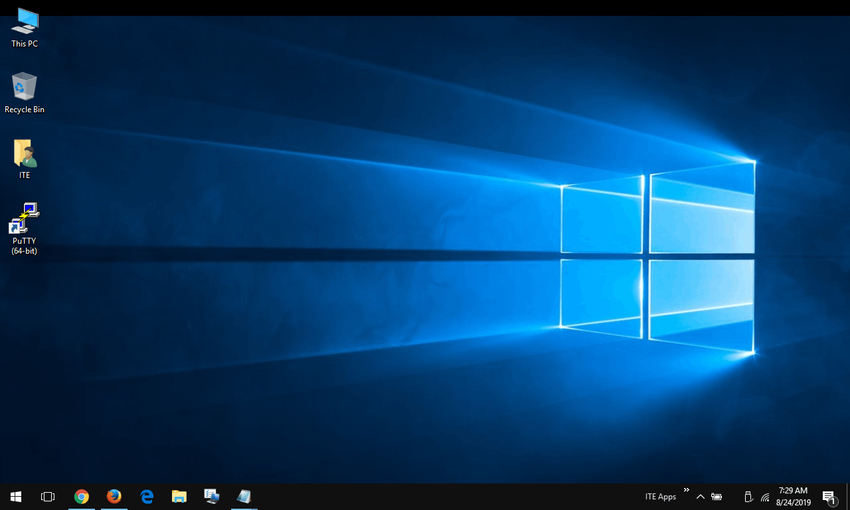
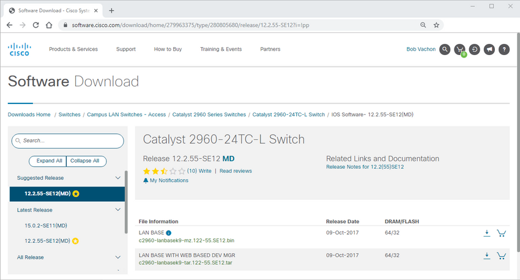
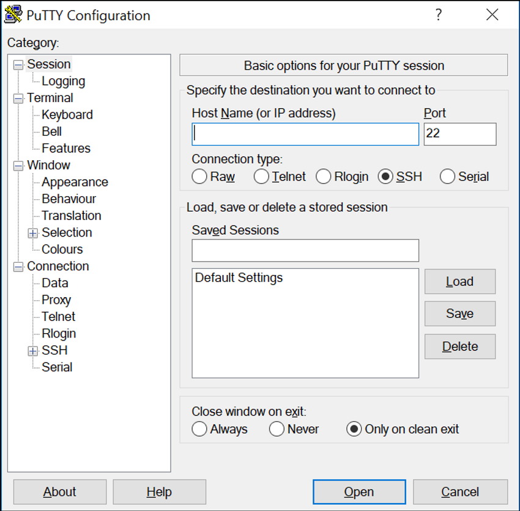
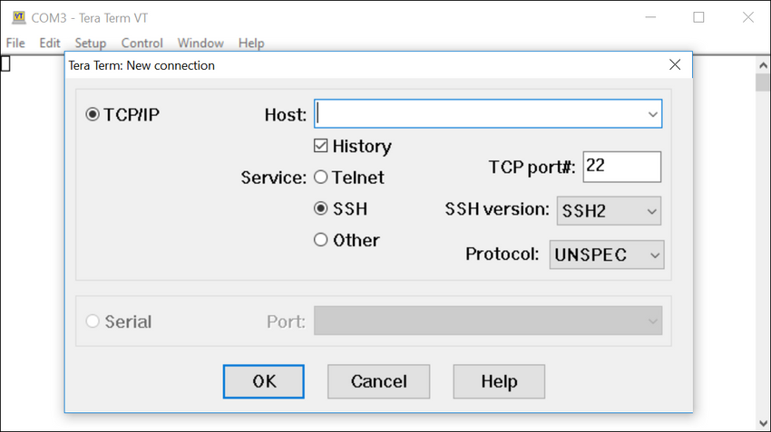
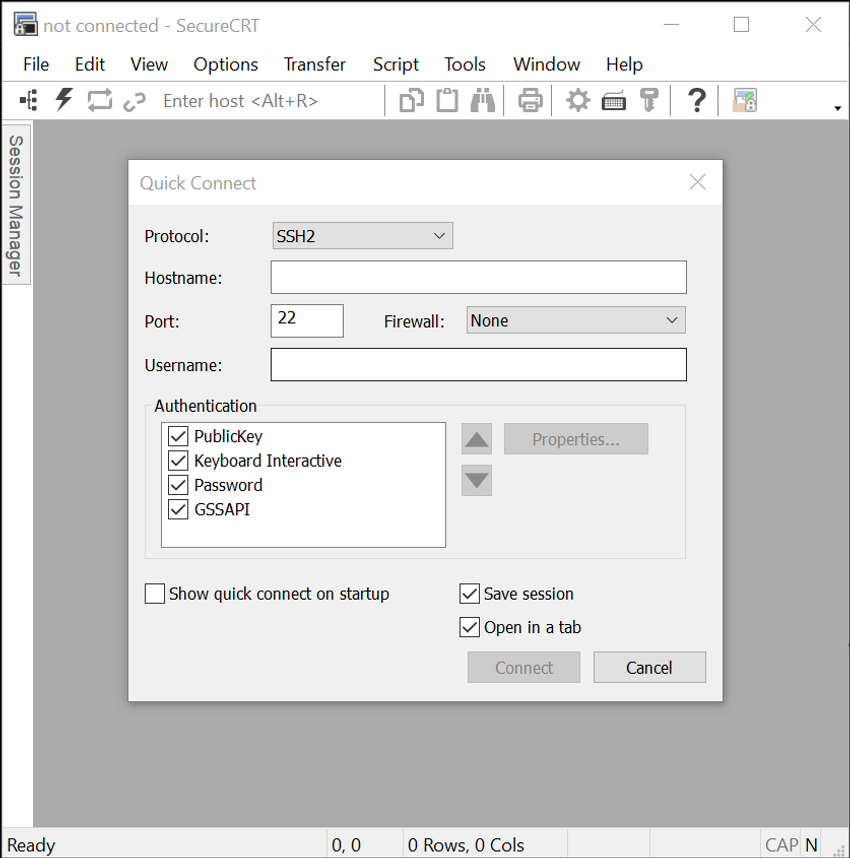

<!-- verified: agorbachev 03.05.2022 -->

<!-- 2.1.1 -->
## Операционные системы

Всем оконечным устройствам и сетевым устройствам требуется операционная система (ОС). Как показано на рисунке, часть ОС, которая непосредственно взаимодействует с аппаратным обеспечением компьютера, называется ядром. Часть, которая обеспечивает связь между приложениями и пользователем, называется оболочкой. Пользователь взаимодействует с оболочкой посредством интерфейса командной строки (command-line interface, CLI) или графического интерфейса пользователя (graphical user interface, GUI).


* **Оболочка** — пользовательский интерфейс, позволяющий пользователям запрашивать определенные задачи с компьютера. Эти запросы могут быть сделаны либо через интерфейс CLI, либо через интерфейс GUI.
* **Ядро** — часть операционной системы, обеспечивающая взаимодействие аппаратных средств и программного обеспечения компьютера, распределение системных ресурсов и т.д.
* **Оборудование** — электронные и иные «физические» компоненты компьютера.

При использовании CLI  происходит непосредственное обращение к системе в текстовом режиме путем ввода команд с клавиатуры в командной строке. Система выполняет команду, часто выводя выходные данные в текстовом формате. Для работы с CLI требуется передавать минимальное количество данных. Однако пользователь должен знать базовую структуру команд для управления системой.

```bash
analyst@secOps ~]$ ls 
Desktop Downloads lab.support.files second_drive
[analyst@secOps ~]$ 
```

<!-- 2.1.2 -->
## Графический интерфейс пользователя

Интерфейс GUI, такой как в ОС Windows, OS X, Apple iOS или Android, позволяет пользователю взаимодействовать с системой при помощи графических значков, меню и окон. Пример GUI, более удобен для пользователя и не требует обширных знаний базовой структуры команд для управления системой. Именно поэтому многие используют GUI.



Однако GUI не всегда предоставляет все те возможности, что доступны при использовании CLI. Кроме того, в GUI часто случаются ошибки, аварийные сбои или интерфейс просто работает неправильно. Поэтому для обращения к сетевым устройствам обычно используется CLI. CLI — менее ресурсоемкий интерфейс и работает гораздо устойчивее, чем GUI.

Сетевая операционная система, используемая на устройствах Cisco, называется межсетевой операционной системой Cisco (Internetwork Operating System - IOS). Cisco IOS используется на большинстве устройств Cisco, независимо от их типа и размеров. Каждый тип маршрутизатора или коммутатора  использует свою версию Cisco IOS. Другие операционные системы Cisco включают в себя IOS XE, IOS XR и NX-OS.

**Примечание**: Операционная система на домашних маршрутизаторах обычно называется микропрограммным обеспечением. Самый распространенный способ настройки домашнего маршрутизатора — использование GUI на основе веб-браузера.

<!-- 2.1.3 -->
## Назначение ОС

Сетевые операционные системы аналогичны операционным системам ПК. При помощи GUI пользователь операционной системы ПК может выполнять следующие задачи.

* Выбирать различные объекты и запускать программы, используя мышь.
* Вводить текст и текстовые команды.
* Просматривать выходные данные на экране монитора.

При помощи сетевой операционной системы на базе CLI, такой как Cisco IOS на коммутаторе или маршрутизаторе, сетевой специалист может выполнять следующие задачи.

* Запускать сетевые программы на базе CLI, используя клавиатуру.
* Вводить текст и текстовые команды с клавиатуры.
* Просматривать выходные данные на экране монитора.

Сетевые устройства Cisco работают под управлением определенных версий Cisco IOS. Версия IOS зависит от типа используемого устройства и необходимых функций. Хотя все устройства поставляются с ОС и набором функций по умолчанию, но если версию IOS и набор функций обновить, то можно получить дополнительные возможности.

На рисунке показан список версий IOS для коммутатора Cisco Catalyst 2960.

**Пример загрузки программного обеспечения Cisco**


<!-- /courses/itn-dl/aeecb970-34fa-11eb-ad9a-f74babed41a6/af1ec5f0-34fa-11eb-ad9a-f74babed41a6/assets/2d9ec912-1c25-11ea-81a0-ffc2c49b96bc_md.png>

<!-- 2.1.4 -->
## Способы доступа

Коммутатор будет пересылать трафик по умолчанию, и его не нужно явно настраивать для работы.  Например, два настроенных узла, подключенных к одному и тому же новому коммутатору, смогут обмениваться данными.

Независимо от поведения нового коммутатора по умолчанию, все коммутаторы должны быть настроены и защищены.

| **Метод** | **Описание** |
| --- | --- |
| **Консоль** | Это физический порт управления, обеспечивающий внеполосный доступ к устройству Cisco. Внеполосный доступ осуществляется через выделенный административный канал, который используется исключительно в целях технического обслуживания устройства. Преимущество использования порта консоли состоит в том, что доступ к устройству возможен даже без настройки сетевых сервисов, например, во время начальной настройки сетевого устройства. Для подключения к консоли требуется компьютер с программным обеспечением эмуляции терминала и специальный кабель консоли для подключения к устройству. |
| **Протокол Secure Shell (SSH)** | Secure Shell (SSH) — метод, позволяющий удаленно установить защищенное подключение CLI через виртуальный интерфейс по сети. В отличие от консольного подключения для SSH-подключений на устройстве должны быть активны сетевые службы, включая активный интерфейс с настроенным адресом. Большинство версий Cisco IOS содержит SSH-сервер и SSH-клиент, который можно использовать для SSH-соединения с другими устройствами. |
| **Telnet** | Telnet — это незащищенный протокол, позволяющий удаленно начать сеанс CLI через виртуальный интерфейс по сети. В отличие от SSH, Telnet не обеспечивает безопасное зашифрованное соединение и должен использоваться только в лабораторной среде. Данные для аутентификации пользователя, пароли и команды передаются по сети в виде простого текста. Лучше всего использовать SSH вместо Telnet. Cisco IOS включает в себя как сервер Telnet, так и клиент Telnet. |

**Примечание:** Некоторые устройства, такие как маршрутизаторы, также могут поддерживать устаревший вспомогательный порт, который раньше использовался, чтобы удаленно начать сеанс CLI с помощью модема. Аналогично консольному подключению вспомогательный порт обеспечивает внеполосное подключение и не требует настройки или наличия каких-либо сетевых служб.

<!-- 2.1.5 -->
## Программы эмуляции терминала

Существует несколько программ эмуляции терминала, используемых для подключения к сетевым устройствам при помощи последовательного подключения через консольный порт либо посредством подключения по протоколам SSH/Telnet. Эти программы позволяют работать эффективнее за счет регулировки размера окон, изменения размера шрифтов и цветовых схем.

**PuTTY** 



**Tera Term**



**SecureCRT**



<!-- 2.1.6 -->
<!-- quiz -->
