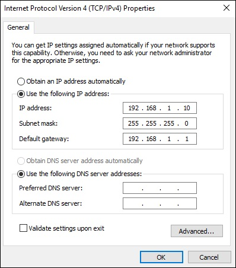
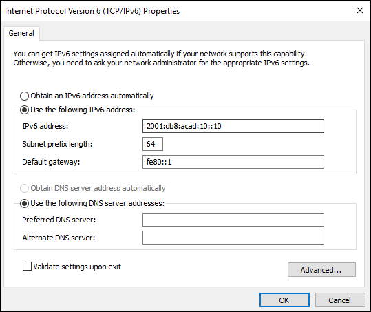
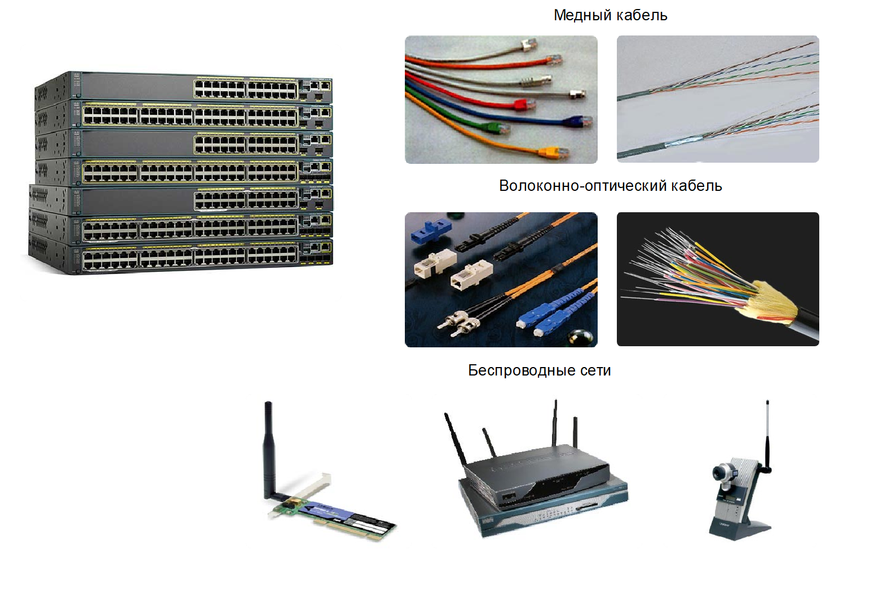

<!-- verified: agorbachev 03.05.2022 -->

<!-- 2.6.1 -->
## IP-адреса

Поздравляем, вы выполнили базовую конфигурацию устройства! Конечно, веселье еще не закончилось.  Если вы хотите, чтобы конечные устройства связывались друг с другом, необходимо убедиться, что каждое из них имеет соответствующий IP-адрес и правильно подключено. В этом разделе вы узнаете об IP-адресах, портах устройств и носителях, используемых для подключения устройств.

Чтобы устройства обнаружили друг друга и установили сквозное подключение по сети Интернет, используются IP-адреса. IP-адреса необходимо настроить для всех оконечных устройств в сети. Примеры конечных устройств:

* Компьютеры (рабочие станции, ноутбуки, файловые серверы, веб-серверы)
* Сетевые принтеры
* Телефоны VoIP
* Видеокамеры системы безопасности
* Смартфоны
* Портативные мобильные устройства (например, беспроводные сканеры штрихкода)

Структура адреса IPv4 — это точечно-десятичное представление в виде четырех десятичных чисел в диапазоне от 0 до 255. Адреса IPv4 присваиваются отдельным устройствам, подключенным к сети.

**Примечание**: Под IP в этом курсе понимаются оба протокола: IPv4 и IPv6. Протокол IPv6 — последняя версия протокола IP, пришедшая на замену более распространенной версии IPv4.

Помимо адреса IPv4 необходима маска подсети. Маска подсети IPv4 — это 32-битовое значение, которое отделяет сетевую часть адреса от узловой части. Маска подсети в сочетании с адресом IPv4 определяет, к какой конкретной подсети относится устройство.

В примере на рисунке узлу назначен адрес IPv4 (192.168.1.10), маска подсети (255.255.255.0) и шлюз по умолчанию (192.168.1.1). Адрес шлюза по умолчанию — это IP-адрес маршрутизатора, который узел будет использовать для доступа к удаленным сетям, в том числе к Интернету.

Длина IPv6-адресов составляет 128 бит, написанных в виде строки шестнадцатеричных значений. Каждые 4 бита представлены одной шестнадцатеричной цифрой, причем общее количество шестнадцатеричных значений равно 32. Группы из четырех шестнадцатеричных цифр разделяются двоеточием (:). IPv6-адреса нечувствительны к регистру, их можно записывать как строчными, так и прописными буквами.

<!-- 2.6.2 -->
## Интерфейсы и порты

Сетевой обмен данными зависит от интерфейсов оконечных пользовательских устройств, интерфейсов сетевых устройств и кабелей, при помощи которых они соединены. Каждый физический интерфейс определяется своими техническими характеристиками (стандартами). Соединяющий кабель должен соответствовать физическим стандартам интерфейса. Существует несколько типов средств сетевого подключения: медные кабели на основе витой пары, оптоволоконные кабели, коаксиальные кабели или средства беспроводного подключения, как показано на рисунке.

<!-- /courses/itn-dl/aeecb970-34fa-11eb-ad9a-f74babed41a6/af1f1412-34fa-11eb-ad9a-f74babed41a6/assets/2daafe12-1c25-11ea-81a0-ffc2c49b96bc.svg -->

Типы средства сетевого подключения данных различаются возможностями и преимуществами. Не все средства сетевого подключения имеют одинаковые характеристики. Не все средства сетевого подключения подходят для одной и той же цели. Вот некоторые различия между типами средствами:

* Расстояние, на которое средство подключения может передавать сигнал
* Среда установки средств подключения
* Объемы данных и скорость передачи
* Стоимость средства подключения и его установка

Каждый канал связи в Интернете не только требует особого типа средства сетевого подключения, но и отдельной сетевой технологии. Например, Ethernet — наиболее распространенная технология локальной сети на сегодняшний день. Порты Ethernet есть на устройствах конечных пользователей, коммутаторах и других сетевых устройствах, которые поддерживают физическое подключение к сети с помощью кабеля.

Коммутаторы Cisco IOS уровня 2 оснащены физическими портами для подключения устройств. Эти порты не поддерживают IP-адреса уровня 3. Поэтому коммутаторы имеют один или несколько виртуальных интерфейсов (switch virtual interface, SVI). Такие интерфейсы называются виртуальными, поскольку на устройстве нет связанного с ними физического оборудования. SVI создается в программном обеспечении.

Виртуальный интерфейс позволяет удаленно управлять коммутатором по сети с помощью протокола IPv4 или IPv6. Каждый коммутатор поставляется с одним интерфейсом SVI в конфигурации по умолчанию. Виртуальным интерфейсом по умолчанию является VLAN 1.

**Примечание**: Для работы коммутатора уровня 2 не нужен IP-адрес. IP-адрес, назначенный SVI, используется для удаленного доступа к коммутатору. Для работы коммутатора IP-адрес не нужен.

<!-- 2.6.3 -->
<!-- quiz -->

