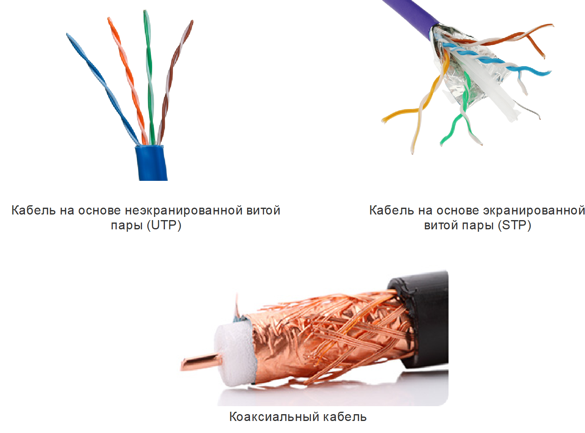
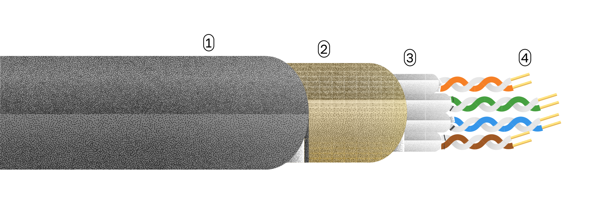

<!-- verified: agorbachev 03.05.2022 -->

<!-- 4.3.1 -->
## Характеристики медных кабелей

Медный кабель является наиболее распространенным типом кабелей, используемых в сетях сегодня. На самом деле это три разных типа медных кабелей, каждый из которых используется в конкретных ситуациях.

Они используются в сетях из-за их невысокой стоимости, простоты монтажа и низкого электрического сопротивления. Однако при передаче сигналов по медным кабелям имеются ограничения по дальности передачи и устойчивости к помехам.

Данные по медным кабелям передаются в виде электрических импульсов. Приемник в сетевом интерфейсе устройства назначения должен получить такой сигнал, который можно легко декодировать для восстановления отправленного сигнала. Однако чем больше дальность передачи сигнала, тем сильнее он искажается. Это называется затуханием сигналов. Поэтому для всех средств подключения на основе медных кабелей в стандартах установлены строгие ограничения на дальность передачи.

Временные характеристики и значения напряжения электрических импульсов также подвержены влиянию следующих источников помех.

* **Электромагнитные помехи (ЭМП) или радиочастотные помехи (РЧП).** Сигналы ЭМП и РЧП могут искажать и нарушать сигналы данных, передаваемые по медному кабелю. Потенциальными источниками ЭМП и РЧП являются источники радиочастотного излучения и электромагнитные устройства, например, флуоресцентные лампы или электродвигатели.
* **Переходные помехи** – это помехи, вызванные воздействием электрических или магнитных полей сигнала одного кабеля на сигнал соседнего кабеля. В телефонных каналах переходные помехи могут приводить к частичной слышимости постороннего разговора по соседнему каналу. Причина этого в том, что при прохождении электрического тока по проводу вокруг него создается слабое круговое магнитное поле, которое может воздействовать и на соседний провод тоже.

На рисунке показано возможное влияние помех на передачу данных.

1.  Передается чистый цифровой сигнал. 
2.  На носителе есть помехи.
3.  Цифровой сигнал поврежден.
4.  Принимающий компьютер считывает измененный сигнал. Обратите внимание, что 0 бит теперь интерпретируется как 1 бит.

Для защиты от вредного влияния ЭМП и РЧП некоторые типы медных кабелей обернуты металлической экранирующей оболочкой. Такие кабели требуют надлежащего заземления.

В некоторых типах медных кабелей провода каждой пары скручены между собой, что обеспечивает эффективное подавление помех.

Восприимчивость медных кабелей к электронному шуму также может быть ограничена с помощью следующих рекомендаций:

* выбрать тип и категорию кабеля, наиболее подходящие для данного сетевого окружения;
* спроектировать кабельную инфраструктуру здания с обходом известных и потенциальных источников помех;
* соблюдать правила прокладки и подключения кабелей при монтаже.

<!-- 4.3.2 -->
## Типы медных кабелей

Для построения сетей используется три основных типа медных кабелей.

На первом рисунке показан неэкранированный кабель витой пары (UTP) с четырьмя цветовыми парами проводов  –  синим, оранжевым, зеленым и коричневым. На втором рисунке изображен экранированный кабель с витой парой (STP), показывающий четыре пары проводов  –  синий, зеленый, коричневый и оранжевый  –  с пленочным щитом, окружающим все четыре пары. На последнем снимке показан центральный медный проводник, окруженный пластиковой изоляцией, окруженный плетеным щитом.

<!-- 4.3.3 -->
## Неэкранированная витая пара (UTP)

Кабели на основе неэкранированной витой пары (UTP) являются самым распространенным средством подключения. Кабели UTP с разъемами RJ-45 используются для соединения узлов с промежуточными сетевыми устройствами, такими как коммутаторы и роутеры.

Кабель UTP для локальных сетей состоит из четырех скрученных пар проводников с цветовой маркировкой, которые заключены в общую гибкую пластиковую оболочку, защищающую кабель от незначительных повреждений. Скручивание проводов снижает влияние помех от других проводов.

На рисунке показано, как цветовая маркировка позволяет идентифицировать пары и проводники, а также облегчает оконцовку кабелей.

Цифры на рисунке определяют некоторые ключевые характеристики неэкранированного кабеля витой пары:

1.  наружная оболочка защищает медный провод от физического повреждения;
2.  витая пара защищает сигнал от помех;
3.  пластиковая изоляция с цветовым кодом создаёт электрическую изоляцию проводов друг от друга и определяет каждую пару.

<!-- 4.3.4 -->
## Экранированная витая пара (STP)

Кабели на основе экранированной витой пары (STP) лучше защищены от помех, чем кабели UTP. Но при этом они значительно дороже и их сложнее монтировать. Как и для кабелей типа UTP, для кабелей STP используется разъем RJ-45.

В кабелях STP применяется как экранирование для защиты от ЭМП и РЧП, так и скручивание проводников для защиты от переходных помех. Для получения наиболее полного эффекта от экранирования кабели STP оснащаются специальными экранированными разъемами для линий передачи данных STP. Если такой кабель не заземлить должным образом, то экран может действовать как антенна и принимать нежелательные сигналы.

На рисунке показан кабель STP, состоящий из четырех пар проводников, обернутых в отдельные экраны из фольги, которые сверху еще вместе обернуты общей экранирующей оплеткой или фольгой.

Цифры на рисунке идентифицируют некоторые ключевые особенности экранированного кабеля витой пары:

1.  наружная оболочка;
2.  экранирующая оплетка или экран из фольги;
3.  экраны из фольги;
4.  витая пара.

<!-- 4.3.5 -->
## Коаксиальный кабель

Коаксиальный кабель называется так потому, что он содержит два соосных проводника. Как показано на рисунке, коаксиальный кабель состоит из нескольких элементов.

* Медный проводник используется для передачи электрических сигналов.
* Слой гибкой пластиковой изоляции расположен вокруг медного проводника.
* Медная оплетка или металлическая фольга, окружающая слой изолирующего материала и выступающая в качестве второго провода в цепи, а также экрана для внутреннего проводника. Этот второй слой, называемый **экраном**, также снижает уровень внешних электромагнитных помех.
* Снаружи кабель покрыт кабельной оболочкой для защиты от незначительных физических повреждений.

С коаксиальным кабелем используются различные типы разъемов. На рисунке показаны соединители типа Bayonet Neill—Concelman (BNC), N и F.

Хотя в современных сетях Ethernet коаксиальные кабели фактически уступили место кабелям UTP, кабели коаксиальной структуры используются в двух областях.

* **Оборудование беспроводных сетей.** Коаксиальные кабели используются для подключения антенн к устройствам беспроводной связи. Они обеспечивют передачу энергии радиочастотных сигналов между антеннами и радиооборудованием.
* **Кабельные интернет-установки.** Поставщики кабельных услуг обеспечивают подключение к Интернету  своим клиентам, заменяя части коаксиального кабеля на опорные элементы усиления с оптоволоконным кабелем. Однако соединения в помещениях клиентов по-прежнему выполняются коаксиальными кабелями.

Цифры на рисунке идентифицируют некоторые ключевые особенности коаксиального кабеля:

1.  наружная оболочка;
2.  медная экранированная оплетка;
3.  пластиковая изоляция;
4.  медный проводник.

<!-- 4.3.6 -->
<!-- quiz -->

