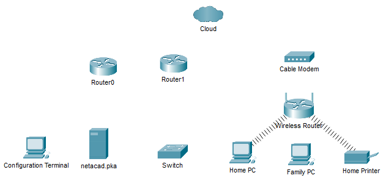

## Топология

## Таблица адресации

| Устройство             | Интерфейс | IP-адрес       | Подключается к |
|------------------------|-----------|----------------|----------------|
| Cloud                  | Eth6      | —              | F0/0           |
| Cloud                  | Coax7     | —              | Port0          |
| Cable Modem            | Port0     | —              | Coax7          |
| Cable Modem            | Port1     | —              | Internet       |
| Router0                | Console   | —              | RS232          |
| Router0                | F0/0      | 192.168.2.1/24 | Eth6           |
| Router0                | F0/1      | 10.0.0.1/24    | F0             |
| Router0                | Ser0/0/0  | 172.31.0.1/24  | Ser0/0         |
| Router1                | Ser0/0    | 172.31.0.2/24  | Ser0/0/0       |
| Router1                | F1/0      | 172.16.0.1/24  | F0/1           |
| Wireless Router        | Internet  | 192.168.2.2/24 | Port1          |
| Wireless Router        | Eth1      | 192.168.1.1    | F0             |
| Family PC              | F0        | 192.168.1.102  | Eth1           |
| Switch                 | F0/1      | 172.16.0.2     | F1/0           |
| Netacad.pka            | F0        | 10.0.0.254     | F0/1           |
| Configuration Terminal | RS232     | —              | Console        |

Эта таблица показывает адресацию для устройства, интерфейса, IP-адреса и где интерфейс подключен.

## Задачи

Часть 1. Подключение к облаку

Часть 2. Подключение маршрутизатора Router0

Часть 3. Подключение оставшихся устройств

Часть 4. Проверка подключений

Часть 5. Изучение физической топологии

## Общие сведения

При работе в программе Packet Tracer (в рамках лабораторной работы или в реальных условиях) вы должны уметь выбирать необходимый кабель и надлежащим образом подключать устройства. В ходе данного упражнения будут рассмотрены: конфигурирование устройств в программе Packet Tracer, выбор кабеля в зависимости от конфигурации, а также подключение устройств. Также в этом упражнении будет подробно рассмотрено физическое представление сети в программе Packet Tracer.

## Инструкции

### Часть 1. Подключение к облаку

**Шаг 1. Подключите Cloud (Облако) к Router0.**

1.  В левом нижнем углу щелкните значок в виде оранжевой молнии, чтобы открыть список доступных **подключений**.

2.  Выберите правильный кабель для подключения порта **F0/0 Router0** к порту **Eth6 Cloud**. **Cloud** — это тип коммутатора, поэтому используйте подключение **Copper Straight-Through** (Медное прямое). После подключения правильного кабеля индикатор канала на кабеле загорится зеленым цветом.

**Шаг 2. Подключите Cloud (Облако) к Cable Modem (Кабельный модем).**

Выберите правильный кабель для подключения порта **Coax7 Cloud** к порту **Port0 Modem**.

После подключения правильного кабеля индикатор канала на кабеле загорится зеленым цветом.

### Часть 2. Подключение маршрутизатора Router0

**Шаг 1. Подключите Router0 к Router1.**

Выберите правильный кабель для подключения порта **Ser0/0/0 Router0** к порту **Ser0/0 Router1**. Используйте один из доступных последовательных (**Serial**) кабелей.

После подключения правильного кабеля индикатор канала на кабеле загорится зеленым цветом.

**Шаг 2. Подключите Router0 к netacad.pka.**

Выберите правильный кабель для подключения порта **F0/1 Router0** к порту **F0 netacad.pka**. Маршрутизаторы и компьютеры обычно используют одинаковые провода для отправки (1 и 2) и получения (3 и 6) данных. Кабель, который нужно выбрать, состоит из скрученных проводов. Хотя многие современные сетевые платы могут автоматически определить, какие пары используются для приема и передачи, на маршрутизаторе **Router0** и сервере **netacad.pka** нет сетевых плат с этой функцией автоопределения.

После подключения правильного кабеля индикатор канала на кабеле загорится зеленым цветом.

**Шаг 3. Подключите Router0 к Configuration Terminal (Терминал настройки).**

Выберите правильный кабель для подключения **консоли Router0** к **терминалу RS232** . Этот кабель не обеспечивает сетевой доступ к **Configuration Terminal**, но позволяет настроить **Router0** через терминал.

После подключения правильного кабеля индикаторы канала на кабеле станут черными.

### Часть 3. Подключение оставшихся устройств

**Шаг 1. Подключите Router1 к Switch (Коммутатор).**

Выберите правильный кабель для подключения порта **F1/0 Router1** к порту **F0/1 Switch**.

После подключения правильного кабеля индикатор канала на кабеле загорится зеленым цветом. Подождите несколько секунд, чтобы индикатор из оранжевого стал зеленым.

**Шаг 2. Подключите Cable Modem (Кабельный модем) к Wireless Router (Беспроводной маршрутизатор).**

Выберите правильный **кабель для подключения порта Port1 Modem** к порту **Internet Wireless Router**.

После подключения правильного кабеля индикатор канала на кабеле загорится зеленым цветом.

**Шаг 3. Подключите Wireless Router (Беспроводной маршрутизатор) к Family PC (Общий ПК).**

Выберите правильный кабель для подключения порта **Eth1 Wireless Router** к **Family PC**.

После подключения правильного кабеля индикатор канала на кабеле загорится зеленым цветом.

### Часть 4. Проверка подключений

**Шаг 1. Проверьте подключение Family PC к netacad.pka.**

1.  Откройте командную строку на **Family PC** и выполните команду ping для сервера **netacad.pka**.

2.  Откройте **веб-браузер** и введите адрес **http://netacad.pka**.

**Шаг 2. Отправьте запрос ping с Home PC (Домашний ПК) на Switch (Коммутатор).**

Откройте командную строку на **Home PC** и выполните команду ping для IP-адреса **Switch**, чтобы проверить соединение.

**Шаг 3. Откройте Router0 с Configuration Terminal (Терминал настройки).**

1.  Откройте **Terminal** на **Configuration Terminal** и примите параметры по умолчанию.

2.  Нажмите клавишу **ввода**, чтобы открыть командную строку **Router0**.

3.  Введите команду **show ip interface brief**, чтобы просмотреть состояние интерфейсов.

### Часть 5. Изучение физической топологии

**Шаг 1. Изучите облако.**

1.  Откройте вкладку **Physical Workspace** (Физическая рабочая область) или используйте сочетания клавиш **Shift**+**P** и **Shift**+**L** для переключения между логической и физической рабочими областями.

2.  Щелкните значок **Home City** (Родной город).

3.  Щелкните значок **Cloud** (Облако).

    Вопрос: Сколько проводов подключено к коммутатору в синей стойке?

    **Введите ваш ответ здесь.**

4.  Нажмите кнопку **Back** (Назад) для возврата к **Home City**.

**Шаг 2. Изучите первичную сеть.**

1.  Щелкните значок **Primary Network** (Первичная сеть). Удерживайте указатель мыши на разных кабелях.

    Вопрос: Что находится в таблице справа от синей стойки?

    **Введите ваш ответ здесь.**

2.  Нажмите кнопку **Back** (Назад) для возврата к **Home City**.

**Шаг 3. Изучите вторичную сеть.**

1.  Щелкните значок **Secondary Network** (Вторичная сеть). Удерживайте указатель мыши на разных кабелях.

    Вопрос: Почему к каждому устройству подключено по два оранжевых кабеля?

    **Введите ваш ответ здесь.**

2.  Нажмите кнопку **Back** (Назад) для возврата к **Home City**.

**Шаг 4. Изучите домашнюю сеть.**

1.  Щелкните значок **Home Network** (Домашняя сеть).

    Вопрос: Почему нет стойки для оборудования?

    **Введите ваш ответ здесь.**

2.  Откройте вкладку **Logical Workspace** (Логическая рабочая область), чтобы вернуться к логической топологии.

[Скачать файл Packet Tracer для локального запуска](./assets/4.6.5-packet-tracer---connect-a-wired-and-wireless-lan_ru-RU.pka)
