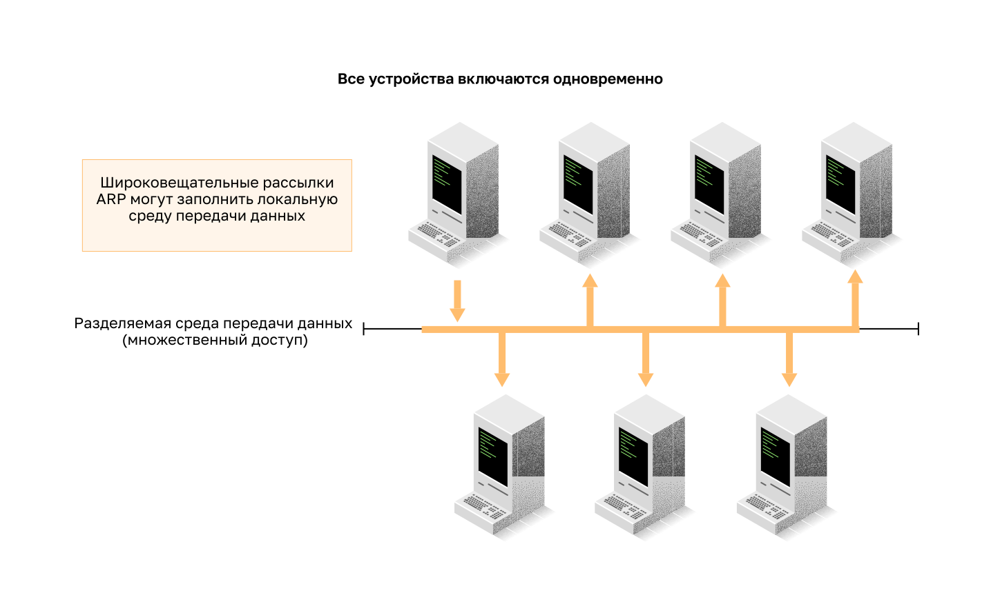

<!-- verified: agorbachev 03.05.2022 -->

<!-- 9.2.1 -->
## Обзор ARP

Если в сети используется протокол связи IPv4, для сопоставления IPv4-адресов с MAC-адресами необходимо использовать протокол разрешения адресов или **ARP**. В этом разделе объясняется, как работает ARP.

Каждое IP-устройство в сети Ethernet имеет уникальный MAC-адрес Ethernet. Когда устройство отправляет кадр Ethernet, он содержит оба этих адреса.

* **MAC-адрес назначения** — MAC-адрес Ethernet устройства назначения в том же сегменте локальной сети. Если узел назначения находится в другой сети, то адресом назначения в кадре будет адрес шлюза по умолчанию (например, роутера).
* **MAC-адрес источника** — это MAC-адрес сетевой платы Ethernet отправителя.

На рисунке показана проблема при отправке кадра другому узлу в том же сегменте сети IPv4.


Чтобы отправить пакет другому узлу в той же локальной сети IPv4, узел должен знать адрес IPv4 и MAC-адрес устройства назначения. Адреса назначения устройства IPv4 либо известны, либо разрешаются по имени устройства. Однако MAC-адреса должны быть обнаружены.

Устройство использует протокол разрешения адресов (ARP) для определения MAC-адреса назначения локального устройства, если известен IPv4-адрес.

Протокол ARP выполняет две основные функции:

* сопоставление IPv4-адресов и МАС-адресов;
* ведение таблицы соответствий IPv4-MAC-адресов.

<!-- 9.2.2 -->
## Функции ARP

Когда пакет отправляется на канальный уровень для инкапсуляции в кадре Ethernet, устройство обращается к таблице в своей памяти, чтобы найти MAC-адрес, который сопоставлен с IPv4-адресом. Эта таблица хранитися в ОЗУ и называется ARP-таблицей или ARP-кешем.

Передающее устройство ищет в своей таблице ARP IPv4-адрес назначения и соответствующий MAC-адрес.

* Если IPv4-адрес назначения пакета находится _в той же сети_, что и IPv4-адрес источника, устройство ищет в таблице ARP IPv4-адрес назначения.
* Если IPv4-адрес назначения пакета находится _в другой сети_, что IPv4-адрес источника, устройство ищет в таблице ARP IPv4-адрес шлюза по умолчанию.

В обоих случаях необходимо найти IPv4-адрес и соответствующий MAC-адрес устройства.

Каждая запись или строка в таблице ARP связывает IPv4-адрес с MAC-адресом. Отношение между двумя значениями называется сопоставлением. Это просто означает, что адрес IPv4 можно найти в таблице и с его помощью определить соответствующий MAC-адрес. Таблица ARP **временно** сохраняет (кеширует) сопоставление устройств в локальной сети (LAN).

Если устройство находит IPv4-адрес, то в качестве MAC-адреса в кадре используется соответствующий MAC-адрес. Если запись не найдена, устройство отправляет ARP-запрос.


Эта анимация иллюстрирует, как хост будет использовать ARP для обнаружения MAC-адреса известного IP-адреса. Хост H1 должен отправить некоторую информацию хосту с IP-адресом 192.168.1.7. Однако H1 не имеет MAC-адреса для этого адреса. Таким образом он отправляет запрос ARP на IP-адрес 192.168.1.7. Все хосты в подсети получают и обрабатывают этот ARP-запрос. Только хост H4 с IP-адресом 192.168.1.7 отправит ответ ARP, содержащий его MAC-адрес.

<!-- 9.2.3 -->
## Видео: принцип работы протокола ARP — ARP-запрос

ARP-запрос отправляется в том случае, когда устройству требуется MAC-адрес, связанный с IPv4-адресом, но в его таблице ARP нет данных о IPv4-адресе.

Сообщения ARP-запроса инкапсулируются непосредственно в кадре Ethernet. Заголовок IPv4 отсутствует. ARP-запрос инкапсулируется в кадре Ethernet со следующей информацией в заголовке:

* **MAC-адрес назначения** (широковещательный адрес FF-FF-FF-FF-FF-FF, требующей принятия и обработки ARP-запроса всеми сетевыми интерфейсными платами Ethernet в локальной сети);
* **MAC-адрес источника** (отправитель MAC-адреса в ARP-запросе);
* **Тип** (в сообщении ARP-запроса есть поле «Тип» со значением 0x806, которое информирует принимающую сетевую плату о том, что для части кадра, выделенной для данных, необходимо использовать процесс ARP).

Поскольку ARP-запросы являются широковещательной рассылкой, они рассылаются через все порты коммутатора, кроме принимающего порта. Все сетевые адаптеры Ethernet в процессе локальной сети транслируют и должны доставить запрос ARP в свою операционную систему для обработки. Каждое устройство обрабатывает ARP-запрос на предмет совпадения целевого IPv4-адреса с собственным адресом. Роутер не пересылает широковещательные рассылки другим интерфейсам.

Только у одного устройства в локальной сети будет IPv4-адрес, совпадающий в целевым IPv4-адресом в ARP-запросе. Ответ от других устройств не поступает.

Просмотрите видео об ARP-запросе для адреса IPv4, который находится в локальной сети.


<!-- 9.2.4 -->
## Видео: принцип работы протокола ARP — ARP-ответ

Только устройство с IPv4-адресом, связанным с целевым IPv4-адресом в ARP-запросе, возвращает ARP-ответ. ARP-ответ инкапсулируется в кадре Ethernet со следующей информацией в заголовке:

* **MAC-адрес получателя** (отправитель MAC-адреса в ARP-запросе);
* **MAC-адрес источника** Это отправитель MAC-адреса в ARP-запросе);
* **Тип** (в сообщении ARP-запроса есть поле «Тип» со значением 0x806, которое информирует принимающую сетевую плату о том, что для части кадра, выделенной для данных, необходимо использовать процесс ARP).

Одноадресный ARP-ответ получит только то устройство, которое отправило ARP-запрос. После получения ARP-ответа устройство добавит IPv4-адрес и соответствующий MAC-адрес в свою таблицу ARP. Теперь пакеты для этого IPv4-адреса можно инкапсулировать в кадрах, используя соответствующий ему MAC-адрес.

Если на ARP-запрос не отвечает ни одно устройство, пакет отбрасывается, поскольку сформировать кадр невозможно.

Записи в таблице ARP получают метку времени. Если к моменту истечения метки времени устройство не получит кадр от какого-либо устройства, запись для этого устройства будет удалена из таблицы.

Кроме того, в таблицу ARP можно добавлять статические записи сопоставления, но это делается нечасто. Срок действия статических записей не истекает со временем, поэтому их необходимо удалять вручную.

**Примечание.** Для IPv6 используется протокол, аналогичный протоколу разрешения адресов (ARP) для IPv4, который называется «Протокол обнаружения соседей» ICMPv6 (ND). Для IPv6 используются сообщения опроса и объявления соседей, которые схожи по своему назначению с ARP-запросами и ответами в IPv4.

Просмотрите видео об ARP-ответе.


<!-- 9.2.5 -->
## Видео: роль ARP в обмене данными с удаленными сетями

Если IPv4-адрес назначения находится в другой сети, что IPv4-адрес источника, устройству-отправителю необходимо отправить кадр на свой шлюз по умолчанию. Это интерфейс локального роутера. Когда в устройстве источника есть пакет с IPv4-адресом в другой сети, оно инкапсулирует этот пакет в кадре, используя MAC-адрес назначения роутера.

IPv4-адрес шлюза по умолчанию хранится в конфигурации IPv4 узлов. Когда узел создает пакет для адресата, он сравнивает IPv4-адрес назначения и свой собственный IPv4-адрес, чтобы определить, находятся ли эти два адреса в одной и той же сети третьего уровня. Если конечный хост находится в другой сети, источник ищет в своей таблице ARP запись с IPv4-адресом шлюза по умолчанию. Если запись отсутствует, для определения MAC-адреса шлюза по умолчанию используется процесс ARP.

Просмотрите видео об ARP-запросе и ответе, при коммуникации с хостами за пределами локальной сети.


<!-- 9.2.6 -->
## Удаление записей из таблицы ARP

В каждом устройстве есть таймер кэша, который удаляет записи из таблицы ARP, не используемые в течение указанного периода времени. Этот период может быть разным в зависимости от операционной системы устройства. Например, новые операционные системы Windows хранят записи таблицы ARP от 15 до 45 секунд, как показано на рисунке.


Кроме того, можно использовать некоторые команды, чтобы удалить все или некоторые записи из таблицы ARP вручную. После удаления записи процесс отправки запроса и получения ответа необходимо задействовать повторно, чтобы зарегистрировать сопоставление в таблице.

<!-- 9.2.7 -->
## Таблицы ARP на сетевых устройствах

На роутере Cisco для просмотра таблицы ARP используется команда **show ip arp**.

```
R1# show ip arp  
Protocol Address Age (min) Hardware Addr Type Interface
Internet 192.168.10.1 - a0e0.af0d.e140 ARPA GigabitEthernet0/0/0
Internet 209.165.200.225 - a0e0.af0d.e141 ARPA GigabitEthernet0/0/1
Internet 209.165.200.226 1 a03d.6fe1.9d91 ARPA GigabitEthernet0/0/1
R1#
```

На компьютерах под управлением Windows 10 для отображения таблицы ARP используется команда **arp –a**.

```
C:\Users\PC > arp -a
Interface: 192.168.1.124 --- 0x10
  Internet Address Physical Address Type
  192.168.1.1 c8-d7-19-cc-a0-86 dynamic
  192.168.1.101 08-3e-0c-f5-f7-77 dynamic
  192.168.1.110 08-3e-0c-f5-f7-56 dynamic
  192.168.1.112 ac-b3-13-4a-bd-d0 dynamic
  192.168.1.117 08-3e-0c-f5-f7-5c dynamic
  192.168.1.126 24-77-03-45-5d-c4 dynamic
  192.168.1.146 94-57-a5-0c-5b-02 dynamic
  192.168.1.255 ff-ff-ff-ff-ff-ff static
  224.0.0.22 01-00-5e-00-00-16 static
  224.0.0.251 01-00-5e-00-00-00-fb static
  239.255.255.250 01-00-5e-7f-ff-fa static
  255.255.255.255 ff-ff-ff-ff-ff static
C:\Users\PC >
```

<!-- 9.2.8 -->
## Широковещательная рассылка и ARP-спуфинг  

Поскольку ARP-запрос является кадром широковещательной рассылки, его получают и обрабатывают все устройства в локальной сети. В стандартной бизнес-сети такие широковещательные рассылки, скорее всего, не окажут серьезного влияния на производительность сети. Но если устройств много и все они одновременно попытаются получить доступ к сетевым службам, это может на короткое время негативно повлиять на работу сети, как показано на рисунке. После того, как устройства разошлют начальные запросы широковещательной рассылки ARP и получат необходимые MAC-адреса, любое влияние на сеть будет сведено к минимуму.




В некоторых случаях использование протокола разрешения адресов (ARP) может представлять определенный риск для безопасности. Злоумышленник может использовать ARP spoofing для выполнения атаки «отравление» ARP-кеша. В ходе таких атак хакер отправляет ответ на ARP-запрос IPv4-адреса с адресом другого устройства, например, шлюза по умолчанию, как показано на рисунке. Хакер отправляет ARP-ответ со своим MAC-адресом. Получатель ответа добавит фальсифицированный MAC-адрес в свою таблицу ARP, что позволит злоумышленнику получать отправляемые пакеты.

Коммутаторы корпоративного уровня оснащены функцией защиты от такого рода атак, которая называется **Dynamic ARP Inspection** (DAI). Функция DAI не рассматривается в этом курсе.


**Примечание.** Для удобства в этом примере MAC-адреса представлены в сокращенном виде.


