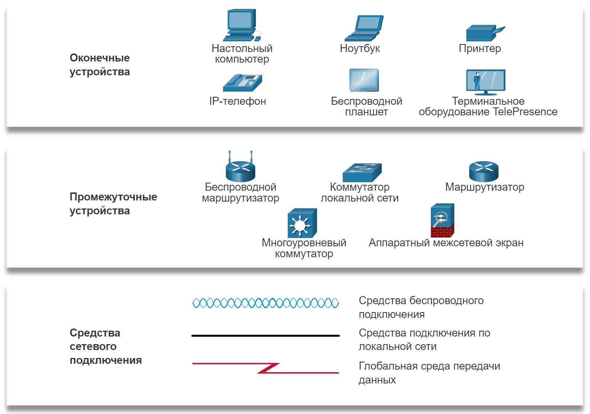
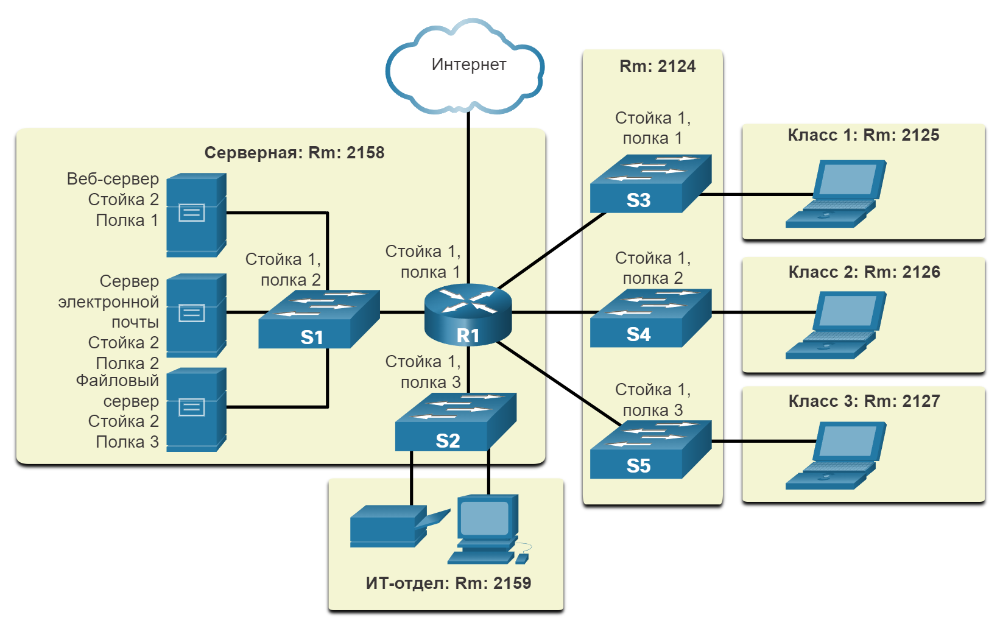

# Представления и топологии сетей

<!-- 1.3.1 -->
##Представления сети
Сетевые архитекторы и администраторы должны уметь показать, как будут выглядеть их сети. Они должны иметь возможность легко видеть, какие компоненты подключаются к другим компонентам, где они будут расположены и как они будут подключены. Для представления различных устройств и каналов, из которых состоит сеть, на схемах сетей часто используются символы, такие как на рисунке.

Изображение показывает символы, используемые в схемах сети. Вверху находятся следующие конечные устройства: настольный компьютер, ноутбук, принтер, IP-телефон, беспроводной стол и конечная точка TelePresence. Посередине находятся следующие промежуточные устройства: беспроводной маршрутизатор, коммутатор локальной сети, маршрутизатор, многоуровневый коммутатор и устройство межсетевого экрана. Внизу расположены следующие сетевые средства массовой информации: синие волны, изображающие беспроводные носители, сплошная черная линия, изображающая носители локальной сети, и красный световой болт, изображающий носители глобальной сети.

Схема обеспечивает наглядный способ понимания, каким образом устройства в большой сети связаны между собой. Этот тип изображения сети называется схемой топологии. Способность понимать логические представления физических сетевых компонентов имеет критическое значение в визуализации организации и функционирования сети.

В дополнение к этим представлениям используется специальная терминология для описания того, как каждое из этих устройств и носители соединяются друг с другом:

- **Сетевые интерфейсные платы (Network Interface Card, NIC)** служат для подключения устройства к сети.
- **Физический порт** — разъем на сетевом устройстве, через который кабели подключены к компьютеру или другому сетевому устройству.
- **Интерфейс** — специализированные порты в сетевом устройстве, которые подключаются к отдельным сетям. Поскольку маршрутизаторы используются для связывания сетей, порты маршрутизатора называются сетевыми интерфейсами.

**Примечание**: Термины «порт» и «интерфейс» часто взаимозаменяемы.

<!-- 1.3.2 -->
## Топологические схемы
Диаграммы топологии являются обязательной документацией для всех, кто работает с сетью. Они представляют визуальную карту соединений в сети. Существует два типа топологических диаграмм: физические и логические.

### Диаграмма физической топологии

Схемы физической топологии — физическое расположение промежуточных устройств и кабельных линий. Можно видеть, что комнаты, в которых расположены эти устройства, помечены в этой физической топологии.

Топология физической сети показывает шесть комнат, каждая из которых выделена светло-желтым прямоугольником, с различными сетевыми устройствами и кабелями. С левой стороны находится серверная комната с надписью комната 2158. Он содержит маршрутизатор с маркировкой R1, установленный на полке 1 стойки 1 с шестью кабельными соединениями. Кабель в верхней части подключается к облаку с надписью Интернет. Кабель слева подключается к коммутатору с надписью S1, установленному на полке 2 стойки 1. S1 подключен к трем серверам: веб-серверу, установленному на полке 1 стойки 2, почтовому серверу, установленному на полке 2 стойки, и файловому серверу, установленному на полке 3 стойки 2. Кабель, подключенный к нижней части R1, подключается к коммутатору с полотчатой S2 установлен на стойке 1 полка 3. S2 имеет два соединения, ведущие к принтеру и ПК в ИТ-офисе с пометкой комната 2159. R1 имеет три кабеля справа, подключенных к трем коммутаторам, расположенным в комнате 2124. Верхний коммутатор имеет маркировку S3 и установлен на полке 1 стойки 1. Средний коммутатор имеет маркировку S4 и установлен на стойке 1 полке 2. Нижний коммутатор имеет маркировку S5 и установлен на полке 1 стойки 3. S3 имеет кабель слева, подключенный к ноутбуку в комнате, помеченной как класс 1 комната 2125. S4 имеет кабель слева, подключенный к ноутбуку в комнате, помеченной как класс 2, комната 2126. S5 имеет кабель слева, подключенный к ноутбуку в комнате, помеченной как класс 3 комната 2127.

### Диаграмма логической топологии

Диаграмма логической топологии иллюстрирует устройства, порты и схему адресации сети, как показано на рисунке. Вы можете увидеть, какие конечные устройства подключены к каким промежуточным устройствам и какие носители используются.

Топология логической сети показывает устройства, метки портов и схему сетевой адресации. В середине изображения находится маршрутизатор с надписью R1. Порт с надписью G0/0 подключается к облаку в верхней части помеченного как Интернет. Порт с надписью G0/1 подключается слева к коммутатору с надписью S1 на порту G0/1. S1 подключен к трем серверам. S1 и серверы выделены светло-желтым кругом с надписью 192.168.10.0 сверху. Порт F0/1 на S1 подключается к веб-серверу. Порт F0/2 на S1 подключается к почтовому серверу. Порт F0/3 на S1 подключается к файловому серверу. Порт F0/1 на R1 подключается внизу к коммутатору с надписью S2. S2 подключается к принтеру и ПК, все из которых выделены в светло-желтый круг с сетью 192.168.11.0, написанной внизу. Слева от R1 расположены три дополнительных соединения, каждое из которых подключается к коммутатору на порту G0/1, который затем подключается к ноутбуку на порту F0/1. Каждый коммутатор и ноутбук выделены желтым цветом и отображается сетевой адрес. Порт G0/0 R1 подключается вверху к коммутатору S3 в сети 192.168.100.0. Порт G1/1 R1 соединяется посередине с коммутатором S4 в сети 192.169.101.0. Порт G1/2 на R1 подключается внизу к коммутатору с надписью S5 в сети 192.168.102.0.

На данном этапе курса вам достаточно знать о топологиях, показанных на схемах физической и логической топологии. Более сложные примеры вы можете найти в Интернете по запросу «схемы сетевой топологии». Если вы добавите слово «Cisco» в поисковую фразу, вы найдете множество топологий с использованием значков, которые похожи на те, что вы видели на этих рисунках.

