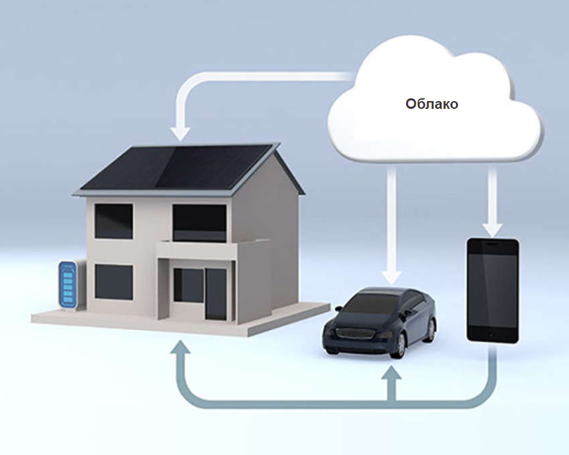

<!-- verified: agorbachev 03.05.2022 -->

<!-- 1.7.1 -->
## Актуальные тенденции

Теперь вы знаете много о сетях, из чего они сделаны, как они соединяют нас и что необходимо, чтобы они оставались надежными. Но сети, как и все остальное, продолжают меняться. Есть несколько тенденций в сети, о которых вы, как студент NetAcad, должны знать.

По мере развития новых технологий и появления на рынке новых оконечных устройств предприятия и потребители должны постоянно приспосабливаться к современным изменяющимся условиям. Существует несколько новых тенденций в развитии сетевых технологий, которые повлияют на организации и потребителей.

* «Принеси на работу свое устройство» (Bring Your Own Device, BYOD)
* Совместная работа через Интернет
* Видеосвязь
* Облачные вычисления

<!-- 1.7.2 -->
## Концепция BYOD

Концепция любого устройства, для любого контента, любым образом, является основной глобальной тенденцией, которая требует значительных изменений в том, как мы используем устройства и безопасно подключаем их к сетям. Эту популярную тенденцию часто называют «Принеси свое собственное устройство» (Bring Your Own Device, BYOD).

Согласно концепции BYOD конечные пользователи могут применять личные устройства для доступа к информации в корпоративной сети или сети комплекса зданий. По мере увеличения популярности потребительских устройств и соответствующего падения цен ожидается, что каждый из сотрудников и учащихся может иметь в личном пользовании самые совершенные вычислительные и сетевые инструменты. К ним относятся ноутбуки, планшеты, смартфоны и электронные книги. Это могут быть устройства, купленные компанией, учебным заведением или самим пользователем.

BYOD означает возможность использования любого устройства в любом месте любым пользователем.

<!-- 1.7.3 -->
## Совместная работа через Интернет

Пользователи подключаются к сети не только для доступа к приложениям для работы с данными, но и для совместной работы друг с другом. Совместная работа — это «работа с другими исполнителями на совместном проекте». Такие инструменты совместной работы, как Cisco Webex (см. рисунок), дают работникам, студентам, учителям, заказчикам и партнерам возможность мгновенного подключения, взаимодействия и достижения целей.

Совместная работа становится критически важным аспектом конкурентоспособности. Совместная работа является приоритетом также в сфере образования. Совместная работа помогает в учебе, развивает навыки взаимодействия в команде, которые необходимы для групповых проектов.

Cisco Webex Teams — это многофункциональный инструмент для совместной работы, который позволяет отправлять мгновенные сообщения одному или нескольким людям, размещать изображения, а также размещать видео и ссылки. Каждая команда «space» сохраняет историю всего, что там размещено.

<!-- 1.7.4 -->
## Видеосвязь

Другая тенденция в сфере сетевых технологий, которая важна для общения и совместной работы, — использование видео. Видео используется для обмена информацией, совместной работы, а также для развлечения. Видеозвонки совершаются с любым лицом, у которого есть подключение к Интернету, независимо от того, где они находятся.

Видеоконференции — это эффективное средство общения как на локальном, так и на глобальном уровне. Использование видео становится ключевым требованием для эффективной совместной работы по мере того, как компании расширяют географические и культурные границы.

<!-- 1.7.5 -->
## Видео: Cisco Webex для небольших переговорных

Посмотрите промо ролик о том, как Cisco Webex внедряется в повседневную жизнь и бизнес.

<!-- 1.7.6 -->
## Облачные вычисления

Облачные вычисления — один из способов получения доступа к данным и их хранения. Облачные вычисления позволяют хранить личные файлы или резервную копию целого жесткого диска на серверах в Интернете. Например, приложениями для работы с текстом и для редактирования фотографий можно пользоваться из облака.

Для предприятий облако расширяет возможности, не требуя при этом больших капиталовложений в создание новой инфраструктуры, обучение нового персонала или лицензирование нового программного обеспечения. Эти экономичные сервисы доступны по запросу на любом устройстве в любой точке мира и обеспечивают должный уровень безопасности и функциональности.

Облачные вычисления возможны благодаря центрам обработки данных. Центр обработки данных (ЦОД) — это помещение, в котором располагаются компьютерные системы и соответствующие компоненты. ЦОД может занимать одно помещение в здании, один или несколько этажей или все здание. ЦОД обычно дорого создавать и обслуживать. По этой причине только крупные организации используют собственные ЦОД, чтобы размещать корпоративные данные и предоставлять услуги пользователям. Организации меньших размеров, которые не могут себе позволить содержание собственного частного ЦОД, могут сократить общие расходы на владение, взяв серверные мощности и сервисы хранения данных в облаке в лизинг у более крупной организации с ЦОД.

Для обеспечения безопасности, надежности и отказоустойчивости поставщики облачных услуг часто хранят данные в распределенных центрах обработки данных. Вместо того, чтобы хранить все данные человека или организации в одном центре обработки данных, они хранятся в нескольких центрах обработки данных в разных местах.

Существует четыре основных типа облаков: публичные облака, частные облака, гибридные облака и коллективные облака, как показано в таблице.

|Типы облаков|Описание|
|---|---|
|**Общедоступные облака**|Облачные приложения и услуги, предлагаемые в общедоступном облаке, доступны неограниченному кругу лиц. Услуги могут быть бесплатными или предлагаются по схеме «оплата по факту использования», например, в случае оплаты интернет-хранилища. Общедоступное облако использует Интернет для предоставления услуг.|
|**Частные облака**|Облачные приложения и сервисы, предлагаемые в частном облаке предназначены для конкретной организации или субъекта, такого как правительство. Частное облако может быть настроено с использованием частной сети организации, хотя его создание и обслуживание может быть дорогостоящим. Управление частным облаком можно поручить внешней организации, которая способна обеспечить максимальную безопасность доступа.|
|**Гибридные облака**|Гибридное облако состоит из двух или более облаков (например, частично частное и частично публичное), где каждая часть остается отдельным объектом, но оба связаны с использованием единой архитектуры. Лица в гибридном облаке будут иметь степень доступа к различным услугам, основанным на правах доступа.|
|**Коллективные облака**|Коллективные облака создается для исключительного использования определенными организациями или организациями. Различия между общедоступным облаком и коллективным облаком заключаются в функциональных потребностях, настроенных для сообщества. Например, медицинские учреждения должны соблюдать политики и законы (например, HIPAA, закон об ответственности и переносе данных о страховании здоровья граждан), которые требуют особой аутентификации и конфиденциальности. Облака сообщества используются несколькими организациями, которые имеют схожие потребности и проблемы. Коллективные облака похожи на общедоступную облачную среду, но с уровнем безопасности, конфиденциальности и даже нормативными требованиями частного облака.|

<!-- 1.7.7 -->
## Технологические тенденции в домашних сетях

Тенденции в развитии сетевых технологий не только оказывают влияние на способ общения на работе и в школе, они также меняют наш образ жизни дома. К новейшим тенденциям домашних сетей относятся «технологии интеллектуального дома».

Технология интеллектуального дома интегрируется в устройства и позволяет им подключаться к другим устройствам и, таким образом, быть более «интеллектуальными» или более автоматизированными. Например, предположим, что вы приготовили блюдо, и перед тем, как уйти из дома на весь день, поставили его в духовку. Вы программируете свою умную печь для пищи, которую вы хотите приготовить. Духовка подключена к вашему «календарю событий», поэтому она знает, когда вы придете домой и начнет готовить еду точно к вашему приходу. Она даже может изменить продолжительность и температуру приготовления, в случае, если ваши планы изменятся. Кроме того, с помощью смартфонов или планшетов пользователи могут напрямую подключиться к духовке и внести необходимые изменения. Когда еда готова, духовка посылает предупреждение вам (или кому-то, кого вы указываете), что еда сделана и нагревается.

Технология «Умный дом» в настоящее время разрабатывается для всех комнат в доме. Технология умного дома станет более распространенной, так как домашние сети и технологии высокоскоростного интернета расширяются.

<!-- /courses/itn-dl/aeec9260-34fa-11eb-ad9a-f74babed41a6/af1e77d0-34fa-11eb-ad9a-f74babed41a6/assets/2d961680-1c25-11ea-81a0-ffc2c49b96bc.svg -->

Смартфон обновляется из облака со статусом умных домашних устройств и смарт-автомобиля. Затем пользователь может использовать смартфон для взаимодействия с умным домом и умным автомобилем.

<!-- 1.7.8 -->
## Сети по линиям электропитания

Организация сети по линиям электропитания — тенденция домашней сети, использующей существующие электрические кабели для соединения устройств, как показано на рисунке.

<!-- /courses/itn-dl/aeec9260-34fa-11eb-ad9a-f74babed41a6/af1e77d0-34fa-11eb-ad9a-f74babed41a6/assets/2d9664a0-1c25-11ea-81a0-ffc2c49b96bc.svg -->

Открытая планировка дома с использованием сети электропередачи для домашней сети.  Существует три 4-портовых адаптера электропередачи PLEK400, подключенных к трем различным электрическим розеткам, соединенным между собой с помощью проводных соединений.  Каждый адаптер имеет по крайней мере одно подключение линии электропередачи к сетевому устройству, включая настольные компьютеры и телевизоры.

При помощи стандартного адаптера сети электропитания устройства могут подключаться к сети LAN везде, где есть электрические розетки. Не нужно устанавливать кабели для передачи данных, и практически не используется дополнительное электричество. С использованием той же проводки, по которой поступает электричество, сети передачи данных по линиям электропитания отправляют информацию на определенных частотах.

Организация сети по линиям электропитания особенно полезна там, где невозможно использовать точки беспроводного доступа или они не обеспечивают доступ для всех устройств в доме. Организация сети по линиям электропитания не служит заменой для выделенных кабельных сетей передачи данных. Однако это альтернатива, когда кабели для передачи данных или беспроводная связь невозможны или неэффективны.

<!-- 1.7.9 -->
## Беспроводная широкополосная сеть

Во многих районах, где кабель и DSL недоступны, беспроводная связь может использоваться для подключения к Интернету.

**Поставщик беспроводных интернет-услуг**

Поставщик беспроводных интернет-услуг (WISP) подключает абонентов к определенным беспроводным точкам доступа с помощью беспроводных технологий, аналогичных домашним беспроводным локальным сетям (WLAN). Чаще всего WISP встречаются в сельской местности, где линии DSL или кабельные сети недоступны.

Иногда антенну устанавливают на отдельную вышку, но чаще ее размещают на существующих конструкциях, таких как водонапорная башня или радиовышка. Небольшая антенна на крыше у абонента находится в зоне приема передатчика WISP. Блок доступа подключается к проводной сети в доме. С точки зрения домашнего пользователя, настройка практически не отличается от настройки DSL или кабельных линий связи. Главное отличие состоит в том, что подключение от дома к оператору связи — это беспроводное подключение, а не через физический кабель.

**Беспроводной широкополосный доступ**

Другое беспроводное решение для дома и малых предприятий — беспроводной широкополосный доступ.

Используется та же сотовая технология, что и для смартфонов. Антенна устанавливается снаружи дома, обеспечивая беспроводное или проводное подключение устройств в любой точке дома. В большинстве случаев домашний беспроводной широкополосный доступ напрямую конкурирует с решениями DSL и кабельными услугами.

<!-- 1.7.10 -->
<!-- quiz -->

