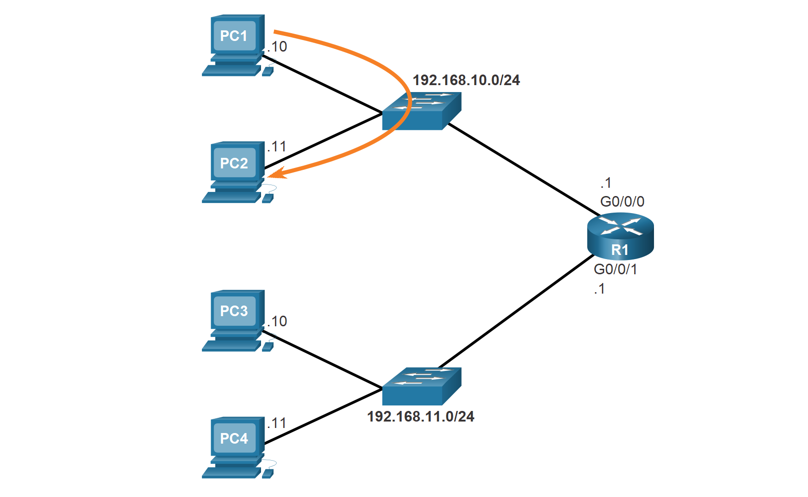
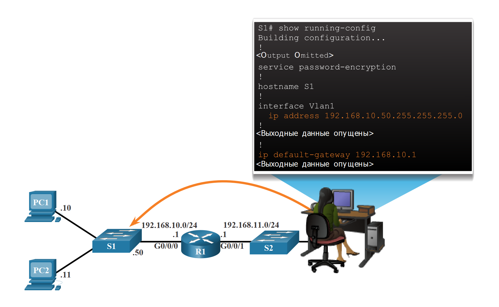

<!-- verified: agorbachev 03.05.2022 -->

<!-- 10.3.1 -->
## Шлюз по умолчанию для хоста

Если локальная сеть имеет только один маршрутизатор, это будет маршрутизатор шлюза, и все узлы и коммутаторы в сети должны быть настроены с этой информацией. Если в локальной сети имеется несколько маршрутизаторов, необходимо выбрать один из них в качестве маршрутизатора шлюза по умолчанию. В этом разделе объясняется, как настроить шлюз по умолчанию на узлах и коммутаторах.

Чтобы оконечное устройство могло обмениваться данными по сети, ему необходимо присвоить правильный IP-адрес, включая адрес шлюза по умолчанию. Шлюз по умолчанию используется только в том случае, когда узлу необходимо отправить пакет устройству в другой сети. Адресом шлюза по умолчанию, как правило, является адрес интерфейса маршрутизатора, связанный с локальной сетью, в которой находится узел. IP-адрес узлового устройства и адрес интерфейса маршрутизатора должны находиться в одной сети.

Например, предположим, что топология сети IPv4 состоит из маршрутизатора, соединяющего две отдельные локальные сети. G0/0 подключен к сети 192.168.10.0, а G0/0.1 — к сети 192.168.11.0. Для каждого главного устройства указан соответствующий адрес шлюза по умолчанию.

В этом примере, если PC1 отправляет пакет PC2, то шлюз по умолчанию не используется. Вместо этого компьютер PC1 отправляет пакет с IPv4-адресом PC2 и пересылает этот пакет непосредственно к PC2 через коммутатор.

<!-- /courses/itn-dl/aeed2ea2-34fa-11eb-ad9a-f74babed41a6/af224860-34fa-11eb-ad9a-f74babed41a6/assets/2e20ca53-1c25-11ea-81a0-ffc2c49b96bc.svg -->

Что если PC1 отправил пакет на PC3? PC1 будет обращаться к пакету с адресом IPv4 PC3, но будет перенаправлять пакет на шлюз по умолчанию, который является интерфейсом G0/0/0 R1. Маршрутизатор принимает пакет, проверяет таблицу маршрутизации, чтобы на основании адреса назначения определить подходящий выходной интерфейс. Затем R1 отправляет пакет из соответствующего интерфейса на PC3.

<!-- /courses/itn-dl/aeed2ea2-34fa-11eb-ad9a-f74babed41a6/af224860-34fa-11eb-ad9a-f74babed41a6/assets/2e20f161-1c25-11ea-81a0-ffc2c49b96bc.svg -->

Такой же процесс будет происходить в сети IPv6, хотя это не отображается в топологии. Устройства будут использовать IPv6 адрес локального маршрутизатора в качестве шлюза по умолчанию.

<!-- 10.3.2 -->
## Шлюз по умолчанию для коммутатора

Коммутатор, который соединяет клиентские компьютеры, обычно является устройством уровня 2. По этой причине коммутатору уровня 2 для нормального функционирования не требуется IP-адрес. Однако, конфигурацию IP можно настроить на коммутаторе, чтобы предоставить администратору удаленный доступ к коммутатору.

Для подключения и управления коммутатором через локальную IP-сеть необходимо настроить виртуальный интерфейс коммутатора (SVI). SVI настроен с IPv4-адресом и маской подсети в локальной локальной сети. Коммутатор также должен иметь адрес шлюза по умолчанию, настроенный для удаленного управления коммутатором из другой сети.

Адрес основного шлюза, как правило, настроен на всех устройствах, которым необходим обмен данными за пределами своей локальной сети.

Чтобы настроить шлюз IPv4 по умолчанию на коммутаторе, используйте команду глобальной конфигурации **ip default-gateway** _ip-address_. Значение _ip-address_, которое указано, является IPv4-адресом локального интерфейса маршрутизатора, подключенного к коммутатору.

На рисунке показан администратор, настраивающий удаленное подключение к коммутатору S1 другой сети.

<!-- /courses/itn-dl/aeed2ea2-34fa-11eb-ad9a-f74babed41a6/af224860-34fa-11eb-ad9a-f74babed41a6/assets/2e211873-1c25-11ea-81a0-ffc2c49b96bc.svg -->

В этом примере узел администратора будет использовать шлюз по умолчанию для отправки пакета на интерфейс G0/0/1 R1. R1 переслал пакет S1 с интерфейса G0/0/0. Поскольку адрес источника пакета IPv4 поступает из другой сети, S1 потребуется шлюз по умолчанию для пересылки пакета на интерфейс G0/0/0 R1. S1 необходимо настроить шлюзом по умолчанию, чтобы иметь возможность реагировать и устанавливать SSH-соединение с административным узлом.

**Примечание:** Пакеты, которые создаются узлами, подключенными к коммутатору, уже должны содержать информацию о шлюзе по умолчанию, настроенном для обмена данными в удаленных сетях.

Коммутатор рабочей группы также может быть настроен с IPv6-адресом на SVI. Однако коммутатор не требует настройки вручную IPv6-адреса шлюза по умолчанию. Коммутатор автоматически получит шлюз по умолчанию из сообщения ICMPv6 Router Advertisement от маршрутизатора.

<!-- 10.3.3 -->
<!-- syntax -->

<!-- 10.3.4 -->
## Работа в симмуляторе: Подключение маршрутизатора к локальной сети (LAN)

В этом упражнении вы будете использовать различные команды **show** для отображения текущего состояния маршрутизатора. Затем вы будете использовать таблицу адресации для настройки интерфейсов Ethernet маршрутизатора. В завершение вы воспользуетесь командами для проверки и тестирования своих конфигураций.

[Подключение маршрутизатора к локальной сети (LAN) (pdf)](./assets/10.3.4-packet-tracer---connect-a-router-to-a-lan.pdf)

[Подключение маршрутизатора к локальной сети (LAN) (pka)](./assets/10.3.4-packet-tracer---connect-a-router-to-a-lan.pka)

<!-- 10.3.5 -->
## Работа в симмуляторе: Устранение неполадок, связанных со шлюзом по умолчанию

Чтобы устройство могло обмениваться данными в пределах нескольких сетей, ему должен быть присвоен IP-адрес, маска подсети и шлюз по умолчанию. Шлюз по умолчанию используется в том случае, когда узлу необходимо отправить пакет устройству, находящемуся в другой сети. Адресом шлюза по умолчанию обычно является адрес интерфейса маршрутизатора, подключенного к локальной сети, к которой подключен узел. В этом упражнении вы завершите документирование сети. После этого вы проверите сетевую документацию, протестировав сквозное подключения и устранив возникшие неполадки. Метод устранения неполадок, который вы будете использовать, состоит из следующих действий.

1.  Проверьте сетевую документацию и выполните тестовые проверки, чтобы выявить проблемы.
2.  Определите оптимальное решение для устранения конкретной проблемы.
3.  Примените выбранное решение.
4.  Проведите тестирование, чтобы убедиться, что проблема устранена.
5.  Запишите выбранное решение.

[Устранение неполадок, связанных со шлюзом по умолчанию Таблица адресации (pdf)](./assets/10.3.5-packet-tracer---troubleshoot-default-gateway-issues.pdf)

[Устранение неполадок, связанных со шлюзом по умолчанию Таблица адресации (pka)](./assets/10.3.5-packet-tracer---troubleshoot-default-gateway-issues.pka)

