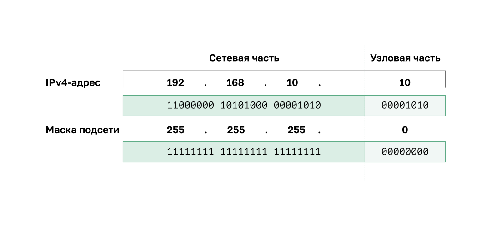
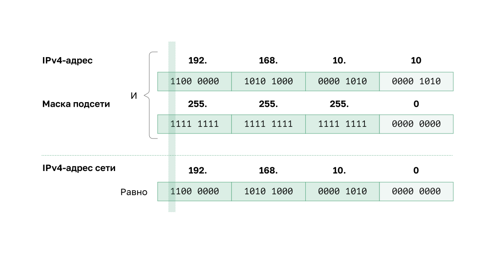

<!-- verified: agorbachev 03.05.2022 -->

<!-- 11.1.1 -->
## Сетевая и узловая части адреса

Адрес IPv4 — иерархический и состоит из раздела сети и раздела хоста. Определяя ту или иную часть, обращайте внимание не на десятичное значение, а на 32-битный поток, как показано на рисунке.

Биты в сетевой части адреса должны быть одинаковыми у всех устройств в одной сети. Биты в хостовой части адреса должны быть уникальными для каждого хоста. Если у двух узлов одна битовая комбинация в определенной сетевой части 32-битного потока, эти два узла находятся в одной и той же сети.

Но как узлы различают сетевую часть 32-битного потока от узловой? Это задача  маски подсети.

<!-- 11.1.2 -->
## Маска подсети

Как показано на рисунке, для назначения адреса IPv4 узлу требуются:

* **IPv4 адрес**   — уникальный IPv4 адрес хоста;
* **маска подсети** \— определяет сетевую часть и часть хоста адреса IPv4.

**Примечание:** Для доступа к удаленным сетям требуется IPv4-адрес шлюза по умолчанию, а IPv4-адрес DNS-сервера необходим для преобразования доменных имен в IPv4-адреса.

Маска подсети IPv4 — это 32-битовое значение, которое отделяет сетевую часть адреса от хостовой части. При назначении устройству IPv4-адреса для определения адреса сети, к которому относится устройство, используют маску подсети. Сетевой адрес представляет все устройства в одной сети.

На рисунке 32-битная маска подсети в десятичном и двоичном форматах с точками.

Обратите внимание, что маска подсети представляет собой последовательность из единичных битов (1), за которой следует последовательность из нулевых битов (0).

Для идентификации сетевой и узловой части IPv4-адреса маска подсети побитово сравнивается с IPv4-адресом слева направо, как показано на рисунке.

Обратите внимание, что маска подсети на самом деле не содержит сетевой или узловой части IPv4-адреса; она лишь указывает компьютеру, где искать эти части в конкретном IPv4-адресе.

Сам процесс определения сетевой и узловой частей адреса называется логической операцией И (AND).

<!-- 11.1.3 -->
## Длина префикса

Представление сетевых адресов и адресов узлов в виде маски подсети в десятичном формате с точкой-разделителем может быть очень громоздким. К счастью, существует более простой способ определения маски подсети, называемый длиной префикса.

Длина префикса означает количество бит, установленных в единицу (1) в маске подсети. Она обозначается символом «/», после которого идет число единиц. Следовательно, нужно подсчитать число битов в маске подсети и поставить перед этим значением косую черту.

Примеры сравнения масок подсети и длины префикса можно увиделть в таблице. В первом столбце перечислены различные маски подсети, которые могут использоваться с адресом узла. Во втором столбце указан полученный 32-битный двоичный адрес. В последнем столбце указана полученная длина префикса.

*Сравнение масок подсети и длины префикса*

| **Маска подсети** | **32-битный адрес** | **Длина префикса** |
| --- | --- | --- |
| 255.0.0.0 | `11111111.00000000.00000000.00000000` | /8 |
| 255.255.0.0 | `11111111.11111111.00000000.00000000` | /16 |
| 255.255.255.0 | `11111111.11111111.11111111.00000000` | /24 |
| 255.255.255.128 | `11111111.11111111.11111111.10000000` | /25 |
| 255.255.255.192 | `11111111.11111111.11111111.11000000` | /26 |
| 255.255.255.224 | `11111111.11111111.11111111.11100000` | /27 |
| 255.255.255.240 | `11111111.11111111.11111111.11110000` | /28 |
| 255.255.255.248 | `11111111.11111111.11111111.11111000` | /29 |
| 255.255.255.252 | `11111111.11111111.11111111.11111100` | /30 |

**Примечание**: Сетевой адрес также называется префиксом или сетевым префиксом. Длина префикса означает количество бит, установленных в единицу (1) в маске подсети.

Предоставляя адрес, длину префикса записывают за адресом IPv4 без пробелов. Например, 192.168.10.10 255.255.0 будет записан как 192.168.10.10/24. Об использовании различных типов длины префикса вы узнаете позже. Сейчас же мы будем говорить о маске подсети /24 (т.е. 255.255.255.0).

<!-- 11.1.4 -->
## Определение сети: логическое И

Логическая операция И — одна из трех основных двоичных операций, используемых в дискретной логике. Две другие операциями — ИЛИ (OR) и НЕ (NOT). Операцию И используют для определения сетевого адреса.

Логическое И — это сравнение двух битов, результаты которого показаны на рисунке ниже. Обратите внимание, что 1 И 1 = 1. Любая другая комбинация приводит к 0.

* 1 И 1 = 1
* 0 И 1 = 0
* 1 И 0 = 0
* 0 И 0 = 0

**Примечание**: В цифровой логике 1 представляет True, а 0 — False. При использовании операции AND оба входных значения должны быть True (1), чтобы результат был True (1).

Чтобы определить сетевой адрес IPv4-узла, к IPv4-адресу и маске подсети побитово применяется логическая операция И. Применение логической операции И к адресу и маске подсети в результате дает сетевой адрес.

Теперь посмотрим, как операция И определяет сетевой адрес.На рисунке показаны узел с IPv4-адресом и маской подсети.

* **IPv4 адрес узла (192.168.10.10)**  — IPv4-адрес хоста в десятичном  формате с точками и в двоичном виде.
* **Маска подсети (255.255.255.0)** — Маска подсети узла в десятичном формате с точками и в двоичном виде.
* **Сетевой адрес (192.168.10.0)** — Логическая операция AND между адресом IPv4 и маской подсети приводит к тому, что сетевой адрес IPv4 отображается в десятичном формате с точками и в двоичном виде.

Обратите внимание, что операция логического И выполняется на 1 бите адресе хоста с 1 битом маски подсети. Это приводит к 1 биту  сетевого адреса. 1 И 1 = 1.

В этом примере операция логического И между адресом узла 192.168.10.10 и маской подсети 255.255.255.0 (/24) приводит к созданию IPv4-адреса сети 192.168.10.0/24. Это важная операция IPv4, так как она сообщает хосту, к какой сети он принадлежит.

<!-- 11.1.5 -->
## Видео: разновидности IP-адресов

В каждой сети есть три типа IP-адресов:

* сетевой адрес,
* адрес хоста,
* широковещательный адрес.

Посмотрите видео, как определяется сетевой адрес, адрес узла и адрес широковещательной рассылки.

<!-- 11.1.6 -->

**Сетевой адрес**

Сетевой адрес — это адрес, представляющий определенную сеть. Устройство принадлежит этой сети, если оно удовлетворяет трем критериям:

* имеет ту же маску подсети, что и сетевой адрес;
* имеет те же биты сети, что и сетевой адрес, как указано маской подсети;
* расположен в том же домене широковещательной рассылки, что и другие узлы с тем же сетевым адресом.

Узел определяет свой сетевой адрес, выполняя операцию логического И между  IPv4-адресом и маской подсети.

Как показано в таблице, сетевой адрес имеет все 0-биты в части узла, как определено маской подсети. В этом примере сетевой адрес — 192.168.10.0/24. Сетевой адрес не может быть назначен устройству.

|  | **Сетевая часть** | **Хостовая часть** | **Биты хоста** |
| --- | --- | --- | --- |
| Маска подсети **255.255.255**.0 или **/24** | `255 255 255` `11111111 11111111 11111111` | `0` `00000000` |  |
| Сетевой адрес **192.168.10**.0 или **/24** | `192 168 10` `11000000 10100000 00001010` | `0` `00000000` | Все 0 |
| Первый адрес **192.168.10**.1 или **/24** | `192 168 10` `11000000 10100000 00001010` | `1` `00000001` | Все 0 и 1 |
| Последний адрес **192.168.10**.254 или **/24** | `192 168 10` `11000000 10100000 00001010` | `254` `11111110` | Все 1 и 0 |
| Широковещательный адрес **192.168.10**.255 или **/24** | `192 168 10` `11000000 10100000 00001010` | `255` `11111111` | Все 1 |

**Адреса узлов**

Адреса узлов — это адреса, которые могут быть назначены устройству (компьютеру, смартфону, веб-камере, принтеру и т.д). Основная часть адреса — биты, обозначенные 0 битами в маске подсети. Адреса хоста могут иметь любую комбинацию битов в части хоста, за исключением всех 0-битов (это будет сетевой адрес) или всех 1-битов (это будет широковещательный адрес).

Все устройства в одной сети должны иметь одинаковую маску подсети и одинаковые биты сети. Только биты хоста будут отличаться и должны быть уникальными.

Обратите внимание, что в таблице есть первый и последний адрес хоста:

* **первый используемый адрес**  — первый узел в сети, имеет все 0-биты с последним (самым правым) 1-битом. В этом примере это 192.168.10.1/24.
* **последний используемый адрес** — последний узел, в сети имеет все 1-биты с последним (самым правым) 0-битом. В этом примере это 192.168.10.254/24.

Любые адреса между 192.168.10.1/24 по 192.168.10.254/24 включительно могут быть назначены устройству в сети.

**Широковещательный адрес**

Широковещательный адрес используется, когда необходим доступ ко всем устройствам в  IPv4-сети. Как показано в таблице, сетевой широковещательный адрес имеет все 1-биты в части узла, определяемой маской подсети. В этом примере сетевой адрес — 192.168.10.255/24. Широковещательный адрес не может быть назначен устройству.

<!-- 11.1.7 -->
<!-- ## Упражнение - Логическое  И для определения сетевого адреса -->

<!-- 11.1.8 -->
<!-- quiz -->
