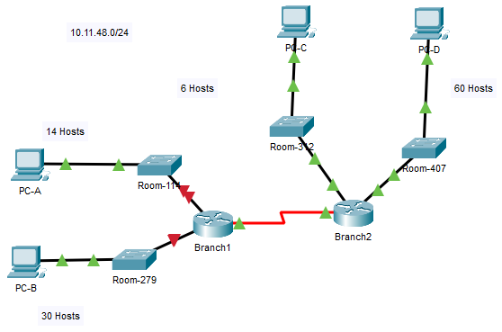

## Топология

## Топология

Будет получена одна из трех возможных топологий.

## Таблица адресации

| Устройство      | Интерфейс | IP-адрес | Маска подсети | Шлюз по умолчанию |
|-----------------|-----------|----------|---------------|-------------------|
| \[\[R1Name\]\]  | G0/0      |          |               | Нет               |
| \[\[R1Name\]\]  | G0/1      |          |               | Нет               |
| \[\[R1Name\]\]  | S0/0/0    |          |               | —                 |
| \[\[R2Name\]\]  | G0/0      |          |               | —                 |
| \[\[R2Name\]\]  | G0/1      |          |               | —                 |
| \[\[R2Name\]\]  | S0/0/0    |          |               | —                 |
| \[\[S1Name\]\]  | VLAN 1    |          |               |                   |
| \[\[S2Name\]\]  | VLAN 1    |          |               |                   |
| \[\[S3Name\]\]  | VLAN 1    |          |               |                   |
| \[\[S4Name\]\]  | VLAN 1    |          |               |                   |
| \[\[PC1Name\]\] | NIC       |          |               |                   |
| \[\[PC2Name\]\] | NIC       |          |               |                   |
| \[\[PC3Name\]\] | NIC       |          |               |                   |
| \[\[PC4Name\]\] | NIC       |          |               |                   |

## Задачи

**Часть 1. Изучение требований к сети**

**Часть 2. Разработка схемы адресации VLSM**

**Часть 3. Назначение сетевым устройствам IP-адресов и проверка подключения**

## Общие сведения

В этом упражнении вы будете использовать заданный сетевой адрес /24 для разработки схемы адресации VLSM. На основании требований вы назначите подсети и адреса, настроите устройства и проверите подключения.

## Инструкции

### Часть 1. Изучение требований к сети

**Шаг 1. Определите количество необходимых подсетей.**

Вы разделите на подсети сетевой адрес **\[\[DisplayNet\]\].** К сети предъявляются следующие требования.

-   **·Локальной сети** \[\[S1Name\]\] **потребуются IP-адреса хоста** \[\[HostReg1\]\].

-   **·Локальной сети** \[\[S2Name\]\] **потребуются IP-адреса хоста** \[\[HostReg2\]\].

-   **·Локальной сети** \[\[S3Name\]\] **потребуются IP-адреса хоста** \[\[HostReg3\]\].

-   **·Локальной сети** \[\[S4Name\]\] **потребуются IP-адреса хоста** \[\[HostReg4\]\].

Вопрос: Сколько подсетей требует данная топология сети?

**Введите ваш ответ здесь.**

**Шаг 2. Определите маски для каждой подсети.**

Вопросы:

1.  Какая маска подсети обеспечит нужное количество IP-адресов для **\[\[S1Name\]\]**?

    **Введите ваш ответ здесь.**

    Сколько доступных для использования адресов узлов будет поддерживать данная подсеть?

    **Введите ваш ответ здесь.**

2.  Какая маска подсети обеспечит нужное количество IP-адресов для **\[\[S2Name\]\]**?

    **Введите ваш ответ здесь.**

    Сколько доступных для использования адресов узлов будет поддерживать данная подсеть?

    **Введите ваш ответ здесь.**

3.  Какая маска подсети обеспечит нужное количество IP-адресов для **\[\[S3Name\]\]**?

    **Введите ваш ответ здесь.**

    Сколько доступных для использования адресов узлов будет поддерживать данная подсеть?

    **Введите ваш ответ здесь.**

4.  Какая маска подсети обеспечит нужное количество IP-адресов для **\[\[S4Name\]\]**?

    **Введите ваш ответ здесь.**

    Сколько доступных для использования адресов узлов будет поддерживать данная подсеть?

    **Введите ваш ответ здесь.**

5.  Какая маска подсети обеспечит нужное количество IP-адресов для соединения **\[\[R1Name\]\]** и **\[\[R2Name\]\]**?

    **Введите ваш ответ здесь.**

### Часть 2. Разработка схемы адресации VLSM

**Шаг 1. Разделите сеть \[\[DisplayNet\]\], исходя из количества узлов на каждую подсеть.**

1.  Первую подсеть используйте для создания самой крупной сети LAN.

2.  Вторую подсеть используйте для создания второй по размеру сети LAN.

3.  Третью подсеть используйте для создания третьей по размеру локальной сети (LAN).

4.  Четвертую подсеть используйте для создания четвертой по размеру локальной сети (LAN).

5.  Пятую подсеть используйте для соединения маршрутизаторов **\[\[R1Name\]\]** и **\[\[R2Name\]\]**.

**Шаг 2. Задокументируйте подсети VLSM.**

Заполните **Таблицу подсетей**, указав описания подсетей (например, локальная сеть \[\[S1Name\]\]), требуемое количество узлов, сетевой адрес подсети, первый используемый адрес узла и широковещательный адрес. Повторяйте эти действия до тех пор, пока все адреса не будут внесены в список.

Таблица подсетей

| Описание подсети | Необходимое количество узлов | Сетевой адрес/CIDR | Первый используемый адрес узла | Широковещательный адрес |
|------------------|------------------------------|--------------------|--------------------------------|-------------------------|
| &nbsp;           |                              |                    |                                |                         |
| &nbsp;           |                              |                    |                                |                         |
| &nbsp;           |                              |                    |                                |                         |
| &nbsp;           |                              |                    |                                |                         |
| &nbsp;           |                              |                    |                                |                         |

**Шаг 3. Задокументируйте схему адресации.**

1.  Назначьте первые доступные IP-адреса маршрутизатору **\[\[R1Name\]\]** для двух каналов локальной сети (LAN) и одного канала сети WAN.

2.  Назначьте первые доступные IP-адреса маршрутизатору **\[\[R2Name\]\]** для двух каналов локальной сети (LAN). Последний из используемых IP-адресов назначьте каналу WAN.

3.  Второй из используемых IP-адресов назначьте коммутаторам.

4.  Последний из используемых IP-адресов назначьте узлам.

### Часть 3. Назначение IP-адресов устройствам и проверка подключения

Основная часть параметров IP-адресации для данной сети уже настроена. Для завершения настройки адресации выполните следующие шаги.

**Шаг 1. Настройте IP-адресацию на интерфейсах локальной сети (LAN) маршрутизатора \[\[R1Name\]\].**

**Шаг 2. Настройте IP-адресацию на коммутаторе \[\[S3Name\]\], включая шлюз по умолчанию.**

**Шаг 3. Настройте IP-адресацию на компьютере \[\[PC4Name\]\], включая шлюз по умолчанию.**

**Шаг 4. Проверьте подключение.**

Подключение можно проверить только от устройств \[\[R1Name\]\], \[\[S3Name\]\] и \[\[PC4Name\]\]. При этом необходимо отправлять эхо-запрос на каждый IP-адрес, перечисленный в **Таблице адресации**.

ID:\[\[indexAdds\]\]\[\[indexNames\]\]\[\[indexTopos\]\]

[Скачать файл Packet Tracer для локального запуска](./assets/11.9.3-lab.pka)
