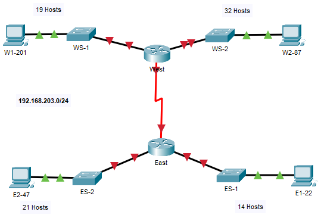

---

> **ВАЖНО**
> 
> Форма для ответов на вопросы будет доступна только при развертывании лабораторной работы 

---

## Топология

## Таблица адресации

| Устройство      | Интерфейс | IP-адрес | Маска подсети | Шлюз по умолчанию |
|-----------------|-----------|----------|---------------|-------------------|
| \[\[R1Name\]\]  | G0/0      |          |               | Нет               |
| \[\[R1Name\]\]  | G0/1      |          |               | Нет               |
| \[\[R1Name\]\]  | S0/0/0    |          |               | —                 |
| \[\[R2Name\]\]  | G0/0      |          |               | —                 |
| \[\[R2Name\]\]  | G0/1      |          |               | —                 |
| \[\[R2Name\]\]  | S0/0/0    |          |               | —                 |
| \[\[S1Name\]\]  | VLAN 1    |          |               |                   |
| \[\[S2Name\]\]  | VLAN 1    |          |               |                   |
| \[\[S3Name\]\]  | VLAN 1    |          |               |                   |
| \[\[S4Name\]\]  | VLAN 1    |          |               |                   |
| \[\[PC1Name\]\] | NIC       |          |               |                   |
| \[\[PC2Name\]\] | NIC       |          |               |                   |
| \[\[PC3Name\]\] | NIC       |          |               |                   |
| \[\[PC4Name\]\] | NIC       |          |               |                   |

## Цели

В этой лабораторной работе вы разработаете схему адресации VLSM с учетом сетевого адреса и требований к хостам. Вы будете настраивать адресации на маршрутизаторах, коммутаторах и хостах.

-   Разработайте схему IP-адресации VLSM с учетом требований.

-   Настройте адресацию на сетевых устройствах и хостах.

-   Проверьте IP-подключение.

-   Найдите и устраните неполадки подключения

## Общие сведения и сценарий

Вам предложили разработать, внедрить и протестировать схему адресации для клиента. Клиент предоставил вам сетевой адрес, подходящий для сети, топологии и требований к хостам. Вы будете реализовывать и тестировать свой проект сети.

## Инструкции

Ваш клиент получил сетевой адрес **\[\[DisplayNet\]\]** . Требования к адресам хостов:

## Требования

Требования хостов:

| LAN                | Требуемое количество адресов |
|--------------------|------------------------------|
| \[\[S1Name\]\] LAN | \[\[HostReg1\]\]             |
| \[\[S2Name\]\] LAN | \[\[HostReg2\]\]             |
| \[\[S3Name\]\] LAN | \[\[HostReg3\]\]             |
| \[\[S4Name\]\] LAN | \[\[HostReg4\]\]             |

Определение требований к архитектуре

-   Создайте план адресации. Следуйте указаниям, приведенным в учебной программе относительно порядка подсетей.

-   Подсети должны быть смежными. Между подсетями не должно быть неиспользуемого адресного пространства.

-   Обеспечьте максимально эффективную подсеть для канала «точка-точка» между маршрутизаторами.

-   Документируйте свой проект сети в таблице, подобной приведенной ниже.

| Описание подсети | Необходимое количество узлов | Сетевой адрес/CIDR | Первый используемый адрес узла | Широковещательный адрес |
|------------------|------------------------------|--------------------|--------------------------------|-------------------------|
| &nbsp;           |                              |                    |                                |                         |
| &nbsp;           |                              |                    |                                |                         |
| &nbsp;           |                              |                    |                                |                         |
| &nbsp;           |                              |                    |                                |                         |
| &nbsp;           |                              |                    |                                |                         |

Требуется произвести конфигурацию.

Примечание. Вы будете настраивать адресации на **всех** устройствах и хостах в сети.

-   Назначьте первые доступные IP-адреса маршрутизатору \[\[R1Name\]\] для двух каналов локальной сети (LAN) и одного канала сети WAN.

-   Назначьте первые доступные IP-адреса маршрутизатору \[\[R2Name\]\] для двух каналов локальной сети (LAN) и одного канала сети WAN. Последний из используемых IP-адресов назначьте каналу WAN.

-   Назначьте коммутаторам второй используемый IP-адрес в подключенных подсетях.

-   Интерфейс управления коммутатором должен быть доступен с хостов во всех локальных сетях.

-   Последний из используемых IP-адресов, соответствующих подсетей назначьте узлам.

Если схема и реализация адресации верны, все узлы и устройства должны быть доступны по сети.

ID:\[\[indexAdds\]\]\[\[indexNames\]\]\[\[indexTopos\]\]

<!-- [Скачать файл Packet Tracer для локального запуска](./assets/11.10.1-lab.pka) -->
