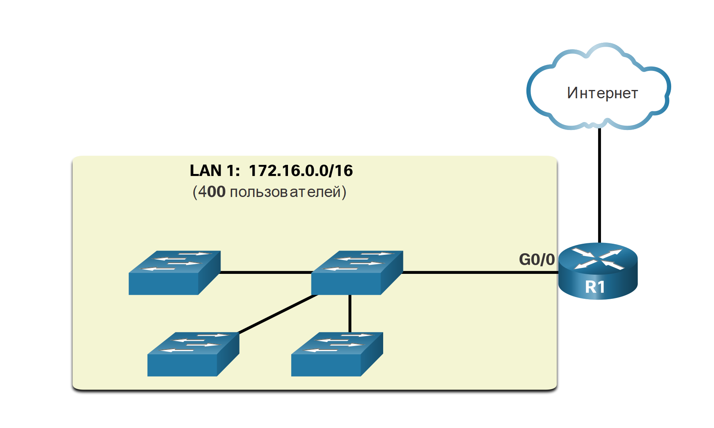
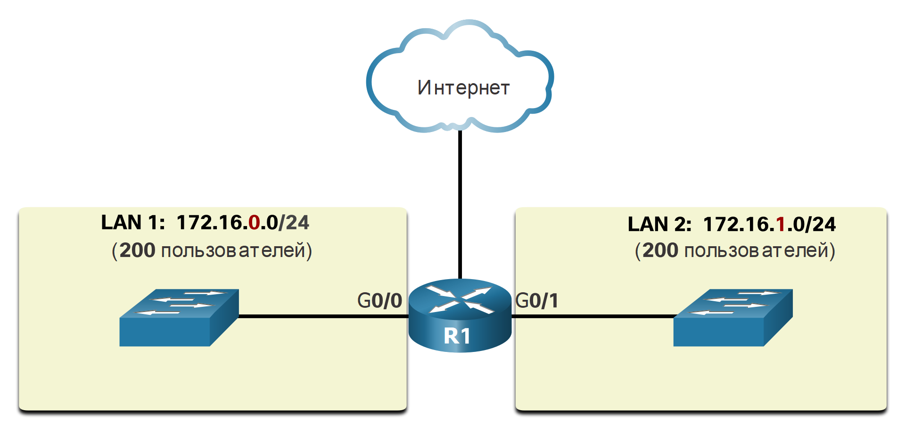
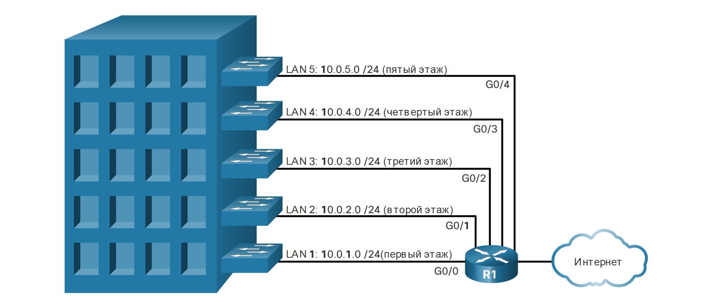
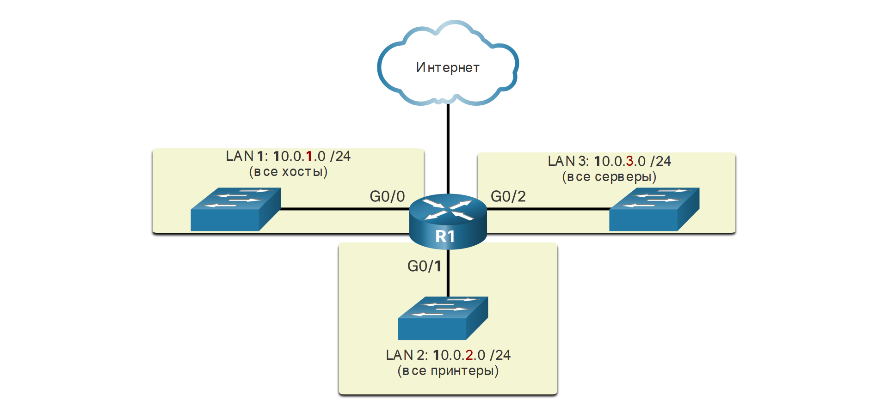

# Сегментация сети

<!-- 11.4.1 -->
##  Широковещательный домен и сегментация

Вы когда-нибудь получали электронное письмо, адресованное каждому человеку на работе или в школе? Это было широковещательная электронная почта. Надеюсь, в нем содержалась информация, которую каждый из вас должен был знать. Но часто широковещательная рассылка не очень актуальна для всех в списке рассылки. Иногда только часть населения должна читать эту информацию.

В локальной сети Ethernet устройства используют широковещательные передачи и протокол разрешения адресов (ARP) для поиска других устройств. ARP использует для отправки широковещательный адрес на уровне 2 с известным IPv4-адресу в локальной сети, чтобы обнаружить  MAC-адрес назначения. Устройства в локальных сетях Ethernet также находят другие устройства, использующие службы.  Узел, как правило, получает свои настройки IPv4-адреса с помощью протокола динамической настройки узла (DHCP), который осуществляет широковещательную рассылку в локальной сети, чтобы найти DHCP-сервер.

Коммутаторы выполняют широковещательную рассылку на все интерфейсы, за исключением того интерфейса, через который была получена рассылка. Например, если бы коммутатор, показанный на рисунке, получил широковещательную рассылку, он бы переслал ее другим коммутаторам и другим пользователям, подключенным к сети.

<!-- /courses/itn-dl/aeed55b0-34fa-11eb-ad9a-f74babed41a6/af22bd92-34fa-11eb-ad9a-f74babed41a6/assets/2e3033a2-1c25-11ea-81a0-ffc2c49b96bc.svg -->

Маршрутизаторы не выполняют широковещательную рассылку. Когда маршрутизатор получает широковещательную рассылку, он не пересылает ее на другие интерфейсы. Например, когда маршрутизатор R1 получает широковещательную рассылку на свой интерфейс Gigabit Ethernet 0/0, он не пересылает ее на другие интерфейсы.

Таким образом, каждый интерфейс маршрутизатора подключен к широковещательному домену, и широковещательные рассылки выполняются только в рамках определенного домена рассылки.

<!-- 11.4.2 -->
## Проблемы с крупными широковещательными доменами

Крупный широковещательный домен представляет собой сеть, соединяющую множество узлов. Проблема крупного широковещательного домена заключается в следующем: узлы могут генерировать избыточную рассылку и негативно влиять на работу сети. На рисунке локальная сеть LAN 1 связывает 400 пользователей, каждый из которых может генерировать трафик широковещательной рассылки. Это приводит к замедлению сетевых операций из-за значительного объема трафика, который он может вызвать, и замедление работы устройства, поскольку устройство должно принимать и обрабатывать каждый широковещательный пакет.

<!-- /courses/itn-dl/aeed55b0-34fa-11eb-ad9a-f74babed41a6/af22bd92-34fa-11eb-ad9a-f74babed41a6/assets/2e305ab4-1c25-11ea-81a0-ffc2c49b96bc.svg -->

Для решения этой проблемы надо сократить размер сети, создав меньшие домены широковещательной рассылки. Такой процесс называется разделением на подсети. Такие более мелкие сети называются подсетями.

На рисунке ниже, например, 400 пользователей локальной сети LAN 1 с сетевым адресом 172.16.0.0/16 были разделены на две подсети по 200 пользователей каждая — 172.16.0.0/24 и 172.16.1.0/24. Рассылка ограничивается более мелкими доменами широковещательной рассылки. Таким образом, широковещательная рассылка из локальной сети LAN 1 не распространится на сеть LAN 2.

<!-- /courses/itn-dl/aeed55b0-34fa-11eb-ad9a-f74babed41a6/af22bd92-34fa-11eb-ad9a-f74babed41a6/assets/2e3081c2-1c25-11ea-81a0-ffc2c49b96bc.svg -->

Обратите внимание на изменение длины префикса с /16 на /24. Использование битов в узловой части для создания дополнительных подсетей — основа разделения на подсети.

**Примечание**: Термины «подсеть» и «сеть» часто используются как синонимы. Большинство сетей сами являются подсетями более крупных блоков адресов.

<!-- 11.4.3 -->
## Причины сегментации сетей

Разделение на подсети снижает общий объем сетевого трафика и повышает производительность сети. Кроме того, это дает возможность администраторам применять меры безопасности. Например, определить подсети, которым разрешено и которым не разрешено взаимодействовать друг с другом. Другая причина заключается в том, что он уменьшает количество устройств, пострадавших от ненормального широковещательного трафика из-за неправильных конфигураций, аппаратных и программных проблем или злонамеренных намерений.

Существует несколько способов использования подсетей для управления сетевыми устройствами.

### Сегментация по местоположению

<!-- /courses/itn-dl/aeed55b0-34fa-11eb-ad9a-f74babed41a6/af22bd92-34fa-11eb-ad9a-f74babed41a6/assets/2e30a8d5-1c25-11ea-81a0-ffc2c49b96bc.svg -->

### Сегментация по группам или функциям

<!-- /courses/itn-dl/aeed55b0-34fa-11eb-ad9a-f74babed41a6/af22bd92-34fa-11eb-ad9a-f74babed41a6/assets/2e30cfe6-1c25-11ea-81a0-ffc2c49b96bc.svg -->

### Сегментация по типу устройств

<!-- /courses/itn-dl/aeed55b0-34fa-11eb-ad9a-f74babed41a6/af22bd92-34fa-11eb-ad9a-f74babed41a6/assets/2e30f6f7-1c25-11ea-81a0-ffc2c49b96bc.svg -->

Сетевые администраторы могут создавать подсети, используя любое другое подразделение, которое имеет смысл для сети. Обратите внимание, что на каждом рисунке для подсетей используется более длинный префикс, обозначающий сеть.

Понимание принципа разделения сети на подсети — главный навык, которым должен обладать каждый сетевой администратор. Разработаны различные методы, помогающие понять суть этого процесса. На первый взгляд разделение на сети может показаться сложным, но чем больше внимания вы будете уделять деталям и чем больше будете практиковаться, тем этот процесс станет для вас проще и понятнее.

<!-- 11.4.4 -->
<!-- quiz -->

