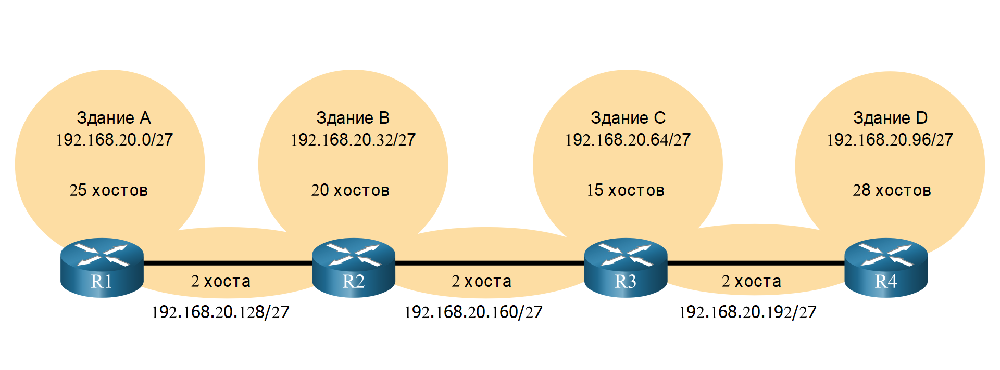
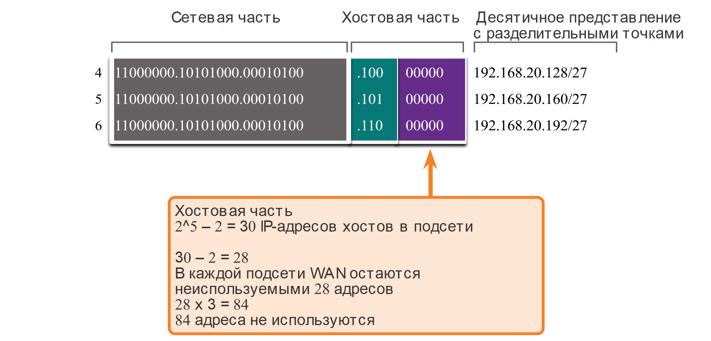
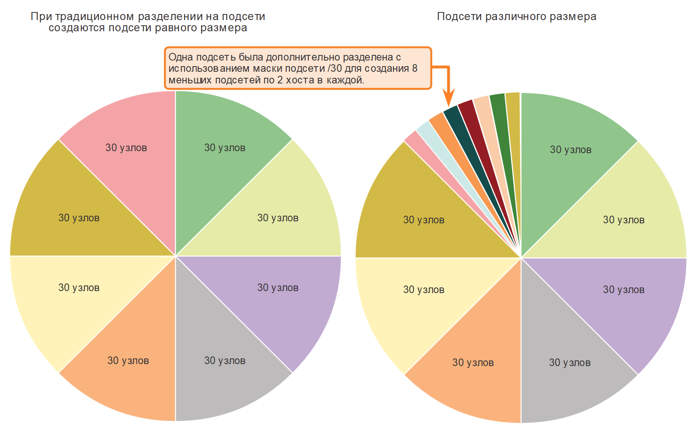
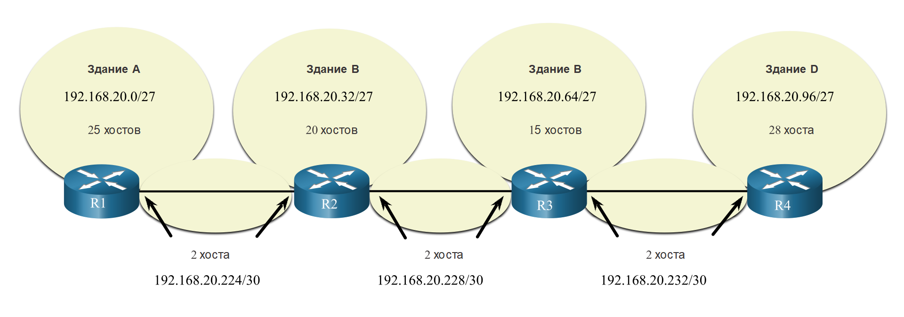

# VLSM

<!-- 11.8.1 -->
## Видео - Основы VLSM 

Как упоминалось в предыдущем разделе, публичные и частные адреса влияют на способ подсети вашей сети. Существуют и другие проблемы, которые влияют на схемы подсетей. Стандартная схема подсетей /16 создает подсети, каждая из которых имеет одинаковое количество узлов. Не каждой подсети, которую вы создаете, потребуется столько хостов, поэтому многие IPv4 адреса остаются неиспользуемыми. Возможно, вам понадобится одна подсеть, содержащая еще много хостов. Именно поэтому была разработана маска подсети переменной длины (VLSM).

Нажмите Воспроизвести, чтобы посмотреть видеоролик об основных методах VLSM.

<video width="768" height="432" controls>
  <source src="./assets/11.8.1.mp4" type='video/mp4; codecs="avc1.42E01E, mp4a.40.2"'>
</video>

<!-- 11.8.2 -->
## Видео - Пример VLSM 

Нажмите Воспроизвести, чтобы посмотреть видеоролик о VLSM-разделении на подсети.

<video width="768" height="432" controls>
  <source src="./assets/11.8.2.mp4" type='video/mp4; codecs="avc1.42E01E, mp4a.40.2"'>
</video>

<!-- 11.8.3 -->
## Сохранение адресов IPv4

Из-за истощения общего адресного пространства IPv4 использование доступных адресов узлов является основной проблемой при подсетях IPv4.

**Примечание**: Более крупный адрес IPv6 позволяет гораздо проще планировать и распределять адреса, чем позволяет IPv4. Сохранение адресов IPv6 не является проблемой. Это одна из движущих сил для перехода на IPv6.

В традиционном разбиении на подсети каждой подсети выделяется одинаковое количество адресов. Если все подсети имеют одинаковые требования к количеству узлов, такие блоки адресов фиксированного размера будут эффективными. Как правило, с публичными адресами IPv4 это не так.

Например, в топологии, показанной на рисунке 1, используются семь подсетей: по одной для каждой из четырех локальных сетей (LAN) и по одной для каждого из трех каналов сети WAN между маршрутизаторами.

<!-- /courses/itn-dl/aeed55b0-34fa-11eb-ad9a-f74babed41a6/af230bb2-34fa-11eb-ad9a-f74babed41a6/assets/2e3a45c3-1c25-11ea-81a0-ffc2c49b96bc.svg -->

<!--
На диаграмме показана топология сети, состоящая из семи подсетей.  Существует четыре маршрутизатора, каждый с подключенной локальной сетью и требованиями к адресации узлов, а также три подключения маршрутизатора к маршрутизатору, для каждого из которых требуется по 2 узла. Маршрутизатор R1 LAN в корпусе A с 25 узлами; маршрутизатор R2 LAN в корпусе B с 20 узлами; маршрутизатор R3 LAN в корпусе C с 15 узлами; а маршрутизатор R4 — в корпусе D с 28 узлами.
-->

В традиционном разбиении на подсети с указанным адресом 192.168.20.0/24 из узловой части в последнем октете можно позаимствовать три бита, чтобы обеспечить создание семи подсетей. Как показано на рисунке 2, при заимствовании трех бит можно создать 8 подсетей, а оставшихся пяти бит в узловой части хватит для 30 адресов узлов в каждой подсети. Такая схема позволяет создать требуемые подсети и соответствует требованиям к узлу в крупнейших локальных сетях (LAN).

### Схема базового разделения на подсети

<!-- /courses/itn-dl/aeed55b0-34fa-11eb-ad9a-f74babed41a6/af230bb2-34fa-11eb-ad9a-f74babed41a6/assets/2e3a93e2-1c25-11ea-81a0-ffc2c49b96bc.svg -->

<!--
На диаграмме показана базовая схема подсетй для заданного адреса 192.168.20.0/24 с тремя битами, заимствованными для подсетей. Наличие 3 бита для подсетей приводит к 2 в сетепени 3 = 8 подсетей. Наличие 5 бит для хостов приводит к 2 в степени 5 - 2 = 30 IP-адресов хоста на подсеть. Все четыре октета показаны в двоичном формате, за которым следует пунктирный десятичный формат для данного адреса и для всех созданных подсетей. Указан сетевой адрес в двоичном формате 11000000.10101000.00010100 (сетевая часть выделена серым цветом) .00000000 (часть узла выделена фиолетовым цветом) = 192.168.20.0/24. Для подсетей, перечисленных ниже, первые 24 бита выделены серым цветом (сетевая часть), следующие три бита выделены синим цветом (часть подсети), а последние пять битов являются оставшимися битами хоста, выделенными фиолетовым цветом. Подсеть 0 - 11000000.10101000.00010100.00000000 = 192.168.20.0/27. Подсеть 1 - 11000000.10101000.00010100.00100000 = 192.168.20.32/27. Подсеть 2 - 11000000.10101000.00010100.01000000 = 192.168.20.64/27. Подсеть 3 - 11000000.10101000.00010100.01100000 = 192.168.20.96/27. Подсети 0 - 3 назначаются для построения локальных сетей A, B, C и D. Подсеть 4 имеет значение 11000000.10101000.00010100.10000000 = 192.168.20.128/27. Подсеть 5 - это 11000000.10101000.00010100.10100000 = 192.168.20.160/27. Подсеть 6 - 11000000.10101000.00010100.11000000 = 192.168.20.192/27. Подсети 4, 5 и 6 назначаются сайту для WAN сайта. Подсеть 7 - это 11000000.10101000.00010100.11100000 = 192.168.20.224/27. Подсеть 7 неиспользуется/доступна. 
-->

Эти семь подсетей могут быть назначены сетям LAN и WAN, как показано на рисунке.

<!-- /courses/itn-dl/aeed55b0-34fa-11eb-ad9a-f74babed41a6/af230bb2-34fa-11eb-ad9a-f74babed41a6/assets/2e3abaf2-1c25-11ea-81a0-ffc2c49b96bc.svg -->

<!--
На диаграмме показаны назначения подсетей для топологии сети, состоящей из семи подсетей. Существует четыре маршрутизатора, каждый с подключенной локальной сетью и требованиями к адресации узлов, а также три подключения маршрутизатора к маршрутизатору, для каждого из которых требуется по 2 узла. Маршрутизатор R1 Здание A LAN имеет 25 узлов и назначается подсеть 192.168.20.0/27. Маршрутизатор R2 Здание B LAN имеет 20 узлов и назначается подсеть 192.168.20.32/27. Маршрутизатор R3 Здание C LAN имеет 15 узлов и назначается подсеть 192.168.20.64/27. Маршрутизатор R4 Здание D LAN имеет 28 узлов и назначается подсеть 192.168.20.96/27. Соединению R1 к R2 назначается подсеть 192.168.20.128/27. Соединению R2 к R3 назначается подсеть 192.168.20.160/27. Соединению R3 к R4 назначается подсеть 192.168.20.192/27.
-->

Хотя при таком стандартном разделении на подсети обеспечивается соответствие требованиям к крупнейшим локальным сетям (LAN) и разделение пространства адресов на соответствующее количество подсетей, это все равно приводит к значительному необоснованному расходованию неиспользуемых адресов.

Например, в каждой подсети для трех каналов WAN требуется только два адреса. Поскольку каждая из подсетей содержит 30 доступных для использования адресов, в каждой из подсетей оказывается 28 неиспользуемых адресов. Как показано на рисунке 3, в результате мы получаем 84 неиспользуемых адреса (28x3).

### Неиспользуемые адреса в подсетях WAN

<!-- /courses/itn-dl/aeed55b0-34fa-11eb-ad9a-f74babed41a6/af230bb2-34fa-11eb-ad9a-f74babed41a6/assets/2e3ae207-1c25-11ea-81a0-ffc2c49b96bc.svg -->

<!--
На рисунке показаны неиспользуемые адреса четырех подсетей WAN с использованием маски подсети /27. Все четыре октета показаны в двоичном формате, за которым следует точечный десятичный формат для подсети. Первые 24 бита выделены серым цветом (сетевая часть), следующие три бита выделены синим цветом, а последние пять битов являются оставшимися битами хоста, выделенными фиолетовым цветом. Подсеть 4 - это 11000000.10101000.00010100.10000000 = 192.168.20.128/27. Подсеть 5 - это 11000000.10101000.00010100.10100000 = 192.168.20.160/27. Подсеть 6 - 11000000.10101000.00010100.11000000 = 192.168.20.192/27. Наличие 5 бит для хостов приводит к 2 в степени 5 - 2 = 30 IP-адресов хоста на подсеть. Каждая подсеть WAN потеряет 28 адресов 84 адреса не используются
-->

Кроме того, это также ограничивает расширение сети в будущем, уменьшая общее число доступных подсетей. Такое неэффективное использование адресов характерно для традиционного разделения на подсети. Применение традиционной схемы разделения на подсети по такому сценарию не является эффективным и подразумевает нецелесообразное расходование ресурсов.

Разделение подсети на несколько подсетей или использование маски подсети переменной длины (VLSM) позволяет предотвратить появление избыточных адресов.

<!-- 11.8.4 -->
## VLSM

Обратите внимание, что во всех предыдущих примерах разделения на подсети ко всем подсетям применялась одна маска подсети. Это означает, что все подсети содержат одинаковое число доступных адресов узлов. Как показано на рисунке, при традиционной схеме разделения на подсети создаются подсети одинакового размера. Все подсети в традиционной схеме используют одну и ту же маску подсети. Как показано на рисунке, VLSM позволяет разделить пространство сети на неравные части. VLSM-маска подсети может варьироваться в зависимости от количества бит, которые были заимствованы для конкретной подсети. Эти биты образуют «переменную» часть маски.

<!-- /courses/itn-dl/aeed55b0-34fa-11eb-ad9a-f74babed41a6/af230bb2-34fa-11eb-ad9a-f74babed41a6/assets/2e3b3023-1c25-11ea-81a0-ffc2c49b96bc.svg -->

<!--
На графике показаны две круговые диаграммы, которые сравнивают традиционную подсеть с VLSM. При традиционном разделении на подсети создаются подсети равного размера Пирог разделен на 8 одинаковых ломтиков, каждый из которых имеет 30 хостов. Слева находится круговая диаграмма под названием: подсети разных размеров. Этот пирог имеет 7 ломтиков идентичных первому пирогу. Восьмой кусочек был далее разделен на 8 меньших ломтиков. Текст, указывающий на 8-й фрагмент, гласит: одна подсеть была дополнительно разделена с использованием маски подсети /30 для создания 8 меньших подсетей по 2 хоста в каждой.
-->

Разделение подсетей на подсети выполняет маска подсети переменной длины (VLSM). Та же топология, которая использовалась ранее, показана на рисунке. Опять же, мы будем использовать сеть 192.168.20.0/24 и подсеть ее для семи подсетей, по одной для каждой из четырех локальных сетей и по одному для каждого из трех соединений между маршрутизаторами.

<!-- /courses/itn-dl/aeed55b0-34fa-11eb-ad9a-f74babed41a6/af230bb2-34fa-11eb-ad9a-f74babed41a6/assets/2e3b7e46-1c25-11ea-81a0-ffc2c49b96bc.svg -->

<!--
На диаграмме показана топология сети, состоящая из семи подсетей.  Существует четыре маршрутизатора, каждый с подключенной локальной сетью и требованиями к адресации узлов, а также три подключения маршрутизатора к маршрутизатору, для каждого из которых требуется по 2 узла. Маршрутизатор R1 LAN в корпусе A с 25 узлами; маршрутизатор R2 LAN в корпусе B с 20 узлами; маршрутизатор R3 LAN в корпусе C с 15 узлами; а маршрутизатор R4 — в корпусе D с 28 узлами.
-->

На рисунке показано, как сеть 192.168.20.0/24 разбилась на восемь подсетей одинакового размера с 30 используемыми адресами узлов в каждой подсети. Четыре подсети использовались для локальных сетей (LAN), а три подсети— для каналов  между маршрутизаторами.

### Базовая схема VLSM-разделения на подсети

<!-- /courses/itn-dl/aeed55b0-34fa-11eb-ad9a-f74babed41a6/af230bb2-34fa-11eb-ad9a-f74babed41a6/assets/2e3bcc60-1c25-11ea-81a0-ffc2c49b96bc.svg -->

<!--
На диаграмме показана базовая схема подсетй для заданного адреса 192.168.20.0/24 с тремя битами, заимствованными для подсетей. Все четыре октета показаны в двоичном формате, за которым следует точечный десятичный формат для данного сетевого адреса и для нескольких созданных подсетей. Указан сетевой адрес в двоичном формате 11000000.10101000.00010100 (сетевая часть выделена серым цветом) .00000000 (часть узла выделена фиолетовым цветом) = 192.168.20.0/24. Для подсетей, перечисленных ниже, первые 24 бита выделены серым цветом (сетевая часть), следующие три бита выделены синим цветом (часть подсети), а последние пять битов являются оставшимися битами хоста, выделенными фиолетовым цветом. Подсеть 0 - 11000000.10101000.00010100.00000000 = 192.168.20.0/27. Подсеть 1 - 11000000.10101000.00010100.00100000 = 192.168.20.32/27. Подсеть 2 - 11000000.10101000.00010100.01000000 = 192.168.20.64/27. Подсеть 3 - 11000000.10101000.00010100.01100000 = 192.168.20.96/27. Подсети 0 - 3 назначаются для построения локальных сетей A, B, C и D. Подсеть 4 имеет значение 11000000.10101000.00010100.10000000 = 192.168.20.128/27. Подсеть 5 - это 11000000.10101000.00010100.10100000 = 192.168.20.160/27. Подсеть 6 - 11000000.10101000.00010100.11000000 = 192.168.20.192/27. Подсети 4, 5 и 6 не используются/доступны. Подсеть 7 - это 11000000.10101000.00010100.11100000 = 192.168.20.224/27. Подсеть 7 будет и дальше разделена на подсети.
-->

Однако, для подключения между маршрутизаторами требуется только два адреса узлов в подсети (один адрес узла для каждого интерфейса маршрутизатора). В настоящее время все подсети имеют 30 используемых адресов узлов для каждой подсети. Чтобы предотвратить неэффективное использование адресов, с помощью VLSM можно создать более мелкие подсети для каналов между маршрутизаторами.

Чтобы создать более мелкие подсети для каналов сети между маршрутизаторами, одна из подсетей будет разделена. В этом примере последняя подсеть 192.168.20.224/27 будет дополнительно разбита на подсети. На рисунке показано, что последняя подсеть была дополнительно подсеть с помощью маски подсети 255.255.255.252 или /30.

### Схема VLSM-разделения на подсети

<!-- /courses/itn-dl/aeed55b0-34fa-11eb-ad9a-f74babed41a6/af230bb2-34fa-11eb-ad9a-f74babed41a6/assets/2e3bf370-1c25-11ea-81a0-ffc2c49b96bc.svg -->

<!--
На диаграмме показана схема подсетей VLSM, когда подсеть 192.168.20.224/27 дополнительно подсеть путем заимствования еще 3 бита. Для исходной подсети первые 24 бита представляют сетевую часть и являются 11000000.10101000.00010100. Следующие три бита представляют часть подсети и являются 111. Последние пять битов представляют собой часть хоста и являются 00000. Адрес в точечно-десятичном формате 192.168.20.224/27. Заимствование 3 дополнительных бита, подсеть подсети, приводит к разделению исходной подсети на 8 небольших подсетей. Для небольших подсетей первые 24 бита являются частью сети, следующие шесть битов являются частью подсети, а последние два бита являются оставшейся частью узла. Подсеть 7:0 - это 11000000.10101000.00010100.11100000 = 192.168.20.224/30. Подсеть 7:1 является 11000000.10101000.00010100.11100100 = 192.168.20.228/30. Подсеть 7:2 - это 11000000.10101000.00010100.11101000 = 192.168.20.232/30. Подсеть 7:3 является 11000000.10101000.00010100.11101100 = 192.168.20.236/30. Подсеть 7:4 является 11000000.10101000.00010100.11110000 = 192.168.20.240/30. Подсеть 7:5 является 11000000.10101000.00010100.11110100 = 192.168.20.244/30. Подсеть 7:6 - это 11000000.10101000.00010100.11111000 = 192.168.20.248/30. Подсеть 7:7 является 11000000.10101000.00010100.11111100 = 192.168.20.252/30. Подсети 7:0, 7:1 и 7:2 назначаются WAN, а остальные подсети не используются/доступны.
-->

Почему /30? Как вы помните, если известно требуемое количество адресов узлов, можно использовать формулу 2^n-2 (где n — количество оставшихся бит в узловой части). Чтобы получить два доступных адреса, в его узловой части должны остаться два бита.

Поскольку в разбитом на подсети адресном пространстве 192.168.20.224/27 имеются 5 бит в узловой части, еще три бита можно позаимствовать, оставив 2 бита в узловой части, как показано на рисунке. На данном этапе расчеты в точности совпадают с расчетами при традиционном разбиении на подсети. Биты заимствуются, определяя диапазоны подсетей. На рисунке показано, как четыре подсети /27 были назначены локальным сетям и три подсети /30 были назначены межмаршрутизаторным каналам.

<!-- /courses/itn-dl/aeed55b0-34fa-11eb-ad9a-f74babed41a6/af230bb2-34fa-11eb-ad9a-f74babed41a6/assets/2e3c1a81-1c25-11ea-81a0-ffc2c49b96bc.svg -->

<!--
На диаграмме показаны назначения подсети VLSM для топологии сети, состоящей из четырех локальных сетей и трех сетей WAN. Существует четыре маршрутизатора, каждый с подключенной локальной сетью и требованиями к адресации узлов, а также три подключения маршрутизатора к маршрутизатору, для каждого из которых требуется по 2 узла. Маршрутизатор R1 Здание A LAN имеет 25 узлов и назначается подсеть 192.168.20.0/27. Маршрутизатор R2 Здание B LAN имеет 20 узлов и назначается подсеть 192.168.20.32/27. Маршрутизатор R3 Здание C LAN имеет 15 узлов и назначается подсеть 192.168.20.64/27. Маршрутизатор R4 Здание D LAN имеет 28 узлов и назначается подсеть 192.168.20.96/27. Соединению R1 к R2 назначается подсеть 192.168.20.224/30. Соединению R2 к R3 назначается подсеть 192.168.20.228/30. Соединению R3 к R4 назначается подсеть 192.168.20.232/30.
-->

Такая схема VLSM-разбиения на подсети уменьшает количество адресов в каждой подсети до подходящего размера соединений с  сетью. Разбиение подсети 7 для сетей WAN оставляет доступными подсети 4, 5 и 6 для будущих сетей, а также 5 дополнительных подсетей для сетей WAN.

**Примечание**: При использовании VLSM, всегда начинайте с обеспечения соответствия требованиям к узлам в крупнейших подсетях. Продолжайте разбиение до тех пор, пока не будут удовлетворены требования к узлам в наименьшей подсети.

<!-- 11.8.5 -->
##  Назначение адреса топологии VLSM

При использовании VLSM-подсетей для сегментов локальной (LAN) и глобальной (WAN) сети можно выделять адреса без ненужных потерь.

На рисунке показаны назначения сетевых адресов и IPv4 адреса, назначенные каждому интерфейсу маршрутизатора.

<!-- /courses/itn-dl/aeed55b0-34fa-11eb-ad9a-f74babed41a6/af230bb2-34fa-11eb-ad9a-f74babed41a6/assets/2e3c68a0-1c25-11ea-81a0-ffc2c49b96bc.svg -->

<!--
На диаграмме показаны назначения подсети VLSM и IP-адресация интерфейса для топологии сети, состоящей из четырех локальных сетей и трех WAN. Существует четыре маршрутизатора, каждый с подключенной локальной сетью и требованиями к адресации узлов, а также три подключения маршрутизатора к маршрутизатору, для каждого из которых требуется по 2 узла. Маршрутизатор R1 здания A LAN подключен к интерфейсу G0/0/0 R1 по адресу 192.168.20.1/27, имеет 25 узлов и назначается подсеть 192.168.20.0/27. Локальная сеть маршрутизатора R2 здания B подключена к интерфейсу G0/0/0 R2 по адресу 192.168.20.33/27, имеет 20 узлов и назначена подсеть 192.168.20.32/27. Маршрутизатор R3 здания C LAN подключен к интерфейсу G0/0/0 R3 по адресу 192.168.20.65/27, имеет 15 узлов и назначается подсеть 192.168.20.64/27. Маршрутизатор R4 здания D LAN подключен к интерфейсу G0/0/0 R4 по адресу 192.168.20.97/27, имеет 28 узлов и назначается подсеть 192.168.20.96/27. Соединение R1 к R2, назначенное подсеть 192.168.20.224/30, подключает интерфейс G0/0/1 R1 с адресом .225 к интерфейсу G0/0/1 R2 с адресом .226. Соединение R2 к R3, назначенное подсеть 192.168.20.228/30, подключает интерфейс G0/1/0 R2 с адресом .229 к интерфейсу G0/0/1 R3 с адресом .230. Соединение R3 к R4, назначенное подсеть 192.168.20.232/30, подключает интерфейс G0/1/0 R2 с адресом .233 к интерфейсу G0/0/1 R4 с адресом .234.
-->

В стандартной схеме адресации IPv4-адрес первого узла в каждой подсети назначается LAN-интерфейсу маршрутизатора. Узлы в каждой подсети будут иметь IPv4-адрес из диапазона адресов этой подсети и соответствующую маску. Узлы будут использовать адрес подключенного LAN-интерфейса маршрутизатора в качестве адреса шлюза по умолчанию.

В таблице показаны сетевые адреса и диапазон адресов узлов для каждой сети. Адрес шлюза по умолчанию отображается для четырех локальных сетей.

|  | **Сетевой адрес** | **Диапазон адресов узлов** | **Адрес шлюза по умолчанию** |
| --- | --- | --- | --- |
| **Здание А** | 192.168.20.0/27 | 192.168.20.1/27 - 192.168.20.30/27 | 192.168.20.1/27 |
| **Здание В** | 192.168.20.32/27 | 192.168.20.33/27 - 192.168.20.62/27 | 192.168.20.33/27 |
| **Здание В** | 192.168.20.64/27 | 192.168.20.65/27 - 92.168.20.94/27 | 192.168.20.65/27 |
| **Здание B** | 192.168.20.96/27 | 192.168.20.97/27 - 192.168.20.126/27 | 192.168.20.97/27 |
| **R1-R2** | 192.168.20.224/30 | 192.168.20.225/30 - 192.168.20.226/30 |  |
| **Р2-Р3** | 192.168.20.228/30 | 192.168.20.229/30 - 192.168.20.230/30 |  |
| **R3-R4** | 192.168.20.232/30 | 192.168.20.233/30 - 192.168.20.234/30 |  |

<!-- 11.8.6 -->
## Задание - Практика VLSM

### 192.168.5.0/24 | Таблица 1. Расчет первых подсетей

### 192.168.5.0/24 | Таблица 2. Расчет VLSM

