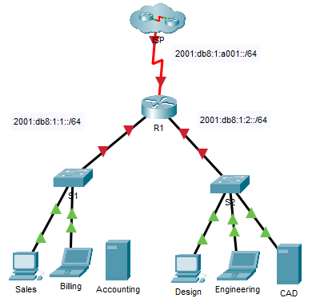

---

> **ВАЖНО**
> 
> Форма для ответов на вопросы будет доступна только при развертывании лабораторной работы 

---

## Топология



## Таблица адресации

| Устройство  | Интерфейс | IPv6-адрес/префикс     | Шлюз по умолчанию |
|-------------|-----------|------------------------|-------------------|
| R1          | G0/0      | 2001:db8:1:1::1/64     | —                 |
| R1          | G0/0      | fe80::1                | —                 |
| R1          | G0/1      | 2001:db8:1:1::1/64     | —                 |
| R1          | G0/1      | fe80::1                | —                 |
| R1          | S0/0/0    | 2001:db8:1:а001: :2/64 | —                 |
| R1          | S0/0/0    | fe80::1                | —                 |
| Sales       | NIC       | 2001:db8:1:1::2/64     | fe80::1           |
| Billing     | NIC       | 2001:db8:1:1::3/64     | fe80::1           |
| Accounting  | NIC       | 2001:db8:1:1::4/64     | fe80::1           |
| Design      | NIC       | 2001:db8:1:2::2/64     | fe80::1           |
| Engineering | NIC       | 2001:db8:1:2::3/64     | fe80::1           |
| CAD         | NIC       | 2001:db8:1:2::4/64     | fe80::1           |
| ISP         | S0/0/0    | 2001:db8:1:a001::1     | fe80::1           |

## Задачи

Часть 1. Настройка IPv6-адресации на маршрутизаторе

Часть 2. Настройка IPv6-адресации на серверах

Часть 3. Настройка IPv6-адресации на клиентских узлах

Часть 4. Тестирование и проверка подключения к сети

## Общие сведения

В этом упражнении вам предстоит отработать настройку IPv6-адресов на маршрутизаторе, серверах и клиентских узлах. Кроме того, вы проверите выполнение IPv6-адресации.

### Часть 1. Настройка IPv6-адресации на маршрутизаторе

**Шаг 1. Включите пересылку IPv6-пакетов на маршрутизаторе.**

1.  Нажмите **R1** и откройте вкладку **CLI** (Интерфейс командной строки). Нажмите **клавишу ввода**.

2.  Войдите в привилегированный режим EXEC.

3.  Введите команду глобальной настройки маршрутизации **ipv6 unicast-routing** Данная команда нужна для включения пересылки IPv6-пакетов на маршрутизаторе.

    ```
    R1(config)# ipv6 unicast-routing
    ```

**Шаг 2. Настройте IPv6-адресацию на GigabitEthernet0/0.**

1.  Введите команды, необходимые для перехода в режим конфигурации интерфейса для GigabitEthernet0/0.

2.  Настройте IPv6-адрес с помощью следующей команды:

    ```
    R1(config-if)# ipv6 address 2001:db8:1:1::1/64
    ```

3.  Настройте локальный IPv6-адрес канала с помощью следующей команды:

    ```
    R1(config-if)# ipv6 address fe80::1 link-local
    ```

4.  Активируйте интерфейс.

    ```
    R1(config-if)# no shutdown
    ```

**Шаг 3. Настройте IPv6-адресацию на GigabitEthernet0/1.**

1.  Введите команды, необходимые для перехода в режим конфигурации интерфейса для GigabitEthernet0/1.

2.  IPv6-адреса смотрите в **таблице адресации**.

3.  Настройте IPv6-адрес, локальный адрес канала и активируйте интерфейс.

**Шаг 4. Настройте IPv6-адресацию на Serial0/0/0.**

1.  Введите команды, необходимые для перехода в режим конфигурации интерфейса Serial0/0/0.

2.  IPv6-адреса смотрите в **таблице адресации**.

3.  Настройте IPv6-адрес, локальный адрес канала и активируйте интерфейс.

**Шаг 5. Проверьте адресацию IPv6 на R1.**

Рекомендуется проверять адресацию, когда она завершена, сравнивая настроенные значения со значениями в таблице адресации.

1.  Выйдите из режима настройки R1.

2.  Проверьте настроенную адресацию, выполнив следующую команду:

    ```
    R1# show ipv6 interface brief
    ```

3.  Если адреса неверны, повторите указанные выше действия, чтобы внести изменения.

    Примечание. Чтобы изменить адресацию с помощью IPv6, необходимо удалить неверный адрес, иначе как правильный адрес и неверный адрес останутся настроенными в интерфейсе.

    Пример.

    ```
    R1(config-if)# no ipv6 address 2001:db8:1:5::1/64
    ```

4.  Сохраните конфигурацию в NVRAM.

### Часть 2. Настройка IPv6-адресации на серверах

**Шаг 1. Настройте IPv6-адресацию на сервере Accounting (Бухгалтерия).**

1.  Щелкните **Accounting** (Бухгалтерия), откройте вкладку **Desktop** (Рабочий стол) и выберите **IP Configuration** (Конфигурация IP).

2.  Установите для **IPv6-адреса** значение **2001:db8:1:1::4** с префиксом **/64**.

3.  Установите для **IPv6-шлюза** локальный адрес канала **fe80::1**.

**Шаг 2. Настройте IPv6-адресацию на сервере CAD (Отдел автоматизации).**

Настройте сервер **CAD** с адресами, как это было сделано в шаге 1. IPv6-адреса см. в **таблице адресации**.

### Часть 3. Настройка IPv6-адресации на клиентских узлах

**Шаг 1. Настройте IPv6-адресацию на клиентских узлах Sales (Отдел продаж) и Billing (Отдел выписки счетов).**

1.  Нажмите **Billing** (Отдел выписки счетов), откройте вкладку **Desktop** (Рабочий стол) и выберите **IP Configuration** (Конфигурация IP).

2.  Установите для **IPv6-адреса**значение **2001:db8:1:1::3** с префиксом **/64**.

3.  Установите для**IPv6 шлюза** локальный адрес канала **fe80::1**.

4.  Повторите шаги с 1А по 1В для узла **Sales** (Отдел продаж). IPv6-адреса см. в **таблице адресации**.

**Шаг 2. Настройте IPv6-адресацию на клиентских узлах Engineering (Технический отдел) и Design (Проектный отдел).**

1.  Нажмите **Engineering** (Технический отдел), откройте вкладку **Desktop** (Рабочий стол) и выберите **IP Configuration** (Конфигурация IP).

2.  Установите для IPv6-адреса значение 2001:db8:1:2::3 с префиксом /64.

3.  Установите для **IPv6-шлюза** локальный адрес канала **fe80::1**.

4.  Повторите шаги с 2А по 2В для узла **Design** (Проектный отдел). IPv6-адреса см. в **таблице адресации**.

### Часть 4. Тестирование и проверка подключения к сети

**Шаг 1. Откройте веб-страницы с сервера на клиентских узлах.**

1.  Нажмите **Sales** (Отдел продаж) и откройте вкладку **Desktop** (Рабочий стол). При необходимости закройте окно **IP Configuration** (Конфигурация IP).

2.  Нажмите **Web Browser** (Веб-браузер). Введите **2001:db8:1:1::4** в строке адреса и нажмите **Go**(вперед). Должен открыться веб-сайт **Accounting** (Бухгалтерия).

3.  Введите **2001:db8:1:2::4** в строке адреса и нажмите **Go**(вперед). Должен открыться веб-сайт **CAD**.

4.  Повторите шаги с 1А по 1Г для других клиентских узлов.

**Шаг 2. Проверка связи с провайдером.**

1.  Нажмите на любой клиент.

2.  На вкладке Desktop (рабочий стол) нажмите Command Prompt (Командная строка).

3.  Проверьте подключение к интернет-провайдеру с помощью следующей команды:

    ```
    PC> ping 2001:db8:1:a001::1
    ```

4.  Выполняйте команду **ping** на других клиентских узлах, пока не убедитесь, что у всех есть связь с провайдером.

[Скачать файл Packet Tracer для локального запуска](./assets/12.6.6-lab.pka)
