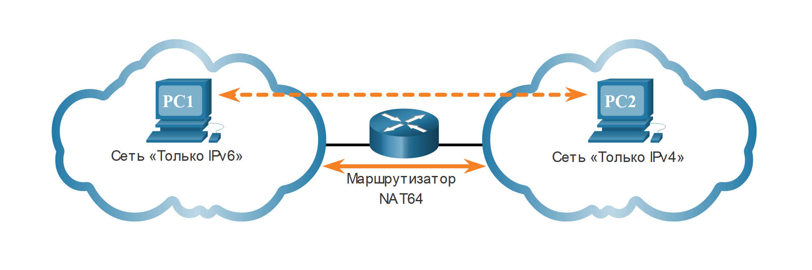

<!-- verified: agorbachev 03.05.2022 -->

<!-- 12.1.1 -->
## Потребность в IPv6

Вы уже знаете, что адреса IPv4 заканчиваются. Вот почему вам нужно узнать об IPv6.

Протокол IPv6 был разработан как преемник протокола IPv4. IPv6 имеет большее 128-битное адресное пространство, что достаточно для 340 ундециллионов адресов. Однако протокол IPv6 — это не только большее число адресов.

Когда специалисты IETF начали разработку преемника IPv4, они использовали эту возможность для устранения ограничений протокола IPv4 и внесения дополнительных улучшений. Среди таких улучшений — протокол управляющих сообщений версии 6 (ICMPv6), который включает в себя разрешение адресов и автонастройку адресов, что отсутствовало в протоколе ICMP для IPv4 (ICMPv4).

Сокращение адресного пространства протокола IPv4 — основной стимулирующий фактор для перехода к использованию IPv6. По мере того как Африка, Азия и другие регионы планеты все больше нуждаются в подключении к сети Интернет, остается все меньше IPv4-адресов, чтобы соответствовать таким темпам развития. Как показано на рисунке, у четырех из пяти региональных интернет-регистраторов (RIR) не осталось свободных IPv4-адресов.

<!-- /courses/itn-dl/aeed55b2-34fa-11eb-ad9a-f74babed41a6/af2332c0-34fa-11eb-ad9a-f74babed41a6/assets/2e412393-1c25-11ea-81a0-ffc2c49b96bc.svg -->

Теоретическое максимальное количество IPv4-адресов — 4,3 миллиарда. Частные адреса вместе с механизмом преобразования сетевых адресов (NAT) позволяли какое-то время замедлить процесс истощения адресного пространства IPv4. Однако механизм преобразования сетевых адресов (NAT) имеет определенные ограничения, которые ухудшают коммуникации в одноранговой сети.

С увеличением числа мобильных устройств мобильные провайдеры лидировали по пути перехода на IPv6. Два крупнейших провайдера мобильной связи в США сообщают, что более 90% их трафика превышает IPv6.

Большинство ведущих интернет-провайдеров и контент-провайдеров, таких как YouTube, Facebook и NetFlix, также сделали переход. Многие компании, такие как Microsoft, Facebook и LinkedIn, переходят на IPv6. В 2018 году широкополосный ISP Comcast сообщил о развертывании более 65%, а British Sky Broadcasting — более 86%.

**Интернет вещей**

Современный Интернет существенно отличается от Интернета прошедших десятилетий. Сегодня это не просто электронная почта, веб-страницы и передача файлов между компьютерами. По мере развития Интернет становится Интернетом вещей. Скоро можно будет получить доступ к Интернету не только через компьютеры, планшеты и смартфоны. Завтра практически все устройства — от автомобилей и биомедицинского оборудования до бытовой техники и природной экосистемы буду оснащены сенсорами и подключены к Интернету.

В связи с распространением Интернета ограниченным адресным пространством IPv4, проблемами с преобразованием сетевых адресов и проникновением Интернета в нашу жизнь пришло время для перехода на протокол IPv6.

<!-- 12.1.2 -->
## Совместное использование протоколов IPv4 и IPv6

Точной даты для перехода на протокол IPv6 нет. Как IPv4, так и IPv6 будут сосуществовать в ближайшем будущем, и переход займет несколько лет. Специалисты IETF создали различные протоколы и инструменты, которые позволяют сетевым администраторам постепенно переводить свои сети на протокол IPv6. Методы перехода можно разделить на 3 категории.

### Двойной стек (Dual stack)

Протоколы IPv4 и IPv6 можно одновременно использовать в одной сети посредством двойного стека. Устройства с двойным стеком одновременно работают с протокольными стеками IPv4 и IPv6. Известный как собственный IPv6, это означает, что сеть клиента имеет подключение IPv6 к своему Интернет-провайдеру и может получать доступ к контенту, найденному в Интернете, через IPv6.

<!-- /courses/itn-dl/aeed55b2-34fa-11eb-ad9a-f74babed41a6/af2332c0-34fa-11eb-ad9a-f74babed41a6/assets/2e4171b2-1c25-11ea-81a0-ffc2c49b96bc.svg -->

### Туннелирование

Туннелирование — это способ передачи IPv6-пакета по IPv4-сети. IPv6-пакет инкапсулируется внутрь IPv4-пакета, как и другие типы данных.

<!-- /courses/itn-dl/aeed55b2-34fa-11eb-ad9a-f74babed41a6/af2332c0-34fa-11eb-ad9a-f74babed41a6/assets/2e4198c1-1c25-11ea-81a0-ffc2c49b96bc.svg -->

### Преобразование сетевых адресов

Преобразование сетевых адресов 64 (NAT64) позволяет устройствам под управлением IPv6 обмениваться данными с устройствами под управлением IPv4 посредством способа преобразования, аналогичного NAT для IPv4. Пакет IPv6 преобразуется в пакет IPv4, а пакет IPv4 преобразуется в пакет IPv6.

<!-- /courses/itn-dl/aeed55b2-34fa-11eb-ad9a-f74babed41a6/af2332c0-34fa-11eb-ad9a-f74babed41a6/assets/2e41bfd1-1c25-11ea-81a0-ffc2c49b96bc.svg -->

**Примечание:** Туннелирование и трансляция предназначены для перехода на собственный IPv6 и должны использоваться только там, где это необходимо. Конечная цель — это естественный обмен данными в формате IPv6 между источником и назначением.

<!-- 12.1.3 -->
<!-- quiz -->

