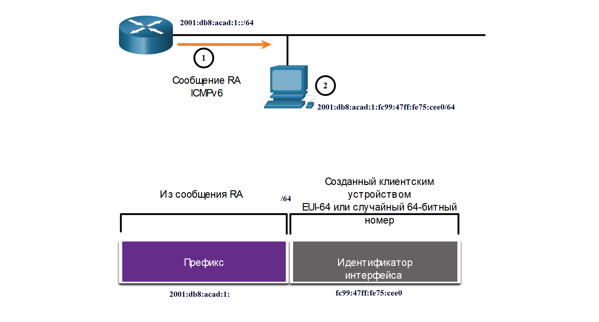
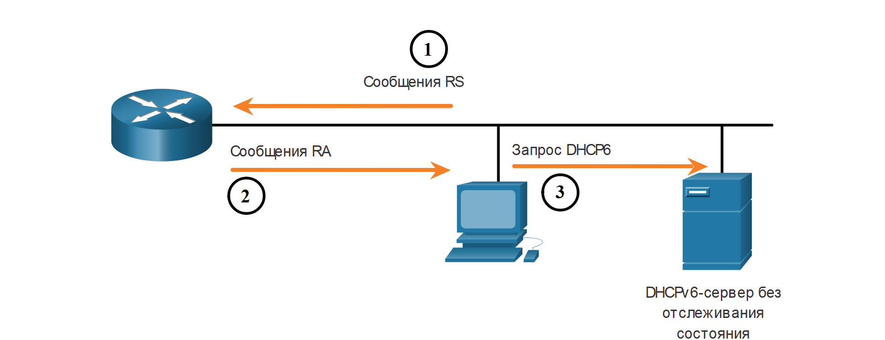
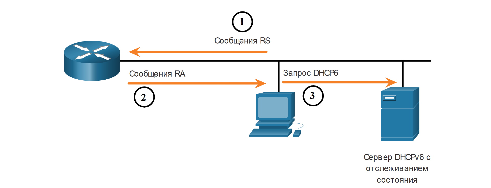
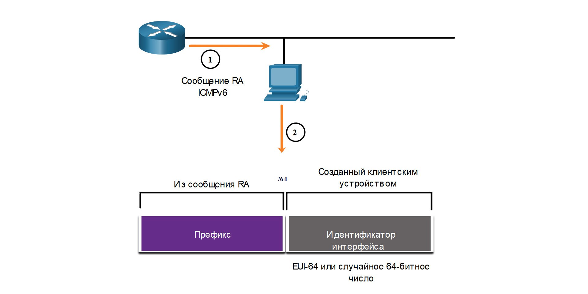
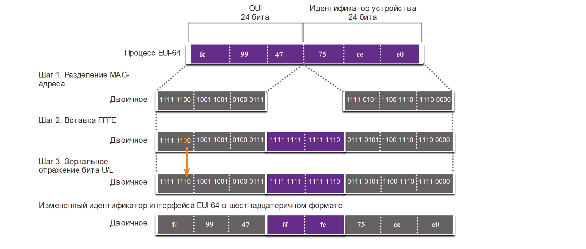

# Динамическое назначение глобальных IPv6-адресов

<!-- 12.5.1 -->
## Сообщения RS и RA ICMPv6

Если вы не хотите статически настраивать GUAs IPv6, не нужно беспокоиться. Большинство устройств получают свои интерфейсы GUA IPv6 динамически. В этом разделе объясняется, как этот процесс работает с использованием сообщений объявления маршрутизатора (router advertisement, RA) и запроса маршрутизатора (router solicitation, RS). Эта тема становится довольно технической, но когда вы поймете разницу между тремя методами, которые может использовать реклама маршрутизатора, а также то, как процесс EUI-64 для создания идентификатора интерфейса отличается от случайно сгенерированного процесса, вы совершите огромный скачок в вашем опыте IPv6!

Для GUA устройство получает адрес динамически через сообщения протокола управления сообщениями Интернета версии 6 (ICMPv6). IPv6-маршрутизаторы каждые 200 секунд отправляют сообщения RA ICMPv6 всем устройствам в сети под управлением IPv6. Сообщение RA также будет отправлено в ответ на хост, отправляющий сообщение RS ICMPv6, которое является запросом на сообщение RA. Оба сообщения показаны на рисунке.

### Сообщения RS и RA ICMPv6


<!-- /courses/itn-dl/aeed55b2-34fa-11eb-ad9a-f74babed41a6/af2359d4-34fa-11eb-ad9a-f74babed41a6/assets/2e487694-1c25-11ea-81a0-ffc2c49b96bc.svg -->

1.  Сообщения RS отправляются на все маршрутизаторы IPv6 хостами, запрашивающими информацию об адресации.
2.  Сообщения RA отправляются на все узлы IPv6. Если используется метод 1 (только SLAAC), функция RA включает сведения о префиксе сети, длине префикса и шлюзе по умолчанию.

Сообщения RA  на интерфейсах Ethernet маршрутизатора IPv6. Маршрутизатор должен быть включен для маршрутизации IPv6, которая по умолчанию не включена. Чтобы маршрутизатор работал как IPv6-маршрутизатор, необходимо использовать команду глобальной настрйоки **ipv6 unicast-routing**.

Сообщение RA ICMPv6 указывает IPv6-устройству, как ему получить информацию по адресации. Окончательное решение зависит от операционной системы устройства. Сообщение RA ICMPv6 включает следующую информацию.

* **Префикс сети и длину префикса:**  сообщают устройству, к какой сети оно относится
* **Адрес шлюза по умолчанию:**  локальный IPv6-адрес канала, IPv6-адрес источника сообщения RA
* **DNS-адрес и имя домена:**  адреса DNS-серверов и имя домена.

Существует три метода для сообщений RA:

* **Метод 1: SLAAC** - «У меня есть все, что вам нужно, включая префикс, длину префикса и адрес шлюза по умолчанию».
* **Метод 2:SLAAC и DHCPv6.**  «Вот моя информация, но вам нужно получить другие сведения, такие как DNS-адреса от DHCPv6-сервера».
* **Метод 3: Stateful DHCPv6 (без SLAAC)** - «Я могу дать вам ваш адрес шлюза по умолчанию. Вам нужно попросить сервер DHCPv6 с сохранением состояния для всей вашей другой информации».

<!-- 12.5.2 -->
## Метод 1: SLAAC

SLAAC - это метод, который позволяет устройству создавать свой собственный GUA без услуг DHCPv6. При использовании SLAAC устройства получают всю необходимую информацию из сообщений Router Advertisement (RA) от ICMPv6-маршрутизатора.

По умолчанию сообщение RA предлагает принимающему устройству использовать данные в сообщении RA для создания собственного глобального индивидуального IPv6-адреса и получения иной информации. Участие DHCPv6-сервера не требуется.

SLAAC не предполагает сохранения состояния, что означает отсутствие центрального сервера (например, DHCPv6-сервера, запоминающего состояния адресов), выделяющего глобальные индивидуальные адреса и хранящего список устройств и их адресов. В случае применения SLAAC клиентское устройство использует информацию в сообщении RA для создания собственного глобального индивидуального адреса. Как показано на рисунке, две части адреса создаются следующим образом:

* **Префикс** - это объявляется в сообщении RA.
* **Идентификатор интерфейса:**  создается либо с помощью расширенного уникального идентификатора EUI-64, либо путем создания случайного 64-битного числа.


<!-- /courses/itn-dl/aeed55b2-34fa-11eb-ad9a-f74babed41a6/af2359d4-34fa-11eb-ad9a-f74babed41a6/assets/2e48c4b2-1c25-11ea-81a0-ffc2c49b96bc.svg -->

1.  Маршрутизатор отправляет сообщение RA с префиксом для локального канала.
2.  ПК использует SLAAC для получения префикса из сообщения RA и создает свой собственный идентификатор интерфейса.

<!-- 12.5.3 -->
## Вариант 2: SLAAC и DHCPv6-сервер без сохранения состояния адресов:

Интерфейс маршрутизатора может быть настроен на отправку объявлений маршрутизатора с помощью SLAAC и DHCPv6-сервера без сохранения состояния адресов (или только DHCPv6-сервера с сохранением состояния адресов).

Как показано на рисунке, с помощью этого метода, сообщение RA предполагает, что устройства используют следующее:

* SLAAC для создания собственного IPv6 GUA
* Локальный адрес канала маршрутизатора, IPv6-адрес источника RA, в качестве адреса шлюза по умолчанию
* DHCPv6-сервер, не сохраняющий состояния адресов, для получения другой информации, такой как адрес DNS-сервера и имя домена.

**Примечание**: DHCPv6-сервер без сохранения состояния адресов распределяет адреса DNS-серверов и имена доменов. Он не выделяет GUA.


<!-- /courses/itn-dl/aeed55b2-34fa-11eb-ad9a-f74babed41a6/af2359d4-34fa-11eb-ad9a-f74babed41a6/assets/2e48ebc3-1c25-11ea-81a0-ffc2c49b96bc.svg -->

1.  ПК отправляет RS всем маршрутизаторам IPv6: «Мне нужна информация адресации».
2.  Маршрутизатор отправляет сообщение RA всем узлам IPv6 с указанным способом 2 (SLAAC и DHCPv6). Здесь указаны ваш префикс, длина префикса и основной шлюз». Но вам нужно будет получить информацию DNS с сервера DHCPv6.
3.  ПК отправляет сообщение DHCPv6 Solicit на все серверы DHCPv6. «Я использовал SLAAC для создания адреса IPv6 и получения адреса шлюза по умолчанию, но мне нужна другая информация с сервера DHCPv6 без состояния. 

<!-- 12.5.4 -->
## Вариант 3: DHCPv6 с поддержкой состояния

Интерфейс маршрутизатора можно настроить на отправку RA, используя только протокол DHCPv6 с сохранением состояния.

DHCPv6-сервер с сохранением состояния адресов аналогичен DHCP-серверу в системе IPv4. С помощью служб DHCPv6-сервера с сохранением состояния адресов устройство может автоматически получать данные адреса, включая глобальный индивидуальный адрес, длину префикса и адреса DNS-серверов.

Как показано на рисунке, с помощью этого метода, сообщение RA предполагает, что устройства используют следующее:

* Локальный адрес канала маршрутизатора, IPv6-адрес источника RA, в качестве адреса шлюза по умолчанию
* DHCPv6-сервер с сохранением состояния адресов для получения глобального индивидуального адреса, адрес DNS-сервера, имя домена и прочую необходимую информацию.


<!-- /courses/itn-dl/aeed55b2-34fa-11eb-ad9a-f74babed41a6/af2359d4-34fa-11eb-ad9a-f74babed41a6/assets/2e4912d5-1c25-11ea-81a0-ffc2c49b96bc.svg -->

1.  ПК отправляет RS всем маршрутизаторам IPv6: «Мне нужна информация адресации».
2.  Маршрутизатор отправляет сообщение RA всем узлам IPv6 с указанным способом 3 (Stateful DHCPv6): «Я ваш шлюз по умолчанию, но вам нужно попросить сервер DHCPv6 с сохранением состояния для вашего IPv6 адреса и другой информации об адресации. «
3.  ПК отправляет сообщение DHCPv6 Solicit всем DHCPv6 серверам DHCPv6 «Я получил мой адрес шлюза по умолчанию из сообщения RA, но мне нужен адрес IPv6 и вся другая информация об адресации от сервера DHCPv6 с сохранением состояния. «

DHCPv6-сервер с сохранением состояния адресов выделяет и ведет список устройств и назначенных им IPv6-адресов. DHCP-сервер в IPv4-сети сохраняет состояния адресов.

**Примечание:** Адрес шлюза по умолчанию может быть получен только динамически из сообщения RA. DHCPv6-сервер, независимо от того, сохраняет ли он состояния адресов или нет, не предоставляет адрес шлюза по умолчанию.

<!-- 12.5.5 -->
## Процесс EUI-64 и случайно сгенерированный идентификатор интерфейса

Если сообщение RA имеет тип SLAAC либо SLAAC + для DHCPv6-сервера без сохранения состояния адресов, клиент должен генерировать собственный идентификатор интерфейса. Клиент получает из сообщения RA префиксную часть адреса, но должен создать собственный идентификатор интерфейса. Идентификатор интерфейса может быть создан с помощью EUI-64 или представлять собой случайно сгенерированное 64-битное число, как показано на рис. 1.

### Динамическое создание идентификатора интерфейса


<!-- /courses/itn-dl/aeed55b2-34fa-11eb-ad9a-f74babed41a6/af2359d4-34fa-11eb-ad9a-f74babed41a6/assets/2e4960f3-1c25-11ea-81a0-ffc2c49b96bc.svg -->

1.  Маршрутизатор посылает сообщение RA
2.  Компьютер использует префикс в сообщении RA и использует либо EUI-64, либо случайное 64-битное число для генерации идентификатора интерфейса

<!-- 12.5.6 -->
## Процесс EUI-64

Организация IEEE разработала расширенный уникальный идентификатор (Extended Unique Identifier, EUI) или измененный процесс EUI-64. Этот процесс использует 48-битный MAC-адрес Ethernet клиента и в середину этого адреса вставляет еще 16 бит для создания 64-битного идентификатора интерфейса.

MAC-адреса Ethernet обычно имеют шестнадцатеричный формат и состоят из двух частей.

* **Уникальный идентификатор организации (Organizationally Unique Identifier, OUI)**  — это 24-битный (шесть шестнадцатеричных цифр) код поставщика, назначенный IEEE
* **Идентификатор устройства** — это уникальное 24-битное (шесть шестнадцатеричных цифр) значение с общим уникальным идентификатором организации (OUI).

Идентификатор интерфейса EUI-64 имеет двоичный формат и состоит из трех частей.

* 24-битный OUI на основе MAC-адреса клиента, в котором седьмой бит (универсально/локальный (U/L) бит) является обратным, т.е. если седьмой бит имеет значение 0, то он становится 1, и наоборот.
* В середину вставляется 16-битное значение FFFE (в шестнадцатеричном формате).
* 24-битный идентификатор устройства на основе MAC-адреса клиента.

Процесс EUI-64 проиллюстрирован на рисунке с помощью MAC-адреса маршрутизатора R1 GigabitEthernet FC99:4775:CEE0.


<!-- /courses/itn-dl/aeed55b2-34fa-11eb-ad9a-f74babed41a6/af2359d4-34fa-11eb-ad9a-f74babed41a6/assets/2e49d621-1c25-11ea-81a0-ffc2c49b96bc.svg -->

**Шаг 1:** Разделите MAC-адрес между OUI и идентификатором устройства.

**Шаг 2:** Вставьте шестнадцатеричное значение FFFE в двоичном формате 1111 1111 1111 1110.

**Шаг 3:** Преобразуйте первые 2 шестнадцатеричных значения OUI в двоичный формат и отразите бит U/L (бит 7). В данном примере 0 в седьмом бите меняется на единицу.

В результате генерируется следующий EUI-64 идентификатор интерфейса FE99: 47FF:FE75:CEE0.

**Примечание**: Использование обратного бита (U/L) и причины зеркального отражения его значения описаны в документе RFC 5342.

Пример выходных данных **ipconfig** команды показывает, что IPv6 GUA динамически создается с использованием SLAAC и процесса EUI-64. Самый простой способ определить, действительно ли адрес был создан с помощью EUI-64, — проверить, есть ли в середине идентификатора интерфейса значение **fffe**, как показано на рис. 3.

Преимущество EUI-64 MAC-адреса Ethernet заключается в том, что его можно использовать для определения идентификатора интерфейса. Кроме того, сетевые администраторы могут легко отслеживать IPv6-адрес до оконечных устройств с помощью уникального МАС-адреса. Тем не менее, это вызвало проблемы конфиденциальности у многих пользователей, которые опасались, что их пакеты могут быть отслежены до фактического физического компьютера. Во избежание таких опасений можно использовать случайно сгенерированный идентификатор интерфейса.

### Идентификатор интерфейса, сгенерированный при помощи EUI-64

```
C:\> ipconfig 
Windows IP Configuration
Ethernet adapter Local Area Connection:
   Connection-specific DNS Suffix . :
   IPv6 Address. . . . . . . . . . . : 2001:db8:acad:1:fc 99:47ff:fe75:cee0 
   Link-local IPv6 Address . . . . . : fe80::fc99:47ff:fe75:cee0
   Default Gateway . . . . . . . . . : fe80::1
C:\ >
```

<!-- 12.5.7 -->
## Случайно сгенерированные идентификаторы интерфейса

В зависимости от операционной системы устройство может использовать случайно сгенерированный идентификатор интерфейса вместо МАС-адресов и EUI-64. Например, начиная с Windows Vista в операционных системах Windows используется случайно сгенерированный идентификатор интерфейса вместо созданного через EUI-64. В ОС Windows XP и в предыдущих операционных системах Windows использовался EUI-64.

После создания идентификатора интерфейса либо с помощью EUI-64, либо через случайную генерацию его можно объединить с префиксом IPv6 из сообщения RA для создания глобального индивидуального адреса, как показано на рис. 4.

### Случайным образом сгенерированный 64-битный идентификатор интерфейса

```
C:\> ipconfig
Windows IP Configuration
Ethernet adapter Local Area Connection:
   Connection-specific DNS Suffix  . :
   IPv6 Address. . . . . . . . . . . : 2001:db8:acad:1:50a5:8a35:a5bb:66e1
   Link-local IPv6 Address . . . . . : fe80::50a5:8a35:a5bb:66e1
   Default Gateway . . . . . . . . . : fe80::1
C:\>
```

**Примечание**: Чтобы обеспечить уникальный индивидуальный IPv6-адрес клиент может использовать процесс обнаружения дублирующихся адресов (Duplicate Address Detection, DAD). Это аналогично ARP-запросу собственного адреса. Отсутствие ответного сообщения означает, что адрес уникален.

<!-- 12.5.8 -->
<!-- quiz -->

