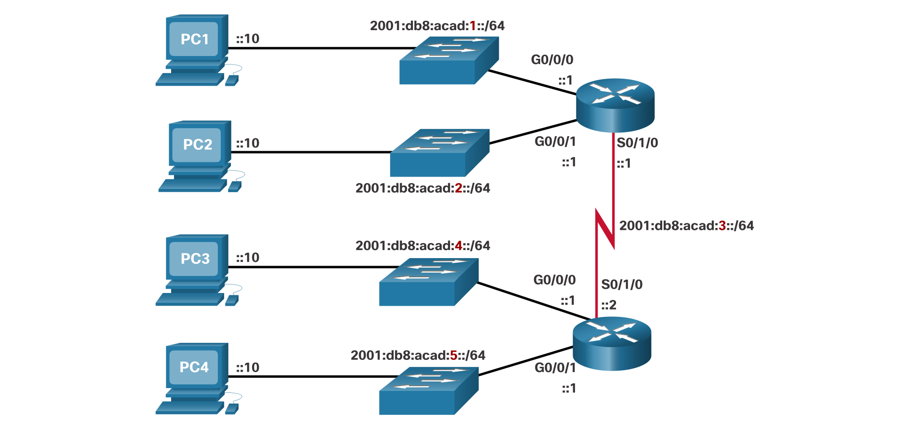
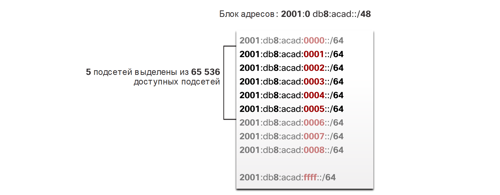

<!-- verified: agorbachev 03.05.2022 -->

<!-- 12.8.1 -->
## Разделение на подсети с использованием идентификатора подсети

Во введении к этому модулю упоминается подсеть сети IPv6. Также сказано, что вы можете обнаружить, что это немного проще, чем подсеть сети IPv4. Вы скоро узнаете!

Напомним, что с IPv4 мы должны заимствовать биты из части хоста для создания подсетей. Это связано с тем, что подсеть была задним числом с IPv4. Однако IPv6 был разработан с учетом подсетей. Для создания подсетей используется отдельное поле ID подсети в GUA IPv6. Как показано на рисунке, поле ID подсети — это область между префиксом глобальной маршрутизации и идентификатором интерфейса.

### GUA с 16-разрядным идентификатором подсети


<!-- /courses/itn-dl/aeed55b2-34fa-11eb-ad9a-f74babed41a6/af2380e0-34fa-11eb-ad9a-f74babed41a6/assets/2e4e42f1-1c25-11ea-81a0-ffc2c49b96bc.svg -->

Преимущество 128-битного адреса заключается в том, что он может поддерживать более чем достаточное количество подсетей и узлов в каждой подсети для каждой сети. Решение проблемы сохранения не является проблемой. Например, если префикс глобальной маршрутизации имеет значение /48 и использует типичные 64 бита для идентификатора интерфейса, это создаст 16-битный идентификатор подсети:

* **16-битный идентификатор подсети** - создает до 65 536 подсетей.
* **64-битный идентификатор интерфейса.**  Поддерживает до 18 квинтиллионов IPv6-адресов  на подсеть (т. е. 18 000 000 000 000 000 000).

**Примечание**: Разбиение на подсети с помощью 64-битного идентификатора интерфейса (или узловой части) также возможно, но требуется редко.

Кроме того, разбиение на подсети IPv6 проще в реализации, чем IPv4, поскольку не нужно выполнять преобразование в двоичный формат. Чтобы определить следующую доступную подсеть, достаточно рассчитать следующее шестнадцатеричное число.

<!-- 12.8.2 -->
## Пример создания подсетей IPv6

Например, организации бы присвоен глобальный префикс маршрутизации 2001:0DB8:ACAD::/48 с 16-битным идентификатором подсети. Это позволит организации создать 64 подсети, как показано на рисунке. Обратите внимание, что префикс глобальной маршрутизации является одинаковым для всех подсетей. Для каждой подсети увеличивается только гекстет идентификатора подсети в шестнадцатеричном формате.

### Организация подсетей с помощью идентификатора подсети


<!-- /courses/itn-dl/aeed55b2-34fa-11eb-ad9a-f74babed41a6/af2380e0-34fa-11eb-ad9a-f74babed41a6/assets/2e4e6a04-1c25-11ea-81a0-ffc2c49b96bc.svg -->

<!-- 12.8.3 -->
## Распределение IPv6-адресов подсети

Когда на выбор доступно 65 000 подсетей, задачей сетевого администратора становится проектирование логической структуры адресов в этой сети.

Как показано на рисунке, в примере топологии потребуются подсети для каждой локальной сети (LAN), а также для канала сети WAN между маршрутизаторами R1 и R2. В отличие от примера для IPv4, с IPv6 подсеть последовательного канала будет иметь ту же длину префикса, что и локальные сети. Хотя при этом могут остаться неиспользуемые адреса, что не является проблемой для IPv6-сетей.

### Пример топологии


<!-- /courses/itn-dl/aeed55b2-34fa-11eb-ad9a-f74babed41a6/af2380e0-34fa-11eb-ad9a-f74babed41a6/assets/2e4eb820-1c25-11ea-81a0-ffc2c49b96bc.svg -->

Как показано на рисунке 2, для данного примера будут выделены пять IPv6-подсетей с идентификаторами подсети от 0001 до 0005. Каждая подсеть /64 предоставит гораздо больше адресов, чем может когда-либо понадобиться.


<!-- /courses/itn-dl/aeed55b2-34fa-11eb-ad9a-f74babed41a6/af2380e0-34fa-11eb-ad9a-f74babed41a6/assets/2e4eb824-1c25-11ea-81a0-ffc2c49b96bc.svg -->

<!-- 12.8.4 -->
## Маршрутизатор, сконфигурированный с подсетями IPv6

Аналогично настройке IPv4, на рисунке 4 показано, что каждый интерфейс маршрутизатора был настроен как находящийся в другой IPv6-подсети.

Конфигурация адреса### IPv6 на маршрутизаторе R1

```
R1(config)# interface gigabitethernet 0/0/0 
R1(config-if)# ipv6 address 2001:db8:acad:1::1/64
R1(config-if)# no shutdown
R1(config-if)# exit
R1(config)# interface gigabitethernet 0/0/1 
R1(config-if)# ipv6 address 2001:db8:acad:2::1/64
R1(config-if)# no shutdown
R1(config-if)# exit
R1(config)# interface serial 0/1/0 
R1(config-if)# ipv6 address 2001:db8:acad:3::1/64
R1(config-if)# no shutdown
```

<!-- 12.8.5 -->
<!-- quiz -->

