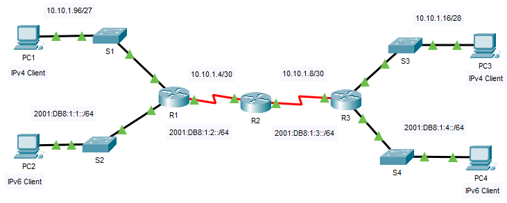

## Топология

## Таблица адресации

| Устройство | Интерфейс | IP адрес/префикс   |                 | Шлюз по умолчанию |
|------------|-----------|--------------------|-----------------|-------------------|
| R1         | G0/0      | 2001:db8:1:1::1/64 |                 | —                 |
| R1         | G0/1      | 10.10.1.97         | 255.255.255.224 | —                 |
| R1         | S0/0/1    | 10.10.1.6          | 255.255.255.252 | —                 |
| R1         | S0/0/1    | 2001:db8:1:2::2/64 |                 |                   |
| R1         | S0/0/1    | fe80::1            |                 |                   |
| R2         | S0/0/0    | 10.10.1.5          | 255.255.255.252 | —                 |
| R2         | S0/0/0    | 2001:db8:1:1::1/64 |                 |                   |
| R2         | S0/0/1    | 10.10.1.9          | 255.255.255.252 | —                 |
| R2         | S0/0/1    | 2001:db8:1:3::1/64 |                 |                   |
| R2         | S0/0/1    | fe80::2            |                 |                   |
| R3         | G0/0      | 2001:db8:1:4::1/64 |                 | —                 |
| R3         | G0/1      | 10.10.1.17         | 255.255.255.240 | —                 |
| R3         | S0/0/1    | 10.10.1.10         | 255.255.255.252 | —                 |
| R3         | S0/0/1    | 2001:db8:1:3::2/64 |                 |                   |
| R3         | S0/0/1    | fe80::3            |                 |                   |
| PC1        | NIC       |                    |                 |                   |
| PC2        | NIC       |                    |                 |                   |
| PC3        | NIC       |                    |                 |                   |
| PC4        | NIC       |                    |                 |                   |

## Задачи

Часть 1. Проверка и восстановление IPv4-подключения

Часть 2. Проверка и восстановление IPv6-подключения

## Сценарий

Это упражнение посвящено проблемам соединения между узлами. Помимо получения и документирования сетевых параметров, вы будете находить проблемы и принимать меры для восстановления соединения.

**Примечание.** Пароль пользовательского режима — **cisco**. Пароль привилегированного режима EXEC — **class**.

## Инструкции

### Часть 1. Проверка и восстановление IPv4-подключения

**Шаг 1. Используйте команды ipconfig и ping для проверки соединения.**

1.  Щелкните **PC1** и откройте **Command Prompt** (Приглашение к вводу команды).

2.  Введите команду **ipconfig /all** для сбора данных об IPv4-адресе. Заполните **таблицу адресации**, указав IPv4-адрес, маску подсети и шлюз по умолчанию.

3.  Щелкните **PC3** и откройте **Command Prompt** (Приглашение к вводу команды).

4.  Введите команду **ipconfig /all** для сбора данных об IPv4-адресе. Заполните **таблицу адресации**, указав IPv4-адрес, маску подсети и шлюз по умолчанию.

5.  Используйте команду **ping** для проверки соединения между **PC1** и **PC3.** Команда ping не должна быть успешно выполнена.

**Шаг 2. Найдите причину сбоя соединения.**

1.  На **PC1** введите команду для трассировки маршрута к **PC3**.

    Вопрос: Какой последний IPv4-адрес успешно ответил на запрос?

    **Введите ваш ответ здесь.**

2.  Трассировка прекратится после 30 попыток. Чтобы остановить трассировку преждевременно, нажмите **Ctrl**+**C**.

3.  На **PC3** введите команду для трассировки маршрута к **PC1**.

    Вопрос: Какой последний IPv4-адрес успешно ответил на запрос?

    **Введите ваш ответ здесь.**

4.  Чтобы остановить трассировку, нажмите **Ctrl**+**C**.

5.  Нажмите кнопку **R1**. Нажмите **ENTER** и войдите в систему маршрутизатора.

6.  Введите команду **show ip interface brief**, чтобы вывести список интерфейсов и их состояний. У этого маршрутизатора есть два IPv4-адреса. Один из них должен был быть записан в шаге 2А.

    Вопрос: А какой второй адрес?

    **Введите ваш ответ здесь.**

7.  Введите команду **show ip route**, чтобы вывести список сетей, к которым подключен маршрутизатор. Обратите внимание, что к интерфейсу **Serial0/0/1** подключено две сети.

    Вопрос: Что они собой представляют?

    **Введите ваш ответ здесь.**

8.  Повторите шаги с 2.5 по 2.7 на маршрутизаторе **R3** и укажите ответы здесь.

    **Введите ваш ответ здесь.**

9.  Нажмите кнопку **R2**. Нажмите **ENTER** и войдите в систему маршрутизатора.

10. Введите команду **show ip interface brief** и запишите адреса.

    **Введите здесь свои адреса.**

11. Выполните дополнительные проверки, если это позволит выявить проблему. Доступен режим моделирования.

**Шаг 3. Предложите решение этой проблемы.**

Сравните ваши ответы в шаге 2 с имеющейся документацией о сети.

Вопрос: В чем заключается ошибка?

**Введите ваш ответ здесь.**

Как можно устранить проблему?

**Введите ваш ответ здесь.**

**Шаг 4. Примените выбранное решение.**

Выполните действие, предложенное в шаге 3.2.

**Шаг 5. Проверьте, что подключение восстановлено.**

1.  На **PC1** проверьте соединение с **PC3**.

2.  На **PC3** проверьте соединение с **PC1**.

    Вопрос: Удалось ли устранить проблему?

    **Введите ваш ответ здесь.**

**Шаг 6. Запишите выбранное решение.**

### Часть 2. Проверка и восстановление IPv6-подключения

**Шаг 1. Используйте команды ipv6config и ping для проверки соединения.**

1.  Щелкните **PC2** и откройте **Command Prompt** (Приглашение к вводу команды).

2.  Введите команду **ipv6config /all** для сбора данных об IPv6-адресе. Заполните **таблицу адресации**, указав IPv6-адрес, префикс подсети и шлюз по умолчанию.

3.  Щелкните **PC4** и откройте **Command Prompt** (Приглашение к вводу команды).

4.  Введите команду **ipv6config /all** для сбора данных об IPv6-адресе. Заполните **таблицу адресации**, указав IPv6-адрес, префикс подсети и шлюз по умолчанию.

5.  Проверьте соединение между **PC2** и **PC4**. Команда ping не должна быть успешно выполнена.

**Шаг 2. Найдите причину сбоя соединения.**

1.  На **PC2** введите команду для трассировки маршрута к **PC4**.

    Вопрос: Какой последний IPv6-адрес успешно ответил на запрос?

    **Введите ваш ответ здесь.**

2.  Трассировка прекратится после 30 попыток. Чтобы остановить трассировку преждевременно, нажмите **Ctrl**+**C**.

3.  На **PC4** введите команду для трассировки маршрута к **PC2**.

    Вопрос: Какой последний IPv6-адрес успешно ответил на запрос?

    **Введите ваш ответ здесь.**

4.  Чтобы остановить трассировку, нажмите **Ctrl**+**C**.

5.  Нажмите кнопку **R3**. Нажмите **ENTER** и войдите в систему маршрутизатора.

6.  Введите команду **show ipv6 interface brief**, чтобы вывести список интерфейсов и их состояний. У этого маршрутизатора есть два IPv6-адреса. Один из них должен соответствовать адресу шлюза, записанному в шаге 1.4.

    Вопрос: Имеется ли несоответствие этих адресов?

    **Введите ваш ответ здесь.**

7.  Выполните дополнительные проверки, если это позволит выявить проблему. Доступен режим моделирования.

**Шаг 3. Предложите решение этой проблемы.**

Сравните ваши ответы в шаге 2 с имеющейся документацией о сети.

Вопрос: В чем заключается ошибка?

**Введите ваш ответ здесь.**

Как можно устранить проблему?

**Введите ваш ответ здесь.**

**Шаг 4. Примените выбранное решение.**

Выполните действие, предложенное в шаге 3.2.

**Шаг 5. Проверьте, что подключение восстановлено.**

1.  На **PC2** проверьте соединение с **PC4**.

2.  На **PC4** проверьте соединение с **PC2**.

    Вопрос: Удалось ли устранить проблему?

    **Введите ваш ответ здесь.**

**Шаг 6. Запишите выбранное решение.**

[Скачать файл Packet Tracer для локального запуска](./assets/13.2.7-packet-tracer---use-ping-and-traceroute-to-test-network-connectivity_ru-RU.pka)
