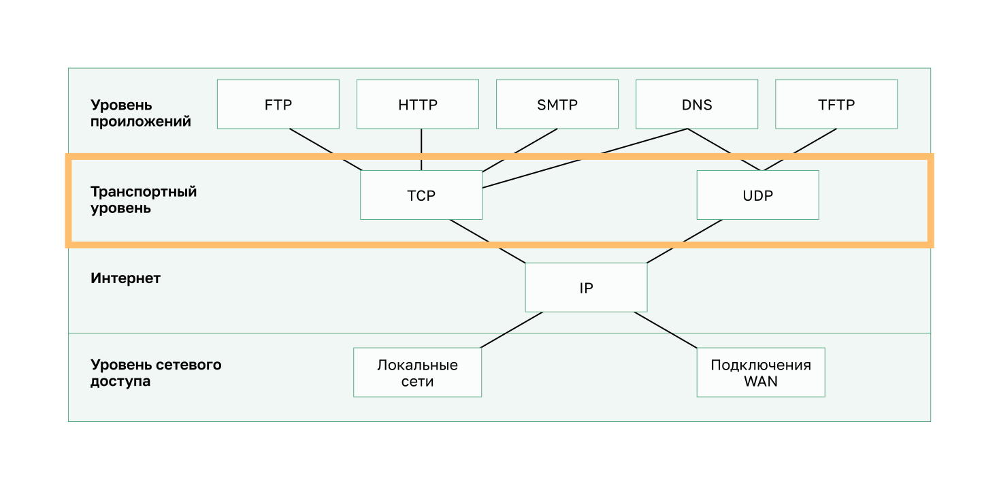

<!-- verified: agorbachev 03.05.2022 -->

<!-- 14.1.1 -->
## Роль транспортного уровня

Программы прикладного уровня генерируют данные, которыми необходимо обмениваться между узлами источника и назначения. Транспортный уровень отвечает за логические связи между приложениями, работающими на разных узлах. Это может включать в себя такие сервисы, как установление временного сеанса между двумя хостами и надежная передача информации для приложения.

Как показано на рисунке, транспортный уровень — это канал между уровнем приложений и нижними уровнями, которые отвечают за передачу данных по сети.

Транспортный уровень не знает типа хоста назначения, типа носителя, по которому должны перемещаться данные, пути, по которому идут данные, загруженности канала или размера сети.

На транспортном уровне действуют два протокола: 

* Протокол управления передачей (Transmission Control Protocol -TCP)
* Протокол пользовательских датаграмм (User Datagram Protocol - UDP)

<!-- 14.1.2 -->
## Функции транспортного уровня

### Отслеживание отдельных сеансов связи

На транспортном уровне каждый набор данных, передаваемый между исходным и целевым приложениями, называется сеансом связи и отслеживается  по отдельности. Транспортный уровень отвечает за поддержку и отслеживание этих нескольких сеансов связи.

Как показано на рисунке, узел может иметь несколько приложений, которые одновременно обмениваются данными по сети.

В большинстве сетей существуют ограничения на объем данных, которые можно включить в один пакет. Поэтому данные должны быть разделены на управляемые части.

### Сегментация данных и последующая сборка сегментов

Транспортный уровень несет ответственность за разделение данных приложения на блоки соответствующего размера. В зависимости от используемого протокола транспортного уровня блоки транспортного уровня называются сегментами или датаграммами. На рисунке показан транспортный уровень с использованием разных блоков для каждого сеанса связи.

Транспортный уровень разделяет данные на сегменты, которые проще контролировать и передавать.

### Добавление информации заголовка

Протокол транспортного уровня также добавляет информацию заголовка, содержащую двоичные данные, организованные в несколько полей, к каждому блоку данных. Именно значения в этих полях позволяют различным протоколам транспортного уровня выполнять свои задачи по управлению процессом передачи данных.

Например, информация заголовка используется принимающим хостом для повторной сборки блоков данных в полный поток данных для программы уровня приложений.

Транспортный уровень гарантирует, что даже если на устройстве запущено несколько приложений, все они получат правильные данные.

### Определение приложений

Транспортный уровень должен быть в состоянии разделять несколько каналов передачи данных с различными требованиями и управлять ими. Для того чтобы пересылать потоки данных в соответствующие приложения, транспортный уровень должен определить целевое приложение. Как показано на рисунке, каждому программному процессу, которому требуется доступ к сети, назначается номер порта, уникальный для этого узла.

### Мультиплексирование сеансов связи

При передаче по сети данных некоторых типов (например, потокового видео) в виде одного полного потока может использоваться вся доступная пропускная способность, что в свою очередь приведет к блокированию других процессов передачи данных, выполняемых в это же время. Кроме того, это усложняет восстановление после сбоев и повторную передачу поврежденных данных.

Как показано на рисунке, транспортный уровень использует сегментацию и мультиплексирование для того, чтобы различные коммуникационные процессы были перемещены по одной и той же сети.

Проверка ошибок может быть выполнена для данных в сегменте, чтобы определить, изменился ли он в процессе передачи.

<!-- 14.1.3 -->
## Протоколы транспортного уровня

Протокол IP отвечает только за структуру, адресацию и маршрутизацию пакетов. Он не определяет способ доставки или передачи пакетов.

Протоколы транспортного уровня определяют способ передачи сообщений между узлами и отвечают за управление требованиями надежности передачи. На транспортном уровне действуют два протокола — TCP и UDP.

Различные приложения предъявляют разные требования к надежности передачи данных. Таким образом, TCP/IP предоставляет два протокола транспортного уровня, как показано на рисунке.

<!-- 14.1.4 -->
### Протокол управления передачей (TCP)

IP касается только структуры, адресации и маршрутизации пакетов от исходного отправителя до конечного пункта назначения. IP не несет ответственности за обеспечение доставки или определение необходимости установления связи между отправителем и получателем.

TCP считается надежным и полнофункциональным протоколом транспортного уровня, который обеспечивает передачу всех данных на узел назначения. TCP включает поля, обеспечивающие доставку данных приложения. Эти поля требуют дополнительной обработки отправляющими и принимающими хостами.

**Примечание**: Данные разделяются на сегменты.

Передача с использованием TCP аналогична отправке пакетов с трекингом, путь которых отслеживается от отправителя до получателя. Если заказ разбит на несколько частей, заказчик может зайти на веб-сайт транспортной компании и посмотреть порядок доставки.

TCP обеспечивает надежность и управление потоком, используя следующие основные операции:

* Отслеживание количества сегментов, отправленных на тот или иной хост тем или иным приложением;
* Подтверждение полученных данных;
* Повторная передача сегментов с неподтвержденными данными по истечении определенного времени ожидания;
* Последовательность данных, которые могут поступить в неправильном порядке;
* Отправка данных с эффективной скоростью, приемлемой для получателя.

Чтобы поддерживать состояние связи и отслеживать информацию, TCP должен сначала установить соединение между отправителем и получателем. TCP является протоколом с установлением соединения.

Просмотрите процесс обмена сегментами TCP и подтверждениями между отправителем и получателем.

<!-- 14.1.5 -->
### Протокол пользовательских датаграмм (UDP)

UDP является более простым протоколом транспортного уровня, чем TCP. Он не обеспечивает надежность и контроль потока, что означает, что требуется меньше полей заголовка. Поскольку процессы UDP отправителя и получателя не должны управлять надежностью и потоком, это означает, что датаграммы UDP могут обрабатываться быстрее, чем сегменты TCP. Он обеспечивает только основные функции для обмена сегментами данных между приложениями, при этом данный протокол отличается незначительными накладными расходами и практически отсутствием проверки данных.

**Примечание**: UDP делит данные на датаграммы, которые также называются сегментами.

UDP — протокол транспортного уровня без установки соединения. Поскольку UDP не обеспечивает надежность или управление потоком, он не требует установления соединения. Поскольку UDP не отслеживает информацию, отправляемую или полученную между клиентом и сервером, UDP также известен как протокол без сохранения состояния.

UDP также известен как протокол доставки с минимальными накладными расходами (best-effort), потому что нет подтверждения того, что данные получены в месте назначения. UDP не задействует процессы транспортного уровня, которые сообщают отправителю об успешной доставке данных.

Работу протокола UDP можно сравнить с отправкой по почте обычного, не заказного письма. Отправитель не знает, сможет ли адресат получить письмо, а почтовое отделение не несет ответственности за отслеживание письма или информирование отправителя о том, доставлено ли письмо по адресу.

Просмотрите анимированное представление передачи сегментов UDP от отправителя получателю.

<!-- 14.1.6 -->
## Использование протоколов транспортного уровня для различных приложений

В некоторых приложениях потеря части данных во время передачи по сети может быть допустима для приложения, но при этом задержки передачи являются недопустимыми. Таким приложениям лучше использовать протокол UDP, поскольку он требует меньших накладных расходов. Протокол UDP более предпочтителен, например, для потоковой передачи аудио и голосовой связи по IP-протоколу (VoIP). Пересылка подтверждений и повторная передача могут замедлить доставку данных.

UDP также используется приложениями запросов и ответов, где данные минимальны, и повторная передача может быть выполнена быстро. Например, служба доменных имен (DNS) использует UDP для этого типа транзакций. Клиент запрашивает адреса IPv4 и IPv6 для известного доменного имени с DNS-сервера. Если клиент не получает ответ в течение заданного периода времени, он просто отправляет запрос снова.

Например, если один или два сегмента видеопотока, передаваемого в режиме реального времени, не будут доставлены, это вызовет кратковременные помехи при передаче изображения. В таком случае возможно искажение изображения или звука, однако, пользователь этого может и не заметить. Если бы устройству назначения приходилось повторно запрашивать потерянные данные, для их повторной отправки пришлось бы задержать весь поток, что привело бы к значительному снижению качества звука или изображения. В этом случае лучше отобразить видео, насколько качественно, насколько это получится сделать, используя уже полученные сегменты, и пожертвовать надежностью.

Для других приложений важно, чтобы все данные поступали и чтобы они могли быть обработаны в правильной последовательности. Для этих типов приложений TCP используется в качестве транспортного протокола. Например, таким приложениям, как базы данных, веб-обозреватели и почтовые клиенты, необходимо, чтобы все отправленные данные поступили на узел назначения в своем первоначальном состоянии. Отсутствие какой-либо информации может привести к повреждению данных, которые в таком случае будут переданы не полностью или будут не читаемыми. Например, при доступе к банковской информации через Интернет важно убедиться, что вся информация отправлена и получена правильно.

На основании этих требований разработчики приложений должны определить, какой транспортный протокол подходит для них лучше всего. Видео может быть отправлено по протоколу TCP или UDP. Приложения для потоковой передачи сохраненного аудио и видео используют протокол TCP. Приложение использует TCP для выполнения буферизации, определения пропускной способности и контроля перегрузки, чтобы лучше контролировать работу пользователя.

Видео и голос в режиме реального времени обычно используют UDP, но могут также использовать TCP или оба UDP и TCP. Приложение для видеоконференций может использовать UDP по умолчанию, но поскольку многие брандмауэры блокируют UDP, приложение также может быть отправлено по протоколу TCP.

Приложения для потоковой передачи сохраненного аудио и видео используют протокол TCP. Например, если ваша сеть неожиданно не в состоянии обеспечить пропускную способность, необходимую для просмотра фильма по запросу, приложение приостанавливает воспроизведение видео. В это время в окне проигрывателя может отображаться сообщение о буферизации данных. В это время протокол TCP пытается восстановить поток. После того как порядок всех сегментов восстановлен, а пропускная способность сети находится на минимально необходимом уровне, протокол TCP возобновляет сеанс связи, чтобы продолжить воспроизведение.

В таблице на рисунке представлено краткое описание различий протоколов TCP и UDP.

<!-- 14.1.7 -->
<!-- quiz -->

