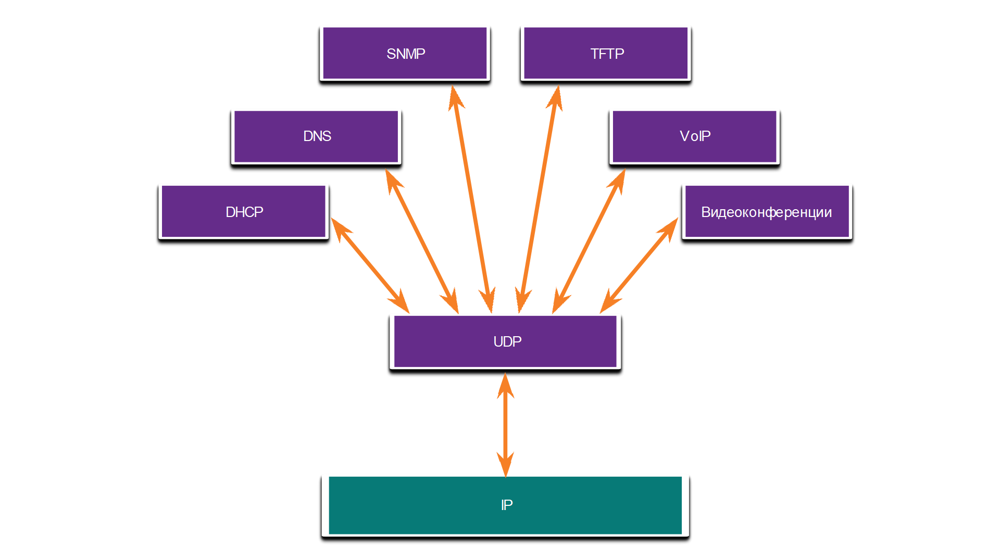

<!-- verified: agorbachev 03.05.2022 -->

<!-- 14.3.1 -->
## Функции протокола UDP

В этом разделе будет рассмотрен UDP, что он делает, и когда лучше использовать его вместо TCP.  UDP — это транспортный протокол с негарантированной доставкой. UDP — это облегченный транспортный протокол, который предлагает такую же сегментацию и повторную сборку данных, как и протокол TCP, но при этом не обеспечивает надежность и управление потоком, присущие TCP.

UDP является настолько простым протоколом, что обычно описывается с точки зрения того, чего он не предоставляет по сравнению с протоколом TCP.

UDP имеет следующие функции:

* Данные восстанавливаются в том порядке, в котором получены.
* Потерянные сегменты повторно не отправляются.
* Без установления сеанса связи.
* Без уведомления отправителя о доступности ресурса.

Для получения дополнительных сведений о UDP ознакомьтесь с [RFC 768](http://rfc.com.ru/rfc768.htm).

<!-- 14.3.2 -->
## Заголовок протокола UDP

UDP — это протокол без отслеживания состояния (stateless), а это значит, что ни клиент, ни сервер не обязан отслеживать состояние сеанса связи. Если при использовании UDP в качестве транспортного протокола требуется надежность передачи данных, ее должно обеспечивать само приложение.

Одним из основных требований для передачи видео и голоса по сети в режиме реального времени является наличие постоянного высокоскоростного потока. Приложения для передачи видео и голоса допускают потери некоторого количества данных, которые будут едва заметны или незаметны вовсе, и отлично подходят для использования протокола UDP.

Единицы информации, передаваемые по протоколу UDP, называются датаграммами или сегментами. Эти датаграммы отправляются без гарантии доставки протоколом транспортного уровня.

Заголовок UDP намного проще, чем заголовок TCP, потому что он имеет только четыре поля и требует 8 байт (т.е. 64 бита). На рисунке показан заголовок TCP.

<!-- /courses/itn-dl/aeed7cc0-34fa-11eb-ad9a-f74babed41a6/af241d20-34fa-11eb-ad9a-f74babed41a6/assets/2e5e6f91-1c25-11ea-81a0-ffc2c49b96bc.svg -->

<!-- 14.3.3 -->
## Поля заголовка UDP

Таблица идентифицирует и описывает четыре поля в заголовке UDP.

| **Поля заголовка UDP** | **Описание** |
| --- | --- |
| **Порт источника**  | 16-битное поле, используемое для идентификации исходного приложения по номеру порта. |
| **Порт назначения** | 16-битное поле, используемое для идентификации приложения назначения по номеру порта. |
| **Длина**  | 16-битное поле, указывающее длину заголовка датаграммы UDP. |
| **Контрольная сумма**  | 16-битное поле, используемое для проверки ошибок заголовка и данных датаграммы. |

<!-- 14.3.4 -->
## Приложения, использующие протокол UDP

Существуют три типа приложений, которые лучше всего подходят для работы с протоколом UDP:

* **Мультимедийные приложения и передача видео в режиме реального времени.**   Такие приложения могут допускать небольшие потери данных, но не допускают задержки (либо минимальные). Примерами могут служить VoIP и потоковое видео.
* **Простые приложения запросов и ответов.**  Приложения с простыми операциями, где хост отправляет запрос и может получить или не получить ответ. В качестве примера можно указать DNS и DHCP.
* **Приложения, самостоятельно обеспечивающие надежность передачи данных,**  — ненаправленный обмен данными, при котором управление потоком, обнаружение ошибок, отправка подтверждений и восстановление после сбоев не требуются или выполняются самим приложением (например, SNMP и TFTP).

На рисунке указаны приложения, требующие UDP.

<!-- /courses/itn-dl/aeed7cc0-34fa-11eb-ad9a-f74babed41a6/af241d20-34fa-11eb-ad9a-f74babed41a6/assets/2e5ebdb2-1c25-11ea-81a0-ffc2c49b96bc.svg -->

И хотя DNS и SNMP по умолчанию используют протокол UDP, они также могут использовать и TCP. DNS использует протокол TCP в случае, когда размер DNS-запроса или DNS-ответа превышает 512 байт (например, когда в DNS-ответе содержится большое количество разрешений имен). Аналогичным образом при определенных обстоятельствах администратор сети может настроить SNMP на использование протокола TCP.

<!-- 14.3.5 -->
<!-- quiz -->

