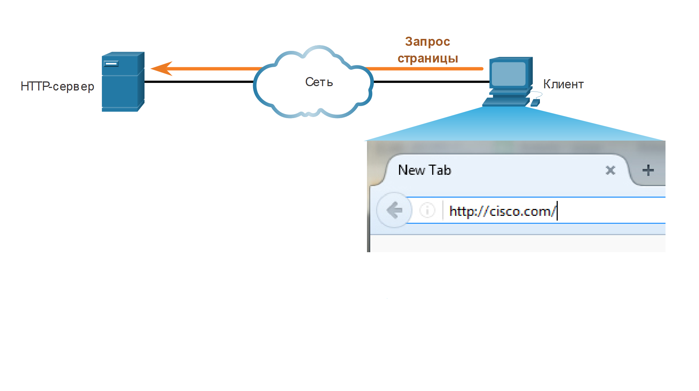
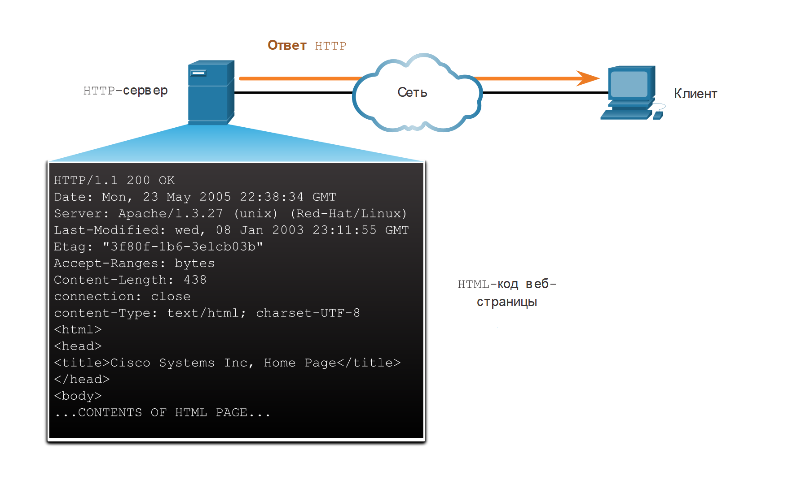
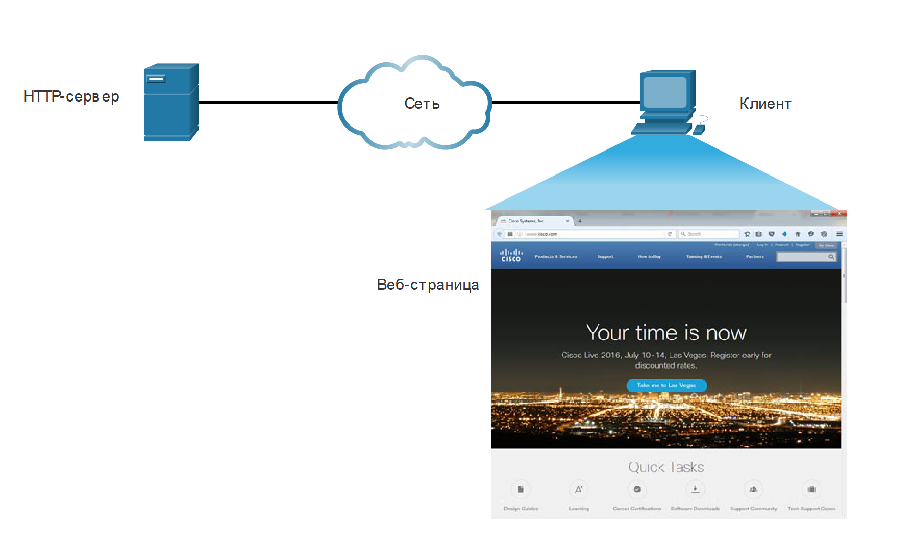
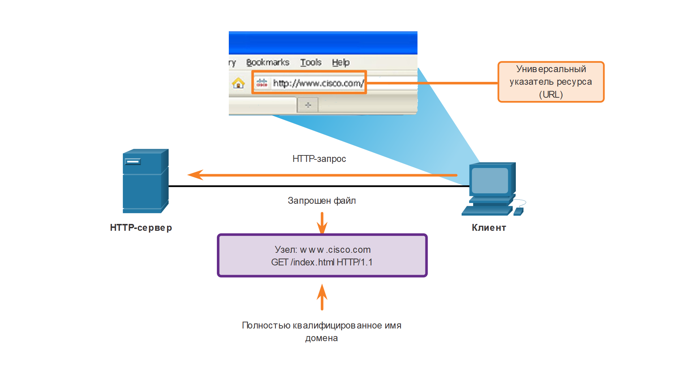
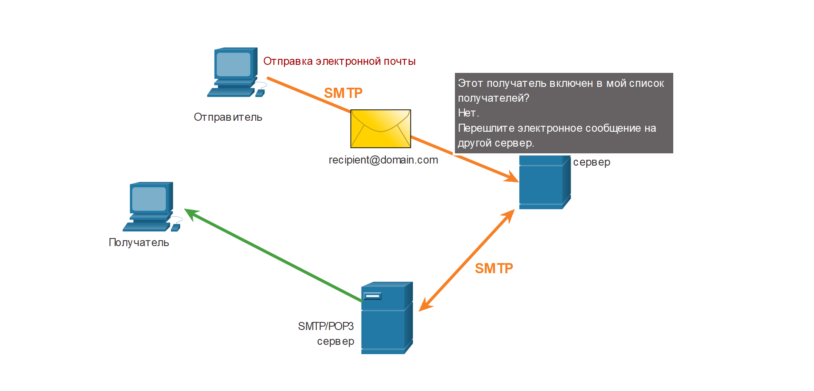
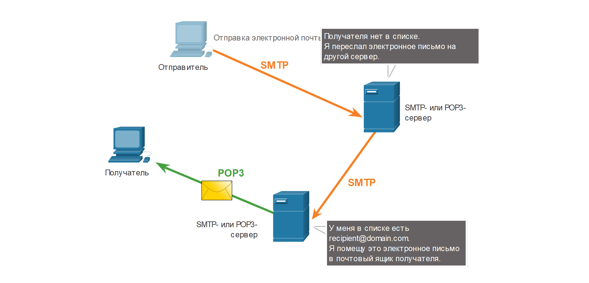
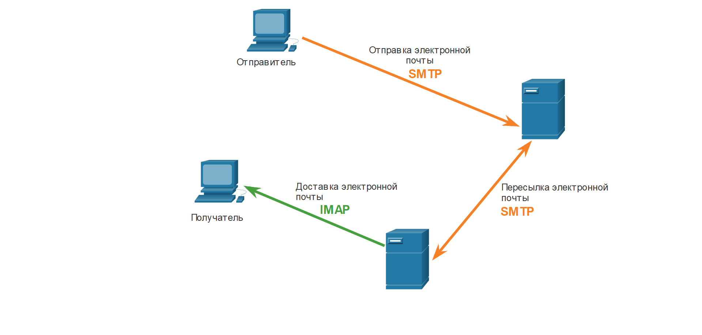

# Протоколы веб-трафика и электронной почты

<!-- 15.3.1 -->
## Протокол передачи гипертекста (HTTP) и язык гипертекстовой разметки (HTML)

Существуют специальные протоколы прикладного уровня, которые предназначены для общего использования, такого как просмотр веб-страниц и электронная почта. Первая тема дала вам обзор этих протоколов. Рассмотрим эту тему более подробно.

Когда веб-адрес или унифицированный указатель ресурса (URL) вводится в веб-браузере, веб-браузер устанавливает соединение с веб-службой. Веб-служба выполняется на сервере, использующем протокол HTTP. URL и унифицированные идентификаторы ресурсов (URI) — это названия, которые большинство пользователей ассоциируют с веб-адресами.

Для того чтобы вы могли лучше понять взаимодействие веб-обозревателя с веб-сервером, мы подробно опишем, как веб-страница открывается в браузере. В данном примере используется URL-адрес http://www.cisco.com/index.html.

### Шаг 1

Браузер интерпретирует три части URL-адреса:

* http (протокол или схема)
* www.cisco.com (имя сервера)
* index.html (название конкретного запрашиваемого файла)

<!-- /courses/itn-dl/aeed7cc2-34fa-11eb-ad9a-f74babed41a6/af24b960-34fa-11eb-ad9a-f74babed41a6/assets/2e715b52-1c25-11ea-81a0-ffc2c49b96bc.svg -->

<!--
показывает http-сервер, подключенный через интернет к клиентскому компьютеру. Клиентский компьютер запрашивает URL-адрес www.cisco.com, который является HTTP-сервером.
-->

### Шаг 2

Затем браузер с помощью сервера доменных имен проводит преобразование имени www.cisco.com в числовой адрес, который используется для подключения к серверу. Клиент инициирует HTTP-запрос к серверу, отправляя GET-запрос на сервер и запрашивает файл index.html.

<!-- /courses/itn-dl/aeed7cc2-34fa-11eb-ad9a-f74babed41a6/af24b960-34fa-11eb-ad9a-f74babed41a6/assets/2e718263-1c25-11ea-81a0-ffc2c49b96bc.svg -->

<!--
показывает фактический веб-адрес www.cicsco.com в поле URL веб-браузера на клиентском компьютере и запрашивая веб-страницу с HTTP-сервера.
-->

### Шаг 3

В ответ на запрос сервер отправляет в браузер HTML-код для этой веб-страницы.

<!-- /courses/itn-dl/aeed7cc2-34fa-11eb-ad9a-f74babed41a6/af24b960-34fa-11eb-ad9a-f74babed41a6/assets/2e71a973-1c25-11ea-81a0-ffc2c49b96bc.svg -->

<!--
показывает ответ HTTP веб-сервера на запрос клиента. В ответе отображается экран со следующим: HTTP / 1.1 OK, текущая дата, тип сервера, дата последнего изменения, номер Etag, диапазоны приема, длина содержимого и состояние подключения. 
-->

### Шаг 4

Браузер декодирует HTML-код и форматирует страницу в окне браузера.

<!-- /courses/itn-dl/aeed7cc2-34fa-11eb-ad9a-f74babed41a6/af24b960-34fa-11eb-ad9a-f74babed41a6/assets/2e71d086-1c25-11ea-81a0-ffc2c49b96bc.svg -->

<!--
графическое изображение с веб-страницей www.cisco.com на экране браузера клиентских компьютеров, завершающий запрос.
-->

<!-- 15.3.2 -->
## Протоколы HTTP и HTTPS

Протокол HTTP основан на механизме «запрос-ответ». Когда клиент (обычно веб-браузер) отправляет запрос веб-серверу, протокол HTTP определяет типы сообщений, используемые для этого взаимодействия. Три основных типа сообщений: GET, POST и PUT (см. рис.):

* **GET** \- это запрос данных клиентом. Клиент (веб-браузер) отправляет сообщение GET веб-серверу, чтобы запросить HTML-страницы.
* **POST** \- отправляет на веб-сервер файлы данных.
* **PUT** \- выгружает на веб-сервер ресурсы и контент, например изображения.

<!-- /courses/itn-dl/aeed7cc2-34fa-11eb-ad9a-f74babed41a6/af24b960-34fa-11eb-ad9a-f74babed41a6/assets/2e7245b3-1c25-11ea-81a0-ffc2c49b96bc.svg -->

<!--
На рисунке изображен клиент, выполняющий HTTP-запрос на HTTP-сервер. Запрошенный файл является полным доменным именем. Запрос использует Get для получения веб-страницы. Поле URL отображается на клиентском компьютере в виде запроса http://www.cisco.com. 
-->

Несмотря на то, что протокол HTTP достаточно гибок, он не является безопасным. Сообщения запроса передают информацию на сервер в виде обычного текста, который может быть перехвачен и прочитан. Аналогичным образом ответы сервера (обычно это HTML-страницы) передаются в незашифрованном виде.

Для защищенного двустороннего обмена данными в Интернете используется защищенная модификация протокола HTTP Secure (HTTPS). HTTPS позволяет использовать аутентификацию и шифрование для защиты данных, пересылаемых между клиентом и сервером. В HTTPS используется тот же процесс «запрос-ответ», что и в HTTP, но поток данных зашифровывается посредством SSL (Secure Socket Layer) перед передачей по сети.

<!-- 15.3.3 -->
## Протоколы электронной почты

Один из основных сервисов, предлагаемых интернет-провайдерами (ISP) — размещение (хостинг) серверов электронной почты. Но чтобы электронная почта заработала на компьютере или другом конечном устройстве, необходим ряд приложений и сервисов, как показано на рисунке. Электронная почта — это набор средств для доставки, хранения и извлечения электронных сообщений в сети. Сообщения электронной почты хранятся на серверах электронной почты в базах данных.

<!-- /courses/itn-dl/aeed7cc2-34fa-11eb-ad9a-f74babed41a6/af24b960-34fa-11eb-ad9a-f74babed41a6/assets/2e72bae1-1c25-11ea-81a0-ffc2c49b96bc.svg -->

<!--
На рисунке показана транзакция электронной почты от отправителя, использующего протокол SMTP, который отправляет электронное письмо по адресу receient@cisco.com через почтовый сервер А провайдера A, поступающий на почтовый сервер B провайдера получателя, а получатель читает электронную почту, используя протокол IMAP или POP.
-->

Клиенты электронной почты для отправки и получения сообщений обращаются к серверам электронной почты. Серверы электронной почты взаимодействуют с другими серверами электронной почты для обмена сообщениями между доменами. Почтовый клиент не соединяется непосредственно с другим почтовым клиентом для отправки сообщения. Оба клиента должны доверить транспортировку сообщений серверу электронной почты.

Для работы с электронной почтой используются три отдельных протокола: SMTP, POP и IMAP. В процессе уровня приложений, на котором выполняется отправка почты, используется протокол SMTP. Клиент получает электронную почту с помощью одного из двух протоколов уровня приложений: POP или IMAP.

<!-- 15.3.4 -->
## SMTP, POP, и IMAP

### SMTP

В формате SMTP сообщение состоит из заголовка и тела сообщения. Если тело сообщения может содержать текст произвольной длины, то в заголовке адреса электронной почты получателя и отправителя должны быть указаны в соответствующем формате.

Когда клиент отправляет сообщение электронной почты, процесс SMTP-клиента подключается к процессу SMTP-сервера на общеизвестном порте 25. Установив соединение, клиент пытается отправить по нему сообщение электронной почты серверу. Как только сервер получит сообщение, он помещает его в очередь сообщений локальной учетной записи, если абонент локальный, или пересылает другому почтовому серверу.

Целевой сервер электронной почты (сервер назначения) в момент доставки сообщения может оказаться недоступен или перегружен. На этот случай в SMTP предусмотрено временное хранение сообщений с последующей повторной отправкой. Периодически сервер проверяет очередь сообщений и пытается отправить их повторно. Если сообщение не удается доставить в течение установленного времени, оно возвращается отправителю с уведомлением о невозможности доставки.

<!-- /courses/itn-dl/aeed7cc2-34fa-11eb-ad9a-f74babed41a6/af24b960-34fa-11eb-ad9a-f74babed41a6/assets/2e730905-1c25-11ea-81a0-ffc2c49b96bc.svg -->

<!--
Это рисунок с компьютером отправителя и компьютера получателя. Два сервера SMTP/POP3 соединены между ними. Почтовое сообщение отправляется с компьютера отправителя с меткой recipient@domain.com по протоколу smtp. Первый SMTP/POP3 получает сообщение от отправителя и спрашивает, есть ли получатель в моем списке получателей? Нет. Перешлите электронное письмо на другой сервер. Второй SMTP/POP3 сервер получает сообщение по протоколу SMTP и пересылает сообщение получателю.
-->

### POP

Протокол POP используется приложениями для получения сообщений от сервера электронной почты. При использовании POP сообщения загружаются клиентом с сервера и удаляются на сервере. Это стандартная операция POP.

Сетевой сервис POP на сервере пассивно ожидает запросов подключения клиентов к TCP-порту 110. Для использования этого сетевого сервиса клиент отправляет запрос на установку TCP-соединения с сервером, как показано на рисунке. После установки соединения сервер POP3 посылает приветствие. Затем клиент и сервер POP обмениваются командами и ответами, пока подключение не будет закрыто или прервано.

Так как при использовании POP сообщения электронной почты загружаются клиентом и удаляются с сервера, это означает, что они не хранятся централизованно. Поскольку POP не хранит сообщения, он не рекомендуется для малого бизнеса, которому требуется решение для централизованного резервного копирования.

POP3 является наиболее часто используемой версией.

<!-- /courses/itn-dl/aeed7cc2-34fa-11eb-ad9a-f74babed41a6/af24b960-34fa-11eb-ad9a-f74babed41a6/assets/2e735722-1c25-11ea-81a0-ffc2c49b96bc.svg -->

<!--
Это рисунок с компьютером отправителя и компьютера получателя. Два сервера SMTP/POP3 соединены между ними. Почтовое сообщение отправляется с компьютера отправителя с меткой recipient@domain.com по протоколу smtp. Первый SMTP/POP3 получает сообщение от отправителя и спрашивает, есть ли получатель в моем списке получателей? Нет. Перешлите электронное письмо на другой сервер. Второй SMTP/POP3-сервер получает сообщение по протоколу SMTP и заявляет, что у меня есть в списке receient@domain.com. Я помещу это письмо в почтовый ящик получателя. Затем получатель читает сообщение, используя протокол POP3. 
-->

### IMAP

Протокол IMAP предусматривает другой метод получения почтовых сообщений с сервера. Его отличие от POP состоит в том, что при подключении пользователя к серверу IMAP в клиентское приложение загружаются только копии сообщений, как показано на рисунке. Исходные сообщения остаются на сервере до тех пор, пока они не будут удалены вручную. Пользователи просматривают копии сообщений в клиентах электронной почты.

Пользователи могут организовать на сервере иерархическую файловую структуру для упорядочения и хранения почты. Эта структура также дублируется клиентом электронной почты. Если пользователь решает удалить сообщение, оно синхронно удаляется из клиента и с сервера.

<!-- /courses/itn-dl/aeed7cc2-34fa-11eb-ad9a-f74babed41a6/af24b960-34fa-11eb-ad9a-f74babed41a6/assets/2e737e38-1c25-11ea-81a0-ffc2c49b96bc.svg -->

<!--
Это рисунок с компьютером отправителя и компьютера получателя. Два сервера SMTP/POP3 соединены между ними. Клиентский компьютер использует протокол SMTP для отправки сообщения через два сервера, и компьютер получателя получает сообщение электронной почты по протоколу imap.
-->

<!-- 15.3.5 -->
<!-- quiz -->

