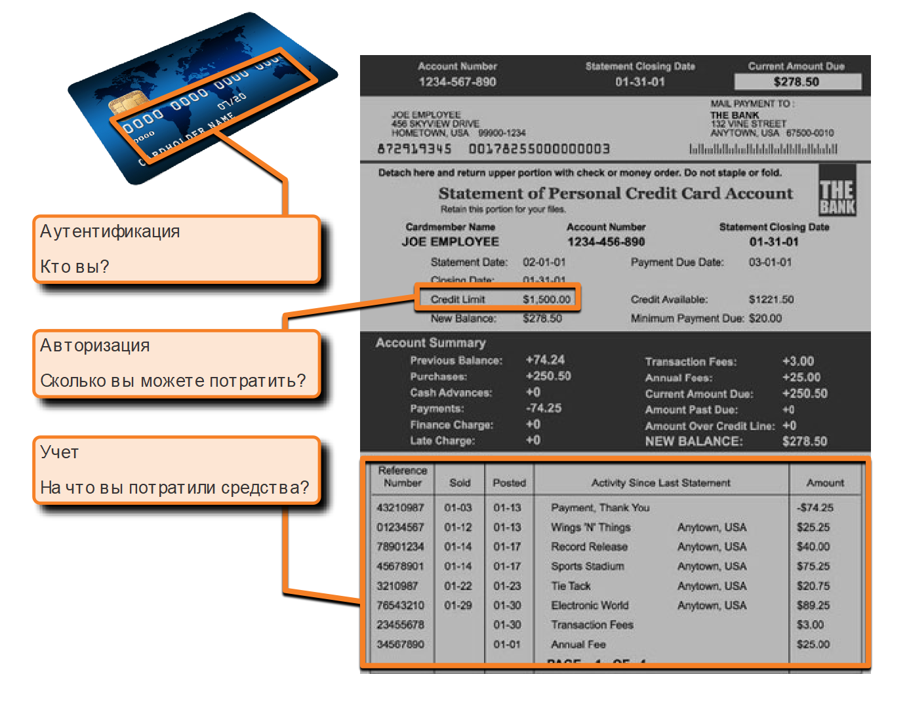

<!-- verified: agorbachev 03.05.2022 -->

<!-- 16.3.1 -->
##  Углубленный подход к защите

Теперь, когда вы знаете, как участники угроз могут проникнуть в сети, вам необходимо понять, как предотвратить такой несанкционированный доступ. В этом разделе описаны действия, которыми можно повысить безопасности сети.

Чтобы снизить уровень сетевых атак, сначала обеспечьте безопасность устройств: маршрутизаторов, коммутаторов, серверов и хостов. Одно из решений — использовать сквозной (многоуровневый) подход к информационной безопасности. Он предполагает совместную работу сетевых устройств и сервисов.

Рассмотрим сеть на рисунке. Несколько устройств и служб обеспечения безопасности позволяют защитить своих пользователей и ресурсы от угроз TCP/IP.

Все сетевые устройства, включая маршрутизатор и коммутаторы, также зафиксированы в соответствии с комбинациями блокировок на соответствующих значках. Значит, они защищены от злоумышленников, которые 
попытаются взломать устройства.

Для защиты пользователей и активов организации от угроз TCP/IP реализовано несколько устройств и служб безопасности.

* **VPN** — Маршрутизатор предоставляет защищенные сервисы VPN с корпоративными сайтами и поддерживает удаленный доступ для пользователей, использующих защищенные зашифрованные туннели.
* **ASA Firewall** — Выделенное устройство предоставляет сервисы межсетевого экрана с сохранением состояния. Это гарантирует, что внутренний трафик может выходить и возвращаться, но внешний трафик не может инициировать соединения с внутренними узлами.
* **IPS** — Система предотвращения вторжений (IPS) отслеживает входящий и исходящий трафик на наличие вредоносных программ, сигнатур сетевых атак и многого другого. Если он распознает угрозу, то может немедленно остановить ее.
* **ESA/WSA** — Устройство защиты электронной почты (ESA) фильтрует спам и подозрительные электронные письма. Устройство веб-безопасности фильтрует известные и подозрительные вредоносные сайты в Интернете.
* **AAA Server** — Этот сервер содержит защищенную базу данных о том, кто авторизован для доступа и управления сетевыми устройствами. Сетевые устройства аутентифицируют административных пользователей, используя эту базу данных.

<!-- 16.3.2 -->
## Резервное копирование

Резервное копирование данных — один из самых эффективных способов защиты от потери данных. При его выполнении копия информации сохраняется на съемном носителе, который можно сохранить в надежном месте. Инфраструктурные устройства должны иметь резервные копии файлов конфигурации и образов IOS на FTP или аналогичном файловом сервере. В случае сбоя оборудования компьютера или маршрутизатора, данные или конфигурацию можно восстановить с помощью резервной копии.

Регулярно выполняйте резервное копирование, как определено в политике безопасности. Резервные копии данных обычно хранятся отдельно, чтобы защитить носитель с резервными копиями на случай, если что-либо произойдет с основным объектом. На хостах Windows есть служебная программа «резервное копирование и восстановление». Для пользователей важно создать резервную копию своих данных на другой диск или на облачное хранилище.

В таблице приведены соображения по резервному копированию и их описания.

| **Рассмотрение** | **Описание** |
| --- | --- |
| Частота | <ul><li>Регулярно выполняйте резервное копирование, как определено в политике безопасности. компании.</li><li>Полное резервное копирование может занять много времени, поэтому выполнять ежемесячно или еженедельное резервное копирование с частыми частичными резервными копиями измененных файлов.</li></ul> |
| Хранение | <ul><li>Проверка — всегда проверяйте резервные копии для обеспечения целостности данных и проводите проверочные процедуры восстановления файлов.</li></ul> |
| Безопасность | <ul><li>Резервные копии следует транспортировать в утвержденное внешнее хранилище на ежедневной, еженедельной или ежемесячной ротации, как того требует политика безопасности.</li></ul> |
| Проверка | <ul><li>Резервные копии следует защищать с помощью надежных паролей. Пароль требуется для восстановления данных.</li></ul> |

<!-- 16.3.3 -->
## Установка исправлений безопасности

Актуальные обновления в соответствии с новейшими разработками обеспечивают более эффективную защиту от сетевых атак. По мере появления новых вредоносных программ предприятиям рекомендуется постоянно следить за обновлением антивирусного программного обеспечения до последних версий.

Наиболее действенный метод минимизации последствий атаки вируса-червя — загрузить обновления для системы безопасности с сайта поставщика операционной системы и установить соответствующие обновления на все уязвимые копии систем. Управление несколькими системами включает в себя создание образа стандартного программного обеспечения (операционные системы и подтвержденные приложения, авторизованные для использования в клиентских системах), развертывание которых выполняется в новых или обновленных системах. Тем не менее, требования к безопасности меняются, и для развернутых систем может потребоваться установка обновленных исправлений безопасности.

Одно из решений для управления критически важными исправлениями безопасности — убедиться, что все конечные системы автоматически загружают обновления, как показано на рисунке для Windows 10. Исправления безопасности загружаются и устанавливаются автоматически без вмешательства пользователя.

<!-- 16.3.4 -->
## Аутентификация, авторизация и учет

Все сетевые устройства должны быть надежно настроены, чтобы предоставлять доступ только авторизованным лицам. Службы по обеспечению сетевой безопасности — аутентификация, авторизация и учет (Authentication, authorization, and accounting, ААА) — это базовая инфраструктура, которая устанавливает средства контроля доступа на сетевом устройстве.

Сочетание служб аутентификации, авторизации и учета — это метод, позволяющий контролировать вход разрешенных пользователей (аутентификация), и действия, которые они могут выполнять, находясь в сети (авторизация), а также следить за их действиями во время доступа к сети (учет).

Концепция служб аутентификации, авторизации и учета (AAA) похожа на использование кредитной карты. Кредитная карта определяет, кто ей может пользоваться, какую сумму можно потратить, а также ведет учет товаров, на которые пользователь тратит деньги, как показано на рисунке.

<!-- 16.3.5 -->
## Межсетевые экраны

Межсетевой экран (брандмауэр, нем. Brand — «пожар», Mauer — «стена») — эффективное средство безопасности для защиты пользователей сети от внешних угроз. Межсетевой экран защищает компьютеры и сети, предотвращая нежелательный трафик при входе во внутренние сети.

Межсетевой экран ставится между двумя (или более) сетями и контролирует трафик между ними, а также позволяет предотвратить несанкционированный доступ. Например, в верхней топологии на рис. 1 показано, как межсетевой экран разрешает трафик от хоста внутренней сети, чтобы выйти из сети и вернуться во внутреннюю сеть. В нижней топологии показано, как трафик, инициированный внешней сетью (например, Интернет), получает доступ к внутренней сети.

### Принцип работы межсетевого экрана

Брандмауэр позволяет внешним пользователям контролировать доступ к определенным службам. Например, серверы, доступные внешним пользователям, обычно размещаются в специальной сети, которая называется демилитаризованной зоной (DMZ), как показано на рисунке. DMZ позволяет сетевому администратору применять определенные политики для хостов, подключенных к этой сети.

### Топология межсетевого экрана с DMZ

<!-- 16.3.6 -->
### Типы межсетевых экранов

Решения для межсетевых экранов собраны в различные комплекты. В брандмауэрах используются различные методы для определения разрешения или запрета доступа к сети:

* **Фильтрация пакетов** — запрет или разрешение доступа на основе IP- или MAC-адресов;
* **Фильтрация по приложениям** — запрет или разрешение доступа для конкретных типов приложений на основе номеров портов;
* **Фильтрация по URL-адресам** — запрет или разрешение доступа к веб-сайтам на основе конкретных URL-адресов или ключевых слов;
* **Анализ пакетов с учетом состояний соединений (SPI)** — входящие пакеты должны представлять собой легитимные отклики на запросы внутренних узлов. Незапрошенные пакеты блокируются, если они не разрешены в явном виде. SPI также предоставляет возможность распознавать и блокировать конкретные типы атак, например DoS-атаку.

<!-- 16.3.7 -->
## Безопасность оконечных устройств

Оконечное устройство, или узел, представляет собой отдельную компьютерную систему или устройство, которое выступает в роли клиента сети. Наиболее распространенные оконечные устройства: ноутбуки, компьютеры, серверы, смартфоны и планшеты. Защита оконечных устройств — одна из самых сложных обязанностей администратора сети, поскольку в этом случае имеет значение человеческий фактор. Компании необходимо разработать и тщательно задокументировать соответствующие политики и ознакомить с ними сотрудников. Сотрудников необходимо обучить правильно использовать сеть. Политики зачастую подразумевают использование антивирусного ПО и меры предотвращения несанкционированного вторжения на узел. Комплексные решения для защиты оконечных устройств используют функции контроля доступа к сети

<!-- 16.3.8 -->
<!-- quiz -->

