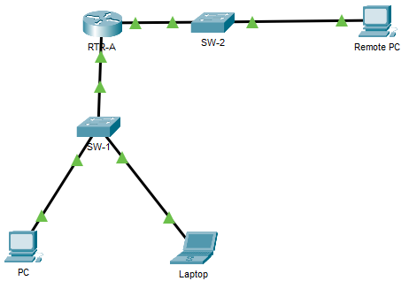

## Топология

## Таблица адресации

| Устройство | Интерфейс       | Адрес         | Маска         | Шлюз |
|------------|-----------------|---------------|---------------|------|
| RTR-A      | G0/0/0          | 192.168.1.1   | 255.255.255.0 | —    |
| RTR-A      | G0/0/1          | 192.168.2.1   | 255.255.255.0 | —    |
| SW-1       | SVI             | 192.168.1.254 | 255.255.255.0 |      |
| PC         | Сетевой адаптер | 192.168.1.2   | 255.255.255.0 |      |
| Laptop     | Сетевой адаптер | 192.168.1.10  | 255.255.255.0 |      |
| Remote PC  | NIC             | 192.168.2.10  | 255.255.255.0 |      |

## Требования

**Чтобы сделать это действие кратким и простым в управлении, некоторые параметры конфигурации безопасности не были реализованы. В других случаях рекомендации по обеспечению безопасности не были соблюдены.**

В этом задании вы будете настраивать маршрутизатор и коммутатор на основе списка требований.

## Инструкции

**Шаг 1. Документирование сети**

Заполните таблицу адресации недостающей информацией.

**Шаг 2. Требования к конфигурации маршрутизатора:**

-   Предотвращение попыток IOS разрешать неправильно набранные команды для имен доменов.

-   Имена узлов должны соответствовать значениям в таблице адресации.

-   Требование: вновь созданные пароли должны быть не менее 10 символов.

-   Для консольной линии необходим надежный десятизначный пароль. Используйте **@Cons1234!**

-   Убедитесь, что сессии консоли и VTY будут закрыть ровно через 7 минут.

-   Надежный зашифрованный десятизначный пароль для привилегированного режима EXEC. Для этого действия допустимо использовать тот же пароль, что и консольной линии.

-   Баннер MOTD, предупреждающий о несанкционированном доступе кустройствам.

-   Шифрование паролей для всех паролей.

-   Имя пользователя **NETadmin** с зашифрованным паролем **LogAdmin!9**.

-   Активация подключения по SSH.

    -   Используйте **security.com** в качестве доменного имени.

    -   Используйте модуль **1024**.

-   Линии VTY должны использовать SSH для входящих подключений.

-   Строки VTY должны использовать имя пользователя и пароль, которые были настроены для проверки подлинности учетных записей.

-   Запретите попытки входа в систему методом грубой силы с помощью команды, которая блокирует попытки входа в систему в течение 45 секунд, если кто-то провалил три попытки в течение 100 секунд.

**Шаг 3. Требования к конфигурации коммутатора:**

-   <u>Все</u> неиспользуемые порты коммутатора должны быть административно отключены.

-   Интерфейс управления SW-1 по умолчанию должен принимать подключения по сети. Используйте информацию, указанную в таблице адресов. Коммутатор должен быть доступен из удаленных сетей.

-   Используйте **@Cons1234!** в качестве пароля привилегированного режима EXEC

-   Настройте SSH, как это было сделано для маршрутизатора.

-   Создайте имя пользователя **NETadmin** с зашифрованным секретным паролем **LogAdmin!9**

-   Линии VTY должны принимать подключения только через SSH.

-   Строки VTY должны быть разрешены только для учетной записи администратора сети при доступек интерфейсу управления коммутатором.

-   Узлы всех подсетей должны иметь возможность пропинговать интерфейс управления коммутатором.

[Скачать файл Packet Tracer для локального запуска](./assets/16.5.1-lab.pka)
