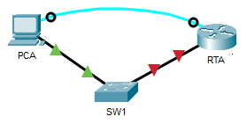

## Топология



## Таблица адресации

| Устройство | Интерфейс | IP-адрес    | Маска подсети | Шлюз по умолчанию |
|------------|-----------|-------------|---------------|-------------------|
| RTA        | G0/0      | 172.16.1.1  | 255.255.255.0 | —                 |
| PCA        | NIC       | 172.16.1.10 | 255.255.255.0 | 172.16.1.1        |
| SW1        | VLAN 1    | 172.16.1.2  | 255.255.255.0 | 172.16.1.1        |

## Сценарий

Администратор сети обратился к вам с просьбой подготовить **RTA** и **SW1** для развертывания. Перед его подключением к сети необходимо активировать функции безопасности.

## Инструкции

### Шаг 1. Настройка основных параметров безопасности на маршрутизаторе.

1.  Настройте IP-адресацию на компьютере **PCA** в соответствии с таблицей адресации.

2.  Используя терминал на RTA, установите консольное соединение с PCA.

3.  Настройте имя хоста как **RTA**.

4.  Настройте IP-адресацию на **RTA** и активируйте интерфейс.

5.  Зашифруйте все открытые пароли.

    ```
    RTA(config)# service password-encryption
    ```

6.  Установите минимальную длину пароля 10.

    ```
    RTA(config)# security password min-length 10
    ```

7.  Установите надежный секретный пароль по своему выбору. **Примечание**. Выберите пароль, который вы будете помнить, или вам нужно будет сбросить его, если вы заблокируете устройство.

8.  Отключите поиск DNS.

    ```
    RTA(config)# no ip domain-lookup
    ```

9.  Установите доменное имя **CCNA.com** (с учетом регистра для правильного расчета баллов программой Packet Тracer).

    ```
    RTA(config)# ip domain-name CCNA.com
    ```

10. Создайте произвольного пользователя с надежным шифрованным паролем.

    ```
    RTA (config) # username any_user secret any_password 
    ```

11. Создайте 1024-разрядные RSA-ключи.

    **Примечание**. В программе Packet Tracer введите команду crypto key generate rsa и нажмите клавишу Enter для продолжения.

    ```
    RTA(config)# crypto key generate rsa
    Имя для ключей будет: RTA.CCNA.com
    Choose the size of the key modulus in the range of 360 to 2048 for your
      General Purpose Keys. Choosing a key modulus greater than 512 may take
      a few minutes.

    How many bits in the modulus [512]: 1024
    ```

12. Заблокируйте на три минуты всех, кто не смог войти в систему, выполнив четыре попытки в течение двух минут.

    ```
    RTA(config)# login block-for 180 attempts 4 within 120
    ```

13. Настройте все линии VTY для доступа по SSH и используйте профили локальных пользователей для аутентификации.

    ```
    RTA(config)# line vty 0 4
    RTA(config-line)# transport input ssh
    RTA(config-line)# login local
    ```

14. Установите тайм-аут режима EXEC на 6 минут на линиях VTY.

    ```
    RTA(config-line)# exec-timeout 6
    ```

15. Сохраните конфигурацию в NVRAM.

16. Откройте командную строку на рабочем столе **PCA** , чтобы установить соединение SSH с **RTA** .

    ```
    C:\> ssh/?
    Packet Tracer PC SSH
    Usage: SSH -l username target
    C:\>
    ```

### Шаг 2. Настройка базовых мер безопасности на коммутаторе

Настройте коммутатор **SW1** с соответствующими мерами безопасности. Для получения дополнительной помощи обратитесь к инструкциям по настройке маршрутизатора.

1.  Нажмите на **SW1** и выберите вкладку **CLI**.

2.  Настройте имя хоста как **SW1**.

3.  Настройте IP-адресацию на SW1 **VLAN1** и активируйте интерфейс.

4.  Настройте адрес шлюза по умолчанию.

5.  Отключите все неиспользуемые порты коммутатора.

    **Примечание. На коммутаторе рекомендуется отключить неиспользуемые порты. Один из способов сделать это - просто закрыть каждый порт с помощью команды «shutdown**». Для этого потребуется доступ к каждому порту по отдельности. Существует метод быстрого внесения изменений в несколько портов одновременно с помощью **команды** interface range. На **SW1** все порты, кроме FastEthernet0/1 и GigabitEthernet0/1, могут быть выключены с помощью следующей команды:

    ```
    SW1 (config) # interface range F0/2-24, G0/2
    SW1 (config-if-range) # shutdown
    %LINK-5-CHANGED: Interface FastEthernet0/2, changed state to administratively down

    %LINK-5-CHANGED: Interface FastEthernet0/3, changed state to administratively down
    <Output omitted>
    %LINK-5-CHANGED: Interface FastEthernet0/24, changed state to administratively down

    %LINK-5-CHANGED: Interface GigabitEthernet0/2, changed state to administratively down
    ```

    Команда использовала диапазон портов 2-24 для портов FastEthernet, а затем один диапазон портов GigabitEthernet0/2.

6.  Зашифруйте все открытые пароли.

7.  Установите надежный секретный пароль по своему выбору.

8.  Отключите поиск DNS.

9.  Установите доменное имя **CCNA.com** (с учетом регистра для правильного расчета баллов программой Packet Тracer).

10. Создайте произвольного пользователя с надежным шифрованным паролем.

11. Создайте 1024-разрядные RSA-ключи.

12. Настройте все линии VTY для доступа по SSH и используйте профили локальных пользователей для аутентификации.

13. Установите тайм-аут режима EXEC на 6 минут на всех линиях VTY.

14. Сохраните конфигурацию в NVRAM.

[Скачать файл Packet Tracer для локального запуска](./assets/16.4.6-packet-tracer---configure-secure-passwords-and-ssh_ru-RU.pka)
