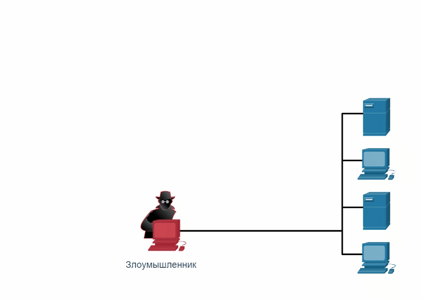
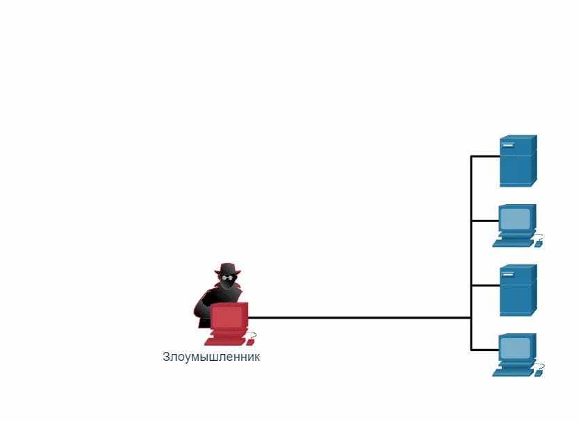
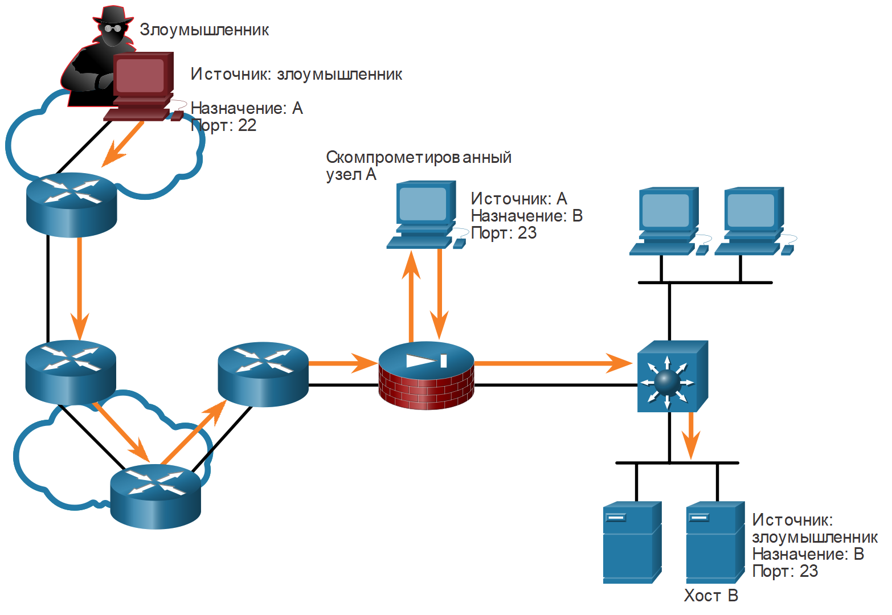
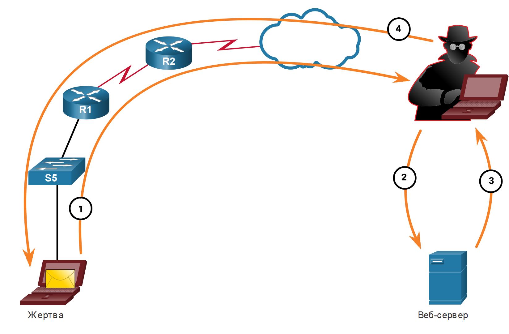
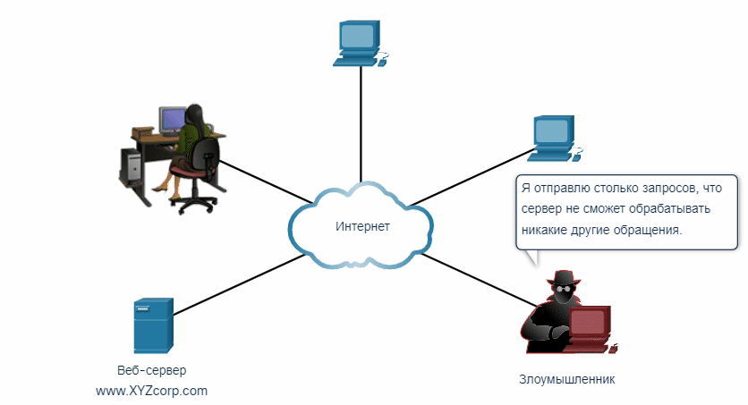
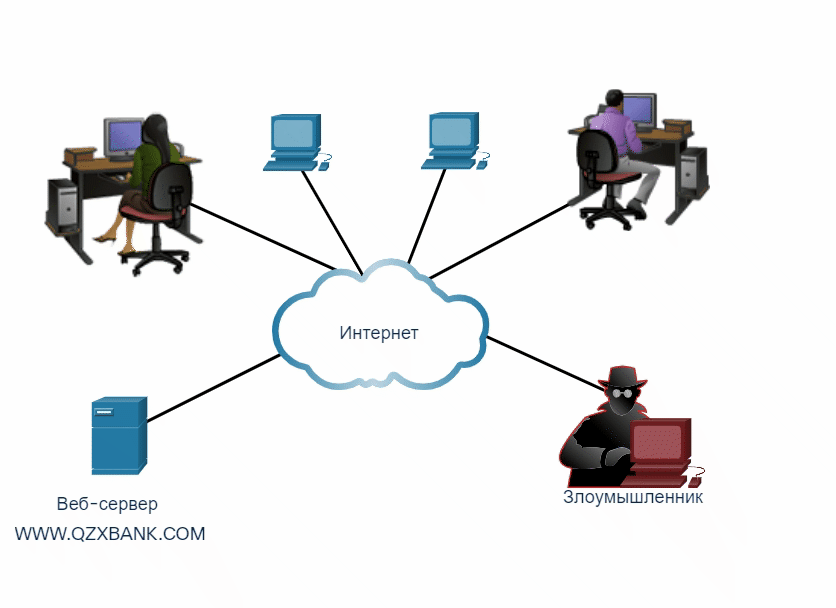

<!-- verified: agorbachev 03.05.2022 -->

<!-- 16.2.1 -->
## Типы вредоносного ПО

В предыдущем разделе описаны типы сетевых угроз и уязвимости, которые делают угрозы возможными. В этом разделе более подробно рассказывается о том, как злоумышленники получают доступ к сети или ограничивают доступ авторизованных пользователей.

Вредоносное ПО ― это вредоносное программное обеспечение (или вредоносный код). Такой код или ПО разрабатывается с целью повредить, разрушить, украсть данные либо причинить вред или совершить незаконные действия в отношении данных, узлов или сетей. К такому типу программного обеспечения можно отнести вирусы, черви и программы-трояны.

**Вирусы**

Компьютерный вирус — это такой тип вредоносного ПО, который распространяется путем внедрения своей копии в другую программу, заражая ее и становясь ее частью. Вирусы распространяются с одного компьютера на другой, инфицируя все объекты на своем пути. Вирусы могут быть разного уровня серьезности — от безобидных назойливых программ до вирусов, разрушающих данные или ПО и создающих условия для отказа в обслуживании (DoS-атаки). Почти все вирусы прикрепляются к исполняемому файлу. Это означает, что вирус может существовать в системе и никак не проявлять себя до тех пор, пока пользователь не запустит вредоносную программу или не откроет зараженный файл. Вредоносный код выполняется вместе с основным кодом зараженной программы. Обычно заражение вирусом никак не отражается на работе инфицированной программы. Однако,, существуют вирусы, которые полностью переписывают программы и копируют себя в них, тем самым уничтожая зараженную программу. Распространяются вирусы во время передачи программы или документа, к которым они прикреплены, с одного компьютера на другой как по сети, так и посредством носителей информации, а также через общие файловые ресурсы и почтовые вложения.

**Черви**

Компьютерные черви похожи на вирусы тем, что они копируют свои функциональные части и могут нанести не меньший ущерб. В отличие от вирусов, для распространения которых обязательно должен иметься зараженный файл, черви представляют собой отдельные программы, распространяющиеся без участия программы-носителя или человека. Чтобы инфицировать узел, червю не обязательно прикрепляться к программе — они проникают в систему через уязвимости в ней. Для незаметного перемещения по сети черви используют компоненты системы.

**Трояны**

К другому типу вредоносного ПО относятся программы-трояны, названные так в честь деревянного коня, с помощью которого греческие воины проникли в Трою, спрятавшись внутри. Они маскируются под легитимные программы. Обычно пользователя обманом заставляют загрузить и запустить такую программу на своем компьютере. После активации программа-троян может осуществить любое количество атак на узел, начиная от раздражающих пользователя всплывающих окон или изменения обоев рабочего стола и заканчивая вредоносными действиями (удаление файлов, кража данных или активация и распространение другого вредоносного ПО, такого как вирусы). Программы-трояны также известны тем, что создают лазейки, позволяющие злоумышленникам получить доступ к системе.

В отличие от вирусов и червей такие вредоносные программы не распространяются путем заражения других файлов, а также не реплицируют сами себя. Они самовоспроизводятся. Обязательным условием для их распространения является открытие пользователем почтового вложения или загрузка и запуск файла из Интернета.

Нажмите кнопку Play (Воспроизведение), чтобы посмотреть анимацию, иллюстрирующую  наиболее распространенные типы вредоносного ПО.

<!-- 16.2.2 -->
## Разведывательные атаки

Помимо атак с использованием вредоносного кода сети также могут стать целью различных сетевых атак. Сетевые атаки можно разделить на три основные категории:

* **Разведывательные атаки** — обнаружение и сопоставление систем, служб или уязвимостей.
* **Атаки доступа** — несанкционированные действия с данными, доступ к системе или использование прав пользователя.
* **Отказ в обслуживании** — отключение или повреждение сетей, систем или служб.

Злоумышленники извне могут использовать инструменты Интернета, например программные средства **nslookup** и **whois**, которые позволяют с легкостью определить пространство IP-адресов, назначенное определенной корпорации или юридическому лицу. После определения пространства IP-адресов злоумышленник может отправить команду ping для проверки связи с общедоступными IP-адресами, чтобы выявить активные адреса. Для автоматизации этого этапа хакер может использовать инструмент эхо-тестирования, например, **fping** или **gping**. Систематически отправляет эхо-запросы на все сетевые адреса в заданном диапазоне или подсети. Этот процесс можно сравнить с просмотром раздела телефонной книги и звонком на каждый из номеров, чтобы проверить, кто ответит.

### Интернет-запросы

Нажмите Воспроизведение на рисунке для просмотра анимации. Хакер ищет исходную информацию о целевом объекте. Можно использовать различные инструменты, в том числе поиск Google, веб-сайт организаций, Whois и многое другое.

### Эхо-тестирование адресов

Нажмите Воспроизведение на рисунке для просмотра анимации. Злоумышленник теперь может инициировать проверку связи, чтобы определить, какие IP-адреса являются активными.

### Сканирование портов

Нажмите кнопку Play (Воспроизведение), чтобы просмотреть анимацию, иллюстрирующую хакера, выполняющего сканирование портов с помощью программы Nmap для обнаружения активных IP-адресов.

<!-- 16.2.3 -->
## Атаки доступа

Атаки доступа используют известные уязвимости в сервисах аутентификации, FTP- и веб-сервисах, чтобы получить доступ к учетным записям в Интернете, конфиденциальным базам данных и другой конфиденциальной информации. Атака доступа позволяет злоумышленнику получить несанкционированный доступ к данным, для просмотра которого у него нет прав. Атаки доступа можно разделить на четыре типа: атаки с паролем, использование доверия, перенаправление портов и «человек-в-середине».

### Подбор пароля

Злоумышленники могут подобрать пароль несколькими способами

* Атаки методом грубой силы
* Атака троянами
* Анализаторы пакетов

<!-- /courses/itn-dl/aeed7cc4-34fa-11eb-ad9a-f74babed41a6/af250780-34fa-11eb-ad9a-f74babed41a6/assets/2e7e2c90-1c25-11ea-81a0-ffc2c49b96bc.svg -->

### Злоупотребление доверием

При атаке с злоупотреблением доверия злоумышленник использует несанкционированные привилегии для получения доступа к системе, что может поставить под угрозу цель. Нажмите кнопку Play (Воспроизведение) в анимации, чтобы просмотреть пример злоупотребления доверием.

### Переадресация портов

При атаке с переадресацией портов злоумышленник использует взломанную систему в качестве базы для атак на другие целевые объекты. В примере на рисунке показан хакер, использующий SSH-протокол (port 22) для подключения к скомпрометированному хосту А. Хост А является доверенным хостом для хоста В, и, следовательно, хакер теперь может использовать для доступа к этому хосту протокол Telnet(port 23).

<!-- /courses/itn-dl/aeed7cc4-34fa-11eb-ad9a-f74babed41a6/af250780-34fa-11eb-ad9a-f74babed41a6/assets/2e7e53a6-1c25-11ea-81a0-ffc2c49b96bc.svg -->

### Атака «Человек посередине» (незаконный посредник, man-in-the-middle)

При атаке через посредника злоумышленник располагается между двумя доверяемыми объектами, чтобы читать, изменять или перенаправлять данные, которыми они обмениваются. На рисунке показан пример атаки через посредника.

<!-- /courses/itn-dl/aeed7cc4-34fa-11eb-ad9a-f74babed41a6/af250780-34fa-11eb-ad9a-f74babed41a6/assets/2e7e7ab9-1c25-11ea-81a0-ffc2c49b96bc.svg -->

**Шаг 1**. Когда жертва запрашивает веб-страницу, запрос направляется на компьютер хакера.

**Шаг 2**. Компьютер хакера получает запрос и загружает настоящую страницу с подлинного веб-сайта.

**Шаг 3**. Злоумышленник может изменить исходную веб-страницу и внести изменения в данные.

**Шаг 4**. Хакер пересылает запрошенную страницу жертве.

<!-- 16.2.4 -->
## Атаки типа «отказ в обслуживании» (DoS-атаки)

Атаки типа «отказ в обслуживании» (DoS-атаки) широко распространены, и их последствия устранить труднее всего. Однако, ввиду простоты реализации DoS-атак и потенциально существенного вреда от них администраторы безопасности должны уделять таким атакам особое внимание.

DoS-атаки могут принимать различные формы. В конечном счете такие атаки, потребляя системные ресурсы, мешают авторизованным пользователям использовать службу. Для предотвращения DoS-атак важно следить за тем, чтобы на компьютере были установлены актуальные обновления для системы безопасности как для ОС, так и для приложений.

### DoS-атака

DoS-атаки представляют высокий риск, поскольку могут легко нарушить обмен информацией и вести к крупным потерям времени и средств. Проводить такие атаки относительно несложно, это под силу даже неопытным злоумышленникам.

Нажмите кнопку Play (Воспроизведение), чтобы посмотреть анимацию, иллюстрирующую DoS-атаку.

### Распределенная атака DDoS

Распределенные атаки типа «Отказ в обслуживании» (DDoS) похожи на DoS-атаки, но проводятся скоординировано из нескольких источников. Например, злоумышленник создает сеть зараженных хостов, известных как зомби. Сеть зомби называется ботнетом. Актер угрозы использует программу командования и управления (CnC), чтобы инструктировать ботнет зомби выполнять DDoS-атаку.

Нажмите кнопку Play (Воспроизведение), чтобы просмотреть анимацию DDoS-атаки.

<!-- 16.2.5 -->
<!-- quiz -->

<!-- 16.2.6 -->
## Лабораторная работа. Изучение угроз безопасности сети

В этой лабораторной работе вы выполните следующие задачи.

* Часть 1: Изучение веб-сайта SANS
* Часть 2: Определение новых угроз безопасности сети
* Часть 3: Подробное описание отдельной угрозы безопасности сети

[Изучение угроз безопасности сети (lab)](./assets/16.2.6-lab---research-network-security-threats.pdf)

