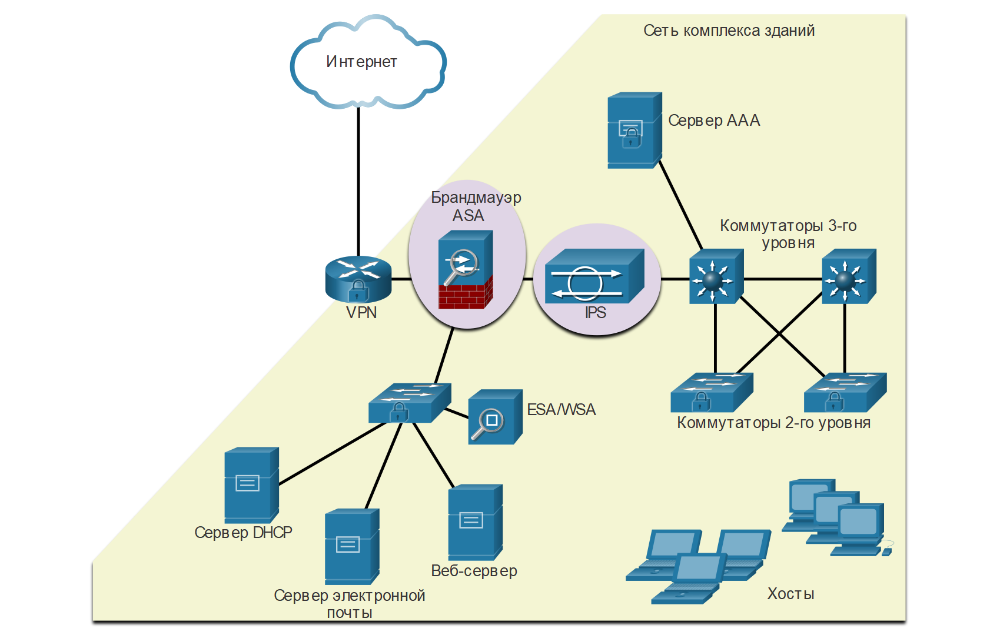
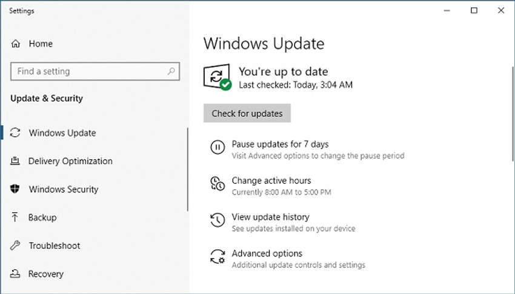

# Защита от сетевых атак

<!-- 16.3.1 -->
##  Углубленный подход к защите

Теперь, когда вы знаете больше о том, как участники угроз могут проникнуть в сети, вам необходимо понять, что делать для предотвращения такого несанкционированного доступа. В этом разделе описывается несколько действий, которые можно предпринять для повышения безопасности сети.

Чтобы снизить уровень сетевых атак, сначала необходимо обеспечить безопасность устройств, включая маршрутизаторы, коммутаторы, серверы и хосты. Одним из решений является использование сквозного подхода к обеспечению безопасности, также известного как многоуровневый подход к информационной безопасности. Такой подход предполагает совместную работу сетевых устройств и сервисов.

Рассмотрим сеть на рисунке. Существует несколько устройств и служб обеспечения безопасности, которые позволяют защитить свои пользователи и ресурсы от угроз TCP/IP.

Все сетевые устройства, включая маршрутизатор и коммутаторы, также зафиксированы в соответствии с комбинациями блокировок на соответствующих значках. Это означает, что они защищены, чтобы не допустить фальсификации устройствами злоумышленниками.

<!-- /courses/itn-dl/aeed7cc4-34fa-11eb-ad9a-f74babed41a6/af250782-34fa-11eb-ad9a-f74babed41a6/assets/2e804f73-1c25-11ea-81a0-ffc2c49b96bc.svg -->

Для защиты пользователей и активов организации от угроз TCP/IP реализовано несколько устройств и служб безопасности.

* **VPN**  - Маршрутизатор используется для предоставления защищенных сервисов VPN с корпоративными сайтами и поддержки удаленного доступа для удаленных пользователей, использующих защищенные зашифрованные туннели.
* **ASA Firewall**  - Это выделенное устройство предоставляет сервисы межсетевого экрана с сохранением состояния. Это гарантирует, что внутренний трафик может выходить и возвращаться, но внешний трафик не может инициировать соединения с внутренними узлами.
* **IPS**  - Система предотвращения вторжений (IPS) отслеживает входящий и исходящий трафик на наличие вредоносных программ, сигнатур сетевых атак и многого другого. Если он распознает угрозу, он может немедленно остановить ее.
* **ESA/WSA**  - Устройство защиты электронной почты (ESA) фильтрует спам и подозрительные электронные письма. Устройство веб-безопасности фильтрует известные и подозрительные веб-сайты вредоносного по Интернета.
* **AAA Server**  - Этот сервер содержит защищенную базу данных о том, кто авторизован для доступа и управления сетевыми устройствами. Сетевые устройства аутентифицируют административных пользователей, используя эту базу данных.

<!--
На рисунке изображена сеть кампуса. Вверху изображено облако, символизирующее Интернет.
подключенный к маршрутизатору, обозначенный как VPN. VPN-маршрутизатор подключен к брандмауэру
ASA. Брандмауэр имеет два дополнительных подключения: одно к IPS и
другой к коммутатору. Коммутатор подключен к DHCP-серверу, почтовому серверу,
и ESA/WSA. IPS подключен к многоуровневому коммутатору. Многоуровневый
коммутатор имеет подключение к серверу AAA, а также к двум коммутаторам уровня 2
подключен к  другому многоуровневому коммутатору. Второй многоуровневый коммутатор также
имеет подключения к тем же коммутаторам уровня 2, что создает избыточность. Ниже
коммутатора уровня 2 показаны  три ноутбука и три компьютера, которые помечены как хосты.
-->

<!-- 16.3.2 -->
## Сохранить резервные копии

Резервное копирование данных — один из самых эффективных способов защиты данных от потери. При выполнении резервного копирования данных компьютера копия информации сохраняется на съемном носителе для резервных копий, который можно сохранить в надежном месте. Инфраструктурные устройства должны иметь резервные копии файлов конфигурации и образов IOS на FTP или аналогичном файловом сервере. В случае сбоя оборудования компьютера или маршрутизатора, данные или конфигурацию можно восстановить с помощью резервной копии.

Регулярно выполняйте резервное копирование, как определено в политике безопасности. Резервные копии данных обычно хранятся отдельно, чтобы защитить носитель с резервными копиями на случай, если что-либо произойдет в основном помещении. На хостах Windows есть служебная программа «резервное копирование и восстановление». Для пользователей важно создать резервную копию своих данных на другой диск или на облачное хранилище.

В таблице приведены соображения по резервному копированию и их описания.

| **Рассмотрение** | **Описание** |
| --- | --- |
| Частота | <ul><li>Регулярно выполняйте резервное копирование, как определено в политике безопасности. компании.</li><li>Полное резервное копирование может занять много времени, поэтому выполнять ежемесячно или еженедельное резервное копирование с частыми частичными резервными копиями измененных файлов.</li></ul> |
| Хранение | <ul><li>Проверка — всегда проверяйте резервные копии для обеспечения целостности данных и проводите проверочные процедуры восстановления файлов.</li></ul> |
| Безопасность | <ul><li>Резервные копии следует транспортировать в утвержденное внешнее хранилище на ежедневной, еженедельной или ежемесячной ротации, как того требует политика безопасности.</li></ul> |
| Проверка | <ul><li>Резервные копии следует защищать с помощью надежных паролей. Пароль требуется для восстановления данных.</li></ul> |

<!-- 16.3.3 -->
## Резервное копирование, обновление и установка исправлений

Актуальные обновления в соответствии с новейшими разработками обеспечивают более эффективную защиту от сетевых атак. По мере появления новых вредоносных программ предприятиям рекомендуется постоянно следить за обновлением антивирусного программного обеспечения до последних версий.

Наиболее действенный метод минимизации последствий атаки вируса-червя — загрузить обновления для системы безопасности с сайта поставщика операционной системы и установить соответствующие обновления на все уязвимые копии систем. Управление несколькими системами включает в себя создание образа стандартного программного обеспечения (операционные системы и подтвержденные приложения, авторизованные для использования в клиентских системах), развертывание которых выполняется в новых или обновленных системах. Тем не менее, требования к безопасности меняются, и для развернутых систем может потребоваться установка обновленных исправлений безопасности.

Одно из решений для управления критически важными исправлениями безопасности заключается в том, чтобы убедиться, что все конечные системы автоматически загружают обновления, как показано на рисунке для Windows 10. Исправления безопасности загружаются и устанавливаются автоматически без вмешательства пользователя.

<!--
The figure shows the Windows Update screen for a Windows 10 pc.
-->

<!-- 16.3.4 -->
## Аутентификация, авторизация и учет

Все сетевые устройства должны быть надежно настроены для предоставления доступа только авторизованным лицам. Такие службы по обеспечению сетевой безопасности, как аутентификация, авторизация и учет (Authentication, authorization, and accounting, ААА), являются базовой инфраструктурой, которая устанавливает средства контроля доступа на каком-либо сетевом устройстве.

Сочетание служб аутентификации, авторизации и учета — это метод, позволяющий контролировать вход разрешенных пользователей (аутентификация), какие действия они могут выполнять, находясь в сети (авторизация), а также следить за их действиями во время доступа к сети (учет).

Концепция служб аутентификации, авторизации и учета (AAA) похожа на использование кредитной карты. Кредитная карта определяет, кто может ею пользоваться, какую сумму можно потратить, а также ведет учет товаров, на которые пользователь тратит деньги, как показано на рисунке.

<!-- /courses/itn-dl/aeed7cc4-34fa-11eb-ad9a-f74babed41a6/af250782-34fa-11eb-ad9a-f74babed41a6/assets/2e8160e1-1c25-11ea-81a0-ffc2c49b96bc.svg -->

<!--
На рисунке показаны две кредитные карты, одна поверх другой рядом с
выпиской по кредитной карте Прямоугольник вокруг чисел на верхней кредитной карте с
текстом: Аутентификация - Кто вы? Второй прямоугольник вокруг кредитного
лимит в выписке по кредитной карте с текстом: Авторизация -  Сколько вы можете
тратить? Третий прямоугольник вокруг транзакционной части кредитной карты
с конечной суммой с текстом:  учет - На что вы это  потратили?
-->

<!-- 16.3.5 -->
## Межсетевые экраны

Межсетевой экран — одно из наиболее эффективных средств безопасности для защиты пользователей сети от внешних угроз. Межсетевой экран защищает компьютеры и сети, предотвращая нежелательный трафик при входе в внутренние сети.

Межсетевой экран ставится между двумя (или более) сетями и контролирует трафик между ними, а также позволяет предотвратить несанкционированный доступ. Например, в верхней топологии на рис. 1 показано, как межсетевой экран разрешает трафик от хоста внутренней сети, чтобы выйти из сети и вернуться во внутреннюю сеть. В нижней топологии показано, как трафик, инициированный внешней сетью (например, Интернет), получает доступ к внутренней сети.

### Принцип работы межсетевого экрана

<!-- /courses/itn-dl/aeed7cc4-34fa-11eb-ad9a-f74babed41a6/af250782-34fa-11eb-ad9a-f74babed41a6/assets/2e81af03-1c25-11ea-81a0-ffc2c49b96bc.svg -->

<!--
На рисунке показан прямоугольник с надписью «Внутренняя сеть». Внутри прямоугольника есть
ПК. Снаружи и справа от прямоугольника есть брандмауэр. Справа 
 от брандмауэра, есть облако с надписью, Интернет. Есть две стрелки,
один означает трафик, уходящий с компьютера, проходящий через брандмауэр и выходящий в
Интернет Вторая стрелка указывает, что брандмауэр разрешает трафик из
Интернет на ПК. На рисунке показан другой прямоугольник с надписью «Внутренняя сеть». Внутри прямоугольника есть
ПК. Снаружи и справа от прямоугольника есть брандмауэр. Справа
от брандмауэра, есть облако с надписью, Интернет. Стрелка
указывая из Интернета на брандмауэр с X, означающим, что трафику
исходящему из сети Интернет запрещено  входить во внутреннюю сеть.
-->

Брандмауэр позволяет внешним пользователям контролировать доступ к определенным службам. Например, серверы, доступные внешним пользователям, обычно размещаются в специальной сети, которая называется демилитаризованной зоной (DMZ), как показано на рисунке. DMZ позволяет сетевому администратору применять определенные политики для хостов, подключенных к этой сети.

### Топология брандмауэра с DMZ

<!-- /courses/itn-dl/aeed7cc4-34fa-11eb-ad9a-f74babed41a6/af250782-34fa-11eb-ad9a-f74babed41a6/assets/2e81d614-1c25-11ea-81a0-ffc2c49b96bc.svg -->

<!--
На рисунке показан прямоугольник с надписью «Внутренняя сеть». Внутри прямоугольника есть
ПК. Снаружи и справа от прямоугольника есть брандмауэр. Справа
от брандмауэра, есть облако с надписью, Интернет. Над брандмауэром
есть сервер DMZ внутри прямоугольника. Есть две стрелки, одна идет
с компьютера через брандмауэр на сервер DMZ, а другая, идущая из
Интернета через брандмауэр на сервер DMZ.
-->

<!-- 16.3.6 -->
## Типы брандмауэров

Решения для межсетевых экранов собраны в различные комплекты. В брандмауэрах используются различные методы для определения разрешения или запрета доступа к сети. В этот список входят следующие продукты:

* **Фильтрация пакетов** — запрет или разрешение доступа на основе IP- или MAC-адресов.
* **Фильтрация по приложениям** — запрет или разрешение доступа для конкретных типов приложений на основе номеров портов.
* **Фильтрация по URL-адресам** — запрет или разрешение доступа к веб-сайтам на основе конкретных URL-адресов или ключевых слов.
* **Анализ пакетов с учетом состояний соединений (SPI)** — входящие пакеты должны представлять собой легитимные отклики на запросы внутренних узлов. Незапрошенные пакеты блокируются, если они не разрешены в явном виде. SPI также предоставляет возможность распознавать и блокировать конкретные типы атак, например атаку типа «отказ в обслуживании» (DoS-атака).

<!-- 16.3.7 -->
## Безопасность оконечных устройств

Оконечное устройство, или узел, представляет собой отдельную компьютерную систему или устройство, которое выступает в роли клиента сети. К наиболее распространенным оконечным устройствам относятся ноутбуки, настольные компьютеры, серверы и смартфоны и планшеты. Защита оконечных устройств — одна из наиболее сложных задач, входящих в обязанности администратора сети, поскольку в данном случае имеет значение человеческий фактор. Компании необходимо разработать и тщательно задокументировать соответствующие политики и ознакомить с ними сотрудников. Сотрудников необходимо обучить правильно использовать сеть. Политики зачастую подразумевают использование антивирусного ПО и меры предотвращения несанкционированного вторжения на узел. Комплексные решения для защиты оконечных устройств используют функции контроля доступа к сети

<!-- 16.3.8 -->
<!-- quiz -->

