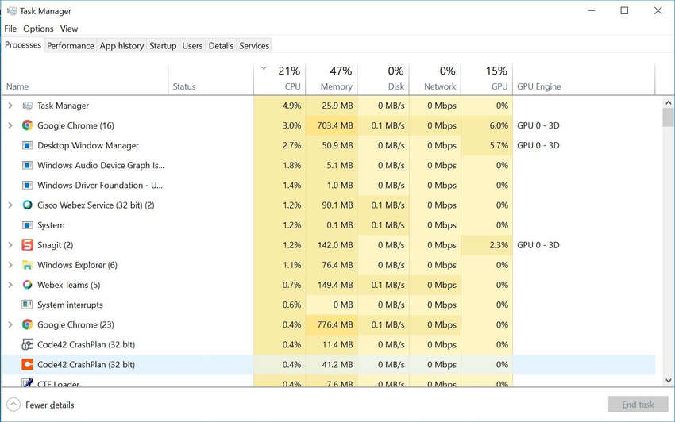

<!-- verified: agorbachev 03.05.2022 -->

<!-- 17.2.1 -->
## Распространенные приложения

В предыдущем разделе рассматривались компоненты небольшой сети, а также некоторые идеи, связанные с проектированием. Они необходимы, когда вы просто настраиваете сеть. После настройки сети еще требуется определить типы приложений и протоколов для работы.

Сеть полезна настолько, насколько полезны используемые в ней приложения. Существует два вида программ или процессов, обеспечивающих доступ к сети: сетевые приложения и службы уровня приложений.

**Сетевые приложения**

**Приложения** — это компьютерные программы, используемые для обмена данными по сети. Некоторые приложения конечных пользователей зависят от сети, то есть они используют протоколы уровня приложений и могут обмениваться данными непосредственно с нижними уровнями стека протоколов. В качестве примера приложения такого типа можно привести почтовые клиенты и браузеры.

**Приложения прикладного уровня**

Другие программы могут прибегать к помощи служб уровня приложений при использовании сетевых ресурсов (например, передача файлов и временное хранение данных сетевой печати). Хотя эти службы прозрачны для сотрудников, они представляют собой программы, которые взаимодействуют с сетью и подготавливают данные для передачи. Для разных типов данных (текстовых, графических или видео) требуются разные сетевые службы, обеспечивающие их надлежащую подготовку к обработке с помощью функций на нижестоящих уровнях модели взаимодействия открытых систем (OSI).

Все приложения и сетевые службы используют протоколы, которые определяют применимые стандарты и форматы данных. Без использования протоколов в сети передачи данных не было бы общего для всех способа форматирования и передачи данных. Чтобы понять функции различных сетевых служб, необходимо ознакомиться с протоколами, которые управляют работой этих служб.

Откройте **диспетчер задач**, чтобы ознакомиться со списком приложений, процессов и служб, выполняющихся в данный момент на компьютере под управлением ОС Windows, как показано на рисунке.

<!-- 17.2.2 -->
## Распространенные протоколы

Большая часть работы технического специалиста в рамках небольшой или большой сети так или иначе связана с сетевыми протоколами. Они поддерживают приложения и службы, используемые сотрудниками в небольших сетях.

Сетевые администраторы обычно требуют доступа к сетевым устройствам и серверам. Двумя наиболее распространенными решениями удаленного доступа являются Telnet и Secure Shell (SSH). SSH сервис является безопасной альтернативой Telnet. При подключении администраторы могут получить доступ к устройству сервера SSH, как если бы они были зарегистрированы локально.

SSH используется для установления безопасного удаленного доступа между SSH-клиентом и другими устройствами с поддержкой SSH:

* **сетевое устройство** (роутер, коммутатор, точка доступа и т.д.);
* **сервер** (веб-сервер, сервер электронной почты и т.д.).

Сетевые администраторы также должны поддерживать общие сетевые серверы и связанные с ними протоколы, как показано на рисунке.

### Веб-сервер

* Клиенты и серверы обмениваются трафиком с помощью протокола передачи гипертекста (HTTP).
* Протокол передачи гипертекста Secure (HTTPS) используется для безопасной веб-связи.

### Сервер электронной почты

* Почтовые серверы и клиенты используют простой протокол электронной почты (SMTP) для отправки электронных писем.
* Почтовые клиенты используют протокол POP3 или протокол доступа к сообщениям Интернета (IMAP) для получения электронной почты .
* Получатели указываются в формате user@xyz.xxx.

### FTP-сервер

* Служба протокола передачи файлов (FTP) позволяет загружать файлы между клиентом и FTP-сервером.
* FTP Secure (FTPS) и Secure FTP (SFTP) используются для обеспечения обмена файлами FTP.

### Сервер DHCP

Протокол DHCP используется клиентами для получения конфигурации IP (например, IP-адрес, маску подсети, шлюз по умолчанию и многое другое) от DHCP-сервера.

### DNS-сервер

* Служба доменных имен (DNS) разрешает доменное имя в IP-адрес (например, cisco.com = 72.163.4.185).
* DNS предоставляет IP-адрес сайта (например, доменное имя) запрашивающему хосту.

**Примечание.** Сервер может предоставлять несколько сетевых служб. Например, сервер может быть сервером электронной почты, FTP и SSH.

Эти сетевые протоколы содержат основной набор инструментов сетевого специалиста. Каждый сетевой протокол определяет:

* процессы на каждой из сторон сеанса обмена данными;
* типы сообщений;
* синтаксис сообщений;
* значение информационных полей;
* способы отправки сообщений и предполагаемый ответ;
* взаимодействие с последующим более низким уровнем.

Политика безопасности многих компаний требует по возможности использовать безопасные версии этих протоколов.

<!-- 17.2.3 -->
## Приложения для передачи голоса и видео

Современные компании все активнее используют для связи с заказчиками и деловыми партнерами IP-телефонию и потоковую передачу мультимедийного содержимого. Многие организации позволяют своим сотрудникам работать удаленно. Как показано на рисунке, многим их пользователям по-прежнему необходим доступ к корпоративному программному обеспечению и файлам, а также поддержка голосовых и видеоприложений.

Администратор сети должен обеспечить установку надлежащего оборудования в сети и настроить сетевые устройства в целях поддержки приоритетной передачи данных.

### Инфраструктура

* Сетевая инфраструктура должна поддерживать онлайн-приложения.
* Существующие устройства и СКС должны быть протестированы и проверены.
* Могут потребоваться более новые сетевые продукты.

### VoIP

* Устройства VoIP преобразуют аналоговые сигналы в цифровые IP-пакеты.
* Протокол VoIP отличается большей экономичностью, чем интегрированные решения IP-телефонии. Однако качество обмена данными не соответствует стандартам таких решений.
* Решения для голосовой и видеосвязи по IP для небольших сетей может быть решена с помощью Skype или Cisco WebEx.

### IP-телефония

* IP-телефон выполняет преобразование голоса в IP с использованием выделенного сервера для управления вызовами и сигнализации.
* Многие поставщики предоставляют решения IP-телефонии для малого бизнеса. Например, такие, как продукты Cisco Business Edition 4000.

### Приложения для передачи данных в режиме реального времени

* Сеть должна поддерживать механизмы качества обслуживания (QoS), чтобы свести к минимуму проблемы задержки для потоковых приложений в режиме реального времени.
* Существует два протокола, удовлетворяющих этому требованию, — транспортный протокол реального времени (Real-Time Transport Protocol, RTP) и управляющий транспортный протокол реального времени (Real-Time Transport Protocol, RTCP).

<!-- 17.2.4 -->
<!-- quiz -->

