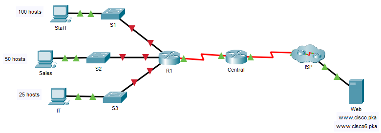

---

> **ВАЖНО**
> 
> Форма для ответов на вопросы будет доступна только при развертывании лабораторной работы 

---

## Топология

## Таблица адресации

| Устройство | Интерфейс | IP адрес/префикс     | Шлюз по умолчанию |
|------------|-----------|----------------------|-------------------|
| R1         | G0/0      |                      | —                 |
| R1         | G0/0      | 2001:db8:acad።1/64   | —                 |
| R1         | G0/0      | fe80::1              | —                 |
| R1         | G0/1      |                      | —                 |
| R1         | G0/1      | 2001:db8:acad:1።1/64 | —                 |
| R1         | G0/1      | fe80::1              | —                 |
| R1         | G0/2      |                      | —                 |
| R1         | G0/2      | 2001:db8:acad:2።1/64 | —                 |
| R1         | G0/2      | fe80::1              | —                 |
| R1         | S0/0/1    | 172.16.1.2 /30       | —                 |
| R1         | S0/0/1    | 2001:db8:2::1/64     | —                 |
| R1         | S0/0/1    | fe80::1              | —                 |
| Central    | S0/0/0    | 209.165.200.226 /30  | —                 |
| Central    | S0/0/0    | 2001:db8:1::1/64     | —                 |
| Central    | S0/0/0    | fe80::2              | —                 |
| Central    | S0/0/1    | 172.16.1.1/30        | —                 |
| Central    | S0/0/1    | 2001:db8:2።2/64      | —                 |
| Central    | S0/0/1    | fe80::2              | —                 |
| S1         | VLAN 1    |                      |                   |
| S2         | VLAN 1    |                      |                   |
| S3         | VLAN 1    |                      |                   |
| Staff      | NIC       |                      |                   |
| Staff      | NIC       | 2001:db8:acad።2/64   | fe80::1           |
| Staff      | NIC       | fe80::2              |                   |
| Sales      | NIC       |                      |                   |
| Sales      | NIC       | 2001:db8:acad:1።2/64 | fe80::1           |
| Sales      | NIC       | fe80::2              |                   |
| IT         | NIC       |                      |                   |
| IT         | NIC       | 2001:db8:acad:2።2/64 | fe80::1           |
| IT         | NIC       | fe80::2              |                   |
| Web        | NIC       | 64.100.0.3 /29       | 64.100.0.1        |
| Web        | NIC       | 2001:db8:cafe።3/64   | fe80::1           |
| Web        | NIC       | fe80::2              |                   |

## Общие сведения и сценарий

Центральный маршрутизатор Central, кластер ISP и веб-сервер Web полностью настроены. Ваша задача — создать новую схему адресации по протоколу IPv4, включающую четыре подсети, используя адрес 192.168.0.0/24. ИТ-отделу (IT) требуется 25 узлов. Отделу продаж (Sales) требуется 50 узлов. Подсеть для остальных сотрудников (Staff) должна быть рассчитана на 100 узлов. В будущем планируется добавление гостевой подсети (Guest), включающей в себя 25 узлов. Вам также нужно задать основные параметры безопасности и настроить интерфейс R1. Кроме того, вы настроите интерфейс SVI и базовые параметры безопасности на коммутаторах S1, S2 и S3.

## Инструкции

**IPv4-адресация**

-   Создайте подсети в соответствии с требованиями хостов.

    -   Staff: 100 узлов

    -   Sales: 50 узлов

    -   IT: 25 узлов

    -   Сеть Guest, которая будет добавлена позже: 25 узлов

-   Запишите назначенные IPv4-адреса в таблицу адресации.

-   Запишите подсеть для сети Guest.

**Настройка компьютера**

-   Настройте компьютеры Staff, Sales и IT, используя назначенный IPv4-адрес, маску подсети и шлюз по умолчанию в соответствии с вашей схемой адресации.

-   Назначьте адреса одноадресной рассылки IPv6 и локального канала, шлюз по умолчанию для сетей Staff, Sales и IT согласно таблице адресации.

**Настройка маршрутизатора R1**

-   Настройте имя устройства в соответствии с таблицей адресации.

-   Отключите поиск DNS.

-   Назначьте **Ciscoenpa55** в качестве зашифрованного пароля доступа к привилегированному режиму EXEC.

-   Назначьте **Ciscoconpa55** в качестве пароля консоли и включите вход по паролю.

-   Установите минимальную длину **10** символов для всех паролей.

-   Зашифруйте все открытые пароли.

-   Создайте баннер с предупреждением о запрете несанкционированного доступа к устройству.

-   Настройте все интерфейсы Gigabit Ethernet

    -   Настройте IPv4-адреса в соответствии с вашей схемой адресации.

    -   Настройте IPv6-адреса в соответствии с таблицей адресации.

-   Настройте SSH на R1:

    -   Измените имя домена на **CCNA-lab.com**

    -   Создайте ключ RSA длиной **1024** бит.

    -   Настройте линии VTY для доступа по протоколу SSH.

    -   Используйте локальные профили пользователей для аутентификации.

    -   Создайте пользователя **Admin1** с **15**-м уровнем привилегированного доступа и зашифрованным паролем **Admin1pa55**.

-   Настройте закрытие линии связи через пять минут неактивности для консоли и линий VTY.

-   Заблокируйте на три минуты всех, кто не смог войти в систему, выполнив четыре попытки в течение двух минут.

**Конфигурация коммутатора**

-   Настройте имя устройства в соответствии с таблицей адресации.

-   Присвойте виртуальному интерфейсу коммутатора (SVI) IPv4-адрес и маску подсети в соответствии с вашей схемой адресации.

-   Настройте шлюз по умолчанию.

-   Отключите поиск DNS.

-   Назначьте **Ciscoenpa55** в качестве зашифрованного пароля доступа к привилегированному режиму EXEC.

-   Назначьте **Ciscoconpa55** в качестве пароля консоли и включите вход по паролю.

-   Настройте закрытие линии связи через пять минут неактивности для консоли и линий VTY.

-   Зашифруйте все открытые пароли.

**Требования к возможности подключения**

-   Откройте веб-браузер на компьютерах Staff, Sales и IT и перейдите на сайт **www.cisco.pka**.

-   Откройте веб-браузер на компьютерах Staff, Sales и IT и перейдите на сайт **www.cisco.pka**.

-   Команда ping должна успешно отправляться со всех компьютеров на все устройства.

[Скачать файл Packet Tracer для локального запуска](./assets/17.8.2-lab.pka)
