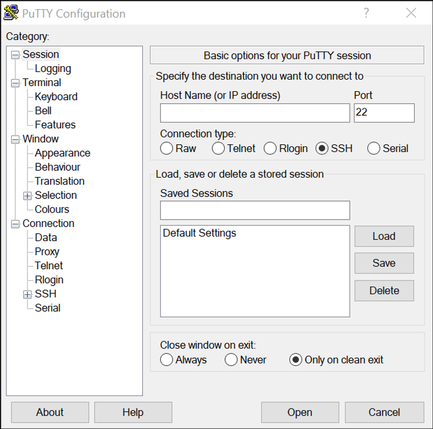

<!-- verified: agorbachev 03.05.2022 -->

<!-- 2.5.1 -->
## Файлы конфигурации

Теперь вы знаете, как выполнять базовую настройку коммутатора, включая пароли и баннерные сообщения. В этом разделе показано, как сохранить конфигурацию.

Конфигурация устройства хранится в двух системных файлах.

* **startup-config** - Это сохраненный файл конфигурации, который хранится в NVRAM. Он содержит все команды, которые будут использоваться при загрузке или перезагрузке Содержимое Флеш-накопителя не теряется при выключении питания устройства.
* **running-config** - Это файл текущей конфигурации, хранится в оперативной памяти (RAM). Он отражает текущую конфигурацию. Изменения текущей конфигурации незамедлительно влияют на работу устройства Cisco. ОЗУ — энергозависимая память. После отключения питания или перезагрузки устройства ОЗУ теряет все свое содержимое.

Команда привилегированного режима EXEC **show running-config** используется для просмотра текущей конфигурации. Как показано в примере, команда выведет список полной конфигурации, хранящейся в настоящее время в ОЗУ.

```
Sw-Floor-1# show running-config
Building configuration...
Current configuration : 1351 bytes
!
! Last configuration change at 00:01:20 UTC Mon Mar 1 1993
!
version 15.0
no service pad
service timestamps debug datetime msec
service timestamps log datetime msec
service password-encryption
!
hostname Sw-Floor-1
!
(output omitted)
```

Для просмотра файла загрузочной конфигурации используйте команду привилегированного режима EXEC **show startup-config**.

Однако при отключении питания или перезапуске устройства все не сохраненные изменения конфигурации будут потеряны. Чтобы сохранить изменения текущей конфигурации в файле загрузочной конфигурации, используйте команду привилегированного режима EXEC **copy running-config startup-config**.

<!-- 2.5.2 -->
## Изменение текущей конфигурации

Если изменения текущей конфигурации не принесли желаемых результатов и файл running-config пока не был сохранен, можно сделать следующее. Удалите  команды по отдельности или перезагрузите устройство с помощью команды привилегированного режима EXEC **reload** для загрузки из файла начальной конфигруации.

Недостатком использования команды **reload** для удаления не сохраненной текущей конфигурации является кратковременный переход устройства в автономный режим и, как следствие, простой сети.

Выполняя перезагрузку, IOS определит, что изменения текущей конфигурации не были сохранены в файл начальной конфигурации. Появится сообщение с вопросом, нужно ли сохранить изменения. Для отмены изменений введите **n** или **no**.

Если нежелательные изменения были сохранены в файл начальной конфигурации, возможно, придется удалить все конфигурации. Для этого нужно удалить начальную конфигурацию и перезапустить устройство. Загрузочную конфигурацию можно удалить с помощью команды привилегированного режима EXEC **erase startup-config**. После ввода команды появится запрос о подтверждении. Нажмите клавишу **Enter** для подтверждения.

После удаления начальной конфигурации из NVRAM перезапустите устройство, чтобы удалить файл текущей конфигурации из ОЗУ. При перезагрузке на коммутаторе применяется загрузочная конфигурация по умолчанию, с которой изначально поставлялось устройство.

<!-- 2.5.3 -->
## Видео: Изменение текущей конфигурации

Посмотрите видео, демонстрирующее сохранение файлов конфигурации коммутатора.

<iframe width="970" height="546" src="https://www.youtube.com/embed/lQQ28pdSqfg" title="YouTube video player" frameborder="0" allow="accelerometer; autoplay; clipboard-write; encrypted-media; gyroscope; picture-in-picture" allowfullscreen></iframe>

<!-- 2.5.4 -->
## Запись конфигурации в текстовый файл

Файлы конфигурации можно также сохранить и поместить в текстовый документ. Эта последовательность действий позволит в дальнейшем редактировать или повторно использовать рабочую копию файлов конфигурации.

Пусть, например, коммутатор был настроен и текущая конфигурация сохранена на устройстве.

**Шаг 1.** Откройте программу эмуляции терминала, например PuTTY или Tera Term, связанную с коммутатором.



**Шаг 2.** Активируйте ведение журнала в программе терминала и назначьте файлу журнала имя и место сохранения. На рисунке  показано, что **All session output** будут записываться в указанный файл (например, MySwitchLogs).


**Шаг 3.** Выполните  команду **show running-config** или **show startup-config** в привилегированном режиме EXEC. Текст, отображенный в окне терминала, будет помещен в выбранный файл.

```
Switch# show running-config
Building configuration...

```

**Шаг 4.** Отключите ведение журнала в программе терминала. На рисунке показано, как отключить ведение журнала сеанса, выбрав **None**.


Созданный текстовый файл можно использовать как протокол текущей конфигурации устройства. Возможно, файл придется отредактировать, прежде чем использовать его для восстановления сохраненной конфигурации на устройстве.

Чтобы восстановить файл конфигурации на устройстве, сделайте следующее.

**Шаг 1.** Войдите в режим глобальной конфигурации на устройстве.

**Шаг 2.** Скопируйте и вставьте текстовый файл в окно терминала, подключенного к коммутатору.

В интерфейсе CLI текстовое содержимое этого файла будет использоваться в качестве команд и станет текущей конфигурацией устройства. Это удобный способ настроить устройство вручную.

<!-- 2.5.5 -->
## Packet Tracer - Настройка начальных параметров коммутатора

В этом упражнении вы настроите базовые параметры коммутатора. Вы обеспечите безопасность доступа к интерфейсу командной строки (CLI) и порту консоли с помощью зашифрованных и открытых паролей. Вы также научитесь настраивать сообщения для пользователей, выполняющих вход в систему коммутатора. Эти баннеры также предупреждают пользователей о том, что несанкционированный доступ запрещен.

[Настройка начальных параметров коммутатора (pdf)](./assets/2.5.5-packet-tracer---configure-initial-switch-settings.pdf)

[Настройка начальных параметров коммутатора (pka)](./assets/2.5.5-packet-tracer---configure-initial-switch-settings.pka)

