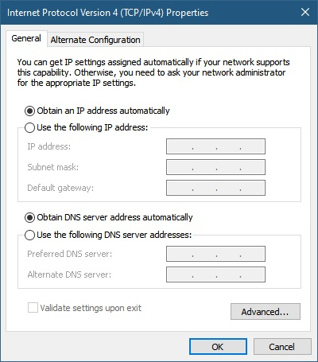

# Настройка IP-адресации

<!-- 2.7.1 -->
## Настройка IP-адресов оконечных устройств вручную
Подобно тому, как вам нужны телефонные номера ваших друзей для текстовых сообщений или звонков, конечным устройствам в вашей сети нужен IP-адрес, чтобы они могли общаться с другими устройствами в вашей сети. В этой части вы создадите основные подключения, настроив IP-адресацию на коммутаторах и ПК.

IP-адрес можно ввести в оконечное устройство вручную или получить автоматически с помощью протокола DHCP.

Чтобы вручную настроить адрес IPv4 на узле ОС Windows, откройте **Control Panel > Network Sharing Center > Change adapter settings** и выберите нужный адаптер. Затем щелкните правой кнопкой мыши и выберите **Properties** для просмотра **Local Area Connection Properties**, как показано на рисунке.

<!-- /courses/itn-dl/aeecb970-34fa-11eb-ad9a-f74babed41a6/af1f3b20-34fa-11eb-ad9a-f74babed41a6/assets/2dac3692-1c25-11ea-81a0-ffc2c49b96bc.png -->

Выделите Internet Protocol Version 4 (TCP/IPv4) и нажмите, **Properties** чтобы открыть окно **Internet Protocol Version 4 (TCP/IPv4) Properties**, показанное на рисунке. Настройте адрес IPv4 и маску подсети, а также шлюз по умолчанию.

**Примечание**: Параметры адресации IPv6 и конфигурации аналогичны IPv4.

<!-- /courses/itn-dl/aeecb970-34fa-11eb-ad9a-f74babed41a6/af1f3b20-34fa-11eb-ad9a-f74babed41a6/assets/2dac5da0-1c25-11ea-81a0-ffc2c49b96bc.jpg -->

**Примечание**: Адреса DNS-серверов — это IPv4-адреса DNS-серверов, которые используются для преобразования IP-адресов в имена доменов, например www.cisco.com.

<!-- 2.7.2-->
## Автоматическая настройка IP-адресов оконечных устройств
Для автоматической настройки IPv4-адресов компьютеры обычно используют по умолчанию DHCP. DHCP — это технология, которая используется практически во всех сетях. Чтобы понять преимущества этой технологии, можно оценить объем работы, который пришлось бы выполнять без нее.

В сети DHCP автоматически настраивает адреса IPv4 для каждого оконечного устройства в сети с включенным протоколом DHCP. Представьте, сколько времени вы бы тратили, если при каждом подключении к сети вам приходилось бы вручную вводить IPv4-адрес, маску подсети, шлюз по умолчанию и DNS-сервер. Умножьте это на количество пользователей и их устройств в организации, и вы сразу поймете преимущества DHCP. Настройка вручную также повышает вероятность ошибок в конфигурации из-за возможного совпадения IPv4-адресов разных устройств.

Как показано на рисунке, чтобы настроить DHCP на ПК с Windows, вам нужно только выбрать **Obtain an IP address automatically** и **Obtain DNS server address automatically**. ПК выполнит поиск DHCP-сервера и получит настройки адреса, необходимые для связи по сети.

**Примечание**: IPv6 использует DHCPv6 и SLAAC (Stateless Address Autoconfiguration) для динамического распределения адресов.

<!-- /courses/itn-dl/aeecb970-34fa-11eb-ad9a-f74babed41a6/af1f3b20-34fa-11eb-ad9a-f74babed41a6/assets/2dac84b0-1c25-11ea-81a0-ffc2c49b96bc.jpg -->

<!-- 2.7.3 -->
<!-- Проверка синтаксиса - Проверка конфигурации IP ПК с Windows -->
<!-- Задание с консолью, пока пропуск -->

<!-- 2.7.4 -->
## Настройка виртуального интерфейса коммутатора (SVI)
Для удаленного доступа к коммутатору на интерфейсе (SVI) нужно настроить IP-адрес и маску подсети. Чтобы настроить SVI на коммутаторе, используйте команду глобальной конфигурации **interface vlan 1**. Vlan 1 — это не реальный физический интерфейс, а виртуальный. Затем назначьте адрес IPv4 с помощью команды конфигурации интерфейса **ip address** *ip-address subnet-mask*. Наконец, включите виртуальный интерфейс с помощью команды конфигурации интерфейса **no shutdown**.

После настройки этих команд все элементы IPv4 в коммутаторе будут готовы для передачи данных по сети.

    Sw-Floor-1# configure terminal
    Sw-Floor-1(config)# interface vlan 1
    Sw-Floor-1(config-if)# ip address 192.168.1.20 255.255.255.0
    Sw-Floor-1(config-if)# no shutdown
    Sw-Floor-1(config-if)# exit
    Sw-Floor-1(config)# ip default-gateway 192.168.1.1

<!-- 2.7.5 -->
<!-- Инструмент проверки синтаксиса. Настройка виртуального интерфейса коммутатора -->
<!-- Задание с консолью. Пока пропуск -->

<!-- 2.7.6 -->
## Packet Tracer. Создание основных подключений
В этом упражнении вы сначала настроите основные параметры коммутатора. Затем вы создадите основные подключения, настроив IP-адреса на коммутаторах и ПК. Завершив настройку IP-адресации, вы будете использовать различные команды **show**, чтобы проверить настройки, а также команду **ping** для проверки основных подключений между устройствами.

[Создание основных подключений](./assets/2.7.6-packet-tracer---implement-basic-connectivity_ru-RU.pdf)

[Скачать файл для Packet Tracer](./assets/2.7.6-packet-tracer---implement-basic-connectivity_ru-RU.pka)
