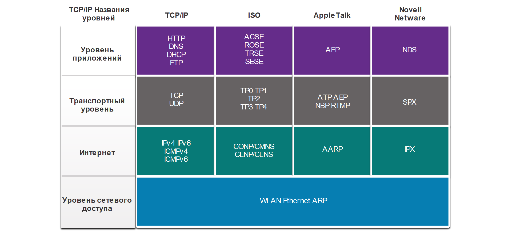
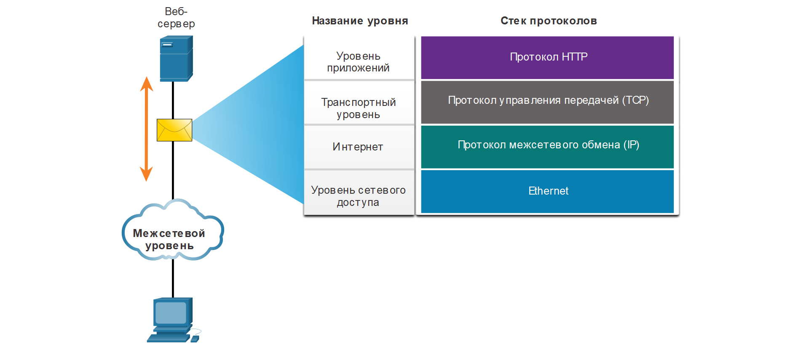
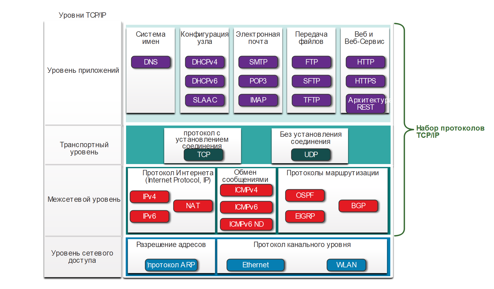

<!-- verified: agorbachev 03.05.2022 -->

<!-- 3.3.1 -->
## Стеки сетевых протоколов

Во многих случаях протоколы должны работать с другими протоколами. Протокольные пакеты предназначены для бесперебойной работы друг с другом.

Группа взаимосвязанных протоколов, необходимых для выполнения коммуникаций, называется набором протоколов.

Один из лучших способов представить, как протоколы взаимодействуют в одном наборе, — рассмотреть взаимодействие в виде стека. Стек протоколов показывает, как отдельные протоколы реализованы в одном наборе. Протоколы рассматриваются с точки зрения уровней. Причем каждый более высокий уровень обслуживания зависит от функций, определенных протоколами более низких уровней. Нижние уровни стека отвечают за перемещение данных по сети и предоставление сервисов верхним уровням, которые отвечают за содержание пересылаемых сообщений.

Как показано на рисунке, мы можем использовать уровни для описания действий, происходящих в нашем примере личного общения. На нижнем, физическом уровне есть два человека, каждый из которых может произнести слова вслух. В середине находится уровень правил, который определяет требования общения, в том числе, что должен быть выбран общий язык. Вверху находится уровень контента, и именно здесь на самом деле говорится о контенте общения.

<!-- /courses/itn-dl/aeece080-34fa-11eb-ad9a-f74babed41a6/af1f6234-34fa-11eb-ad9a-f74babed41a6/assets/2dbc1510-1c25-11ea-81a0-ffc2c49b96bc.svg -->

Наборы протоколов — это наборы правил, применяющихся вместе для решения проблемы.

<!-- 3.3.2 -->
## Эволюция протоколов

Набор протоколов представляет собой множество протоколов, которые используются вместе для предоставления комплексных сетевых сервисов. Начиная с 1970-х годов было несколько различных пакетов протоколов, некоторые из которых были разработаны организацией по стандартизации, а другие разработаны различными поставщиками.

Во время эволюции сетевых коммуникаций и Интернета существовало несколько конкурирующих пакетов протоколов, как показано на рисунке.

<!-- /courses/itn-dl/aeece080-34fa-11eb-ad9a-f74babed41a6/af1f6234-34fa-11eb-ad9a-f74babed41a6/assets/2dbc8a40-1c25-11ea-81a0-ffc2c49b96bc.svg -->

* **Internet Protocol Suite или TCP/IP** - это наиболее распространенный и актуальный набор протоколов, используемый сегодня. Пакет протоколов TCP/IP представляет собой открытый стандартный набор протоколов, поддерживаемый рабочей группой Internet Engineering Task Force (IETF).
* **Протоколы взаимодействия открытых систем (OSI)** - это семейство протоколов, разработанных совместно в 1977 году Международной организацией по стандартизации (ИСО) и Международным союзом электросвязи (МСЭ). Протокол OSI также включал семиуровневую модель, называемую эталонной моделью OSI. Эталонная модель OSI классифицирует функции ее протоколов. Сегодня OSI в основном известен своей многоуровневой моделью. Протоколы OSI в основном были заменены TCP/IP.
* **AppleTalk** - Краткосрочный фирменный пакет протоколов, выпущенный компанией Apple Inc. в 1985 году для устройств Apple. В 1995 году Apple приняла использование TCP/IP вместо AppleTalk.
* **Novell NetWare** - недолговечный фирменный пакет протоколов и сетевой операционной системы, разработанный компанией Novell Inc. в 1983 году с использованием сетевого протокола IPX. В 1995 году компания «Новелл» приняла использование TCP/IP вместо IPX.

<!-- 3.3.3 -->
## Пример протокола TCP/IP

Протоколы TCP/IP работают на транспортном, сетевом уровнях и уровне приложений. На уровне доступа к сети нет протоколов TCP/IP. Наиболее распространенными протоколами LAN уровня доступа к сети являются протоколы Ethernet и WLAN (беспроводная локальная сеть). Протоколы уровня сетевого доступа обеспечивают доставку IP-пакетов по физическому средству подключения.

На рисунке показан пример трех протоколов TCP/IP, используемых для отправки пакетов между веб-браузером хоста и веб-сервером. HTTP, TCP и IP используются протоколы TCP/IP. На уровне доступа к сети в примере используется Ethernet. Однако это также может быть беспроводной стандарт, такой как WLAN или сотовая связь.

<!-- /courses/itn-dl/aeece080-34fa-11eb-ad9a-f74babed41a6/af1f6234-34fa-11eb-ad9a-f74babed41a6/assets/2dbcff73-1c25-11ea-81a0-ffc2c49b96bc.svg -->

<!-- 3.3.4 -->
## Набор протоколов TCP/IP

Сегодня пакет протоколов TCP/IP включает в себя множество протоколов и продолжает развиваться для поддержки новых служб. Наиболее распространенные показаны на рисунке.

<!-- /courses/itn-dl/aeece080-34fa-11eb-ad9a-f74babed41a6/af1f6234-34fa-11eb-ad9a-f74babed41a6/assets/2dbd74a1-1c25-11ea-81a0-ffc2c49b96bc.svg -->

TCP/IP - это набор протоколов, используемый в Интернете и сетях сегодняшнего дня. TCP/IP имеет два важных аспекта для поставщиков и производителей:

* **Открытый стандартный набор протоколов** - это означает, что он свободно доступен для общественности и может быть использован любым поставщиком на их оборудовании или в их программном обеспечении.
* **Набор протоколов на основе стандартов**  - это означает, что он был одобрен сетевой индустрией и одобрен организацией по стандартизации. Использование стандартов в разработке и реализации протоколов гарантирует, что продукты от разных производителей будет успешно взаимодействовать между собой.

### Уровень приложений

**Служба разрешения доменных имен (DNS)**

* **DNS** преобразует имена доменов, например cisco.com, в адреса IPv4 и IPv6.

**Автоматическая конфигурация хостов**

* **DHCPv4**  -  протокол динамической настройки узлов. Сервер DHCPv4 динамически назначает информацию адресации IPv4 клиентам DHCPv4 при запуске и позволяет повторно использовать адреса, когда они больше не нужны.
* **DHCPv6**  - протокол динамической настройки узлов для протокола IPv6. DHCPv6 похож на DHCPv4. Сервер DHCPv6 динамически назначает информацию адресации IPv6 клиентам DHCPv6 при запуске.
* **SLAAC**  - Автоматическая конфигурация адреса без сохранения состояния (Stateless Address Autoconfiguration, SLAAC) Метод, позволяющий устройству получать информацию об адресации IPv6 без использования сервера DHCPv6.

**Электронная почта**

* **SMTP**  - простой протокол пересылки почты. SMTP ― упрощенный протокол передачи электронной почты, с помощью которого клиенты отправляют электронную почту на почтовый сервер, а серверы отправляют электронную почту на другие серверы.
* **POP3** - Протокол почтового отделения (Post Office Protocol version 3, POP3) Позволяет клиентам получать электронную почту с почтового сервера и загружать ее в локальное почтовое приложение клиента.  
* **IMAP**  - протокол доступа к сообщениям в Интернете (IMAP) Позволяет клиентам получать доступ к электронным сообщениям, которые хранятся на почтовом сервере

**Передача файлов**

* **FTP**  -  Протокол передачи файлов Устанавливает правила, которые позволяют пользователю получать доступ к файлам на других узлах и обмениваться ими по сети FTP - надежный протокол доставки файлов с подтверждением и установлением соединения
* **SFTP**  - SSH протокол передачи файлов. Протокол передачи файлов поверх SSH (SFTP) — SFTP является расширением протокола Secure Shell (SSH) и может использоваться для создания защищенного сеанса передачи файлов. SSH — это метод безопасного удаленного входа, который обычно используется для доступа к командной строке устройства. 
* **TFTP**  -  простейший протокол передачи файлов Простой протокол передачи файлов без подключения с максимальными усилиями, неподтвержденными доставкой файлов. Он использует меньше накладных расходов, чем FTP

**Гипертекстовая разметка и передача репрезентативного состояния** 

* **HTTP**  — Hypertext Transfer Protocol (протокол передачи гипертекста) Задает правила обмена в Интернете текстом, графическими изображениями, звуковыми, видео и другими файлами мультимедиа по Интернету.
* **HTTPS**  - Защищенный HTTP (HTTPS) Безопасная форма HTTP, которая шифрует данные, которые обмениваются через Интернет. 
* **REST** - Representational State Transfer.  Веб-служба, использующая интерфейсы прикладного программирования (API) и HTTP-запросы для создания веб-приложений.

### Транспортный уровень

* **TCP**  - Протокол управления передачей (TCP) обеспечивает устойчивое взаимодействие между процессами, работающими на разных хостах, и обеспечивает надежную передачу данных с подтверждением успешной доставки.

* **UDP**  - Протокол пользовательских датаграмм (UDP) Позволяет процессу, запущенному на одном узле, отправлять пакеты процессу, запущенному на другом узле. Не подтверждает успешную доставку датаграммы.

### Межсетевой уровень

**Протокол Интернета (Internet Protocol, IР)**

* **IPv4**  - Интернет-протокол версии 4 (IPv4) Получает сегменты сообщений из транспортного уровня, упаковывает сообщения в пакеты и направляет пакеты для сквозной доставки по сети. IPv4 использует 32-разрядный адрес.
* **IPv6**  - Интернет-протокол версии 6 (IPv6) Подобен IPv4, но использует 128-битный адрес.
* **NAT**  -  преобразование сетевых адресов. Преобразует IP-адреса частной сети в глобальные уникальные публичные IP-адреса

**Обмен сообщениями**

* **ICMPv4**  - Протокол управляющих сообщений в Интернете (Internet Control Message Protocol, ICMP) Обеспечивает обратную связь от хоста назначения к исходному хосту, чтобы сообщать об ошибках доставки пакетов
* **ICMPv6** - ICMP для IPv6. Аналогичная функциональность ICMPv4, но используется для пакетов IPv6.
* **ICMPv6 ND**  - ICMPv6 протокол обнаружения соседей. Включает четыре сообщения протокола, которые используются для разрешения адресов и обнаружения повторяющихся адресов.

**Протоколы маршрутизации**

* **OSPF**  — открытый протокол предпочтения кратчайшего пути Протокол маршрутизации состояния связи, который использует иерархическую структуру на основе областей. Это протокол внутренней маршрутизации, являющийся открытым стандартом.
* **EIGRP**  — усовершенствованный внутренний протокол маршрутизации шлюзов EIGRP ― это усовершенствованный внутренний протокол маршрутизации шлюзов, разработанный компанией Cisco, который использует составной показатель, строящийся на пропускной способности, задержке, нагрузке и надежности.
* **BGP**  - Протокол пограничного шлюза BGP Открытый стандартный протокол маршрутизации внешнего шлюза, используемый между Интернет-провайдерами (ISP). Протокол BGP также обеспечивает обмен данными маршрутизации между интернет-провайдерами и их крупными частными клиентами.

### Уровень сетевого доступа

**Разрешение адресов**

* **ARP**  - Протокол разрешения адресов (ARP) Обеспечивает динамическое сопоставление между IP-адресами и аппаратными адресами

Протокол канального уровня

* **Ethernet**  определяет правила для стандартов прокладки кабелей и обмена сигналами на уровне доступа к сети.
* **WLAN**  - беспроводная локальная сеть (WLAN) Определяет правила беспроводной сигнализации на радиочастотах 2,4 ГГц и 5 ГГц.

<!-- 3.3.5 -->
## Обмен данными TCP/IP

На анимации ниже показан процесс инкапсуляции в рамках небольшой сети с веб-сервером и веб-клиентом. В данном процессе задействованы компоненты, которые составляют сообщение, такие как Ethernet кадр и IP-пакет, сегмент TCP и пользовательские данные. 

* Веб-сервер подготавливает страницу на языке гипертекстовой разметки (HTML) в качестве данных для отправки. 
* Заголовок протокола HTTP уровня приложений добавляется в начало данных в формате HTML. 
* Заголовок содержит различные данные, включая версию HTTP, которую использует сервер, а также код состояния, указывающий, что у него имеется информация для веб-клиента. 
* Протокол уровня приложений HTTP передает данные веб-страницы в формате HTML на транспортный уровень TCP. 
* Протокол транспортного уровня добавляет дополнительную информацию к данным HTTP для управления обменом информацией между веб-сервером и веб-клиентом. 
* Информация IP добавляется к информации TCP. 
* IP назначает соответствующие IP-адреса источника и места назначения. Такая информация называется IP-пакетом. 
* Протокол Ethernet добавляет информацию в начало и конец IP-пакета, чтобы создать кадр. 
* Затем кадр преобразуется в строку бинарных битов, отправляемых по сетевому пути веб-клиенту.

Следующая анимация показывает процесс приема веб-страницы и декапсуляции веб-страницы для отображения в веб-браузере клиента.

* Клиент получает поток битов с сервера. 
* Клиент принимает двоичную строку битов и преобразует ее в кадр Ethernet. 
* Кадр содержит заголовок Ethernet, IP-пакет, сегмент TCP и данные. 
* При обработке кадра заголовки протоколов удаляются в обратном порядке. Сначала обрабатывается и удаляется информация Ethernet, вслед за ней информация IP-протокола, затем TCP и, наконец, HTTP. 
* Затем данные веб-страницы передаются веб-браузеру клиента.

<!-- 3.3.6 -->
<!-- quiz -->

