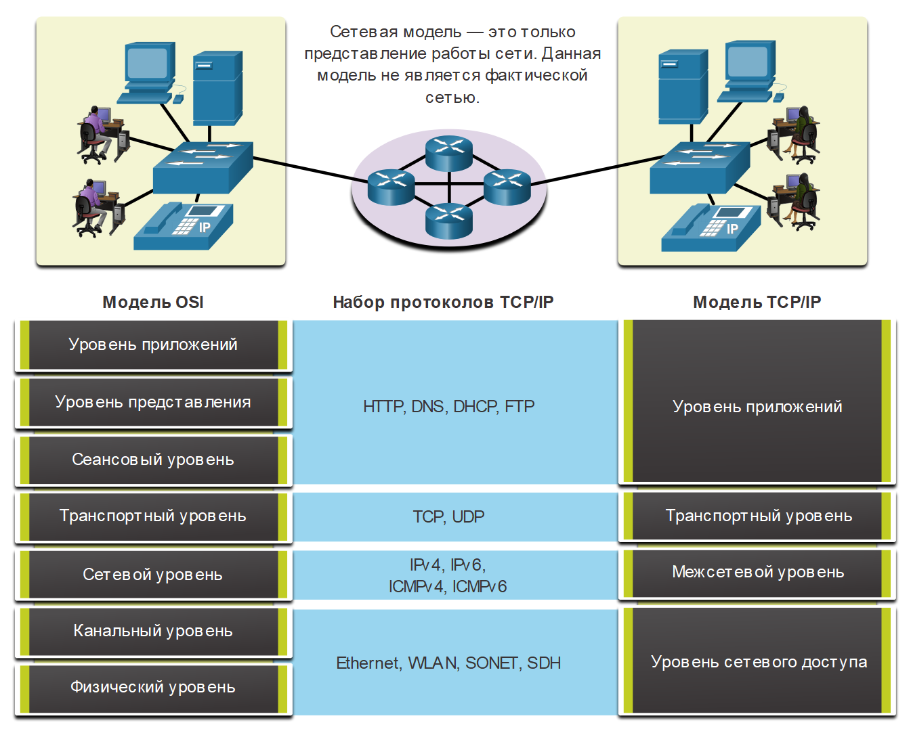
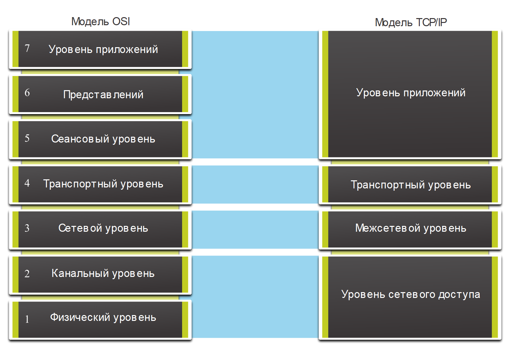

<!-- verified: agorbachev 03.05.2022 -->

<!-- 3.5.1 -->
## Преимущества использования многоуровневой модели

На самом деле вы не можете наблюдать, как реальные пакеты перемещаются по реальной сети, как вы можете наблюдать, как компоненты автомобиля собираются вместе на конвейере.  В таких ситуациях может помочь модель.

Сложные понятия, такие как функционирование сети, трудно объяснить и понять. По этой причине многоуровневая модель используется для модуляции операций сети в управляемые уровни.

Многоуровневая модель для описания сетевых протоколов и операций обеспечивает следующие преимущества.

- Упрощение разработки протоколов, поскольку протоколы, работающие на определенном уровне, определяют формат обрабатываемых данных и интерфейс верхних и нижних уровней.
- Стимулирование конкуренции, так как продукты разных поставщиков могут взаимодействовать друг с другом.
- Предотвращение влияния изменений технологий или функций одного уровня на другие уровни (верхние и нижние).
- Общий язык для описания функций сетевого взаимодействия.

Как показано на рисунке, существуют две многоуровневые модели, которые используются для описания сетевых операций:

- Эталонная модель взаимодействия открытых систем (OSI)
- Эталонная модель TCP/IP

<!-- /courses/itn-dl/aeece080-34fa-11eb-ad9a-f74babed41a6/af1fb050-34fa-11eb-ad9a-f74babed41a6/assets/2dc256a5-1c25-11ea-81a0-ffc2c49b96bc.svg -->

<!-- 3.5.2 -->
## Эталонная модель OSI

Модель OSI определяет широкий список функций и сервисов, реализуемых на каждом уровне. Эталонная модель обеспечивает единообразное применение всех сетевых протоколов и сервисов, описывая то, что необходимо сделать на определенном уровне, но не предписывая конкретные способы выполнения.

Кроме того, она описывает взаимодействие каждого уровня с вышестоящими и нижестоящими уровнями. Рассматриваемые в рамках этого курса протоколы TCP/IP соотносятся как с моделью OSI, так и с моделью TCP/IP. В таблице приведены подробные сведения о каждом уровне модели. Функциональные возможности каждого уровня и связь между уровнями станут более понятны по мере подробного рассмотрения протоколов в этом курсе.

| **Уровни модели OSI** | **Описание** |
| --- | --- |
| **7 - Прикладной уровень** | Уровень приложений содержит протоколы для обмена данными между процессами. |
| **6 - Уровень представления** | Уровень представления обеспечивает общее представление данных, передаваемых между службами уровня приложений. |
| **5 - Сеансовый уровень** | Сеансовый уровень предоставляет услуги уровню представления для организации его диалога и управления обменом данными. |
| **4 - Транспортный уровень** | Транспортный уровень определяет службы для сегментирования, передачи и повторной сборки данных для индивидуальной связи между конечными устройствами. |
| **3 - Сетевой уровень** | Сетевой уровень предоставляет функции для обмена отдельными частями данных по сети между указанными оконечными устройствами. |
| **2 - Канальный уровень** | Протоколы канального уровня описывают способы обмена кадрами данных при обмене данными между устройствами по общей среде передачи данных. |
| **1 - Физический уровень** | Протоколы физического уровня описывают механические, электрические, функциональные и процедурные средства для активации, поддержания и деактивации физических соединений для передачи бит к и от сетевого устройства. |

**Примечание**: Если уровни модели TCP/IP обозначаются только по названию, то 7 уровней модели OSI часто обозначаются по номеру. Например, физический уровень упоминается как уровень 1 модели OSI, уровень канала передачи данных - уровень 2 и так далее.

<!-- 3.5.3 -->
## Модель протоколов TCP/IP

Протокольная модель сетевого взаимодействия TCP/IP была создана в начале 70-х годов и иногда называется моделью сети Интернет. Протокольная модель соответствует структуре определенного набора протоколов. TCP/IP является протокольной моделью, поскольку в ней описываются функции, которые выполняются на каждом уровне протоколов, входящих в набор протоколов TCP/IP. TCP/IP также используется в качестве эталонной модели. В таблице приведены сведения о каждом уровне модели OSI.

| **Уровни модели TCP/IP** | **Описание** |
| --- | --- |
| **4 - Прикладной уровень** | Представляет данные пользователю, а также обеспечивает кодирование и управление диалоговыми окнами. |
| **3 - Транспортный уровень** | Поддерживает связь между различными устройствами в разных сетях. |
| **2 - Межсетевой уровень** | Определяет наилучший путь через сеть. |
| **1 - Уровень сетевого доступа** | Управляет устройствами и средcтвами подключения, формирующими сеть. |

Стандарт протоколов TCP/IP рассматривается на общедоступном форуме и определяется в общедоступных документах RFC. RFC создан сетевыми инженерами и отправляется другим членам IETF для комментариев.

<!-- 3.5.4 -->
## Сравнение моделей OSI и TCP/IP

Набор протоколов TCP/IP может быть описан с точки зрения эталонной модели OSI. В модели OSI уровень доступа к сети и прикладной уровень модели TCP/IP дополнительно подразделяются для описания отдельных функций, которые реализуются на этих уровнях.

На уровне доступа к сети набор протоколов TCP/IP не определяет список протоколов, используемых для передачи по физическому средству подключения; он описывает только передачу с сетевого уровня физическим сетевым протоколам. Уровни 1 и 2 модели OSI описывают процедуры доступа к средствам подключения и физическим средствам отправки данных по сети.

<!-- /courses/itn-dl/aeece080-34fa-11eb-ad9a-f74babed41a6/af1fb050-34fa-11eb-ad9a-f74babed41a6/assets/2dc319f2-1c25-11ea-81a0-ffc2c49b96bc.svg -->

Основные сходства касаются транспортного и сетевого уровней; однако эти две модели по разному работают с вышестоящими и нижестоящими уровнями.

* Уровень 3 модели OSI, или сетевой уровень, соответствует межсетевому уровню модели TCP/IP. Этот уровень описывает протоколы, определяющие пути передачи данных в сети.
* Уровень 4 модели OSI, или транспортный уровень, соответствует транспортному уровню модели TCP/IP. Этот уровень описывает общие сервисы и функции, которые обеспечивают упорядоченную и надежную доставку данных от источника до места назначения.
* Прикладной уровень TCP/IP включает в себя ряд протоколов, которые поддерживают определенные функции для работы разнообразных приложений конечных пользователей. Уровни 5, 6 и 7 модели OSI используются в качестве эталонов для разработчиков и поставщиков прикладного программного обеспечения для создания приложений, работающих в сетях.
* Обе модели (TCP/IP и OSI) широко применяются в отношении протоколов различных уровней. Так как модель OSI разделяет канальный и физический уровни, именно она используется для этих уровней.

<!-- 3.5.5 -->
## Packet Tracer: изучение моделей TCP/IP и OSI в действии

Данное упражнение по моделированию — первый шаг на пути к пониманию принципов работы пакета проколов TCP/IP и его взаимосвязи с моделью OSI. Режим моделирования позволяет просматривать содержимое пересылаемых по сети данных на каждом из уровней.

По мере продвижения данных по сети они разбиваются на более мелкие фрагменты и идентифицируются таким образом, чтобы их можно было воссоединить по прибытию в пункт назначения. Каждый фрагмент получает собственное имя (единица данных протокола — PDU) и ассоциируется с конкретным уровнем моделей TCP/IP и OSI. Назначенное имя называется блоком данных протокола (PDU). Режим моделирования программы Packet Tracer позволяет просматривать все уровни и относящиеся к ним PDU. Ниже описана последовательность шагов пользователя для запроса веб-страницы с веб-сервера с помощью установленного на клиентском ПК веб-браузера.

Хотя большая часть показанной на экране информации будет подробнее рассмотрена далее, это даст вам возможность ознакомиться с возможностями программы Packet Tracer, а также наглядно рассмотреть процесс инкапсуляции.

[Изучение моделей TCP/IP и OSI в действии (pdf)](./assets/3.5.5-packet-tracer---investigate-the-tcp-ip-and-osi-models-in-action.pdf)

[Изучение моделей TCP/IP и OSI в действии (pka)](./assets/3.5.5-packet-tracer---investigate-the-tcp-ip-and-osi-models-in-action.pka)

