# Двоичная система счисления

<!-- 5.1.1 -->
## Двоичные адреса и адреса IPv4

Адреса IPv4 начинаются как двоичные, последовательность только из 1 и 0. Управлять ими сложно, поэтому сетевые администраторы должны преобразовать их в десятичные. В этом разделе показано несколько способов сделать это.

Двоичная система счисления состоит из цифр 0 и 1, называемых битами. Десятичная система счисления состоит из 10 цифр: от 0 до 9.

Понимание двоичной системы важно для нас, поскольку узлы, серверы и сетевые устройства используют именно двоичную адресацию. В частности, для идентификации друг друга они используют двоичные IPv4-адреса (как показано на рис. 1).

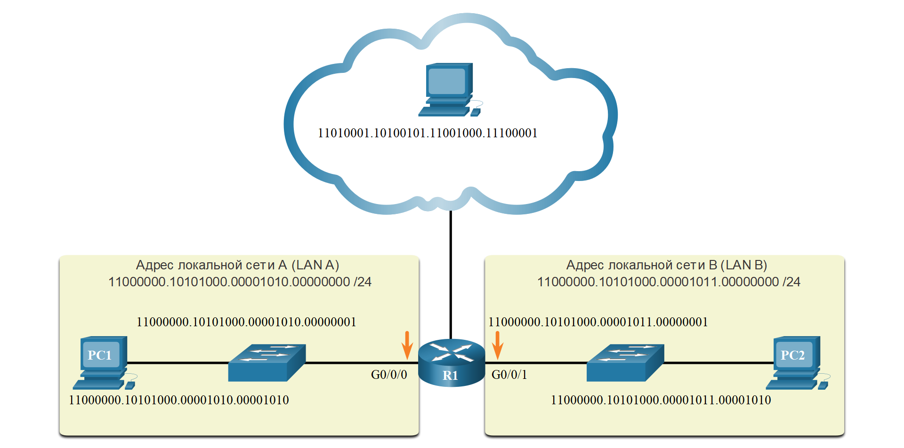
<!-- /courses/itn-dl/aeece084-34fa-11eb-ad9a-f74babed41a6/af209ab4-34fa-11eb-ad9a-f74babed41a6/assets/2de2d6f3-1c25-11ea-81a0-ffc2c49b96bc.svg -->

На рисунке представлен центральный маршрутизатор с двумя локальными сетями, подключенными напрямую, и одной глобальной сетью, подключенной к облаку. В каждой локальной сети есть коммутатор и ПК.  WAN имеет один компьютер.
Каждое устройство имеет адрес IPv4, который находится в точечной двоичной записи вместо точечной десятичной записи.

Каждый адрес представляет собой строку из 32 бит, разделенную на 4 части, называемые октетами. Каждый октет содержит 8 бит (или 1 байт), разделенные точкой. Например, узлу PC1 на рисунке назначен IPv4-адрес 11000000.10101000.00001010.00001010. Адресом его шлюза по умолчанию будет соответствующий адрес интерфейса Gigabit Ethernet interface маршрутизатора R1: 11000000.10101000.00001010.00000001.

Двоичный код хорошо работает с хостами и сетевыми устройствами. Однако людям очень сложно работать с ним.

Для простоты использования IPv4-адреса обычно выражаются в десятичном формате с точкой-разделителем. Узлу PC1 назначен IPv4-адрес 192.168.10.10; адрес шлюза по умолчанию — 192.168.10.1, как показано на рисунке.

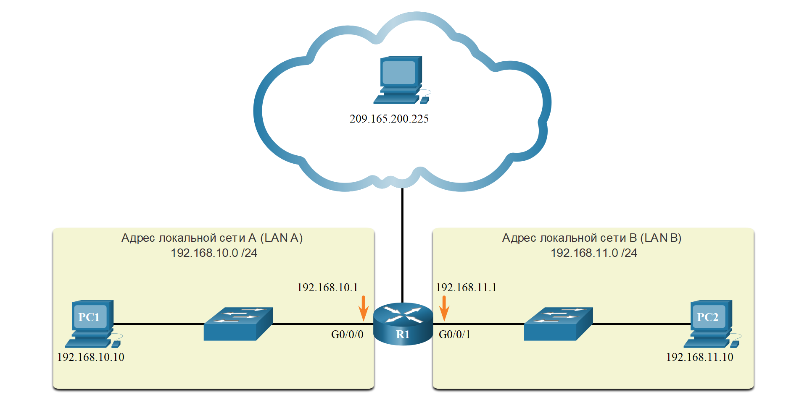
<!-- /courses/itn-dl/aeece084-34fa-11eb-ad9a-f74babed41a6/af209ab4-34fa-11eb-ad9a-f74babed41a6/assets/2de2fe03-1c25-11ea-81a0-ffc2c49b96bc.svg -->

Эта схема аналогична первому примеру, однако вместо IPv4 адресации в двоичном виде, она представлена в точечной десятичной нотации. 

Для четкого понимания адресации сети необходимо знать принципы двоичной адресации и получить практические навыки преобразования IPv4-адресов из двоичной системы счисления в десятичную с точкой разделителем. В этом разделе вы узнаете, как переводить числа из двоичной в десятичную систему счисления.

<!-- 5.1.2 -->
## Видео. Перевод чисел из двоичной в десятичную систему счисления

Нажмите «Воспроизведение», чтобы увидеть, как двоичный адрес преобразуется в десятичный.

<video width="768" height="432" controls>
  <source src="./assets/5.1.2.mp4" type='video/mp4; codecs="avc1.42E01E, mp4a.40.2"'>
</video>

<!-- 5.1.3 -->
## Двоичная позиционная система счисления

Чтобы переводить числа из двоичной в десятичную систему счисления, нужно понимать позиционную систему счисления. Принцип позиционной системы счисления заключается в том, что значение цифры определяется ее «позицией» в последовательности цифр. Вам уже знакома наиболее распространенная система счисления — десятичная (с основанием 10).

В таблице показана суть десятичной системы счисления с точкой-разделителем.

| Основание | 10 | 10 | 10 | 10 |
| --- | --- | --- | --- | --- |
| Позиция в числе | 3 | 2 | 1 | 0 |
| Вычисление | (103) | (102) | (101) | (100) |
| Позиционное значение | 1000 | 100 | 10 | 1 |

**Примечание:** n0 это  = 1.

Следующие маркеры описывают каждую строку таблицы.

- Строка 1, Основание - это база числа. Десятичная система счисления имеет основание 10.
2-я строка определяет позицию десятичного числа (справа налево): 0 (1-я позиция), 1 (2-я позиция), 2 (3-я позиция), 3 (4-я позиция). Эти числа также представляют экспоненциальное значение, которое будет использоваться для расчета позиционного значения (4-я строка).
В 3-й строке рассчитывается позиционное значение путем возведения основания в степень, равную экспоненциальному значению его позиции строки 2.

- Позиционное значение строки 4 представляет единицы тысячи, сотни, десятки и единицы.

Чтобы воспользоваться позиционной системой, сопоставьте заданное число с его позиционным значением. В примере на рис. 2 показана позиционная запись десятичного числа 1234.

|  | Тысячи | Сотни | Десятки | Единицы |
| --- | --- | --- | --- | --- |
| Позиционное значение | 1000 | 100 | 10 | 1 |
| Десятичное число (1234) | 1 | 2 | 3 | 4 |
| Вычислите | 1 x 1000 | 2 x 100 | 3 x 10 | 4 x 1 |
| Складываем их... | 1000 | + 200 | + 30 | + 4 |
| **Результат** | **1234** |

Напротив, двоичная позиционная запись работает так, как описано в таблице.

| Основание | 2 | 2 | 2 | 2 | 2 | 2 | 2 | 2 |
| --- | --- | --- | --- | --- | --- | --- | --- | --- |
| Позиция в числе | 7 | 6 | 5 | 4 | 3 | 2 | 1 | 0 |
| Вычислите | (27) | (26) | (25) | (24) | (23) | (22) | (21) | (20) |
| Позиционное значение | 128 | 64 | 32 | 16 | 8 | 4 | 2 | 1 |

**Примечание:** n0 это  = 1.

Следующие маркеры описывают каждую строку таблицы.

- Строка 1, Основание - это база числа. Двоичная система счисления имеет основание 2.
2-я строка определяет позицию двоичного числа (справа налево): 0 (1-я позиция), 1 (2-я позиция), 2 (3-я позиция), 3 (4-я позиция). Эти числа также представляют экспоненциальное значение, которое будет использоваться для расчета позиционного значения (4-я строка).
В 3-й строке рассчитывается позиционное значение путем возведения основания в степень, равную экспоненциальному значению его позиции строки 2.

- Позиционное значение строки 4 представляет единицы , двойки, четверки, восьмерки и т.д.

На примере, в таблице, показано соответствие двоичного числа 11000000 десятичному числу 192. Если бы двоичное число составляло 10101000, то ему бы соответствовало десятичное число 168.

| Позиционное значение | 128 | 64 | 32 | 16 | 8 | 4 | 2 | 1 |
| --- | --- | --- | --- | --- | --- | --- | --- | --- |
| Двоичное число (11000000) | 1 | 1 | 0 | 0 | 0 | 0 | 0 | 0 |
| Вычислите | 1 x 128 | 1 x 64 | 0 x 32 | 0 x 16 | 0 x 8 | 0 x 4 | 0 x 2 | 0 x 1 |
| Складываем их .. | 128 | + 64 | + 0 | + 0 | + 0 | + 0 | + 0 | + 0 |
| **Результат** | **192** |

<!-- 5.1.4 -->
<!-- quiz -->

<!-- 5.1.5 -->
## Конвертировать двоичный в десятичные

Для преобразования двоичного IPv4-адреса в десятичный эквивалент с точкой-разделителем, разделите IPv4-адрес на четыре 8-битных октета. Затем занесите двоичное позиционное значение в качестве двоичного числа первого октета и выполните соответствующее вычисление.

Например, предположим, что IPv4-адрес узла — 11000000.10101000.00001011.00001010. Для преобразования двоичного адреса в десятичный формат, начните с первого октета, как показано в таблице. Введите 8-битное двоичное число в качестве позиционного значения строки 1, а затем выполните вычисление, результатом которого будет десятичное число 192. Это число составит первый октет десятичной записи с точкой-разделителем.

| Позиционное значение | 128 | 64 | 32 | 16 | 8 | 4 | 2 | 1 |
| --- | --- | --- | --- | --- | --- | --- | --- | --- |
| Двоичное число (11000000) | 1 | 1 | 0 | 0 | 0 | 0 | 0 | 0 |
| Вычислите | 128 | 64 | 32 | 16 | 8 | 4 | 2 | 1 |
| Складываем | 128 | + 64 | + 0 | + 0 | + 0 | + 0 | + 0 | + 0 |
| **Результат** | **192** |

Затем преобразуйте второй октет 10101000, как показано в таблице. Итоговое десятичное значение — 168; это будет второй октет.

| Позиционное значение | 128 | 64 | 32 | 16 | 8 | 4 | 2 | 1 |
| --- | --- | --- | --- | --- | --- | --- | --- | --- |
| Двоичное число (10101000) | 1 | 0 | 1 | 0 | 1 | 0 | 0 | 0 |
| Вычислите | 128 | 64 | 32 | 16 | 8 | 4 | 2 | 1 |
| Складываем | 128 | + 0 | + 32 | + 0 | + 8 | + 0 | + 0 | + 0 |
| **Результат** | **168** |

Преобразовать третий октет 00001011, как показано в таблице.

| Позиционное значение | 128 | 64 | 32 | 16 | 8 | 4 | 2 | 1 |
| --- | --- | --- | --- | --- | --- | --- | --- | --- |
| Двоичное число (00001011) | 0 | 0 | 0 | 0 | 1 | 0 | 1 | 1 |
| Вычислите | 128 | 64 | 32 | 16 | 8 | 4 | 2 | 1 |
| Складываем | 0 | + 0 | + 0 | + 0 | + 8 | + 0 | + 2 | + 1 |
| **Результат** | **11** |

Преобразовать четвертый октет 00001010, как показано в таблице. Это завершает IP-адрес и производит **192.168.11.10**.

| Позиционное значение | 128 | 64 | 32 | 16 | 8 | 4 | 2 | 1 |
| --- | --- | --- | --- | --- | --- | --- | --- | --- |
| Двоичное число (00001010) | 0 | 0 | 0 | 0 | 1 | 0 | 1 | 0 |
| Вычислите | 128 | 64 | 32 | 16 | 8 | 4 | 2 | 1 |
| Складываем | 0 | + 0 | + 0 | + 0 | + 8 | + 0 | + 2 | + 0 |
| **Результат** | **10** |

<!-- 5.1.6 -->
<!-- ## Упражнение - преобразование двоичного числа в десятичное -->

<!-- 5.1.7 -->
## Преобразование десятичных чисел в двоичный формат

Необходимо также понимать, как преобразовывать IPv4-адреса в десятичном формате с точкой-разделителем в двоичный формат. Полезным инструментом является таблица двоичных позиционных значений.

### 128

Больше ли или равно десятичное число в октете (n) самому старшему биту (**128**)?

* Если нет, тогда пишем **0** в позиционное значение **128** позиционное значение.
* Если да, то пишем **1** в позиционное значение **128** и вычитаем **128** от десятичного числа.

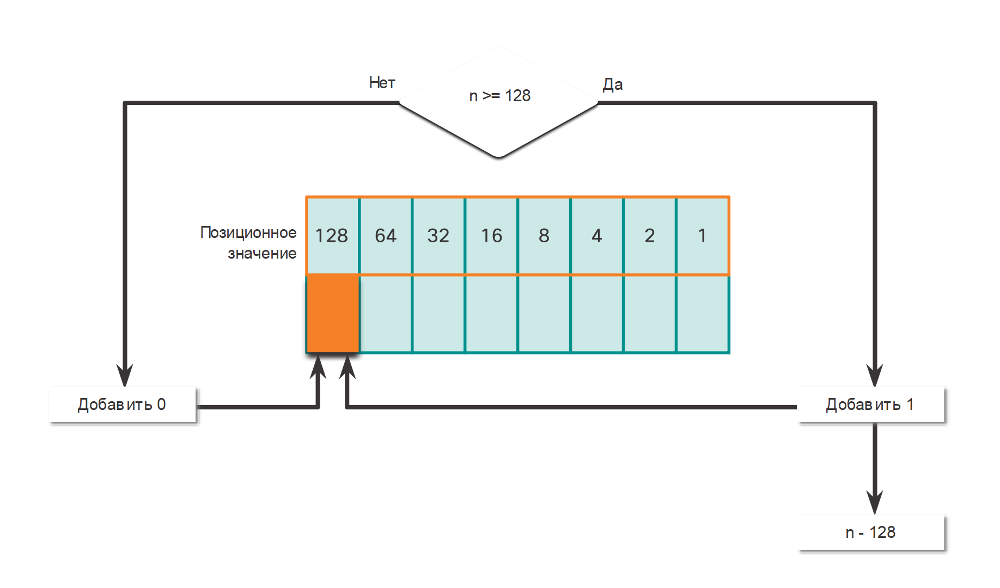
<!-- /courses/itn-dl/aeece084-34fa-11eb-ad9a-f74babed41a6/af209ab4-34fa-11eb-ad9a-f74babed41a6/assets/2de4abb5-1c25-11ea-81a0-ffc2c49b96bc.svg -->

### 64

Больше ли или равно десятичное число в октете (n) самому старшему биту (**64**)?

* Если нет, тогда пишем **0** в позиционное значение **64** позиционное значение.
* Если да, то пишем **1** в позиционное значение **64** и вычитаем **64** от десятичного числа.

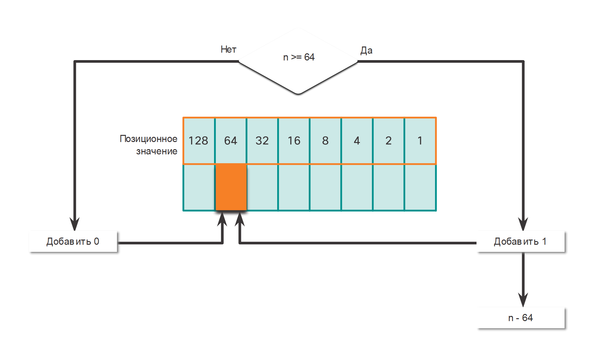
<!-- /courses/itn-dl/aeece084-34fa-11eb-ad9a-f74babed41a6/af209ab4-34fa-11eb-ad9a-f74babed41a6/assets/2de4f9d2-1c25-11ea-81a0-ffc2c49b96bc.svg -->

### 32

Больше ли или равно десятичное число в октете (n) самому старшему биту (**32**)?

* Если нет, тогда пишем **0** в позиционное значение **32** позиционное значение.
* Если да, то пишем **1** в позиционное значение **32** и вычитаем **32** от десятичного числа.

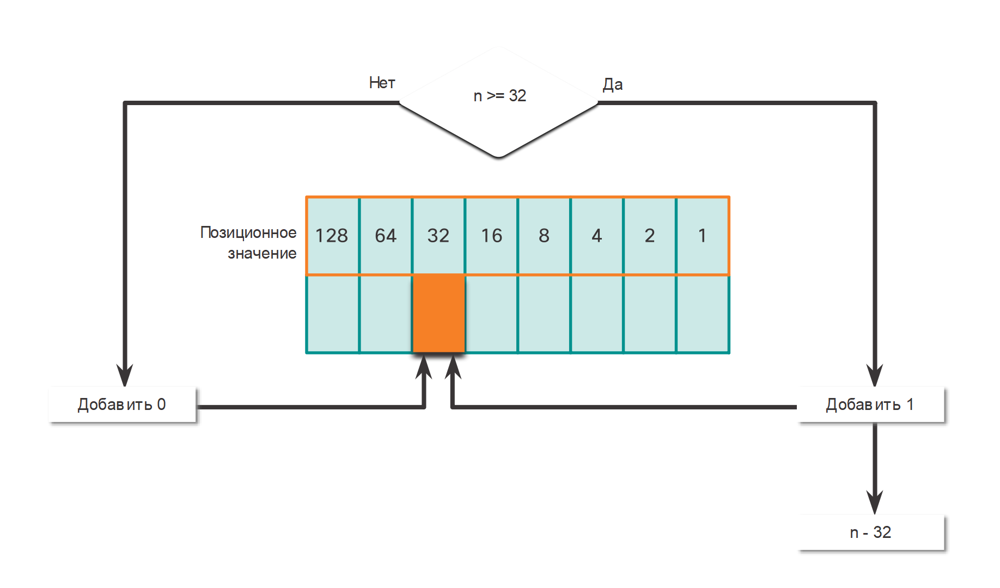
<!-- /courses/itn-dl/aeece084-34fa-11eb-ad9a-f74babed41a6/af209ab4-34fa-11eb-ad9a-f74babed41a6/assets/2de520e4-1c25-11ea-81a0-ffc2c49b96bc.svg -->

### 16

Больше ли или равно десятичное число в октете (n) самому старшему биту (**16**)?

* Если нет, тогда пишем **0** в позиционное значение **16** позиционное значение.
* Если да, то пишем **1** в позиционное значение **16** и вычитаем **16** от десятичного числа.

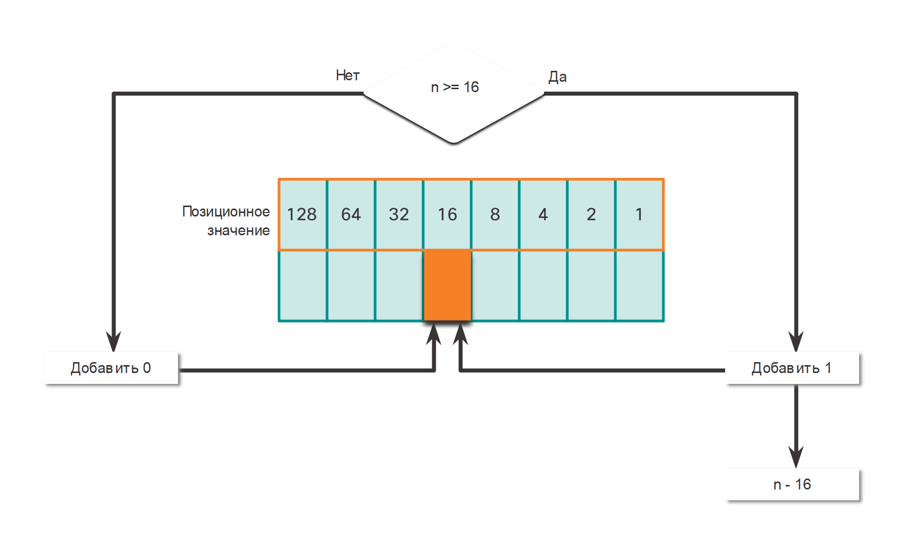
<!-- /courses/itn-dl/aeece084-34fa-11eb-ad9a-f74babed41a6/af209ab4-34fa-11eb-ad9a-f74babed41a6/assets/2de56f01-1c25-11ea-81a0-ffc2c49b96bc.svg -->

### 8

Больше ли или равно десятичное число в октете (n) самому старшему биту (**8**)?

* Если нет, тогда пишем **0** в позиционное значение **8** позиционное значение.
* Если да, то пишем **1** в позиционное значение **8** и вычитаем **8** от десятичного числа.

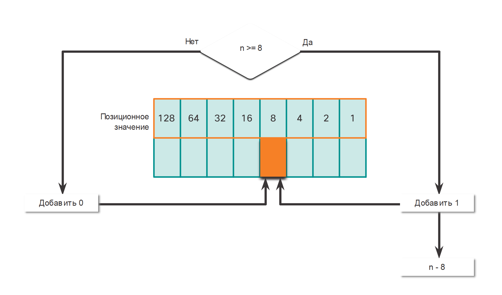
<!-- /courses/itn-dl/aeece084-34fa-11eb-ad9a-f74babed41a6/af209ab4-34fa-11eb-ad9a-f74babed41a6/assets/2de59612-1c25-11ea-81a0-ffc2c49b96bc.svg -->

### 4

Больше ли или равно десятичное число в октете (n) самому старшему биту (**4**)?

* Если нет, тогда пишем **0** в позиционное значение **4** позиционное значение.
* Если да, то пишем **1** в позиционное значение **4** и вычитаем **4** от десятичного числа.

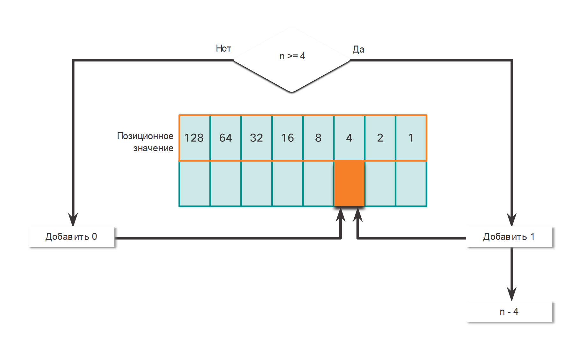
<!-- /courses/itn-dl/aeece084-34fa-11eb-ad9a-f74babed41a6/af209ab4-34fa-11eb-ad9a-f74babed41a6/assets/2de5bd25-1c25-11ea-81a0-ffc2c49b96bc.svg -->

### 2

Больше ли или равно десятичное число в октете (n) самому старшему биту (**2**)?

* Если нет, тогда пишем **0** в позиционное значение **2** позиционное значение.
* Если да, то пишем **1** в позиционное значение **2** и вычитаем **2** от десятичного числа.

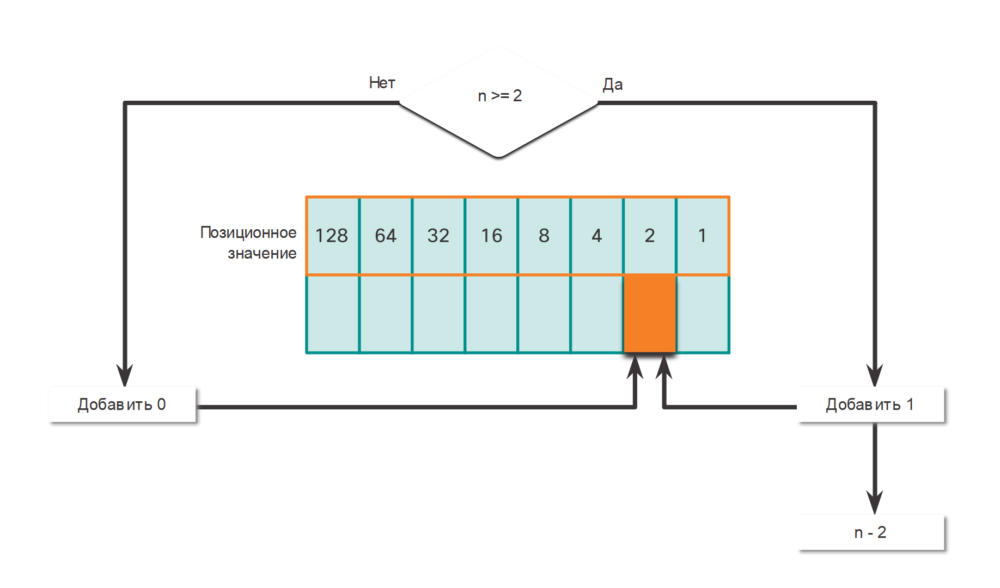
<!-- /courses/itn-dl/aeece084-34fa-11eb-ad9a-f74babed41a6/af209ab4-34fa-11eb-ad9a-f74babed41a6/assets/2de60b40-1c25-11ea-81a0-ffc2c49b96bc.svg -->

### 1

Больше ли или равно десятичное число в октете (n) самому старшему биту (**1**)?

* Если нет, тогда пишем **0** в позиционное значение **1** позиционное значение.
* Если да, то пишем **1** в позиционное значение **1** и вычитаем **1** от последнего десятичного числа.

<!-- /courses/itn-dl/aeece084-34fa-11eb-ad9a-f74babed41a6/af209ab4-34fa-11eb-ad9a-f74babed41a6/assets/2de63253-1c25-11ea-81a0-ffc2c49b96bc.svg -->

<!-- 5.1.8 -->
## Пример преобразования десятичных чисел в двоичный формат

Чтобы лучше понять этот процесс, рассмотрим IP-адрес 192.168.11.10.

Первый октет номер 192 преобразуется в двоичный, используя ранее объясняемый процесс позиционной нотации.

В случае простых или небольших десятичных чисел процедуру вычитания можно пропустить. Это число можно довольно легко получить без вычитания (8 + 2 = 10). Двоичное значение второго октета — 00001010.

Четвертый октет — 11 (8 + 2 + 1). Двоичное значение второго октета — 00001011.

Преобразование между двоичной и десятичной системами счисления может поначалу показаться сложным, но чем больше вы будете практиковаться, тем проще сможете это делать.

### Шаг 1

Первый октет с номером **192** равен или больше старшего бита **128**?

* Да, это так, поэтому добавьте 1 к позиционному значению старшего разряда к представлению **128**.
* Затем вычтите **128** из **192** получаем разницу (остаток) **64**.

<!-- /courses/itn-dl/aeece084-34fa-11eb-ad9a-f74babed41a6/af209ab4-34fa-11eb-ad9a-f74babed41a6/assets/2de6a780-1c25-11ea-81a0-ffc2c49b96bc.svg -->

### Шаг 2

Остаток **64** равен или больше следующего старшего бита **64**?

* Поскольку они равны, добавьте **1** в качестве следующего по старшинству позиционного значения.

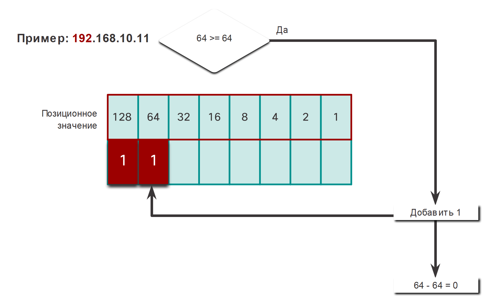
<!-- /courses/itn-dl/aeece084-34fa-11eb-ad9a-f74babed41a6/af209ab4-34fa-11eb-ad9a-f74babed41a6/assets/2de6ce92-1c25-11ea-81a0-ffc2c49b96bc.svg -->

### Шаг 3

Так как остаток отсутствует, введите двоичный код **0** в остальные позиционные значения.

* Двоичное значение первого октета равно **11000000**.

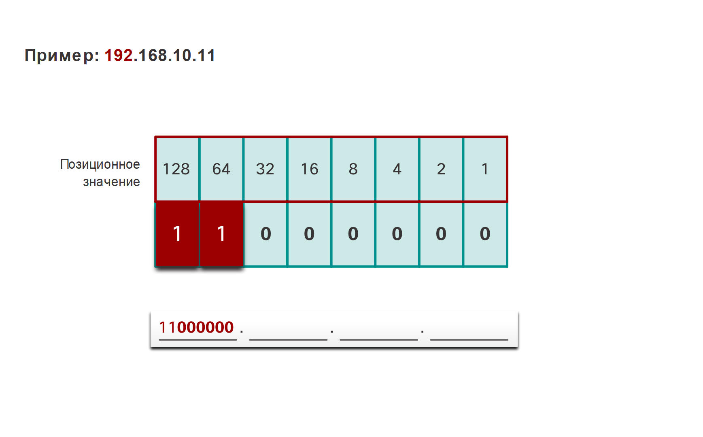
<!-- /courses/itn-dl/aeece084-34fa-11eb-ad9a-f74babed41a6/af209ab4-34fa-11eb-ad9a-f74babed41a6/assets/2de6f5a5-1c25-11ea-81a0-ffc2c49b96bc.svg -->

### Шаг 4

Является ли число второго октета **168** равным или больше бита старшего разряда **128**?

* Да, это так, поэтому добавьте **1** к позиционному значению старшего разряда к представлению **128**.
* Затем вычтите **128** из  **168**  получаем разницу (остаток) **40**.

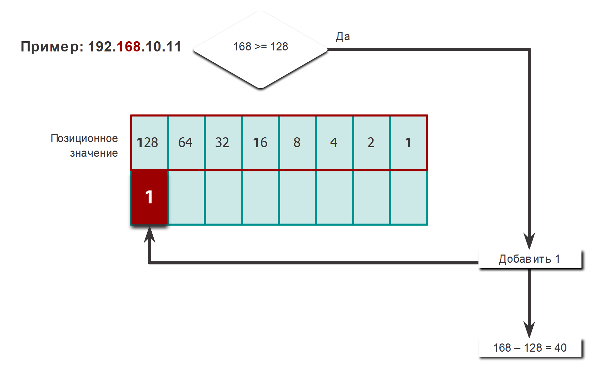
<!-- /courses/itn-dl/aeece084-34fa-11eb-ad9a-f74babed41a6/af209ab4-34fa-11eb-ad9a-f74babed41a6/assets/2de71cb5-1c25-11ea-81a0-ffc2c49b96bc.svg -->

### Шаг 5

Остаток **40** равен или больше следующего бита старшего разряда **64**?

* Нет, следовательно пишем **0** в позиционном значении.

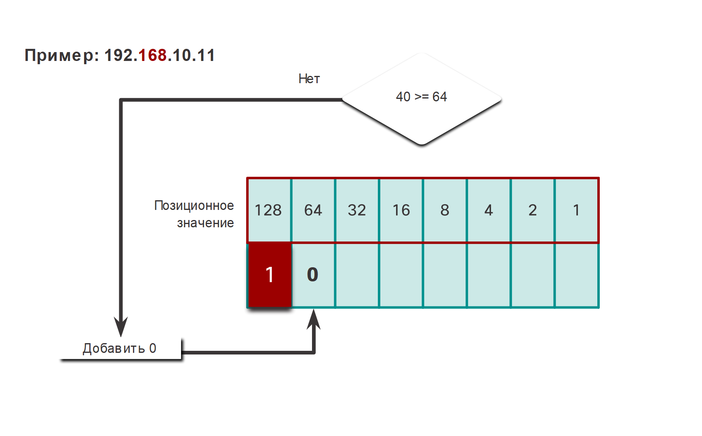
<!-- /courses/itn-dl/aeece084-34fa-11eb-ad9a-f74babed41a6/af209ab4-34fa-11eb-ad9a-f74babed41a6/assets/2de76ad0-1c25-11ea-81a0-ffc2c49b96bc.svg -->

### Шаг 6

Остаток **40** равен или больше следующего бита старшего разряда **32**?

* Да, это так, поэтому добавьте **1** к позиционному значению старшего разряда к представлению **32**.
* Затем вычтите **32** из  **40**  получаем разницу (остаток) of **8**.

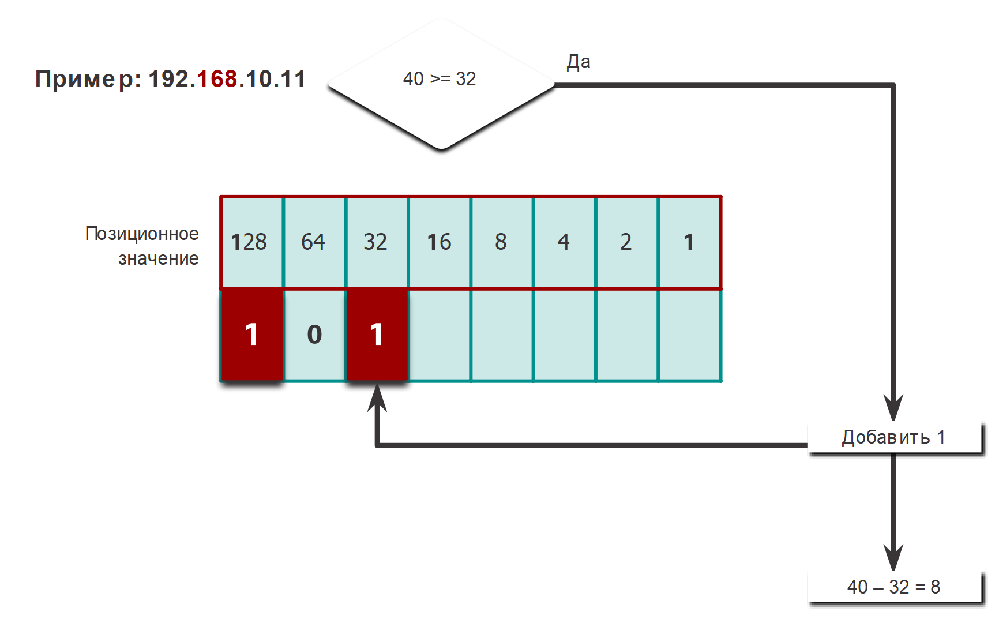
<!-- /courses/itn-dl/aeece084-34fa-11eb-ad9a-f74babed41a6/af209ab4-34fa-11eb-ad9a-f74babed41a6/assets/2de791e1-1c25-11ea-81a0-ffc2c49b96bc.svg -->

### Шаг 7

Остаток **8** равен или больше следующего бита старшего разряда **16**?

* Нет, это не так, поэтому введите двоичный **0** в позиционное значение.

<!-- /courses/itn-dl/aeece084-34fa-11eb-ad9a-f74babed41a6/af209ab4-34fa-11eb-ad9a-f74babed41a6/assets/2de7b8f3-1c25-11ea-81a0-ffc2c49b96bc.svg -->

### Шаг 8

Остаток **8** равен или больше следующего бита старшего разряда **8**?

* Оно равно, следовательно, добавляем **1** к следующему позиционному значению старшего разряда.

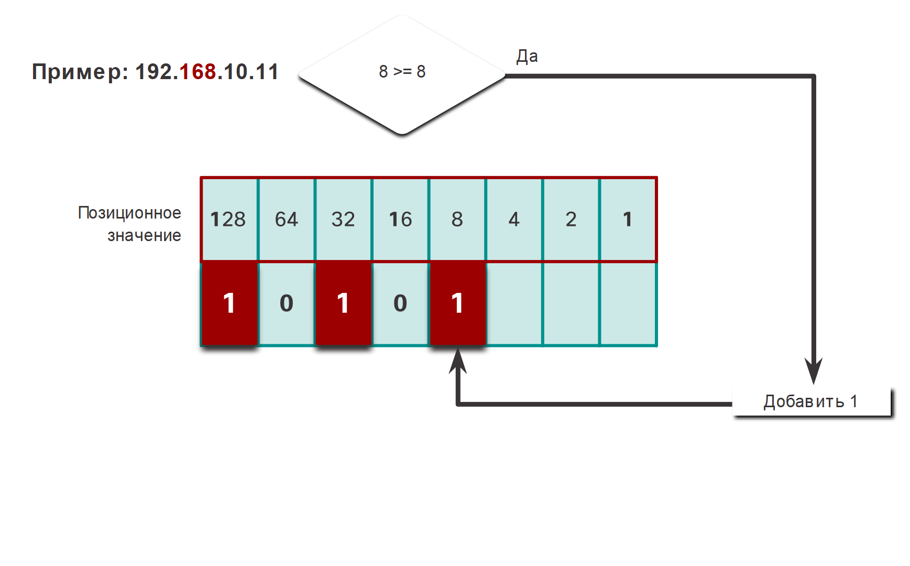
<!-- /courses/itn-dl/aeece084-34fa-11eb-ad9a-f74babed41a6/af209ab4-34fa-11eb-ad9a-f74babed41a6/assets/2de7e004-1c25-11ea-81a0-ffc2c49b96bc.svg -->

### Шаг 9

Так как остаток отсутствует, введите двоичный код **0** в остальные позиционные значения.

* Двоичное значение второго октета составляет is **10101000**.

<!-- /courses/itn-dl/aeece084-34fa-11eb-ad9a-f74babed41a6/af209ab4-34fa-11eb-ad9a-f74babed41a6/assets/2de80715-1c25-11ea-81a0-ffc2c49b96bc.svg -->

### Шаг 10

Двоичное значение второго октета — **00001010**.

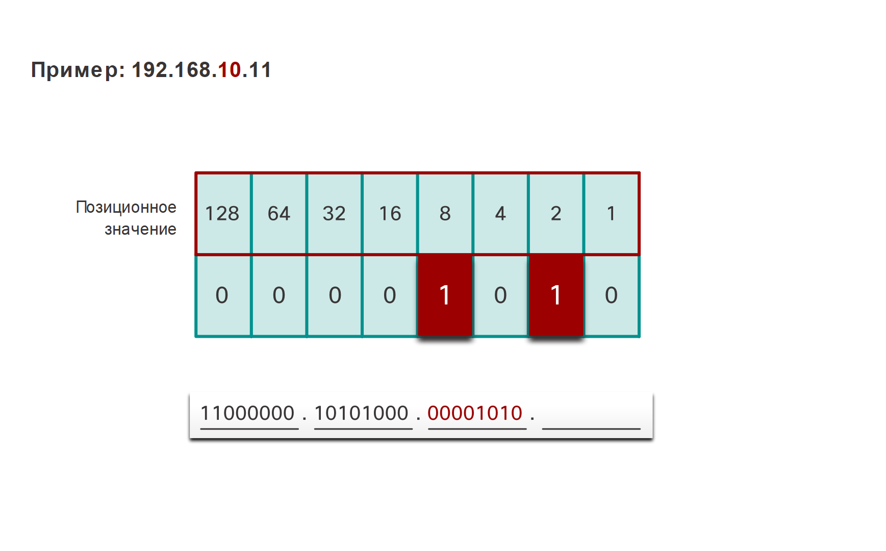
<!-- /courses/itn-dl/aeece084-34fa-11eb-ad9a-f74babed41a6/af209ab4-34fa-11eb-ad9a-f74babed41a6/assets/2de82e23-1c25-11ea-81a0-ffc2c49b96bc.svg -->

### Шаг 11.

Бинарное значение четвертого октета **00001011**.

<!-- /courses/itn-dl/aeece084-34fa-11eb-ad9a-f74babed41a6/af209ab4-34fa-11eb-ad9a-f74babed41a6/assets/2de85532-1c25-11ea-81a0-ffc2c49b96bc.svg -->

<!-- 5.1.9 -->
<!-- ## Упражнение - Преобразование десятичных чисел в двоичные -->

<!-- 5.1.10 -->
<!-- ## Упражнение. Игра «Двоичные числа»-->

<!-- 5.1.11 -->
## Адреса IPv4

Как упоминалось в начале этой темы, маршрутизаторы и компьютеры понимают только двоичные файлы, в то время как люди работают в десятичной системе. Важно, чтобы вы получили полное представление об этих двух системах нумерации и о том, как они используются в сети.

### Адрес в десятичном формате с точкой-разделителем

192.168.10.10 — это IP-адрес, назначенный компьютеру.

<!-- /courses/itn-dl/aeece084-34fa-11eb-ad9a-f74babed41a6/af209ab4-34fa-11eb-ad9a-f74babed41a6/assets/2de8f175-1c25-11ea-81a0-ffc2c49b96bc.svg -->

### Октеты

Этот адрес состоит из 4 разных октетов.

<!-- /courses/itn-dl/aeece084-34fa-11eb-ad9a-f74babed41a6/af209ab4-34fa-11eb-ad9a-f74babed41a6/assets/2de91883-1c25-11ea-81a0-ffc2c49b96bc.svg -->

### 32-битный адрес

Компьютер сохраняет адрес как целый 32-битный поток данных.

<!-- /courses/itn-dl/aeece084-34fa-11eb-ad9a-f74babed41a6/af209ab4-34fa-11eb-ad9a-f74babed41a6/assets/2de93f91-1c25-11ea-81a0-ffc2c49b96bc.svg -->

