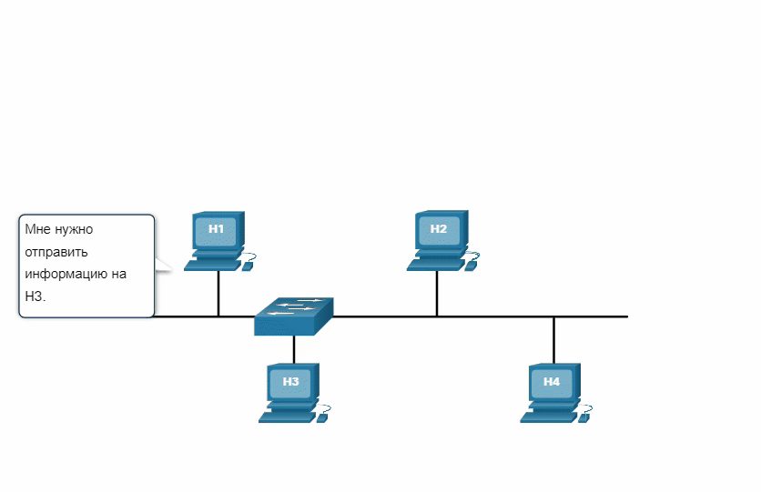
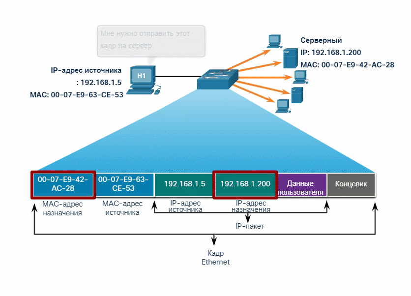
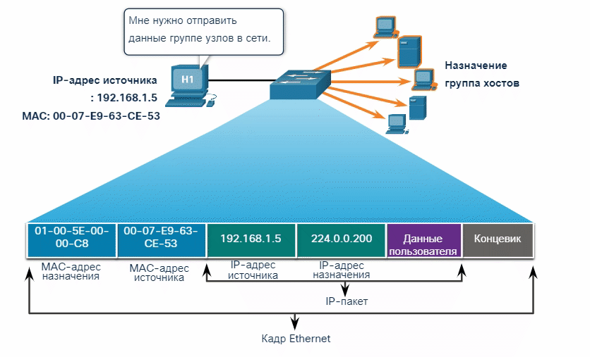

<!-- verified: agorbachev 03.05.2022 -->

<!-- 7.2.1 -->
## MAC-адрес и шестнадцатеричная система счисления

В сети адреса IPv4 представлены с использованием десятичной системы счисления с десятичной базой и двоичной системы счисления с основанием 2. Адреса IPv6 и адреса Ethernet представлены с использованием базовой шестнадцатеричной системы счисления. Чтобы понять шестнадцатеричную систему, вы должны сначала быть знакомы с двоичной и десятичной.

Шестнадцатеричная система счисления, в которой используются цифры от 0 до 9 и буквы от A до F.

MAC-адрес Ethernet состоит из 48-битного двоичного значения. Шестнадцатеричный используется для идентификации адреса Ethernet, так как одна шестнадцатеричная цифра представляет четыре бита. Таким образом 48-разрядный MAC-адрес Ethernet может быть выражен только с помощью 12 шестнадцатеричных значений.

На рисунке сравниваются эквивалентные десятичные и шестнадцатеричные значения для двоичных файлов 0000 до 1111 (F).

<!-- /courses/itn-dl/aeed0792-34fa-11eb-ad9a-f74babed41a6/af2136f2-34fa-11eb-ad9a-f74babed41a6/assets/2dfec364-1c25-11ea-81a0-ffc2c49b96bc.svg -->

Если 8 бит (1 байт) — это общепринятая бинарная группа, то двоичный код 00000000–11111111 может быть представлен в шестнадцатеричной системе счисления как диапазон 00–FF, как показано на рисунке.

<!-- /courses/itn-dl/aeed0792-34fa-11eb-ad9a-f74babed41a6/af2136f2-34fa-11eb-ad9a-f74babed41a6/assets/2dfeea77-1c25-11ea-81a0-ffc2c49b96bc.svg -->

Чтобы заполнить 8-битное представление, всегда отображаются ведущие нули. Например, двоичное значение 0000 1010 показано в шестнадцатеричной системе как 0A.

Шестнадцатеричные числа часто представлены значением, предшествующим **0x** (например, 0x73), чтобы различать десятичные и шестнадцатеричные значения в документации.

Шестнадцатеричное число также может быть представлено индексом 16 или шестнадцатеричным числом, за которым следует H (например, 73H).

Возможно, вам придется конвертировать между десятичными и шестнадцатеричными значениями. При необходимости такого преобразования обычно проще преобразовать десятичное или шестнадцатеричное значение в двоичное, а затем преобразовать двоичное значение соответственно либо в десятичное, либо в шестнадцатеричное.

<!-- 7.2.2 -->
## MAC-адрес Ethernet

Каждое устройство в сети Ethernet подключено к одной и той же общей среде передачи данных. MAC-адрес используется для определения источника и места назначения в локальной сети Ethernet. MAC-адресация предоставляет метод идентификации устройств на более низком уровне модели OSI.

MAC-адрес Ethernet — это 48-битный адрес, выраженный с использованием 12 шестнадцатеричных цифр, как показано на рисунке. Поскольку байт равен 8 битам, мы также можем сказать, что MAC-адрес имеет длину 6 байтов.

<!-- /courses/itn-dl/aeed0792-34fa-11eb-ad9a-f74babed41a6/af2136f2-34fa-11eb-ad9a-f74babed41a6/assets/2dff3892-1c25-11ea-81a0-ffc2c49b96bc.svg -->

Все MAC-адреса должны быть уникальными для устройства Ethernet или интерфейса Ethernet. Для этого все поставщики, продающие устройства Ethernet, должны зарегистрироваться в IEEE, чтобы получить уникальный 6-й шестнадцатеричный (т.е. 24-битный или 3-байтовый) код, называемый организационно уникальным идентификатором (OUI).

Когда поставщик назначает MAC-адрес устройству или интерфейсу Ethernet, поставщик должен выполнить следующие действия:

* Используют свой назначенный OUI в качестве первых 6 шестнадцатеричных цифр.
* Назначая уникальное значение в последних 6 шестнадцатеричных цифрах.

Таким образом MAC-адрес Ethernet состоит из 6 шестнадцатеричного кода OUI поставщика, за которым следует 6 шестнадцатеричных значений, назначенных поставщиком, как показано на рисунке.

<!-- /courses/itn-dl/aeed0792-34fa-11eb-ad9a-f74babed41a6/af2136f2-34fa-11eb-ad9a-f74babed41a6/assets/2dff86b3-1c25-11ea-81a0-ffc2c49b96bc.svg -->

Например, предположим, что Cisco необходимо назначить уникальный MAC-адрес новому устройству. IEEE присвоил Cisco OUI **00-60-2F**. Затем Cisco настроили устройство с уникальным кодом поставщика, таким как **3A-07-BC**. Таким образом, MAC-адрес Ethernet этого устройства будет **00-60-2F-3A-07-BC.**

Поставщик несет ответственность за то, чтобы ни одному из его устройств не был присвоен одинаковый MAC-адрес. Тем не менее, дубликаты MAC-адресов могут существовать из-за ошибок, допущенных во время производства, ошибок, допущенных в некоторых методах реализации виртуальных машин, или изменений, сделанных с помощью одного из нескольких программных средств. В любом случае MAC-адрес необходимо будет изменить в новой сетевой плате или программном обеспечении.

<!-- 7.2.3 -->
## Обработка кадров

MAC-адрес часто называется «встроенным» или «зашитым» адресом (burned-in address, BIA), поскольку исторически сложилось так, что он записывается в ПЗУ (постоянное запоминающее устройство) на сетевой плате. Это означает, что адрес вносится в чип ПЗУ на аппаратном уровне без возможности дальнейшего изменения.

**Примечание**: Операционные системы и сетевые платы современных компьютеров поддерживают возможность изменения MAC-адреса с помощью программ. Это удобно при попытке получения доступа к сети, в которой используется фильтрация на основе BIA. Следовательно, фильтрация или отслеживание трафика на основе MAC-адреса более не является надежным способом.

При запуске компьютера сетевая плата сначала копирует MAC-адрес из ПЗУ в ОЗУ. Когда устройство пересылает сообщение в сеть Ethernet, оно добавляет к кадру информацию заголовка.

* **MAC-адрес источника**  - Это MAC-адрес сетевой платы устройства источника.
* **MAC-адрес назначения**  - Это MAC-адрес сетевой карты устройства назначения.

При поступлении кадра Ethernet на сетевую плату она проверяет MAC-адрес назначения, чтобы определить, совпадает ли он с физическим MAC-адресом устройства, сохраненным в ОЗУ. Если не удается обнаружить совпадения, устройство отклоняет кадр. При наличии совпадения сетевая плата передает кадр вверх по уровням модели OSI, где происходит процесс деинкапсуляции.

**Примечание:** Сетевые платы устройств Ethernet принимают кадры также в том случае, если MAC-адрес назначения является широковещательной рассылкой или группой многоадресной рассылки, в которую включен узел.

Любое устройство, которое является источником или адресатом кадра Ethernet, будет иметь сетевой адаптер Ethernet и, следовательно, MAC-адрес. К ним относятся рабочие станции, серверы, принтеры, мобильные устройства и маршрутизаторы.

<!-- 7.2.4 -->
## Индивидуальный (одноадресный) MAC-адрес

В сети Ethernet для одноадресной, многоадресной и широковещательной рассылки уровня 2 используются разные MAC-адреса.

Индивидуальный MAC-адрес — это уникальный адрес, который используется при отправке кадра от одного передающего устройства к одному устройству назначения.

Просмотрите, как обрабатывается одноадресный кадр. В этом примере MAC-адрес назначения и IP-адрес назначения являются одноадресные адреса.

В примере, показанном в анимации, узел с IPv4-адресом 192.168.1.5 (источник) запрашивает веб-страницу с сервера с IPv4-адресом одноадресной рассылки 192.168.1.200. Для отправки и приема одноадресного пакета в заголовке IP-пакета должен указываться IP-адрес назначения. Кроме того, в заголовке кадра Ethernet должен быть MAC-адрес назначения. IP-адрес и MAC-адрес — это данные для доставки пакета одному узлу.

Для определения MAC-адреса назначения на узле источника используется протокол разрешения адресов (ARP). Процесс, который использует хост-источник для определения MAC-адреса назначения, связанного с адресом IPv6, называется Neighbor Discovery (ND).

**Примечание:** MAC-адрес источника всегда должен быть адресом одноадресной рассылки (индивидуальным).

<!-- 7.2.5 -->
## MAC-адрес широковещательной рассылки

Кадр широковещательной передачи Ethernet принимается и обрабатывается каждым устройством в локальной сети Ethernet. Функции широковещательной сети Ethernet заключаются в следующем:

* MAC-адрес назначения — это адрес FF-FF-FF-FF-FF-FF в шестнадцатеричном формате (48 разрядов в двоичном формате).
* Он пересылается через все порты коммутатора Ethernet, кроме входящего порта.
* Он не пересылается маршрутизатором.

Если инкапсулированные данные являются широковещательным пакетом IPv4, это означает, что пакет содержит целевой IPv4-адрес, который имеет все единицы (1) в хост-части. Эта нумерация в адресе означает, что все узлы в локальной сети (домене широковещательной рассылки) получат и обработают пакет.

Посмотрите, как обрабатывается широковещательный кадр. В этом примере MAC-адрес назначения и IP-адрес назначения являются  широковещательным.

Как показано в анимации, узел источника отправляет IPv4-пакет широковещательной рассылки на все устройства в сети. IPv4-адрес назначения (192.168.1.255) — это адрес широковещательной рассылки. Если IPv4-пакет широковещательной рассылки инкапсулирован в кадре Ethernet, MAC-адрес назначения является MAC-адресом широковещательной рассылки в шестнадцатеричном формате FF-FF-FF-FF-FF-FF (48 единиц в двоичном формате).

DHCP для IPv4 является примером протокола, который использует широковещательные адреса Ethernet и IPv4.

Однако не все широковещательные сети Ethernet имеют широковещательный пакет IPv4. Например, запросы ARP не используют протокол IPv4, но сообщение ARP отправляется как широковещательная сеть Ethernet.

<!-- 7.2.6 -->
## MAC-адрес многоадресной рассылки

Кадр многоадресной передачи Ethernet принимается и обрабатывается группой устройств в локальной сети Ethernet, принадлежащих к той же группе многоадресной рассылки. Функции многоадресной рассылки Ethernet заключаются в следующем:

* Существует MAC-адрес назначения 01-00-5E, когда инкапсулированные данные являются многоадресным пакетом IPv4, и MAC-адрес назначения 33-33, когда инкапсулированные данные являются многоадресным пакетом IPv6.
* Существуют другие зарезервированные MAC-адреса назначения многоадресной рассылки для тех случаев, когда инкапсулированные данные не являются IP-адресами, например протокол STP и протокол обнаружения уровня канала (LLDP).
* Он рассылается на  все порты коммутатора Ethernet, за исключением входящего порта, если коммутатор не настроен для многоадресного отслеживания.
* Он не пересылается маршрутизатором, если маршрутизатор не настроен на маршрутизацию многоадресных пакетов.

Если инкапсулированные данные являются многоадресным IP-пакетом, устройствам, которые принадлежат многоадресной группе, назначается IP-адрес многоадресной группы. Диапазон IPv4-адресов многоадресной рассылки — от 224.0.0.0 до 239.255.255.255. Диапазон IPv6-адресов многоадресной рассылки начинается с FF00:: /8. Поскольку адреса многоадресной рассылки представляют собой группу адресов (которая иногда называется также группой узлов), они используются только как адреса назначения пакета. Источник всегда имеет адрес одноадресной рассылки.

Как и в случае с адресами для одноадресной и широковещательной рассылки, IP-адресу для многоадресной рассылки требуется соответствующий MAC-адрес, чтобы фактически передавать кадры по локальной сети. MAC-адрес многоадресной рассылки связан и использует информацию адресации от адреса многоадресной рассылки IPv4 или IPv6.

Просмотрите, как обрабатывается многоадресный кадр. В этом примере MAC-адрес назначения и IP-адрес назначения являются многоадресными адресами.

Протоколы маршрутизации и другие сетевые протоколы используют многоадресную адресацию. Такие приложения, как программное обеспечение для обработки видео и изображений, также могут использовать многоадресную адресацию, хотя многоадресные приложения встречаются не так часто.

<!-- 7.2.7 -->
## Лабораторная работа: Просмотр MAC-адресов сетевых устройств

В этой лабораторной работе вы выполните следующие задачи.

* Часть 1: Настройка топологии и инициализация устройств
* Часть 2: Настройка устройств и проверка подключения
* Часть 3: Отображение, описание и анализ МАС-адресов Ethernet

[Просмотр MAC-адресов сетевых устройств (лабораторная работа для физического оборудования)](./assets/7.2.7-lab---view-network-device-mac-addresses.pdf)

