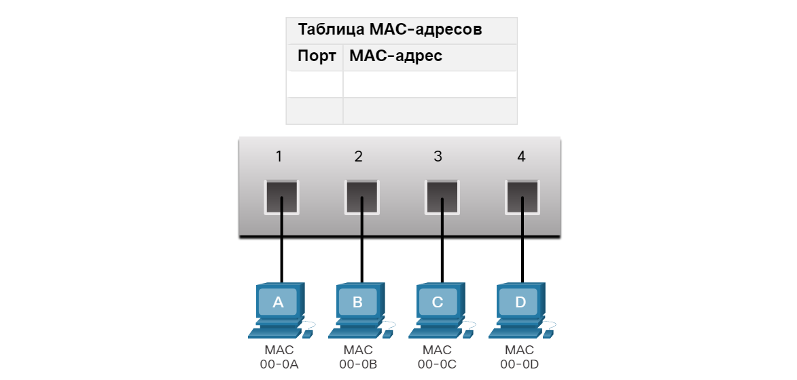
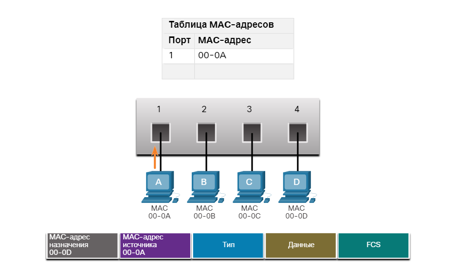
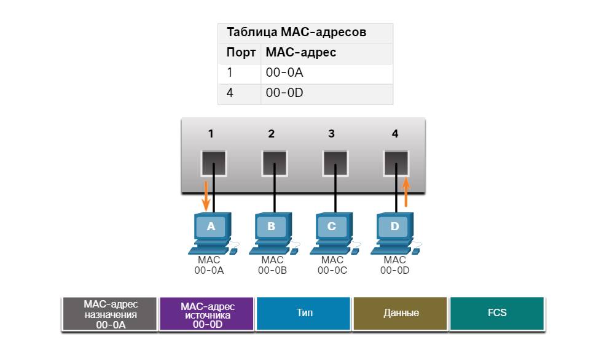
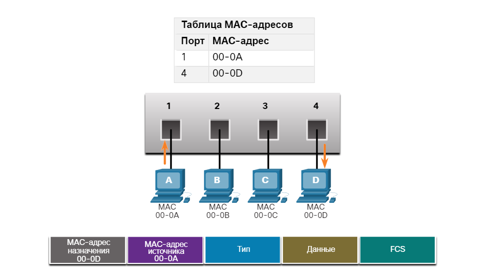

# Таблица MAC-адресов

<!-- 7.3.1 -->
## Основная информация о коммутаторах

Теперь, когда вы знаете все о MAC-адресах Ethernet, пришло время рассказать о том, как коммутатор использует эти адреса для пересылки (или отбрасывания) кадров на другие устройства в сети. Если бы коммутатор просто переадресовывал каждый кадр, который он получил на все порты, ваша сеть была бы настолько перегружена, что, вероятно, полностью остановилась бы.

Коммутатор Ethernet уровня 2 использует MAC-адреса для принятия решения о пересылке. Устройство не имеет информации о протоколе, передаваемом в части кадра, выделенной для данных, например, в IPv4-пакете или ND-пакет IPv6. Коммутатор пересылает пакеты только на основе MAC-адресов Ethernet уровня 2.

В отличие от устаревших концентраторов Ethernet, которые повторяют биты на всех портах, кроме входящего, коммутатор Ethernet обращается к таблице MAC-адресов для пересылки каждого конкретного кадра. На рисунке показан только что включенный 4-портовый коммутатор. Таблица показывает таблицу MAC-адресов, которая еще не изучила MAC-адреса для четырех подключенных компьютеров.

**Примечание**: Для удобства в этом примере MAC-адреса представлены в сокращенном виде.

<!-- /courses/itn-dl/aeed0792-34fa-11eb-ad9a-f74babed41a6/af2136f4-34fa-11eb-ad9a-f74babed41a6/assets/2e021ec3-1c25-11ea-81a0-ffc2c49b96bc.svg -->

Таблица MAC-адресов коммутатора пуста.

<!--
На диаграмме показаны четыре узла, а также связанные с ними MAC-адреса, подключенные к портам 1 - 4 коммутатора. Таблица MAC-адресов, которая сопоставляет порты с MAC-адресами, в настоящее время пуста.
-->

**Примечание**: Таблицу MAC-адресов иногда называют таблицей ассоциативной памяти (CAM). Хотя понятие «таблица ассоциативной памяти» используется относительно часто, в этом курсе мы будем называть ее таблицей MAC-адресов.

<!-- 7.3.2 -->
## Коммутатор  теперь находится в режиме обучения и выполняет пересылку.

Коммутатор создает таблицу MAC-адресов динамически, проверяя MAC-адрес источника в кадрах, принимаемых портом.Он пересылает кадры на основе совпадения между MAC-адресом назначения в кадре и записью в таблице MAC-адресов.

### Получение информации

При каждом поступлении кадра в коммутатор выполняется проверка на наличие новой информации. Проверяются MAC-адрес источника, указанный в кадре, и номер порта, по которому кадр поступает в коммутатор. Если MAC-адрес источника отсутствует, он добавляется в таблицу вместе с номером входящего порта. Если MAC-адрес источника уже существует, коммутатор обновляет таймер обновления для этой записи. По умолчанию в большинстве коммутаторов Ethernet данные в таблице хранятся в течение 5 минут.

Например, на рисунке PC-A отправляет кадр Ethernet на PC-D. Таблица показывает, что коммутатор добавляет MAC-адрес для PC-A в таблицу MAC-адресов.

**Примечание**: Если MAC-адрес источника указан в таблице, но с другим портом, коммутатор считает эту запись новой. Запись заменяется на тот же MAC-адрес, но с более актуальным номером порта.

<!-- /courses/itn-dl/aeed0792-34fa-11eb-ad9a-f74babed41a6/af2136f4-34fa-11eb-ad9a-f74babed41a6/assets/2e026ce4-1c25-11ea-81a0-ffc2c49b96bc.svg -->

1.  PC-A отправляет кадр Ethernet.
2.  Коммутатор добавляет номер порта и MAC-адрес PC-A в таблицу MAC-адресов.

<!--
Четыре хоста, A - D, подключены к коммутатору на портах 1 - 4. Узел A с MAC-адресом 00-0A (упрощенный в данном примере) подключен к коммутатору на порту 1. Узел A отправляет кадр с MAC-адресом назначения 00-0D. MAC-адрес источника кадра — 00-0A.  Коммутатор сопоставляет порт 1 MAC-адрес 00-0A в своей таблице MAC-адресов.
-->

### Перенаправление

Если MAC-адрес назначения является адресом одноадресной рассылки, коммутатор ищет совпадения между MAC-адресом назначения кадра и записью в таблице MAC-адресов. Если MAC-адрес назначения есть в таблице, коммутатор пересылает кадр через указанный порт. Если MAC-адреса назначения нет в таблице, коммутатор пересылает кадр через все порты, кроме входящего порта. Это называется одноадресной рассылкой неизвестному получателю.

Как показано на рисунке, в таблице коммутатора нет MAC-адреса назначения для компьютера PC-D, поэтому он пересылает кадр через все порты, кроме порта 1.

**Примечание**: Если MAC-адрес назначения является адресом широковещательной или многоадресной рассылки, коммутатор также пересылает кадр через все порты, кроме входящего.

<!-- /courses/itn-dl/aeed0792-34fa-11eb-ad9a-f74babed41a6/af2136f4-34fa-11eb-ad9a-f74babed41a6/assets/2e02bb01-1c25-11ea-81a0-ffc2c49b96bc.svg -->

1.  MAC-адреса назначения нет в таблице
2.  перешлет кадр на все порты

<!--
Четыре хоста, A - D, подключены к коммутатору на портах 1 - 4. Кадр имеет MAC-адрес назначения 00-0D и MAC-источник 00-0A. Единственная запись в таблице MAC-адресов сопоставляет порт 1 с MAC-адресом 00-0A. Кадр пересылается через порты 2, 3 и 4.
-->

<!-- 7.3.3 -->
## Фильтрация кадров

Поскольку коммутатор получает кадры от разных устройств, его таблица MAC-адресов заполняется через проверку MAC-адреса источника каждого кадра. Если в таблице MAC-адресов коммутатора есть MAC-адрес назначения, он может выполнять фильтрацию кадров и пересылать его через один порт.

### От PC-D до коммутатора

На рисунке PC-D отвечает на PC-A. Коммутатор видит MAC-адрес PC-D во входящем кадре на порту 4. Затем коммутатор помещает MAC-адрес PC-D в таблицу MAC-адресов, связанную с портом 4.

<!-- /courses/itn-dl/aeed0792-34fa-11eb-ad9a-f74babed41a6/af2136f4-34fa-11eb-ad9a-f74babed41a6/assets/2e030922-1c25-11ea-81a0-ffc2c49b96bc.svg -->

Коммутатор добавляет номер порта и MAC-адрес PC-D в свою таблицу MAC-адресов.

<!--
Четыре хоста, A - D, подключены к коммутатору на портах 1 - 4. Узел D с MAC-адресом 00-0D подключен к коммутатору на порту 4. Хост D отправляет кадр с MAC-адресом назначения 00-0A и исходным MAC-адресом 00-0D.  Коммутатор сопоставляет порт 4 с MAC-адресом 00-0D в своей таблице MAC-адресов.
-->

### От коммутатор до PC-A

Далее, поскольку коммутатор имеет MAC-адрес назначения для PC-A в таблице MAC-адресов, он отправит кадр только через порт 1, как показано на рисунке.

<!-- /courses/itn-dl/aeed0792-34fa-11eb-ad9a-f74babed41a6/af2136f4-34fa-11eb-ad9a-f74babed41a6/assets/2e033036-1c25-11ea-81a0-ffc2c49b96bc.svg -->

1.  Коммутатор имеет запись MAC-адреса для указанного  получателя.
2.  Коммутатор фильтрует кадр, отправляя его только из порта 1.

<!--
Четыре хоста, A - D, подключены к коммутатору на портах 1 - 4. Узел D с MAC-адресом 00-0D подключен к коммутатору на порту 4. Таблица MAC-адресов коммутатора содержит две записи. Порт 1 связан с MAC-адресом 00-0A, а порт 4 связан  с MAC-адресом 00-0D. Хост D отправляет кадр с MAC-адресом назначения 00-0A и исходным MAC-адресом 00-0D. Кадр отправляется из порта 1 на узел A, MAC-адрес которого 00-0A.
-->

### От PC-A до  коммутатора, от коммутатора до   PC-D

Затем PC-A отправляет другой кадр PC-D, как показано на рисунке. Таблица MAC-адресов уже содержит MAC-адрес для PC-A; следовательно, пятиминутный таймер обновления для этой записи сбрасывается. Поскольку в таблице коммутатора уже есть MAC-адрес компьютера PC-D, он пересылает кадр только через порт 4.

<!-- /courses/itn-dl/aeed0792-34fa-11eb-ad9a-f74babed41a6/af2136f4-34fa-11eb-ad9a-f74babed41a6/assets/2e037e50-1c25-11ea-81a0-ffc2c49b96bc.svg -->

1.  Коммутатор получает другой кадр от PC-A и обновляет таймер для записи MAC-адреса для порта 1.
2.  Коммутатор имеет недавнюю запись для MAC-адреса назначения и фильтрует кадр, переадресовывая его только из порта 4.

<!--
Четыре хоста, A - D, подключены к коммутатору на портах 1 - 4. Узел A с MAC-адресом 00-0A подключен к коммутатору на порту 1. Таблица MAC-адресов коммутатора содержит две записи. Порт 1 связан с MAC-адресом 00-0A, а порт 4 связан  с MAC-адресом 00-0D. Хост A отправляет кадр с MAC-адресом назначения 00-0D и исходным MAC-адресом 00-0A. Кадр отправляется port41 хосту D, MAC-адрес которого 00-0D.
-->

<!-- 7.3.4 -->
## Видеоролик. Таблицы MAC-адресов на подключенных друг к другу коммутаторах

В таблице коммутатора может быть несколько MAC-адресов, связанных с одним портом. Обычно это происходит тогда, когда коммутатор соединен с другим коммутатором. В таблице MAC-адресов коммутатора вводится отдельная запись для каждого кадра, получаемого с другого MAC-адреса источника.

Нажмите кнопку Play (Воспроизведение), чтобы просмотреть видеоролик о построении таблиц МАС-адресов в двух соединенных между собой коммутаторах.

<video width="768" height="432" controls>
  <source src="./assets/7.3.4.mp4" type='video/mp4; codecs="avc1.42E01E, mp4a.40.2"'>
</video>

<!-- 7.3.5 -->
## Видео - Отправка кадра на шлюз по умолчанию

Если IP-адрес устройства находится в удаленной сети, отправить кадр Ethernet в устройство назначения напрямую невозможно. Вместо этого кадр Ethernet отправляется по MAC-адресу шлюза по умолчанию, т. е. маршрутизатора.

Нажмите  Воспроизвести, чтобы просмотреть видеоролик об обмене данными между компьютером PC-A и шлюзом по умолчанию.

**Примечание**: В этом видеоролике в IP-пакете, отправляемом с компьютера PC-A на устройство в удаленной сети, указаны IP-адрес источника компьютера PC-A и IP-адрес назначения удаленного узла. В возвращаемом IP-пакете указаны IP-адрес источника удаленного узла и IP-адрес назначения, т. е. адрес компьютера PC-A.

<video width="768" height="432" controls>
  <source src="./assets/7.3.5.mp4" type='video/mp4; codecs="avc1.42E01E, mp4a.40.2"'>
</video>

<!-- 7.3.6 -->
## Упражнение. Коммутация в действии!

Определите, как коммутатор пересылает кадр, используя MAC-адреса источника и назначения и информацию из таблицы MAC-адресов. Ответьте на вопросы, используя предоставленную информацию.

<!-- 7.3.7 -->
## Лабораторная работа. Просмотр таблицы MAC-адресов коммутатора

В этой лабораторной работе вы выполните следующие задачи.

* Часть 1: Создание и настройка сети
* Часть 2: Изучение таблицы МАС-адресов коммутатора

[Просмотр таблицы MAC-адресов коммутатора (lab)](./assets/7.3.7-lab---view-the-switch-mac-address-table.pdf)

