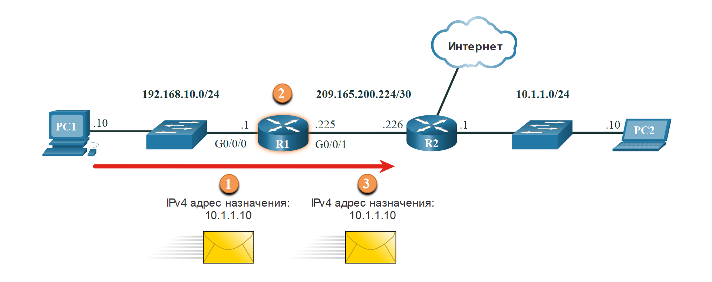
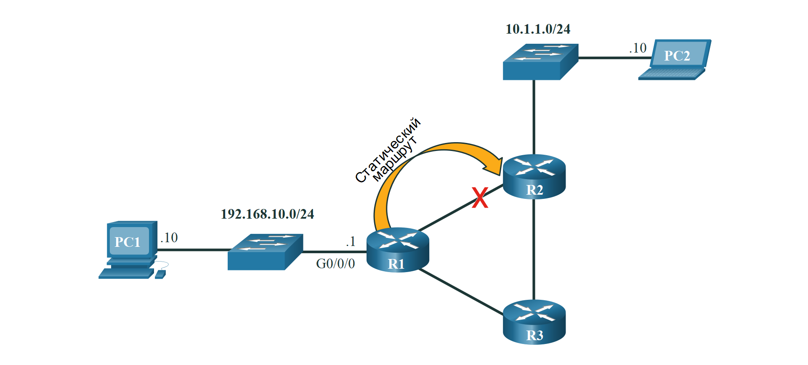
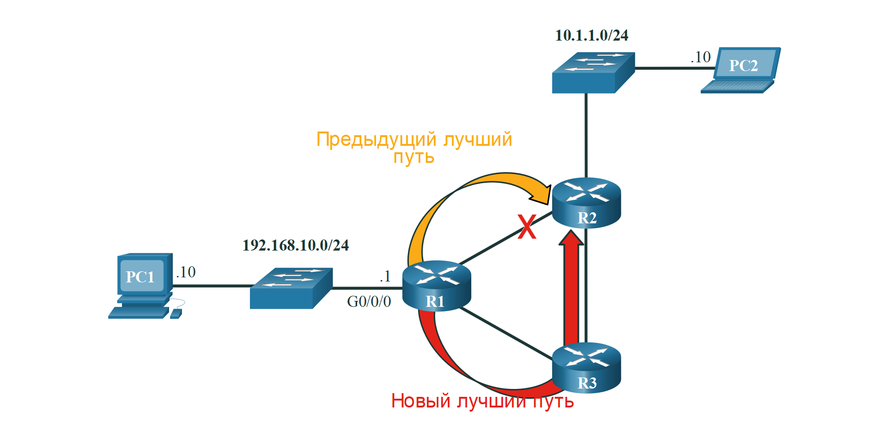

# Введение в маршрутизацию

<!-- 8.5.1 -->
## Решение о пересылке пакетов маршрутизатора

В предыдущем разделе рассматривались таблицы маршрутизации узлов. Большинство сетей также содержат маршрутизаторы, которые являются промежуточными устройствами. Маршрутизаторы также содержат таблицы маршрутизации. В этом разделе рассматриваются операции маршрутизатора на сетевом уровне. Когда узел отправляет пакет другому узлу, он использует свою таблицу маршрутизации, чтобы определить место отправки пакета. Если узел назначения находится в удаленной сети, пакет пересылается на шлюз по умолчанию, который обычно является локальным маршрутизатором.

Когда пакет поступает на интерфейс маршрутизатора:

Маршрутизатор считывает IP-адрес назначения и просматривает свою таблицу маршрутизации, определяя, куда нужно переслать пакет. Таблица маршрутизации содержит список всех известных сетевых адресов (префиксов) и куда пересылать пакет. Эти записи известны как записи маршрута или маршруты. Маршрутизатор пересылает пакет, используя наилучшую соответствующую запись маршрута.


<!-- /courses/itn-dl/aeed0794-34fa-11eb-ad9a-f74babed41a6/af21ac24-34fa-11eb-ad9a-f74babed41a6/assets/2e10c4c0-1c25-11ea-81a0-ffc2c49b96bc.svg -->

1.  Пакет поступает на интерфейс Gigabit Ethernet 0/0/0 маршрутизатора R1. R1 деинкапсулирует заголовок Ethernet уровня 2 и концевик.
2.  Маршрутизатор R1 проверяет адрес назначения IPv4 пакета и ищет наилучшее соответствие в своей таблице маршрутизации IPv4. Запись маршрута указывает, что этот пакет должен быть перенаправлен на маршрутизатор R2.
3.  Маршрутизатор R1 инкапсулирует пакет в новый заголовок и концевик Ethernet и пересылает пакет на маршрутизатор следующего хопа - R2.

<!--
Схема представляет собой топологию сети, показывающую, что происходит с пакетом IPv4 при маршрутизации между сетями. Хост PC1 с адресом .10 подключен к коммутатору в сети 192.168.10.0/24, который подключен к интерфейсу G0/0/0 маршрутизатора R1 с адресом .1. Сеть 209.165.200.224/30 подключает интерфейс G0/0/1 на R1, адрес .225, к другому маршрутизатору R2 по адресу .226. R2 подключен к коммутатору в сети 10.1.1.0/24, к которому подключен узел PC2, адрес .10. Маршрутизатор R2 подсоединен к Интернет-облаку. Пакет с адресом назначения 10.1.1.10 отправляется с PC1 на R1. Затем R1 отправляет пакет с адресом IPv4 назначения 10.1.1.10 на R2.
-->

В следующей таблице приведены соответствующие сведения из таблицы маршрутизации R1.

### R1 Routing Table

| Маршрут | Адрес следующего перехода или <br> исходящий интерфейс |
| --- | --- |
| 192.168.10.0 /24 | G0/0/0 |
| 209.165.200.224/30 | G0/0/1 |
| **10.1.1.0/24** | **через R2** |
| Маршрут по умолчанию 0.0.0.0/0 | через R2 |


<!-- 8.5.2 -->
## Таблица маршрутизации IP-маршрутизатора

Таблица маршрутизации маршрутизатора содержит записи сетевого маршрута, перечисляющие все возможные известные сетевые назначения.

В таблице маршрутизации хранятся три типа записей маршрута:

* **Сети с прямым подключением (Directly-connected networks)-** эти записи сетевого маршрута являются активными интерфейсами маршрутизатора. Маршрутизаторы добавляют маршрут с прямым подключением, когда интерфейс настроен с IP-адресом и активирован. Каждый из интерфейсов маршрутизатора подключен к разному сегменту сети. На рисунке сети с прямым подключением в таблице маршрутизации R1 IPv4 будут иметь значения 192.168.10.0/24 и 209.165.200.224/30.
* **Удаленные сети** — это сети, подключенные к другим маршрутизаторам. Маршрутизаторы узнают о удаленных сетях либо путем явной настройки администратором, либо путем обмена информацией о маршрутах с помощью протокола динамической маршрутизации. На рисунке удаленная сеть в таблице маршрутизации R1 IPv4 будет иметь значение 10.1.1.0/24.
* **Маршрут по умолчанию** — как и узел, большинство маршрутизаторов также включают запись маршрута по умолчанию, в качестве последнего средства, если иного маршрута до нужной сети в таблице маршрутизации нет. Маршрут по умолчанию используется, если в таблице IP-маршрутизации нет лучшего (наибольшего) соответствия. На рисунке таблица маршрутизации R1 IPv4, скорее всего, будет включать маршрут по умолчанию для пересылки всех пакетов маршрутизатору R2.

На рисунке представлены сети с прямым подключением и удаленные сети маршрутизатора R1.


<!-- /courses/itn-dl/aeed0794-34fa-11eb-ad9a-f74babed41a6/af21ac24-34fa-11eb-ad9a-f74babed41a6/assets/2e10ebd4-1c25-11ea-81a0-ffc2c49b96bc.svg -->

R1 имеет две сети прямого подключения:

* 192.168.10.0/24
* 209.165.200.224/30

R1 также имеет удаленные сети (например, 10.1.1.0/24 и Интернет), о которых он может узнать.

<!--
Схема представляет собой топологию сети, показывающая непосредственно подключенные сети и удаленные сети маршрутизатора. Хост PC1 с адресом .10 подключен к коммутатору в сети 192.168.10.0/24, который подключен к интерфейсу G0/0/0 маршрутизатора R1 с адресом .1. Сеть 209.165.200.224/30 подключает интерфейс G0/0/1 на R1, адрес .225, к другому маршрутизатору R2 по адресу .226 на G0/0/1. R2 подключен к коммутатору в сети 10.1.1.0/24, к которому подключен узел PC2, адрес .10. Маршрутизатор R2 подсоединен к Интернет-облаку.  Сети 192.168.10.0/24 и 209.165.200.224/30 показаны как сети, напрямую подключенные к R1 и сети 10.1.2.0/24 (должно ли это быть 10.1.1.0/24?) отображается как удаленная сеть R2.
-->

Маршрутизатор может узнать о удаленных сетях одним из двух способов:

* **Вручную.**  Данные об удаленных сетях вручную вводятся в таблицу маршрутов с использованием статических маршрутов.
* **Динамически.**  Удаленные маршруты автоматически добавляются с использованием протокола динамической маршрутизации.

<!-- 8.5.3 -->
## Статическая маршрутизация

Статические маршруты - это записи маршрутов, которые настраиваются вручную. На рисунке показан пример статического маршрута, настроенного вручную на маршрутизаторе R1. Статический маршрут включает в себя адрес удаленной сети и IP-адрес маршрутизатора следующего перехода.


<!-- /courses/itn-dl/aeed0794-34fa-11eb-ad9a-f74babed41a6/af21ac24-34fa-11eb-ad9a-f74babed41a6/assets/2e1139f0-1c25-11ea-81a0-ffc2c49b96bc.svg -->

R1 настраивается вручную со статическим маршрутом для достижения сети 10.1.1.0/24. Если этот путь изменится, R1 потребуется новый статический маршрут.

<!--
Схема представляет собой топологию сети, показывающую статическую конфигурацию маршрута для достижения удаленной сети. Хост PC1 с адресом .10 подключен к коммутатору в сети 192.168.10.0/24, который подключен к интерфейсу G0/0/0 маршрутизатора R1 с адресом .1. Сеть 209.165.200.224/30 подключает интерфейс G0/0/1 на R1, адрес .225, к другому маршрутизатору R2 по адресу .226. R2 имеет интерфейс с адресом .1, подключенный к коммутатору в сети 10.1.1.0/24, к которому подключен PC2, адрес .10. Маршрутизатор R2 подсоединен к Интернет-облаку. Статическая конфигурация маршрута R1 к сети 10.1.1.0/24 читает: R1(config)#ip route 10.1.1.0 255.255.255.0 209.165.200.226. В конфигурации 10.1.1.0 255.255.255.0 помечена как удаленная сеть, а 209.165.200.226 — IP-адрес маршрутизатора следующего перехода.
-->

В случае изменения топологии сети статический маршрут не обновляется автоматически и должен быть перенастроен вручную. Например, на рисунке R1 имеет статический маршрут для достижения сети 10.1.1.0/24 через R2. Если этот путь больше не доступен, потребуется перенастроить R1 на новый статический маршрут к сети 10.1.1.0/24 через R3. Поэтому маршрутизатор R3 должен иметь запись маршрута в таблице маршрутизации для отправки пакетов, предназначенных для 10.1.1.0/24, на R2.


<!-- /courses/itn-dl/aeed0794-34fa-11eb-ad9a-f74babed41a6/af21ac24-34fa-11eb-ad9a-f74babed41a6/assets/2e1139f8-1c25-11ea-81a0-ffc2c49b96bc.svg -->

Если маршрут от R1 через R2 больше недоступен, необходимо настроить новый статический маршрут через R3. Статический маршрут не корректируется автоматически для изменения топологии.

<!--
Схема представляет собой топологию сети, показывающую неисправную связь в статическом маршруте. Хост PC1 с адресом .10 подключен к коммутатору в сети 192.168.10.0/24, который подключен к интерфейсу G0/0/0 маршрутизатора R1 с адресом .1. R1 подключен к маршрутизатору R2 и маршрутизатору R3 с прямым подключением. R2 подключен к коммутатору в сети 10.1.1.0/24, к которому подключен узел PC2, адрес .10. Статический маршрут настроен на R1, который указывает на R2 в качестве следующего перехода.  Красный символ X указывает на то, что эта связь не удалась.
-->

Статическая маршрутизация имеет следующие характеристики:

* Статический маршрут должен быть настроен вручную.
* Администратору необходимо перенастроить статический маршрут, если есть изменения в топологии и статический маршрут больше не является жизнеспособным.
* Статический маршрут подходит для небольшой сети и когда избыточных каналов мало или нет.
* Статический маршрут обычно используется с протоколом динамической маршрутизации для настройки маршрута по умолчанию.

<!-- 8.5.4 -->
## Динамическая маршрутизация

Протокол динамической маршрутизации позволяет маршрутизаторам автоматически получать информацию о удаленных сетях, включая маршрут по умолчанию, от других маршрутизаторов. Маршрутизаторы, использующие протоколы динамической маршрутизации, автоматически обмениваются информацией о маршрутизации с другими маршрутизаторами и выполняют обновления в случае каких-либо изменений в топологии без участия сетевого администратора. При изменении топологии сети маршрутизаторы совместно используют эту информацию с помощью протокола динамической маршрутизации и автоматически обновляют свои таблицы маршрутизации.

Протоколы динамической маршрутизации включают OSPF и расширенный протокол маршрутизации внутреннего шлюза (EIGRP). На рисунке показан пример того, как маршрутизаторы R1 и R2 автоматически используют сетевую информацию с помощью протокола маршрутизации OSPF.


<!-- /courses/itn-dl/aeed0794-34fa-11eb-ad9a-f74babed41a6/af21ac24-34fa-11eb-ad9a-f74babed41a6/assets/2e116106-1c25-11ea-81a0-ffc2c49b96bc.svg -->

* R1 использует протокол маршрутизации OSPF, чтобы сообщить R2 о сети 192.168.10.0/24.
* R2 использует протокол маршрутизации OSPF, чтобы сообщить R1 о сети 10.1.1.0/24.

<!--
Схема представляет собой топологию сети, показывающую маршрутизаторы, использующие протоколы динамической маршрутизации для обмена информацией. Хост PC1 с адресом .10 подключен к коммутатору в сети 192.168.10.0/24, который подключен к интерфейсу G0/0/0 маршрутизатора R1 с адресом .1. Сеть 209.165.200.224/30 подключает интерфейс G0/0/1 на R1, адрес .225, к другому маршрутизатору R2 по адресу .226. R2 имеет интерфейс с адресом .1 подключен к коммутатору в сети 10.1.1.0/24, к которому хост PC2, адрес . 10, подключен. Стрелки показывают, что R1 и R2 делятся информацией друг с другом.
-->

Базовая конфигурация требует, чтобы администратор сети включил непосредственно подключенные сети в рамках протокола динамической маршрутизации. Протокол динамической маршрутизации будет автоматически выполнять следующие действия:

* Обнаружение удаленных сетей;
* Обновление данных маршрутизации;
* Выбор оптимального пути к сетям назначения;
* Поиск нового оптимального пути в случае, если текущий путь недоступен.

Если маршрутизатор вручную настроен со статическим маршрутом или узнает о удаленной сети динамически с помощью протокола динамической маршрутизации, адрес удаленной сети и адрес следующего перехода вводятся в таблицу IP-маршрутизации. Как показано на рисунке, при изменении топологии сети маршрутизаторы будут автоматически корректироваться и пытаться найти новый оптимальный путь.


<!-- /courses/itn-dl/aeed0794-34fa-11eb-ad9a-f74babed41a6/af21ac24-34fa-11eb-ad9a-f74babed41a6/assets/2e11af22-1c25-11ea-81a0-ffc2c49b96bc.svg -->

R1, R2 и R3 используют протокол динамической маршрутизации OSPF. При изменении топологии сети они могут автоматически корректироваться, чтобы найти новый оптимальный путь.

<!--
На диаграмме показана топология сети, в которой маршрутизаторы, использующие протоколы динамической маршрутизации, корректируют оптимальные пути после изменения топологии. Хост PC1 с адресом .10 подключен к коммутатору в сети 192.168.10.0/24, который подключен к интерфейсу G0/0/0 маршрутизатора R1 с адресом .1. R1 подключен к маршрутизатору R2 и маршрутизатору R3 с прямым подключением. R2 подключен к коммутатору в сети 10.1.1.0/24, к которому подключен узел PC2, адрес .10. Красный символ X указывает на то, что связь между R1 и R2, помеченная как предыдущий лучший путь, не удалась.  Новый лучший путь показан от R1 до R3 до R2.
-->

**Примечание**: Во многих случаях маршрутизаторы одновременно используют протоколы динамической маршрутизации и статические маршруты.

<!-- 8.5.5 -->
## Видео. Таблица маршрутизации маршрутизатора IPv4 

В отличие от таблицы маршрутизации главного компьютера, в ней отсутствуют заголовки столбцов, определяющие информацию, которая содержится в таблице маршрутизации маршрутизатора. Важно узнать значение различных элементов, которые содержатся в каждой записи таблицы маршрутизации.

Нажмите кнопку «Воспроизведение», чтобы просмотреть общие сведения о таблице IPv4-маршрутизации.

<video width="768" height="432" controls>
  <source src="./assets/8.5.5.mp4" type='video/mp4; codecs="avc1.42E01E, mp4a.40.2"'>
</video>

<!-- 8.5.6 -->
## Введение в таблицу маршрутизации IPv4

Обратите внимание на рисунке, что R2 подключен к Интернету. Поэтому администратор настраивает R1 со статическим маршрутом, отправляющим пакеты R2, если в таблице маршрутизации нет конкретной записи, соответствующей IP-адресу назначения. R1 и R2 также используют маршрутизацию OSPF для объявления напрямую подключенных сетей.


<!-- /courses/itn-dl/aeed0794-34fa-11eb-ad9a-f74babed41a6/af21ac24-34fa-11eb-ad9a-f74babed41a6/assets/2e122453-1c25-11ea-81a0-ffc2c49b96bc.svg -->

<!--
Хост PC1 с адресом .10 подключен к коммутатору в сети 192.168.10.0/24, который подключен к интерфейсу G0/0/0 маршрутизатора R1 с адресом .1. Сеть 209.165.200.224/30 подключает интерфейс G0/0/1 на R1, адрес .225, к другому маршрутизатору R2 по адресу .226. R2 подключен к коммутатору в сети 10.1.1.0/24, к которому подключен узел PC2, адрес .10. Маршрутизатор R2 подсоединен к Интернет-облаку. 
-->

```
R1# show ip route
Codes: L - local, C - connected, S - static, R - RIP, M - mobile, B - BGP
       D - EIGRP, EX - EIGRP external, O - OSPF, IA - OSPF inter area 
       N1 - OSPF NSSA external type 1, N2 - OSPF NSSA external type 2
       E1 - OSPF external type 1, E2 - OSPF external type 2
       i - IS-IS, su - IS-IS summary, L1 - IS-IS level-1, L2 - IS-IS level-2
       ia - IS-IS inter area, * - candidate default, U - per-user static route
       o - ODR, P - periodic downloaded static route, H - NHRP, l - LISP
       a - application route
       + - replicated route, % - next hop override, p - overrides from PfR
Gateway of last resort is 209.165.200.226 to network 0.0.0.0
S*    0.0.0.0/0 [1/0] via 209.165.200.226, GigabitEthernet0/0/1
      10.0.0.0/24 is subnetted, 1 subnets
O        10.1.1.0 [110/2] via 209.165.200.226, 00:02:45, GigabitEthernet0/0/1
      192.168.10.0/24 is variably subnetted, 2 subnets, 2 masks
C        192.168.10.0/24 is directly connected, GigabitEthernet0/0/0
L        192.168.10.1/32 is directly connected, GigabitEthernet0/0/0
      209.165.200.0/24 is variably subnetted, 2 subnets, 2 masks
C        209.165.200.224/30 is directly connected, GigabitEthernet0/0/1
L        209.165.200.225/32 is directly connected, GigabitEthernet0/0/1
R1#
```

Команда **show ip route** привилегированного режима EXEC используется для просмотра таблицы маршрутизации IPv4 на маршрутизаторе Cisco IOS. В примере показана таблица маршрутизации IPv4 маршрутизатора R1. В начале каждой записи таблицы маршрутизации находится код, который используется для идентификации типа маршрута или способа его изучения. К общим источникам маршрутов (кодам) относятся следующие:

* **L** - IP-адрес локального интерфейса с прямым подключением
* **C** – Присоединенная напрямую сеть
* **S** — Статический маршрут был вручную настроен администратором
* **O** - OSPF
* **D** - EIGRP

В таблице маршрутизации отображаются все известные маршруты назначения IPv4 для R1.

Присоединенная напрямую маршрут создается автоматически, когда интерфейс маршрутизатора настроен с информацией об IP-адресе и активирован. Маршрутизатор добавляет две записи маршрута с кодами C (т.е. подключенная сеть) и L (т.е. IP-адрес локального интерфейса подключенной сети). Записи маршрута также определяют интерфейс выхода для доступа к сети. Две напрямую подключенные сети в этом примере — 192.168.10.0/24 и 209.165.200.224/30.

Маршрутизаторы R1 и R2 также используют протокол динамической маршрутизации OSPF для обмена информацией о маршрутизаторе. В примере таблицы маршрутизации R1 содержит запись маршрута для сети 10.1.1.0/24, которую он динамически узнал от маршрутизатора R2 по протоколу маршрутизации OSPF.

Маршрут по умолчанию (default route) имеет сетевой адрес всех нулей. Например, сетевой адрес IPv4 — 0.0.0.0. Статическая запись маршрута в таблице маршрутизации начинается с кода S\ *, как показано в примере.

<!-- 8.5.7 -->
<!-- quiz -->

