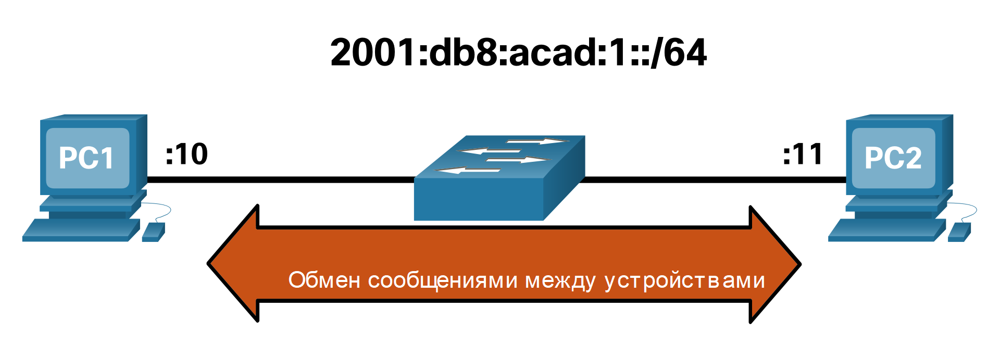
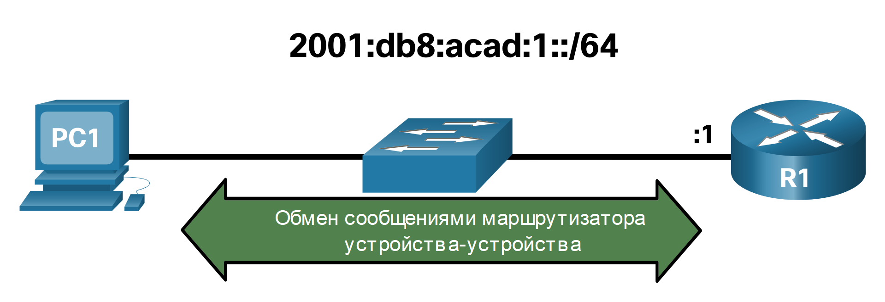
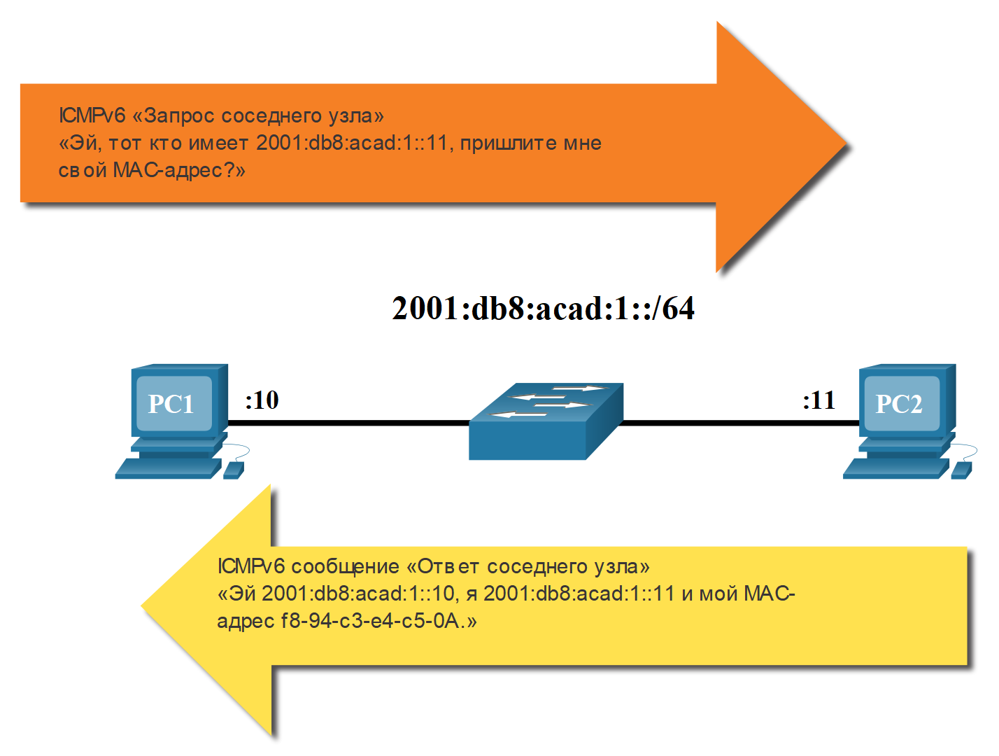

# Обнаружение соседних IPv6 устройств

<!-- 9.3.1 -->
## Видео - Обнаружение соседних IPv6 устройств

Если ваша сеть использует протокол связи IPv6, то протокол Neighbor Discovery или ND - это то, что вам нужно для сопоставления адресов IPv6 с MAC-адресами. В этом разделе объясняется, как работает ND.

Нажмите Воспроизвести, чтобы просмотреть демонстрацию обнаружения соседей IPv6.

<video width="768" height="432" controls>
  <source src="./assets/9.3.1.mp4" type='video/mp4; codecs="avc1.42E01E, mp4a.40.2"'>
</video>

<!-- 9.3.2 -->
## Сообщения об обнаружении соседей IPv6

Протокол обнаружения соседей IPv6  называется ND или NDP. В этом курсе мы будем называть его ND. ND обеспечивает разрешение адресов, обнаружение маршрутизаторов и службы перенаправления для IPv6 с использованием ICMPv6. ICMPv6 ND использует пять сообщений ICMPv6 для выполнения этих служб:

* Сообщение «Запрос соседнего узла» (Neighbor Solicitation, NS);
* Сообщение «Ответ соседнего узла» (Neighbor Advertisement, NA);
* Сообщение «Запрос к маршрутизатору» (Router Solicitation, RS);
* Сообщение «Ответ маршрутизатора» (Router Advertisement, RA);
* Сообщение «Перенаправление» (Redirect Message).

«Запрос соседнего узла» и «Ответ соседнего узла» используются для обмена сообщениями между устройствами, например разрешения адресов (аналогично ARP для IPv4). Устройства включают как хост-компьютеры, так и маршрутизаторы.

<!-- /courses/itn-dl/aeed2ea0-34fa-11eb-ad9a-f74babed41a6/af21d332-34fa-11eb-ad9a-f74babed41a6/assets/2e1a61b1-1c25-11ea-81a0-ffc2c49b96bc.svg -->

«Запрос к маршрутизатору» и «Ответ маршрутизатора» предназначены для обмена сообщениями между устройствами и маршрутизаторами. Обычно обнаружение маршрутизатора используется для динамического распределения адресов и автонастройки адресов без состояния (SLAAC).

<!-- /courses/itn-dl/aeed2ea0-34fa-11eb-ad9a-f74babed41a6/af21d332-34fa-11eb-ad9a-f74babed41a6/assets/2e1a88c2-1c25-11ea-81a0-ffc2c49b96bc.svg -->

**Примечание**: Пятое сообщение ICMPv6 ND представляет собой сообщение перенаправления, которое используется для лучшего выбора следующего перехода. Это выходит за рамки данного курса.

IPv6 ND определяется в IETF RFC 4861.

<!-- 9.3.3 -->
## Обнаружение соседей IPv6 - разрешение адресов

Подобно ARP для IPv4, IPv6 устройства используют IPv6 ND для определения MAC-адреса устройства, которое имеет известный IPv6 адрес.

Сообщения ICMPv6 «Запрос соседнего узла» и «Оповещение соседних узлов о присутствии» используются для разрешения MAC-адресов. Это похоже на запросы ARP и ответы ARP, используемые ARP для IPv4. Например, предположим, что PC1 хочет выполнить эхо-запрос PC2 по адресу IPv6 2001:db8:acad::11. Чтобы определить MAC-адрес для известного IPv6-адреса, PC1 отправляет сообщение ICMPv6 Neighbor Solicitation, как показано на рисунке.

<!-- /courses/itn-dl/aeed2ea0-34fa-11eb-ad9a-f74babed41a6/af21d332-34fa-11eb-ad9a-f74babed41a6/assets/2e1aafd3-1c25-11ea-81a0-ffc2c49b96bc.svg -->

Сообщения ICMPv6 «Запрос соседнего узла» отправляются с помощью специальных адресов многоадресной рассылки Ethernet и IPv6. Это позволяет сетевой адаптер Ethernet принимающего устройства определить, является ли сообщение «Запрос соседнего узла» предназначенным ему, не отправляя его в операционную систему для обработки.

PC2 отвечает на запрос сообщением ICMPv6 «Ответ соседнего узла», которое содержит MAC-адрес.

<!-- 9.3.4 -->
## Packet Tracer - Обнаружение соседних IPv6 устройств

Чтобы устройство взаимодействует с другим устройством, должен быть известен MAC-адрес устройства назначения. С IPv6 процесс, называемый Обнаружение соседних IPv6 устройств, отвечает за определение MAC-адреса назначения. Вы будете собирать информацию PDU в режиме моделирования, чтобы лучше понять процесс. Ддя этого задания Packet Tracer нет оценки.

[Обнаружение соседних IPv6 устройств (pdf)](./assets/9.3.4-packet-tracer---ipv6-neighbor-discovery.pdf)

[Обнаружение соседних IPv6 устройств (pka)](./assets/9.3.4-packet-tracer---ipv6-neighbor-discovery.pka)

<!-- 9.3.5 -->
<!-- quiz -->

